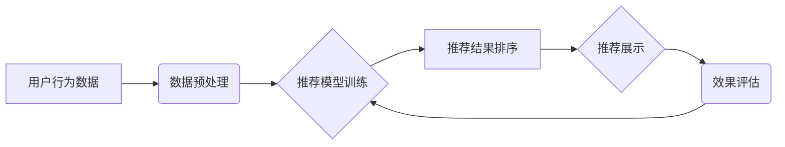

                 

## 大数据驱动的电商搜索推荐：AI 模型融合技术在电商领域的应用与优化

> 关键词：电商搜索推荐、大数据、AI模型融合、协同过滤、内容基余、深度学习、推荐系统优化

## 1. 背景介绍

在当今数据爆炸的时代，电商平台面临着海量商品和用户数据，如何精准推荐用户感兴趣的商品，提升用户体验和转化率，成为电商平台的核心竞争力。传统的基于规则的推荐系统难以应对数据复杂性和用户个性化的挑战。而大数据驱动的电商搜索推荐系统，通过挖掘用户行为、商品特征等海量数据中的潜在关联，利用人工智能（AI）模型融合技术，能够提供更精准、个性化的推荐，从而提升用户满意度和商业效益。

电商搜索推荐系统通常包含以下几个关键模块：

* **数据采集与预处理:** 收集用户行为数据、商品信息、平台运营数据等，并进行清洗、转换、特征提取等预处理工作。
* **推荐模型训练:** 基于大数据，训练各种推荐模型，例如协同过滤、内容基余、深度学习等。
* **推荐结果排序与展示:** 根据用户特征、商品信息、模型预测结果等因素，对推荐结果进行排序和展示，以提升用户点击率和转化率。
* **效果评估与优化:** 通过监控推荐效果指标，例如点击率、转化率、用户满意度等，不断优化推荐模型和策略。

## 2. 核心概念与联系

**2.1 核心概念**

* **协同过滤:** 基于用户或商品之间的相似性进行推荐。例如，如果用户A和用户B都喜欢商品X，那么协同过滤算法可能会推荐商品Y，因为用户B也喜欢商品Y。
* **内容基余:** 基于商品的特征和用户偏好进行推荐。例如，如果用户喜欢运动类商品，那么内容基余算法可能会推荐其他运动类商品。
* **深度学习:** 利用多层神经网络学习数据中的复杂特征，进行更精准的推荐。例如，深度学习模型可以学习用户画像、商品语义等信息，进行更个性化的推荐。

**2.2 架构图**



## 3. 核心算法原理 & 具体操作步骤

### 3.1 算法原理概述

本文将重点介绍基于深度学习的电商搜索推荐算法，其原理是利用深度神经网络学习用户和商品之间的复杂关系，从而进行精准的推荐。

### 3.2 算法步骤详解

1. **数据收集与预处理:** 收集用户行为数据、商品信息、平台运营数据等，并进行清洗、转换、特征提取等预处理工作。
2. **特征工程:** 将原始数据转换为模型可理解的特征，例如用户性别、年龄、购买历史、商品类别、价格、描述等。
3. **模型构建:** 选择合适的深度学习模型，例如多层感知机（MLP）、卷积神经网络（CNN）、循环神经网络（RNN）等，并根据具体需求进行模型设计和参数设置。
4. **模型训练:** 利用训练数据训练深度学习模型，通过反向传播算法不断调整模型参数，使其能够学习用户和商品之间的复杂关系。
5. **模型评估:** 利用测试数据评估模型性能，常用的指标包括准确率、召回率、F1-score等。
6. **模型部署:** 将训练好的模型部署到线上环境，用于实时推荐。

### 3.3 算法优缺点

**优点:**

* **精准度高:** 深度学习模型能够学习数据中的复杂特征，从而进行更精准的推荐。
* **个性化强:** 深度学习模型可以学习每个用户的个性化偏好，提供更个性化的推荐。
* **可扩展性强:** 深度学习模型可以处理海量数据，并随着数据量的增加不断提升推荐精度。

**缺点:**

* **训练成本高:** 深度学习模型训练需要大量的计算资源和时间。
* **数据依赖性强:** 深度学习模型的性能依赖于训练数据的质量和数量。
* **解释性差:** 深度学习模型的决策过程较为复杂，难以解释其推荐结果背后的原因。

### 3.4 算法应用领域

深度学习在电商搜索推荐领域有着广泛的应用，例如：

* **商品推荐:** 推荐用户可能感兴趣的商品，例如基于浏览历史、购买历史、用户画像等进行商品推荐。
* **搜索结果排序:** 根据用户搜索词和历史行为，对搜索结果进行排序，提升用户搜索体验。
* **个性化广告推荐:** 根据用户兴趣和行为，推荐个性化的广告，提升广告转化率。

## 4. 数学模型和公式 & 详细讲解 & 举例说明

### 4.1 数学模型构建

深度学习模型在电商搜索推荐中通常采用协同过滤和内容基余相结合的模型架构。

**协同过滤模型:**

假设用户u对商品i的评分为r<sub>ui</sub>，协同过滤模型的目标是预测用户u对商品i的评分。

**内容基余模型:**

假设商品i的特征向量为x<sub>i</sub>，用户u的特征向量为y<sub>u</sub>，内容基余模型的目标是预测用户u对商品i的评分。

**融合模型:**

将协同过滤模型和内容基余模型融合，可以构建更强大的推荐模型。

### 4.2 公式推导过程

**协同过滤模型:**

常用的协同过滤模型包括基于用户的协同过滤和基于物品的协同过滤。

* **基于用户的协同过滤:**

$$
\hat{r}_{ui} = \bar{r}_u + \frac{\sum_{v \in N(u)} (r_{uv} - \bar{r}_v) \cdot s_{uv}}{\sum_{v \in N(u)} s_{uv}}
$$

其中：

* $\hat{r}_{ui}$ 是模型预测的用户u对商品i的评分。
* $\bar{r}_u$ 是用户u的平均评分。
* $r_{uv}$ 是用户u对商品v的评分。
* $N(u)$ 是用户u的邻居用户集合。
* $s_{uv}$ 是用户u和用户v之间的相似度。

* **基于物品的协同过滤:**

$$
\hat{r}_{ui} = \bar{r}_i + \frac{\sum_{v \in N(i)} (r_{uv} - \bar{r}_v) \cdot s_{uv}}{\sum_{v \in N(i)} s_{uv}}
$$

其中：

* $\bar{r}_i$ 是商品i的平均评分。
* $N(i)$ 是商品i的邻居商品集合。

**内容基余模型:**

$$
\hat{r}_{ui} = \omega_1 \cdot \mathbf{x}_i^T \mathbf{y}_u + \omega_2 \cdot \mathbf{p}_i
$$

其中：

* $\omega_1$ 和 $\omega_2$ 是权重参数。
* $\mathbf{x}_i$ 是商品i的特征向量。
* $\mathbf{y}_u$ 是用户u的特征向量。
* $\mathbf{p}_i$ 是商品i的潜在特征向量。

### 4.3 案例分析与讲解

假设我们有一个电商平台，用户购买了以下商品：

* 用户A购买了商品1和商品3。
* 用户B购买了商品2和商品3。
* 用户C购买了商品1和商品4。

我们可以利用协同过滤算法，计算用户之间的相似度，并预测用户对其他商品的评分。例如，用户A和用户B都购买了商品3，因此他们的相似度较高，我们可以预测用户A可能也喜欢商品2。

## 5. 项目实践：代码实例和详细解释说明

### 5.1 开发环境搭建

* Python 3.x
* TensorFlow 或 PyTorch
* Jupyter Notebook

### 5.2 源代码详细实现

```python
import tensorflow as tf

# 定义模型结构
model = tf.keras.Sequential([
    tf.keras.layers.Embedding(input_dim=vocab_size, output_dim=embedding_dim),
    tf.keras.layers.Flatten(),
    tf.keras.layers.Dense(units=64, activation='relu'),
    tf.keras.layers.Dense(units=1)
])

# 编译模型
model.compile(optimizer='adam', loss='mse')

# 训练模型
model.fit(X_train, y_train, epochs=10)

# 预测结果
predictions = model.predict(X_test)
```

### 5.3 代码解读与分析

* **Embedding层:** 将用户和商品的ID转换为稠密的向量表示。
* **Flatten层:** 将多维向量转换为一维向量。
* **Dense层:** 全连接层，用于学习用户和商品之间的复杂关系。
* **Adam优化器:** 用于更新模型参数。
* **MSE损失函数:** 用于衡量模型预测结果与真实评分之间的误差。

### 5.4 运行结果展示

训练完成后，我们可以使用测试数据评估模型性能，并根据模型预测结果进行商品推荐。

## 6. 实际应用场景

### 6.1 商品推荐

电商平台可以利用深度学习模型，根据用户的浏览历史、购买历史、用户画像等信息，推荐用户可能感兴趣的商品。例如，如果用户经常购买运动类商品，那么模型可能会推荐其他运动类商品，或者推荐与用户购买商品相关的配件。

### 6.2 搜索结果排序

电商平台可以利用深度学习模型，根据用户的搜索词和历史行为，对搜索结果进行排序，提升用户搜索体验。例如，如果用户搜索“运动鞋”，那么模型可能会将用户之前购买过的运动鞋品牌排在前面，或者将与用户搜索词相关的商品排在前面。

### 6.3 个性化广告推荐

电商平台可以利用深度学习模型，根据用户的兴趣和行为，推荐个性化的广告，提升广告转化率。例如，如果用户经常购买化妆品，那么模型可能会推荐与化妆品相关的广告。

### 6.4 未来应用展望

随着深度学习技术的不断发展，电商搜索推荐系统将更加智能化、个性化。例如，未来可能会出现基于用户情感分析的推荐系统，能够根据用户的评论、表情等信息，更精准地理解用户的需求。

## 7. 工具和资源推荐

### 7.1 学习资源推荐

* **书籍:**
    * Deep Learning by Ian Goodfellow, Yoshua Bengio, and Aaron Courville
    * Hands-On Machine Learning with Scikit-Learn, Keras & TensorFlow by Aurélien Géron
* **在线课程:**
    * TensorFlow Tutorials: https://www.tensorflow.org/tutorials
    * PyTorch Tutorials: https://pytorch.org/tutorials/

### 7.2 开发工具推荐

* **TensorFlow:** https://www.tensorflow.org/
* **PyTorch:** https://pytorch.org/
* **Scikit-learn:** https://scikit-learn.org/

### 7.3 相关论文推荐

* **Collaborative Filtering for Implicit Feedback Datasets**
* **Deep Learning for Recommender Systems**
* **Neural Collaborative Filtering**

## 8. 总结：未来发展趋势与挑战

### 8.1 研究成果总结

深度学习在电商搜索推荐领域取得了显著的成果，能够提供更精准、个性化的推荐，提升用户体验和商业效益。

### 8.2 未来发展趋势

* **多模态推荐:** 将文本、图像、视频等多模态数据融合到推荐系统中，提供更丰富的推荐结果。
* **联邦学习:** 利用联邦学习技术，在保护用户隐私的前提下，训练更强大的推荐模型。
* **解释性推荐:** 研究更可解释的深度学习模型，能够解释推荐结果背后的原因。

### 8.3 面临的挑战

* **数据质量:** 深度学习模型的性能依赖于训练数据的质量和数量，如何获取高质量的训练数据仍然是一个挑战。
* **模型 interpretability:** 深度学习模型的决策过程较为复杂，难以解释其推荐结果背后的原因，如何提高模型 interpretability 是一个重要的研究方向。
* **公平性与偏见:** 深度学习模型可能会学习到数据中的偏见，导致推荐结果不公平，如何解决模型公平性问题是一个重要的挑战。

### 8.4 研究展望

未来，电商搜索推荐系统将朝着更智能化、个性化、公平化的方向发展，深度学习技术将继续发挥重要作用。


## 9. 附录：常见问题与解答

**Q1: 深度学习模型训练需要多少数据？**

A1: 深度学习模型的训练数据量取决于模型复杂度和任务难度。一般来说，需要至少几千条数据才能训练一个基本的深度学习模型。

**Q2: 如何评估深度学习模型的性能？**

A2: 常用的评估指标包括准确率、召回率、F1-score、AUC等。

**Q3: 如何解决深度学习模型的过拟合问题？**

A3: 可以使用正则化技术、dropout、数据增强等方法来解决过拟合问题。


作者：禅与计算机程序设计艺术 / Zen and the Art of Computer Programming 
<end_of_turn>

