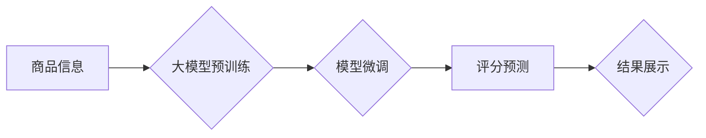

                 

## 大模型在商品评分预测中的实践

> 关键词：大模型、商品评分预测、深度学习、Transformer、BERT、Fine-tuning、推荐系统

## 1. 背景介绍

在当今数据爆炸的时代，商品评分预测已成为电商平台和市场营销领域的关键技术之一。准确的商品评分预测可以帮助用户快速找到心仪商品，提升用户体验，同时也能帮助商家优化产品策略，提高销售额。传统商品评分预测方法主要依赖于基于规则的算法和机器学习模型，但这些方法往往难以捕捉商品评分背后的复杂语义关系和用户偏好。

近年来，大模型技术的发展为商品评分预测带来了新的机遇。大模型，例如BERT、GPT等，凭借其强大的语义理解能力和泛化能力，能够更好地学习商品和用户之间的关联性，从而实现更准确的评分预测。

## 2. 核心概念与联系

### 2.1 商品评分预测

商品评分预测是指根据商品的特征和用户历史行为数据，预测用户对该商品的评分。评分通常是一个数值，例如1-5星，反映用户对商品的满意度。

### 2.2 大模型

大模型是指参数量巨大、训练数据海量的人工智能模型。大模型通常具有强大的语义理解能力和泛化能力，能够在各种自然语言处理任务中取得优异的性能。

### 2.3 Transformer

Transformer是一种新型的神经网络架构，其核心是注意力机制，能够有效地捕捉序列数据中的长距离依赖关系。Transformer在自然语言处理领域取得了突破性的进展，例如BERT、GPT等大模型都基于Transformer架构。

**大模型在商品评分预测中的应用流程**



## 3. 核心算法原理 & 具体操作步骤

### 3.1 算法原理概述

大模型在商品评分预测中的应用主要基于以下原理：

* **语义嵌入:** 将商品和用户的信息转换为向量表示，以便模型能够理解它们的语义关系。
* **注意力机制:** 捕捉商品和用户之间的重要信息，例如商品的属性、用户购买历史等。
* **多层感知机:** 对嵌入后的信息进行多层非线性变换，学习复杂的评分预测模型。

### 3.2 算法步骤详解

1. **数据预处理:** 收集商品信息、用户行为数据等，并进行清洗、转换、编码等操作。
2. **语义嵌入:** 使用预训练好的大模型（例如BERT）对商品和用户的信息进行语义嵌入，得到向量表示。
3. **模型微调:** 将预训练好的大模型进行微调，使用商品评分数据训练模型，学习商品评分预测模型。
4. **评分预测:** 将新的商品信息和用户特征输入到训练好的模型中，得到商品评分预测结果。

### 3.3 算法优缺点

**优点:**

* **高准确率:** 大模型能够捕捉商品评分背后的复杂语义关系，实现更准确的评分预测。
* **泛化能力强:** 预训练好的大模型具有较强的泛化能力，能够应用于不同的商品类型和用户群体。
* **可扩展性强:** 大模型可以根据需要进行扩展，例如增加更多商品特征或用户行为数据。

**缺点:**

* **训练成本高:** 大模型的训练需要大量的计算资源和时间。
* **模型复杂度高:** 大模型的结构复杂，需要专业的技术人员进行维护和调优。
* **数据依赖性强:** 大模型的性能依赖于训练数据的质量和数量。

### 3.4 算法应用领域

大模型在商品评分预测领域的应用场景广泛，例如：

* **电商平台:** 预测用户对商品的评分，推荐相关商品，提高用户转化率。
* **旅游平台:** 预测用户对酒店、景点等的评分，提供个性化旅游推荐。
* **电影平台:** 预测用户对电影的评分，推荐相关电影，提高用户粘性。

## 4. 数学模型和公式 & 详细讲解 & 举例说明

### 4.1 数学模型构建

商品评分预测模型可以构建为一个回归问题，目标是预测用户对商品的评分。常用的数学模型包括线性回归、逻辑回归、支持向量机等。

### 4.2 公式推导过程

以线性回归为例，其模型公式如下：

$$
\hat{y} = \beta_0 + \beta_1 x_1 + \beta_2 x_2 + ... + \beta_n x_n
$$

其中：

* $\hat{y}$ 是预测的商品评分
* $\beta_0$ 是截距项
* $\beta_1, \beta_2, ..., \beta_n$ 是模型参数
* $x_1, x_2, ..., x_n$ 是商品特征的向量表示

模型参数可以通过最小二乘法等方法进行训练。

### 4.3 案例分析与讲解

假设我们有一个电商平台，需要预测用户对商品的评分。商品特征包括商品价格、商品类别、商品描述等。我们可以使用线性回归模型进行预测。

例如，一个商品的价格为100元，属于电子产品类别，商品描述为“高性能笔记本电脑”。我们可以将这些特征转换为向量表示，并输入到训练好的线性回归模型中，得到该商品的预测评分。

## 5. 项目实践：代码实例和详细解释说明

### 5.1 开发环境搭建

* Python 3.6+
* TensorFlow/PyTorch
* Jupyter Notebook

### 5.2 源代码详细实现

```python
import tensorflow as tf

# 定义模型结构
model = tf.keras.Sequential([
    tf.keras.layers.Embedding(input_dim=vocab_size, output_dim=embedding_dim),
    tf.keras.layers.LSTM(units=128),
    tf.keras.layers.Dense(units=1, activation='linear')
])

# 编译模型
model.compile(optimizer='adam', loss='mse')

# 训练模型
model.fit(x_train, y_train, epochs=10)

# 预测评分
predictions = model.predict(x_test)
```

### 5.3 代码解读与分析

* **Embedding层:** 将商品和用户的信息转换为向量表示。
* **LSTM层:** 捕捉商品和用户之间的长距离依赖关系。
* **Dense层:** 对嵌入后的信息进行多层非线性变换，学习评分预测模型。
* **Optimizer:** 使用Adam优化器进行模型训练。
* **Loss:** 使用均方误差作为损失函数。

### 5.4 运行结果展示

训练完成后，我们可以使用测试数据对模型进行评估，例如计算模型的均方误差（MSE）和R-squared值。

## 6. 实际应用场景

### 6.1 电商平台

大模型在电商平台的应用场景广泛，例如：

* **商品推荐:** 根据用户的历史购买记录和商品特征，推荐用户可能感兴趣的商品。
* **个性化营销:** 根据用户的兴趣爱好和购买习惯，进行个性化的营销推广。
* **价格优化:** 根据市场需求和竞争对手价格，优化商品价格，提高利润率。

### 6.2 旅游平台

大模型可以帮助旅游平台提供更个性化的服务，例如：

* **行程推荐:** 根据用户的旅行偏好和预算，推荐合适的旅游行程。
* **酒店预订:** 根据用户的需求和酒店评价，推荐合适的酒店。
* **景点推荐:** 根据用户的兴趣爱好和旅行时间，推荐附近的景点。

### 6.3 其他应用场景

大模型还可以应用于其他领域，例如：

* **金融领域:** 预测股票价格、识别欺诈交易等。
* **医疗领域:** 辅助诊断疾病、预测患者风险等。
* **教育领域:** 个性化学习推荐、自动批改作业等。

### 6.4 未来应用展望

随着大模型技术的不断发展，其在商品评分预测领域的应用将更加广泛和深入。例如：

* **多模态融合:** 将文本、图像、音频等多模态数据融合，提高评分预测的准确率。
* **实时预测:** 利用实时数据流，实现商品评分的实时预测。
* **解释性模型:** 开发能够解释评分预测结果的模型，提高模型的可解释性。

## 7. 工具和资源推荐

### 7.1 学习资源推荐

* **书籍:**
    * 《深度学习》
    * 《自然语言处理》
* **在线课程:**
    * Coursera: 深度学习
    * Udacity: 自然语言处理
* **博客:**
    * TensorFlow Blog
    * PyTorch Blog

### 7.2 开发工具推荐

* **TensorFlow:** 开源深度学习框架
* **PyTorch:** 开源深度学习框架
* **Jupyter Notebook:** 交互式编程环境

### 7.3 相关论文推荐

* BERT: Pre-training of Deep Bidirectional Transformers for Language Understanding
* GPT-3: Language Models are Few-Shot Learners
* Transformer: Attention Is All You Need

## 8. 总结：未来发展趋势与挑战

### 8.1 研究成果总结

大模型在商品评分预测领域取得了显著的成果，能够实现更高的准确率和更强的泛化能力。

### 8.2 未来发展趋势

未来，大模型在商品评分预测领域将朝着以下方向发展：

* **模型规模更大:** 参数量更大的大模型将能够学习更复杂的评分预测模型。
* **多模态融合:** 将文本、图像、音频等多模态数据融合，提高评分预测的准确率。
* **实时预测:** 利用实时数据流，实现商品评分的实时预测。
* **解释性模型:** 开发能够解释评分预测结果的模型，提高模型的可解释性。

### 8.3 面临的挑战

大模型在商品评分预测领域也面临一些挑战：

* **训练成本高:** 大模型的训练需要大量的计算资源和时间。
* **模型复杂度高:** 大模型的结构复杂，需要专业的技术人员进行维护和调优。
* **数据依赖性强:** 大模型的性能依赖于训练数据的质量和数量。

### 8.4 研究展望

未来，我们需要继续探索大模型在商品评分预测领域的应用，并解决其面临的挑战，以实现更准确、更智能的商品评分预测。

## 9. 附录：常见问题与解答

* **Q1: 大模型的训练需要多少计算资源？**

A1: 大模型的训练需要大量的计算资源，例如数百甚至数千个GPU。

* **Q2: 如何评估大模型的性能？**

A2: 可以使用均方误差（MSE）、R-squared值等指标评估大模型的性能。

* **Q3: 如何解决大模型的数据依赖性问题？**

A3: 可以尝试使用数据增强技术、迁移学习等方法来解决大模型的数据依赖性问题。


作者：禅与计算机程序设计艺术 / Zen and the Art of Computer Programming 
<end_of_turn>

