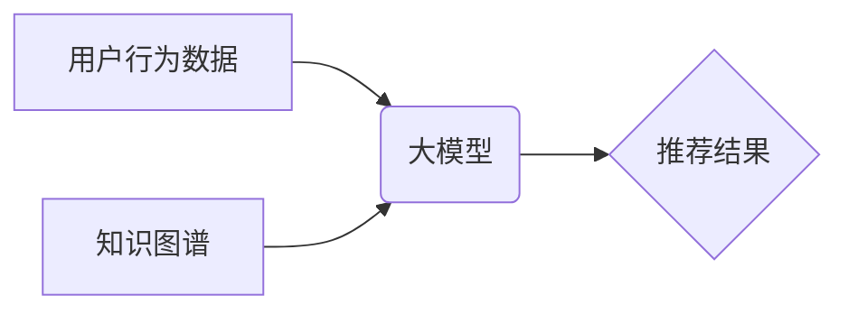

                 

## 大模型对推荐系统长尾用户服务的改进

> 关键词：大模型、推荐系统、长尾用户、个性化推荐、冷启动问题、知识图谱、Transformer模型

## 1. 背景介绍

随着互联网的蓬勃发展，推荐系统已成为各大平台的核心功能，为用户提供个性化服务，提升用户体验。然而，传统推荐系统在服务长尾用户方面存在着诸多挑战。长尾用户是指用户群体中数量较少、兴趣偏好较为独特的用户，他们的行为数据稀疏，难以被传统基于协同过滤或内容过滤的推荐算法有效捕捉。这导致长尾用户往往面临推荐结果不精准、缺乏个性化的困境，从而影响用户粘性和平台发展。

近年来，大模型技术突飞猛进，其强大的学习能力和泛化能力为解决长尾用户服务难题提供了新的思路。大模型能够从海量数据中学习到更丰富的用户特征和物品语义，并通过知识图谱等辅助信息，提升对长尾用户的理解和服务精准度。

## 2. 核心概念与联系

### 2.1  推荐系统

推荐系统旨在根据用户的历史行为、偏好和上下文信息，预测用户对特定物品的兴趣，并推荐最相关的物品。

### 2.2  长尾用户

长尾用户是指用户群体中数量较少、兴趣偏好较为独特的用户，他们的行为数据稀疏，难以被传统推荐算法有效捕捉。

### 2.3  大模型

大模型是指参数规模庞大、训练数据海量的人工智能模型，其强大的学习能力和泛化能力使其能够处理复杂的任务，例如自然语言处理、图像识别、推荐系统等。

### 2.4  知识图谱

知识图谱是一种结构化的知识表示形式，它将实体和关系以图的形式表示，能够捕捉事物之间的语义关联，为推荐系统提供更丰富的上下文信息。

**核心概念与架构流程图**



## 3. 核心算法原理 & 具体操作步骤

### 3.1  算法原理概述

大模型在推荐系统中主要通过以下两种方式改进长尾用户服务：

1. **基于Transformer模型的个性化推荐:** Transformer模型能够捕捉用户行为序列中的长距离依赖关系，并学习用户兴趣的动态变化，从而为长尾用户提供更精准的个性化推荐。

2. **知识图谱增强推荐:** 将知识图谱与推荐算法相结合，能够丰富用户和物品的语义信息，帮助模型理解长尾用户的潜在兴趣，并推荐更相关的物品。

### 3.2  算法步骤详解

**基于Transformer模型的个性化推荐步骤:**

1. **数据预处理:** 收集用户行为数据，例如点击、浏览、购买等，并进行清洗、转换、编码等预处理操作。

2. **Transformer模型训练:** 使用预处理后的数据训练Transformer模型，模型输入用户行为序列，输出用户兴趣向量。

3. **兴趣向量聚类:** 将用户兴趣向量进行聚类，将具有相似兴趣的用户归为同一类。

4. **推荐物品:** 根据用户的兴趣类别和物品特征，使用推荐算法（例如基于内容过滤、协同过滤等）推荐物品。

**知识图谱增强推荐步骤:**

1. **知识图谱构建:** 构建用户、物品、属性等实体之间的关系图谱。

2. **知识图谱嵌入:** 将知识图谱中的实体和关系映射到低维向量空间，以便模型理解和利用知识信息。

3. **模型融合:** 将知识图谱嵌入与推荐模型相结合，例如将知识图谱嵌入作为模型的输入特征，或使用知识图谱约束模型的学习过程。

4. **推荐物品:** 根据融合后的模型输出，推荐物品。

### 3.3  算法优缺点

**基于Transformer模型的个性化推荐:**

* **优点:** 能够捕捉用户行为序列中的长距离依赖关系，学习用户兴趣的动态变化，提升推荐精准度。
* **缺点:** 需要海量数据进行训练，训练成本高，模型参数规模大，部署成本高。

**知识图谱增强推荐:**

* **优点:** 能够丰富用户和物品的语义信息，帮助模型理解长尾用户的潜在兴趣，提升推荐相关性。
* **缺点:** 知识图谱构建和维护成本高，知识图谱的质量直接影响推荐效果。

### 3.4  算法应用领域

* **电商推荐:** 为用户推荐个性化的商品，提升转化率。
* **内容推荐:** 为用户推荐个性化的新闻、视频、文章等内容，提升用户粘性。
* **社交推荐:** 为用户推荐新的朋友、兴趣小组等，提升用户社交体验。

## 4. 数学模型和公式 & 详细讲解 & 举例说明

### 4.1  数学模型构建

**Transformer模型的注意力机制:**

Transformer模型的核心是注意力机制，它能够学习用户行为序列中不同时间步长的重要性，并权衡不同时间步长的信息贡献。注意力机制的数学公式如下：

$$
Attention(Q, K, V) = softmax(\frac{QK^T}{\sqrt{d_k}})V
$$

其中：

* $Q$：查询矩阵
* $K$：键矩阵
* $V$：值矩阵
* $d_k$：键向量的维度
* $softmax$：softmax函数

**举例说明:**

假设用户行为序列为 $[A, B, C, D]$，其中每个行为表示为一个向量。

* $Q$：查询矩阵，表示当前时间步长的行为向量。
* $K$：键矩阵，表示所有时间步长的行为向量。
* $V$：值矩阵，表示所有时间步长的行为向量。

注意力机制会计算每个时间步长的行为向量与所有其他时间步长的行为向量的相似度，并根据相似度权衡不同时间步长的信息贡献，最终输出一个加权后的用户兴趣向量。

### 4.2  公式推导过程

Transformer模型的注意力机制公式推导过程较为复杂，涉及到矩阵运算、线性变换、激活函数等多个步骤。

### 4.3  案例分析与讲解

可以通过实际案例分析Transformer模型的注意力机制在推荐系统中的应用效果。例如，可以分析用户点击商品的序列数据，观察注意力机制如何捕捉用户兴趣的变化，并根据用户兴趣变化推荐更相关的商品。

## 5. 项目实践：代码实例和详细解释说明

### 5.1  开发环境搭建

* Python 3.7+
* PyTorch 1.7+
* Transformers 4.0+

### 5.2  源代码详细实现

```python
from transformers import AutoModelForSequenceClassification, AutoTokenizer

# 加载预训练模型和词典
model_name = "bert-base-uncased"
tokenizer = AutoTokenizer.from_pretrained(model_name)
model = AutoModelForSequenceClassification.from_pretrained(model_name)

# 用户行为序列数据
user_behavior = ["购买手机", "浏览电脑", "购买耳机"]

# 将用户行为序列转换为模型输入格式
inputs = tokenizer(user_behavior, return_tensors="pt")

# 使用模型预测用户兴趣
outputs = model(**inputs)

# 获取用户兴趣向量
user_interest = outputs.logits

# ...后续代码用于根据用户兴趣向量进行推荐
```

### 5.3  代码解读与分析

* 代码首先加载预训练的BERT模型和词典。
* 然后将用户行为序列转换为模型输入格式。
* 使用模型预测用户兴趣，并获取用户兴趣向量。
* 后续代码可以根据用户兴趣向量进行推荐，例如使用基于内容过滤或协同过滤的算法推荐相关的物品。

### 5.4  运行结果展示

运行代码后，可以得到用户兴趣向量，并根据用户兴趣向量进行推荐。推荐结果可以展示给用户，并根据用户反馈进行模型优化。

## 6. 实际应用场景

### 6.1  电商推荐

大模型可以为电商平台提供更精准的商品推荐，例如根据用户的浏览历史、购买记录、购物车内容等信息，推荐用户可能感兴趣的商品。

### 6.2  内容推荐

大模型可以为新闻、视频、文章等内容平台提供个性化的内容推荐，例如根据用户的阅读习惯、观看历史、点赞记录等信息，推荐用户可能感兴趣的内容。

### 6.3  社交推荐

大模型可以为社交平台提供更精准的社交推荐，例如根据用户的兴趣爱好、好友关系、社交行为等信息，推荐用户可能感兴趣的朋友、兴趣小组等。

### 6.4  未来应用展望

大模型在推荐系统领域的应用前景广阔，未来可能应用于以下场景：

* **更个性化的推荐:** 大模型能够更深入地理解用户的兴趣偏好，提供更个性化的推荐。
* **长尾用户服务:** 大模型能够更好地服务长尾用户，为他们提供更精准的推荐。
* **跨平台推荐:** 大模型能够整合不同平台的用户数据，提供跨平台的个性化推荐。
* **多模态推荐:** 大模型能够融合文本、图像、视频等多模态数据，提供更丰富的推荐体验。

## 7. 工具和资源推荐

### 7.1  学习资源推荐

* **论文:**

    * Vaswani, A., Shazeer, N., Parmar, N., Uszkoreit, J., Jones, L., Gomez, A. N., ... & Polosukhin, I. (2017). Attention is all you need. Advances in neural information processing systems, 30.
    * Devlin, J., Chang, M. W., Lee, K., & Toutanova, K. (2018). Bert: Pre-training of deep bidirectional transformers for language understanding. arXiv preprint arXiv:1810.04805.

* **博客:**

    * https://huggingface.co/blog/transformers-tutorial
    * https://towardsdatascience.com/

### 7.2  开发工具推荐

* **PyTorch:** https://pytorch.org/
* **Transformers:** https://huggingface.co/transformers/

### 7.3  相关论文推荐

* **Knowledge Graph Enhanced Recommendation:** https://arxiv.org/abs/1908.09607
* **Personalized Recommendation with Transformer Networks:** https://arxiv.org/abs/1909.06311

## 8. 总结：未来发展趋势与挑战

### 8.1  研究成果总结

大模型在推荐系统中取得了显著的成果，能够提升推荐精准度，更好地服务长尾用户。

### 8.2  未来发展趋势

* **模型规模和能力提升:** 未来大模型规模将继续扩大，能力将进一步提升，能够更好地理解用户需求和物品特征。
* **多模态融合:** 大模型将融合文本、图像、视频等多模态数据，提供更丰富的推荐体验。
* **个性化推荐增强:** 大模型将更加深入地理解用户的兴趣偏好，提供更个性化的推荐。
* **联邦学习:** 大模型将应用于联邦学习场景，保护用户隐私的同时提升推荐效果。

### 8.3  面临的挑战

* **数据隐私和安全:** 大模型训练需要海量数据，如何保护用户隐私和数据安全是一个重要挑战。
* **模型解释性和可控性:** 大模型的决策过程较为复杂，如何提高模型的解释性和可控性是一个重要的研究方向。
* **模型部署成本:** 大模型参数规模庞大，部署成本较高，需要寻找更有效的部署方案。

### 8.4  研究展望

未来研究将继续探索大模型在推荐系统中的应用，例如：

* 开发更有效的知识图谱构建和融合方法。
* 研究大模型的解释性和可控性，提高模型的透明度和信任度。
* 探索大模型在联邦学习场景中的应用，保护用户隐私的同时提升推荐效果。


## 9. 附录：常见问题与解答

### 9.1  Q: 大模型训练需要多少数据？

A: 大模型训练需要海量数据，通常需要数十亿甚至数百亿个样本。

### 9.2  Q: 大模型的部署成本高吗？

A: 大模型的部署成本较高，需要强大的计算资源和存储空间。

### 9.3  Q: 如何评估大模型的推荐效果？

A: 大模型的推荐效果可以评估指标，例如点击率、转化率、用户满意度等。

### 9.4  Q: 大模型如何保护用户隐私？

A: 大模型可以应用于联邦学习场景，保护用户隐私的同时提升推荐效果。


作者：禅与计算机程序设计艺术 / Zen and the Art of Computer Programming 
<end_of_turn>

