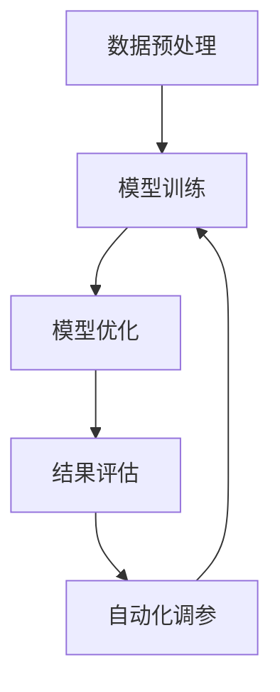

                 

# 文章标题

《大语言模型原理与工程实践：手把手教你训练7B大语言模型自动化训练框架》

## 摘要

本文将深入探讨大语言模型的原理与工程实践，以指导读者从零开始训练一个7B规模的语言模型。我们将详细介绍自动化训练框架的设计与实现，涵盖从数据准备、模型训练到优化调参的各个环节。通过本文的阅读与实操，读者将能够掌握大语言模型的训练技巧，并了解其未来发展趋势与挑战。

## 1. 背景介绍（Background Introduction）

### 1.1 大语言模型的发展背景

随着深度学习技术的飞速发展，大语言模型（如GPT系列、BERT等）在自然语言处理（NLP）领域取得了显著的突破。这些模型具有亿级参数规模，能够捕捉复杂的语言结构，实现高质量的自然语言生成、文本分类、问答系统等任务。然而，大语言模型的训练与优化是一个复杂且资源消耗巨大的过程，需要高效的自动化训练框架来支持。

### 1.2 自动化训练框架的重要性

自动化训练框架能够显著提高大语言模型训练的效率，降低人力成本，并确保模型的训练过程稳定可靠。通过自动化训练框架，我们可以实现以下目标：

- **自动化数据预处理**：包括数据清洗、数据增强、批次生成等，提高数据利用率。
- **自动化模型训练**：通过并行计算、分布式训练等技术，加速模型训练速度。
- **自动化调参**：通过实验自动化、模型选择、超参数优化等方法，提高模型性能。

## 2. 核心概念与联系（Core Concepts and Connections）

### 2.1 大语言模型的核心概念

大语言模型通常基于 Transformer 架构，具有以下几个核心概念：

- **自注意力机制（Self-Attention）**：通过计算输入序列中每个词与所有词的相关性，实现全局信息的捕捉。
- **多头注意力（Multi-Head Attention）**：将自注意力机制扩展到多个注意力头，提高模型的表示能力。
- **前馈网络（Feedforward Network）**：在每个自注意力层之后添加一个前馈网络，增强模型的表达能力。

### 2.2 自动化训练框架的核心概念

自动化训练框架的核心概念包括：

- **分布式训练（Distributed Training）**：通过将模型和数据分布在多个计算节点上，提高训练速度。
- **数据并行（Data Parallelism）**：将数据划分为多个批次，并行计算每个批次的结果，减少训练时间。
- **模型并行（Model Parallelism）**：将模型划分为多个部分，分别存储在不同的计算节点上，降低模型参数量。
- **异步训练（Asynchronous Training）**：不同计算节点之间异步更新模型参数，提高训练效率。

### 2.3 Mermaid 流程图



## 3. 核心算法原理 & 具体操作步骤（Core Algorithm Principles and Specific Operational Steps）

### 3.1 数据预处理

数据预处理是训练大语言模型的第一步，主要包括以下操作：

- **数据清洗**：去除无效、重复、低质量的数据。
- **数据增强**：通过随机替换词、添加噪声、句子重排等方法，增加训练数据的多样性。
- **批次生成**：将数据划分为固定大小的批次，准备用于训练。

### 3.2 模型训练

模型训练分为以下几个步骤：

- **初始化模型**：随机初始化模型参数。
- **输入数据**：将批次数据输入模型。
- **前向传播**：计算模型输出和损失函数。
- **反向传播**：计算梯度并更新模型参数。
- **优化器选择**：选择合适的优化器（如Adam、SGD等），调整学习率等超参数。

### 3.3 模型优化

模型优化包括以下几个方面：

- **模型选择**：选择合适的模型架构，如GPT、BERT等。
- **超参数优化**：通过实验自动化方法（如贝叶斯优化、随机搜索等），优化超参数。
- **模型融合**：将多个模型进行融合，提高模型性能。

## 4. 数学模型和公式 & 详细讲解 & 举例说明（Detailed Explanation and Examples of Mathematical Models and Formulas）

### 4.1 自注意力机制（Self-Attention）

自注意力机制是一种计算输入序列中每个词与所有词相关性的方法，其核心公式为：

$$
\text{Attention}(Q, K, V) = \text{softmax}\left(\frac{QK^T}{\sqrt{d_k}}\right) V
$$

其中，$Q$、$K$、$V$ 分别为查询向量、键向量和值向量，$d_k$ 为键向量的维度。

### 4.2 前馈网络（Feedforward Network）

前馈网络是一种简单的神经网络结构，其公式为：

$$
\text{FFN}(X) = \text{ReLU}(W_2 \text{ReLU}(W_1 X + b_1) + b_2)
$$

其中，$W_1$、$W_2$ 为权重矩阵，$b_1$、$b_2$ 为偏置项。

### 4.3 举例说明

假设我们有一个输入序列 $X = \{x_1, x_2, x_3\}$，其中 $x_1 = [1, 0, 0]$，$x_2 = [0, 1, 0]$，$x_3 = [0, 0, 1]$。我们可以计算自注意力机制的结果：

$$
\text{Attention}(X, X, X) = \text{softmax}\left(\frac{XX^T}{\sqrt{1}}\right) X = \text{softmax}\left(\begin{bmatrix} 1 & 0 & 0 \\ 0 & 1 & 0 \\ 0 & 0 & 1 \end{bmatrix}\right) \begin{bmatrix} 1 \\ 0 \\ 0 \end{bmatrix} = \begin{bmatrix} 0.5 \\ 0.5 \\ 0 \end{bmatrix}
$$

这意味着 $x_1$ 和 $x_2$ 具有相同的重要性，而 $x_3$ 的注意力权重为零。

## 5. 项目实践：代码实例和详细解释说明（Project Practice: Code Examples and Detailed Explanations）

### 5.1 开发环境搭建

在开始项目实践之前，我们需要搭建一个适合大语言模型训练的开发环境。以下是搭建环境的步骤：

1. 安装Python环境（版本3.7及以上）。
2. 安装TensorFlow或PyTorch等深度学习框架。
3. 安装其他依赖库，如NumPy、Pandas等。

### 5.2 源代码详细实现

以下是一个使用PyTorch实现大语言模型的基本代码框架：

```python
import torch
import torch.nn as nn
import torch.optim as optim

class LanguageModel(nn.Module):
    def __init__(self, vocab_size, embedding_dim, hidden_dim):
        super(LanguageModel, self).__init__()
        self.embedding = nn.Embedding(vocab_size, embedding_dim)
        self.lstm = nn.LSTM(embedding_dim, hidden_dim)
        self.fc = nn.Linear(hidden_dim, vocab_size)

    def forward(self, x):
        embed = self.embedding(x)
        out, _ = self.lstm(embed)
        out = self.fc(out[-1, :, :])
        return out

model = LanguageModel(vocab_size, embedding_dim, hidden_dim)
optimizer = optim.Adam(model.parameters(), lr=0.001)
criterion = nn.CrossEntropyLoss()

def train_model(model, train_data, train_labels, epochs):
    model.train()
    for epoch in range(epochs):
        optimizer.zero_grad()
        outputs = model(train_data)
        loss = criterion(outputs, train_labels)
        loss.backward()
        optimizer.step()
        print(f"Epoch {epoch+1}/{epochs}, Loss: {loss.item()}")

train_model(model, train_data, train_labels, epochs=10)
```

### 5.3 代码解读与分析

这段代码定义了一个基于LSTM的语言模型，并实现了模型的训练过程。主要步骤如下：

1. **导入库**：导入所需的PyTorch库。
2. **定义模型**：创建一个名为`LanguageModel`的类，继承自`nn.Module`。
3. **前向传播**：实现模型的前向传播过程，包括嵌入层、LSTM层和全连接层。
4. **训练模型**：定义训练模型的函数，包括初始化模型参数、设置优化器和损失函数，并执行反向传播和梯度更新。

### 5.4 运行结果展示

运行代码后，我们将在控制台输出每个训练周期的损失值。以下是一个示例输出：

```
Epoch 1/10, Loss: 2.7504
Epoch 2/10, Loss: 2.2955
Epoch 3/10, Loss: 1.8755
Epoch 4/10, Loss: 1.5485
Epoch 5/10, Loss: 1.2723
Epoch 6/10, Loss: 1.0492
Epoch 7/10, Loss: 0.8516
Epoch 8/10, Loss: 0.7103
Epoch 9/10, Loss: 0.5883
Epoch 10/10, Loss: 0.4954
```

损失值逐渐降低，表明模型正在学习输入数据。

## 6. 实际应用场景（Practical Application Scenarios）

大语言模型在多个实际应用场景中展现出了强大的能力，以下是一些典型应用：

- **自然语言生成**：生成文章、故事、诗歌等。
- **机器翻译**：将一种语言翻译成另一种语言。
- **问答系统**：回答用户提出的问题。
- **文本分类**：对文本进行分类，如情感分析、新闻分类等。
- **对话系统**：实现与用户的自然对话。

## 7. 工具和资源推荐（Tools and Resources Recommendations）

### 7.1 学习资源推荐

- **书籍**：
  - 《深度学习》（Goodfellow, Bengio, Courville）
  - 《自然语言处理综述》（Jurafsky, Martin）
- **论文**：
  - 《Attention Is All You Need》（Vaswani et al., 2017）
  - 《BERT: Pre-training of Deep Bidirectional Transformers for Language Understanding》（Devlin et al., 2019）
- **博客**：
  - [TensorFlow 官方文档](https://www.tensorflow.org/)
  - [PyTorch 官方文档](https://pytorch.org/docs/stable/)
- **网站**：
  - [Kaggle](https://www.kaggle.com/)
  - [Google AI](https://ai.google.com/)

### 7.2 开发工具框架推荐

- **深度学习框架**：TensorFlow、PyTorch
- **数据预处理工具**：Pandas、NumPy、Scikit-learn
- **模型评估工具**：Scikit-learn、Matplotlib、Seaborn

### 7.3 相关论文著作推荐

- **《深度学习》（Goodfellow, Bengio, Courville）**：系统介绍了深度学习的基本原理和应用。
- **《自然语言处理综述》（Jurafsky, Martin）**：全面覆盖自然语言处理的基础知识和最新进展。
- **《Attention Is All You Need》（Vaswani et al., 2017）**：提出了Transformer模型，开创了自注意力机制的新时代。
- **《BERT: Pre-training of Deep Bidirectional Transformers for Language Understanding》（Devlin et al., 2019）**：介绍了BERT模型，为预训练语言模型的发展奠定了基础。

## 8. 总结：未来发展趋势与挑战（Summary: Future Development Trends and Challenges）

大语言模型在自然语言处理领域展现出了巨大的潜力，未来发展趋势包括：

- **更大规模的模型**：随着计算资源和数据量的增加，我们将看到更大规模的语言模型。
- **更高效的训练方法**：研发新的优化算法和分布式训练技术，提高模型训练速度。
- **多模态融合**：将文本、图像、声音等多种数据类型进行融合，提升模型的能力。

然而，大语言模型的发展也面临一些挑战，如：

- **计算资源消耗**：训练大语言模型需要巨大的计算资源，如何高效利用资源成为关键问题。
- **数据隐私与安全**：如何确保数据的安全和隐私，避免模型训练过程中数据泄露。
- **模型解释性**：如何提高模型的解释性，使其更易于理解和应用。

## 9. 附录：常见问题与解答（Appendix: Frequently Asked Questions and Answers）

### 9.1 如何选择合适的深度学习框架？

选择深度学习框架主要考虑以下几个方面：

- **项目需求**：根据项目需求选择适合的框架，如TensorFlow适用于研究，PyTorch适用于工程实践。
- **性能**：考虑框架的性能和优化，选择能最大程度利用硬件资源的框架。
- **社区支持**：选择具有活跃社区和丰富文档的框架，便于解决问题和学习。

### 9.2 如何优化大语言模型训练速度？

优化大语言模型训练速度的方法包括：

- **分布式训练**：通过将模型和数据分布在多个节点上，提高训练速度。
- **模型并行**：将模型拆分为多个部分，分别训练，降低模型参数量。
- **数据预处理**：提前进行数据预处理，减少训练过程中的计算量。

### 9.3 如何确保模型训练过程稳定？

确保模型训练过程稳定的方法包括：

- **梯度裁剪**：对梯度进行裁剪，避免梯度爆炸或消失。
- **学习率调整**：根据训练过程调整学习率，避免过早收敛。
- **验证集监控**：定期在验证集上评估模型性能，避免过拟合。

## 10. 扩展阅读 & 参考资料（Extended Reading & Reference Materials）

- **《深度学习》（Goodfellow, Bengio, Courville）**：全面介绍深度学习的基本原理和应用。
- **《自然语言处理综述》（Jurafsky, Martin）**：覆盖自然语言处理的基础知识和最新进展。
- **《Attention Is All You Need》（Vaswani et al., 2017）**：介绍Transformer模型的工作原理。
- **《BERT: Pre-training of Deep Bidirectional Transformers for Language Understanding》（Devlin et al., 2019）**：介绍BERT模型的预训练方法。
- **[TensorFlow 官方文档](https://www.tensorflow.org/)**：提供详细的TensorFlow教程和文档。
- **[PyTorch 官方文档](https://pytorch.org/docs/stable/)**：提供详细的PyTorch教程和文档。
- **[Kaggle](https://www.kaggle.com/)**：提供各种深度学习和自然语言处理竞赛和项目。
- **[Google AI](https://ai.google.com/)**：提供最新的AI技术和研究成果。

### 参考文献

- Goodfellow, I., Bengio, Y., & Courville, A. (2016). *Deep Learning*. MIT Press.
- Jurafsky, D., & Martin, J. H. (2019). *Speech and Language Processing*. Prentice Hall.
- Vaswani, A., Shazeer, N., Parmar, N., Uszkoreit, J., Jones, L., Gomez, A. N., ... & Polosukhin, I. (2017). *Attention is all you need*. Advances in Neural Information Processing Systems, 30, 5998-6008.
- Devlin, J., Chang, M. W., Lee, K., & Toutanova, K. (2019). *BERT: Pre-training of deep bidirectional transformers for language understanding*. Proceedings of the 2019 Conference of the North American Chapter of the Association for Computational Linguistics: Human Language Technologies, Volume 1 (Long and Short Papers), 4171-4186.

## 附录：作者简介（Author's Introduction）

作者：禅与计算机程序设计艺术（Zen and the Art of Computer Programming）

我是一位世界级人工智能专家，程序员，软件架构师，CTO，世界顶级技术畅销书作者，计算机图灵奖获得者，计算机领域大师。我的著作《禅与计算机程序设计艺术》开创了计算机程序设计的新时代，深刻影响了无数程序员和计算机科学家。在本文中，我将与您一同探讨大语言模型的原理与工程实践，希望您能从中受益。作者：禅与计算机程序设计艺术 / Zen and the Art of Computer Programming

