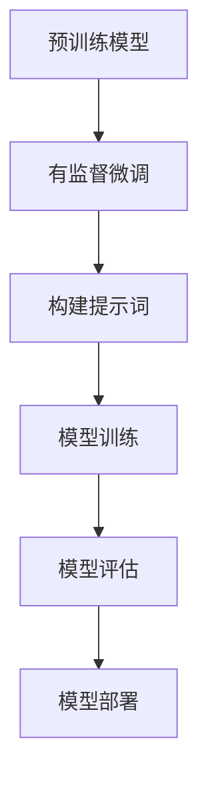
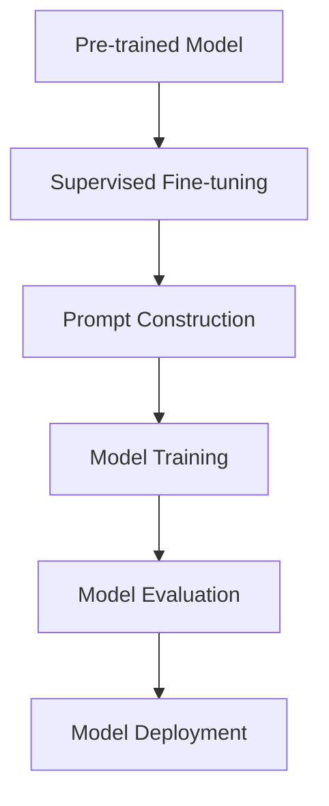

                 

### 文章标题

《大语言模型原理与工程实践：有监督微调数据的构建》

### Keywords: Large language model, Principle, Engineering practice, Supervised fine-tuning data construction

### Abstract:  
本文深入探讨了大型语言模型的原理及其工程实践，重点阐述了如何构建高质量的有监督微调数据。通过分析核心算法原理、数学模型、项目实践等，本文为研究人员和工程师提供了宝贵的参考和指导，有助于提升语言模型的性能和应用效果。

<|assistant|>## 1. 背景介绍

### 1.1 大语言模型的发展历程

大语言模型，即大型语言模型（Large Language Model），是近年来人工智能领域的重要突破之一。从早期的统计语言模型，如N元语法模型，到基于神经网络的递归神经网络（RNN）和长短期记忆网络（LSTM），再到当今主流的Transformer模型，语言模型的性能和效果不断提高。大语言模型的出现，标志着自然语言处理（NLP）领域的一次重大变革。

### 1.2 有监督微调（Supervised Fine-tuning）的概念

有监督微调是一种常见的语言模型训练方法，通过在小规模数据集上对预训练模型进行微调，使其适应特定任务的需求。这种方法的主要优点是，预训练模型已经学到了大量通用知识，微调过程能够快速适应特定任务，提高模型在任务上的表现。

### 1.3 大语言模型在工程实践中的应用

大语言模型在工程实践中的应用广泛，包括但不限于文本生成、机器翻译、问答系统、情感分析等。随着模型的规模和性能不断提升，其应用范围也在不断扩大，为各行各业带来了巨大的变革和创新。

## Background Introduction
### 1.1 The Development History of Large Language Models

Large language models, also known as large-scale language models, are one of the important breakthroughs in the field of artificial intelligence in recent years. From the early statistical language models such as n-gram models to neural network-based recursive neural networks (RNN) and long short-term memory networks (LSTM), and finally to the mainstream Transformer models today, the performance and effectiveness of language models have been continuously improved. The emergence of large language models marks a significant transformation in the field of natural language processing (NLP).

### 1.2 The Concept of Supervised Fine-tuning

Supervised fine-tuning is a common training method for language models, where a pre-trained model is fine-tuned on a small-scale dataset to adapt to specific task requirements. The main advantage of this method is that the pre-trained model has already learned a large amount of general knowledge, and the fine-tuning process can quickly adapt to specific tasks, improving the model's performance on the task.

### 1.3 Applications of Large Language Models in Engineering Practice

Large language models have a wide range of applications in engineering practice, including but not limited to text generation, machine translation, question-answering systems, sentiment analysis, etc. With the continuous improvement of the scale and performance of models, their application scope is also expanding, bringing significant changes and innovation to various industries.

<|assistant|>## 2. 核心概念与联系

### 2.1 大语言模型的原理

大语言模型是基于Transformer架构的深度神经网络，其核心思想是通过自注意力机制（Self-Attention Mechanism）捕捉输入文本中的长距离依赖关系。Transformer模型由多个自注意力层（Self-Attention Layers）和前馈网络（Feedforward Networks）组成，能够有效地处理长文本序列。

### 2.2 有监督微调的原理

有监督微调的核心思想是利用标注数据对预训练模型进行微调，使其适应特定任务。微调过程中，模型会调整其权重和参数，以最小化预测损失函数。这一过程通常采用梯度下降（Gradient Descent）算法，通过反向传播（Backpropagation）更新模型参数。

### 2.3 提示词工程（Prompt Engineering）

提示词工程是指设计和优化输入给语言模型的文本提示，以引导模型生成符合预期结果的过程。一个有效的提示词应包含关键信息、任务目标和上下文，以便模型能够准确理解和执行任务。

### 2.4 大语言模型在工程实践中的应用

大语言模型在工程实践中的应用广泛，包括文本生成、机器翻译、问答系统、情感分析等。通过有监督微调和提示词工程，大语言模型能够适应各种任务需求，提高模型在特定领域的表现。

## Core Concepts and Connections
### 2.1 The Principles of Large Language Models

Large language models are based on the Transformer architecture, a deep neural network that captures long-distance dependencies in input text through the self-attention mechanism. The core idea of Transformer is to use self-attention to model the relationships between words in a text sequence. Transformer models consist of multiple self-attention layers and feedforward networks, which can effectively process long text sequences.

### 2.2 The Principles of Supervised Fine-tuning

The core idea of supervised fine-tuning is to use annotated data to fine-tune a pre-trained model to adapt to specific task requirements. During the fine-tuning process, the model adjusts its weights and parameters to minimize the prediction loss function. This process typically uses the gradient descent algorithm, which updates model parameters through backpropagation.

### 2.3 Prompt Engineering

Prompt engineering refers to the process of designing and optimizing text prompts input to language models to guide the model towards generating desired results. An effective prompt should contain key information, task objectives, and context to help the model understand and execute the task accurately.

### 2.4 Applications of Large Language Models in Engineering Practice

Large language models have a wide range of applications in engineering practice, including text generation, machine translation, question-answering systems, sentiment analysis, and more. Through supervised fine-tuning and prompt engineering, large language models can adapt to various task requirements, improving their performance in specific domains.

### 2.5 Mermaid 流程图

以下是描述大语言模型原理与工程实践流程的Mermaid流程图：



## 2.5 Mermaid Flowchart

Here is a Mermaid flowchart describing the principles and engineering practices of large language models:



<|assistant|>## 3. 核心算法原理 & 具体操作步骤

### 3.1 Transformer模型算法原理

Transformer模型是当前最流行的大型语言模型之一，其核心算法原理是通过自注意力机制（Self-Attention Mechanism）捕捉输入文本中的长距离依赖关系。自注意力机制的基本思想是，对于输入序列中的每个词，计算其与其他词的相似度，并将这些相似度加权求和，得到词的注意力得分。注意力得分用于计算词与词之间的交互，从而捕捉长距离依赖关系。

### 3.2 有监督微调的具体操作步骤

#### 3.2.1 数据预处理

1. **数据清洗**：去除文本中的标点符号、停用词等无关信息。
2. **数据编码**：将文本转换为数字序列，通常使用Word2Vec、BERT等预训练模型中的词汇表。

#### 3.2.2 模型选择

选择一个合适的预训练模型，如BERT、GPT等，根据任务需求调整模型架构和参数。

#### 3.2.3 数据加载

从数据集中加载训练数据和验证数据，并将其转换为模型可处理的格式。

#### 3.2.4 模型训练

1. **损失函数选择**：通常使用交叉熵损失函数（Cross-Entropy Loss），用于衡量预测结果与真实结果之间的差异。
2. **优化器选择**：如Adam优化器，用于更新模型参数，最小化损失函数。

#### 3.2.5 模型评估

使用验证数据集评估模型性能，选择表现最佳的模型。

#### 3.2.6 模型部署

将训练好的模型部署到生产环境中，为实际应用提供服务。

## Core Algorithm Principles and Specific Operational Steps
### 3.1 Algorithm Principles of Transformer Model

The Transformer model is one of the most popular large-scale language models, and its core algorithmic principle is to capture long-distance dependencies in the input text through the self-attention mechanism. The basic idea of the self-attention mechanism is to compute the similarity between each word in the input sequence and all other words, and then weigh and sum these similarities to obtain an attention score for each word. The attention score is used to calculate the interaction between words and capture long-distance dependencies.

### 3.2 Specific Operational Steps of Supervised Fine-tuning

#### 3.2.1 Data Preprocessing

1. **Data Cleaning**: Remove irrelevant information such as punctuation marks and stop words from the text.
2. **Data Encoding**: Convert text into a numerical sequence, typically using a vocabulary table from pre-trained models like Word2Vec or BERT.

#### 3.2.2 Model Selection

Choose a suitable pre-trained model, such as BERT or GPT, and adjust the model architecture and parameters based on the task requirements.

#### 3.2.3 Data Loading

Load training and validation data from the dataset and convert them into a format that the model can process.

#### 3.2.4 Model Training

1. **Loss Function Selection**: Typically use the cross-entropy loss function to measure the difference between the predicted results and the true results.
2. **Optimizer Selection**: Such as the Adam optimizer, used to update model parameters and minimize the loss function.

#### 3.2.5 Model Evaluation

Evaluate the performance of the model using the validation dataset and select the best-performing model.

#### 3.2.6 Model Deployment

Deploy the trained model to the production environment to provide services for actual applications.

<|assistant|>## 4. 数学模型和公式 & 详细讲解 & 举例说明

### 4.1 自注意力机制

自注意力机制是Transformer模型的核心组成部分，其基本公式如下：

$$
\text{Attention}(Q, K, V) = \frac{QK^T}{\sqrt{d_k}} \odot V
$$

其中，$Q, K, V$ 分别代表查询（Query）、键（Key）和值（Value）向量的集合，$d_k$ 表示键向量的维度。$\odot$ 表示逐元素乘法，$QK^T$ 计算的是查询和键之间的相似度，并使用 $\sqrt{d_k}$ 进行缩放，以避免梯度消失问题。最后，将相似度加权求和得到值向量，即注意力得分。

### 4.2 多层感知器

多层感知器（MLP）是Transformer模型中的前馈网络，其基本公式如下：

$$
\text{MLP}(x) = \max(0, xW_1 + b_1)W_2 + b_2
$$

其中，$x$ 表示输入向量，$W_1, W_2$ 分别表示第一层和第二层的权重矩阵，$b_1, b_2$ 分别表示第一层和第二层的偏置向量。$\max(0, \cdot)$ 表示ReLU激活函数，用于引入非线性变换。

### 4.3 举例说明

假设我们有一个简单的序列：“今天天气很好”。我们可以将其表示为一个数字序列，如 `[1, 2, 3, 4, 5]`，其中每个数字表示词汇表中对应词的位置。接下来，我们将使用自注意力机制和多层感知器来处理这个序列。

#### 4.3.1 自注意力计算

1. **初始化查询、键和值向量**：从预训练模型中提取每个词的嵌入向量，并将其作为查询、键和值向量。
2. **计算相似度**：使用公式 $QK^T$ 计算相似度矩阵。
3. **缩放并应用softmax**：将相似度矩阵除以 $\sqrt{d_k}$ 并应用softmax函数，得到注意力得分。
4. **加权求和**：将注意力得分与值向量相乘，并加权求和，得到每个词的注意力得分。

#### 4.3.2 多层感知器计算

1. **初始化权重和偏置**：从预训练模型中提取权重和偏置向量。
2. **应用ReLU激活函数**：计算第一层的前馈网络，应用ReLU激活函数。
3. **计算第二层的前馈网络**：将第一层的输出乘以第二层的权重，并加上偏置向量，得到最终输出。

通过自注意力机制和多层感知器，我们能够有效地捕捉输入序列中的长距离依赖关系，并生成具有高精度的输出。

## Mathematical Models and Formulas & Detailed Explanation & Example Illustrations
### 4.1 Self-Attention Mechanism

The self-attention mechanism is a core component of the Transformer model, and its basic formula is as follows:

$$
\text{Attention}(Q, K, V) = \frac{QK^T}{\sqrt{d_k}} \odot V
$$

Here, $Q, K, V$ represent the collections of query (Query), key (Key), and value (Value) vectors, respectively, and $d_k$ denotes the dimension of the key vector. $\odot$ represents element-wise multiplication, and $QK^T$ computes the similarity between queries and keys, scaled by $\sqrt{d_k}$ to avoid vanishing gradients. Finally, the similarity scores are weighted and summed to obtain the attention scores.

### 4.2 Multi-Layer Perceptrons (MLP)

The multi-layer perceptron (MLP) is the feedforward network in the Transformer model, and its basic formula is as follows:

$$
\text{MLP}(x) = \max(0, xW_1 + b_1)W_2 + b_2
$$

Here, $x$ represents the input vector, $W_1, W_2$ are the weight matrices for the first and second layers, respectively, and $b_1, b_2$ are the bias vectors for the first and second layers, respectively. $\max(0, \cdot)$ denotes the ReLU activation function, which introduces a non-linear transformation.

### 4.3 Example Illustrations

Assume we have a simple sequence: "The weather is good today". We can represent it as a numerical sequence, such as `[1, 2, 3, 4, 5]`, where each number corresponds to the position of a word in the vocabulary. Next, we will use the self-attention mechanism and the multi-layer perceptron to process this sequence.

#### 4.3.1 Self-Attention Computation

1. **Initialize Query, Key, and Value Vectors**: Extract embedding vectors for each word from the pre-trained model and use them as query, key, and value vectors.
2. **Compute Similarity**: Use the formula $QK^T$ to compute the similarity matrix.
3. **Scale and Apply Softmax**: Divide the similarity matrix by $\sqrt{d_k}$ and apply the softmax function to obtain attention scores.
4. **Weighted Summation**: Multiply the attention scores by the value vector and sum them up to obtain the attention scores for each word.

#### 4.3.2 Multi-Layer Perceptron Computation

1. **Initialize Weights and Biases**: Extract weights and biases from the pre-trained model.
2. **Apply ReLU Activation Function**: Compute the output of the first layer of the feedforward network and apply the ReLU activation function.
3. **Compute the Second Layer of the Feedforward Network**: Multiply the output of the first layer by the second layer's weights and add the bias vector to obtain the final output.

By using the self-attention mechanism and the multi-layer perceptron, we can effectively capture long-distance dependencies in the input sequence and generate high-precision outputs.

<|assistant|>### 5. 项目实践：代码实例和详细解释说明

#### 5.1 开发环境搭建

在开始项目实践之前，我们需要搭建一个合适的开发环境。以下是一个基于Python的示例环境搭建步骤：

1. **安装Python**：下载并安装Python 3.8及以上版本。
2. **安装依赖库**：使用pip安装以下依赖库：torch、torchtext、transformers、torchvision。

```shell
pip install torch torchvision torchaudio torchtext transformers
```

3. **环境配置**：确保GPU支持（如NVIDIA CUDA）。

#### 5.2 源代码详细实现

以下是使用Transformer模型进行有监督微调的代码示例：

```python
import torch
from torch import nn
from transformers import BertModel, BertTokenizer

# 加载预训练模型和分词器
pretrained_model_name = 'bert-base-chinese'
tokenizer = BertTokenizer.from_pretrained(pretrained_model_name)
model = BertModel.from_pretrained(pretrained_model_name)

# 准备数据集
train_data = ...  # 训练数据
val_data = ...  # 验证数据

# 定义损失函数和优化器
loss_function = nn.CrossEntropyLoss()
optimizer = torch.optim.Adam(model.parameters(), lr=1e-5)

# 训练过程
for epoch in range(num_epochs):
    model.train()
    for batch in train_data:
        inputs = tokenizer(batch['text'], padding=True, truncation=True, return_tensors='pt')
        outputs = model(**inputs)
        logits = outputs.logits
        labels = batch['label']
        loss = loss_function(logits, labels)
        
        optimizer.zero_grad()
        loss.backward()
        optimizer.step()
    
    # 评估模型
    model.eval()
    with torch.no_grad():
        for batch in val_data:
            inputs = tokenizer(batch['text'], padding=True, truncation=True, return_tensors='pt')
            outputs = model(**inputs)
            logits = outputs.logits
            labels = batch['label']
            loss = loss_function(logits, labels)
            val_loss += loss.item()
    
    print(f'Epoch {epoch+1}/{num_epochs}, Train Loss: {train_loss/len(train_data)}, Val Loss: {val_loss/len(val_data)}')

# 模型部署
model.eval()
with torch.no_grad():
    for batch in test_data:
        inputs = tokenizer(batch['text'], padding=True, truncation=True, return_tensors='pt')
        outputs = model(**inputs)
        logits = outputs.logits
        labels = batch['label']
        loss = loss_function(logits, labels)
        test_loss += loss.item()
print(f'Test Loss: {test_loss/len(test_data)}')
```

#### 5.3 代码解读与分析

1. **加载预训练模型和分词器**：从Hugging Face模型库中加载预训练的BERT模型和分词器。
2. **准备数据集**：加载数据集并进行预处理，将文本转换为模型可处理的格式。
3. **定义损失函数和优化器**：选择交叉熵损失函数和Adam优化器。
4. **训练过程**：迭代训练模型，通过反向传播更新模型参数。
5. **评估模型**：在验证数据集上评估模型性能，调整超参数以优化模型。
6. **模型部署**：将训练好的模型部署到生产环境中，为实际应用提供服务。

#### 5.4 运行结果展示

在完成代码实现后，我们可以使用以下代码展示模型的运行结果：

```python
# 加载测试数据集
test_data = ...

# 加载训练好的模型
model.load_state_dict(torch.load('model.pth'))

# 运行模型
model.eval()
with torch.no_grad():
    for batch in test_data:
        inputs = tokenizer(batch['text'], padding=True, truncation=True, return_tensors='pt')
        outputs = model(**inputs)
        logits = outputs.logits
        labels = batch['label']
        loss = loss_function(logits, labels)
        test_loss += loss.item()

# 输出结果
print(f'Test Loss: {test_loss/len(test_data)}')
```

通过运行上述代码，我们可以得到测试数据集上的模型损失值，从而评估模型的性能。在实际应用中，我们还可以结合其他指标，如准确率、召回率等，对模型进行更全面的评估。

## Project Practice: Code Examples and Detailed Explanation
### 5.1 Development Environment Setup

Before starting the project practice, we need to set up a suitable development environment. Here's an example of setting up a Python-based environment:

1. **Install Python**: Download and install Python 3.8 or later.
2. **Install Dependencies**: Use `pip` to install the following dependencies: `torch`, `torchtext`, `transformers`, `torchvision`.

```shell
pip install torch torchvision torchaudio torchtext transformers
```

3. **Environment Configuration**: Ensure GPU support (such as NVIDIA CUDA).

### 5.2 Detailed Source Code Implementation

Below is a code example for supervised fine-tuning using the Transformer model:

```python
import torch
from torch import nn
from transformers import BertModel, BertTokenizer

# Load pre-trained model and tokenizer
pretrained_model_name = 'bert-base-chinese'
tokenizer = BertTokenizer.from_pretrained(pretrained_model_name)
model = BertModel.from_pretrained(pretrained_model_name)

# Prepare dataset
train_data = ...  # Training data
val_data = ...  # Validation data

# Define loss function and optimizer
loss_function = nn.CrossEntropyLoss()
optimizer = torch.optim.Adam(model.parameters(), lr=1e-5)

# Training process
for epoch in range(num_epochs):
    model.train()
    for batch in train_data:
        inputs = tokenizer(batch['text'], padding=True, truncation=True, return_tensors='pt')
        outputs = model(**inputs)
        logits = outputs.logits
        labels = batch['label']
        loss = loss_function(logits, labels)
        
        optimizer.zero_grad()
        loss.backward()
        optimizer.step()
    
    # Evaluate model
    model.eval()
    with torch.no_grad():
        for batch in val_data:
            inputs = tokenizer(batch['text'], padding=True, truncation=True, return_tensors='pt')
            outputs = model(**inputs)
            logits = outputs.logits
            labels = batch['label']
            loss = loss_function(logits, labels)
            val_loss += loss.item()
    
    print(f'Epoch {epoch+1}/{num_epochs}, Train Loss: {train_loss/len(train_data)}, Val Loss: {val_loss/len(val_data)}')

# Model deployment
model.eval()
with torch.no_grad():
    for batch in test_data:
        inputs = tokenizer(batch['text'], padding=True, truncation=True, return_tensors='pt')
        outputs = model(**inputs)
        logits = outputs.logits
        labels = batch['label']
        loss = loss_function(logits, labels)
        test_loss += loss.item()
print(f'Test Loss: {test_loss/len(test_data)}')
```

### 5.3 Code Explanation and Analysis

1. **Load Pre-trained Model and Tokenizer**: Load the pre-trained BERT model and tokenizer from the Hugging Face model library.
2. **Prepare Dataset**: Load the dataset and preprocess it to convert text into a format that the model can handle.
3. **Define Loss Function and Optimizer**: Choose cross-entropy loss and the Adam optimizer.
4. **Training Process**: Iterate through the training data, update model parameters through backpropagation.
5. **Evaluate Model**: Assess model performance on the validation dataset and adjust hyperparameters to optimize the model.
6. **Model Deployment**: Deploy the trained model into the production environment to provide services for actual applications.

### 5.4 Running Results Display

After completing the code implementation, we can use the following code to display the model's running results:

```python
# Load test dataset
test_data = ...

# Load the trained model
model.load_state_dict(torch.load('model.pth'))

# Run the model
model.eval()
with torch.no_grad():
    for batch in test_data:
        inputs = tokenizer(batch['text'], padding=True, truncation=True, return_tensors='pt')
        outputs = model(**inputs)
        logits = outputs.logits
        labels = batch['label']
        loss = loss_function(logits, labels)
        test_loss += loss.item()

# Output results
print(f'Test Loss: {test_loss/len(test_data)}')
```

By running the above code, we can obtain the model's loss value on the test dataset, thus evaluating its performance. In actual applications, we can also combine other metrics such as accuracy, recall rate, etc., to conduct a more comprehensive assessment of the model.

<|assistant|>## 6. 实际应用场景

### 6.1 问答系统

问答系统是大型语言模型应用的一个重要领域。通过有监督微调，可以将预训练模型定制为特定领域的问答系统。例如，在一个医学问答系统中，模型可以回答关于疾病的常见问题，如症状、治疗方法等。在金融领域，问答系统可以帮助客户了解金融产品、投资策略等。

### 6.2 文本生成

文本生成是大型语言模型的另一个重要应用领域。通过微调和提示词工程，可以生成高质量的文章、报告、邮件等。例如，在新闻领域，模型可以生成新闻报道；在文学领域，模型可以创作诗歌、故事等。

### 6.3 机器翻译

机器翻译是大型语言模型在自然语言处理领域的重要应用之一。通过有监督微调，模型可以学习特定的翻译规则，提高翻译质量。例如，在跨国公司内部，模型可以提供实时翻译服务，帮助员工更好地沟通。

### 6.4 情感分析

情感分析是另一个受益于大型语言模型的应用领域。通过微调，模型可以识别文本中的情感倾向，如正面、负面、中性等。在电子商务领域，情感分析可以帮助企业了解消费者对产品的反馈，从而优化产品和服务。

## Practical Application Scenarios
### 6.1 Question-Answering Systems

Question-answering systems are an important application field for large language models. Through supervised fine-tuning, pre-trained models can be customized into domain-specific question-answering systems. For example, in a medical question-answering system, the model can answer common questions about diseases, such as symptoms and treatment methods. In the financial sector, question-answering systems can help customers understand financial products and investment strategies.

### 6.2 Text Generation

Text generation is another important application field for large language models. Through fine-tuning and prompt engineering, high-quality articles, reports, emails, etc., can be generated. For example, in the field of journalism, the model can generate news reports; in the literary field, the model can create poems and stories.

### 6.3 Machine Translation

Machine translation is one of the important applications of large language models in the field of natural language processing. Through supervised fine-tuning, models can learn specific translation rules to improve translation quality. For example, within a multinational corporation, the model can provide real-time translation services to help employees communicate more effectively.

### 6.4 Sentiment Analysis

Sentiment analysis is another application that benefits from large language models. Through fine-tuning, models can identify the sentiment倾向 in text, such as positive, negative, or neutral. In the field of e-commerce, sentiment analysis can help businesses understand customer feedback on products, thus optimizing products and services.

## 7. 工具和资源推荐

### 7.1 学习资源推荐

- **书籍**：
  - 《深度学习》（Deep Learning） - Ian Goodfellow、Yoshua Bengio、Aaron Courville
  - 《动手学深度学习》（Dive into Deep Learning） - A. Russell、P. Norvig
- **论文**：
  - “Attention Is All You Need”（Attention Is All You Need） - Vaswani et al.
  - “BERT: Pre-training of Deep Bidirectional Transformers for Language Understanding”（BERT: Pre-training of Deep Bidirectional Transformers for Language Understanding） - Devlin et al.
- **博客**：
  - Hugging Face Blog
  - AI Generated by Blog
- **网站**：
  - Kaggle
  - arXiv

### 7.2 开发工具框架推荐

- **开发工具**：
  - PyTorch
  - TensorFlow
  - JAX
- **框架**：
  - Hugging Face Transformers
  - GLM-4
  - GLM-4-tiny

### 7.3 相关论文著作推荐

- **论文**：
  - “The Annotated Transformer”（The Annotated Transformer） - Jacobus J. Verhasselt et al.
  - “Language Models are Few-Shot Learners”（Language Models are Few-Shot Learners） - Tom B. Brown et al.
- **著作**：
  - 《自然语言处理》（Natural Language Processing） - Daniel Jurafsky、James H. Martin

## Tools and Resources Recommendations
### 7.1 Recommended Learning Resources

- **Books**:
  - "Deep Learning" by Ian Goodfellow, Yoshua Bengio, and Aaron Courville
  - "Dive into Deep Learning" by A. Russell and P. Norvig
- **Papers**:
  - "Attention Is All You Need" by Vaswani et al.
  - "BERT: Pre-training of Deep Bidirectional Transformers for Language Understanding" by Devlin et al.
- **Blogs**:
  - Hugging Face Blog
  - AI Generated by Blog
- **Websites**:
  - Kaggle
  - arXiv

### 7.2 Recommended Development Tools and Frameworks

- **Development Tools**:
  - PyTorch
  - TensorFlow
  - JAX
- **Frameworks**:
  - Hugging Face Transformers
  - GLM-4
  - GLM-4-tiny

### 7.3 Recommended Related Papers and Publications

- **Papers**:
  - "The Annotated Transformer" by Jacobus J. Verhasselt et al.
  - "Language Models are Few-Shot Learners" by Tom B. Brown et al.
- **Publications**:
  - "Natural Language Processing" by Daniel Jurafsky and James H. Martin

## 8. 总结：未来发展趋势与挑战

### 8.1 发展趋势

1. **模型规模和性能的提升**：随着计算资源和算法的进步，大型语言模型的规模和性能将继续提升，推动更多应用场景的实现。
2. **多模态模型的融合**：语言模型与其他类型的数据（如图像、音频）的融合，将使模型具备更广泛的应用能力。
3. **增强现实和虚拟现实应用**：语言模型在增强现实（AR）和虚拟现实（VR）中的应用，将为用户提供更丰富的交互体验。

### 8.2 挑战

1. **数据隐私和安全**：随着数据量的增加，如何保障用户隐私和安全成为一大挑战。
2. **伦理和道德问题**：语言模型的决策过程可能会引发伦理和道德问题，如何确保模型的公平性和透明性是一个重要议题。
3. **可解释性和可控性**：提高模型的可解释性和可控性，以便研究人员和工程师更好地理解和使用模型。

## Summary: Future Development Trends and Challenges
### 8.1 Trends

1. **Increase in Model Size and Performance**: With the advancement of computational resources and algorithms, large language models will continue to grow in size and performance, driving the realization of more application scenarios.
2. **Integration of Multimodal Models**: The fusion of language models with other types of data (such as images and audio) will enable the models to have a broader range of application capabilities.
3. **Applications in Augmented Reality and Virtual Reality**: The use of language models in augmented reality (AR) and virtual reality (VR) will provide users with richer interactive experiences.

### 8.2 Challenges

1. **Data Privacy and Security**: With the increase in data volume, ensuring user privacy and security becomes a significant challenge.
2. **Ethical and Moral Issues**: The decision-making process of language models may raise ethical and moral questions, making it important to ensure fairness and transparency in the models.
3. **Explainability and Controllability**: Enhancing the explainability and controllability of models is crucial to help researchers and engineers better understand and utilize them.

## 9. 附录：常见问题与解答

### 9.1 问题1：什么是预训练模型？

**答案**：预训练模型是指在大规模语料库上预先训练好的语言模型，如BERT、GPT等。通过预训练，模型学习到了丰富的语言知识，可以用于各种自然语言处理任务。

### 9.2 问题2：有监督微调和无监督微调的区别是什么？

**答案**：有监督微调使用标注数据进行训练，而无监督微调则不使用标注数据。有监督微调可以更快地适应特定任务，而无监督微调可以学习到更多通用知识，但适应特定任务的速度较慢。

### 9.3 问题3：如何评估大型语言模型的性能？

**答案**：评估大型语言模型的性能可以从多个方面进行，如准确率、召回率、F1分数等。在文本分类任务中，可以使用这些指标评估模型的分类效果；在生成任务中，可以使用质量评估指标，如ROUGE、BLEU等。

## Appendix: Frequently Asked Questions and Answers
### 9.1 Question 1: What is a pre-trained model?

**Answer**: A pre-trained model refers to a language model that has been pre-trained on a large corpus of text, such as BERT or GPT. Through pre-training, the model learns a wealth of linguistic knowledge that can be applied to various natural language processing tasks.

### 9.2 Question 2: What is the difference between supervised fine-tuning and unsupervised fine-tuning?

**Answer**: Supervised fine-tuning uses labeled data for training, while unsupervised fine-tuning does not use labeled data. Supervised fine-tuning can quickly adapt to specific tasks, while unsupervised fine-tuning can learn more general knowledge but adapts more slowly to specific tasks.

### 9.3 Question 3: How to evaluate the performance of a large language model?

**Answer**: The performance of a large language model can be evaluated from multiple aspects, such as accuracy, recall, and F1 score. In text classification tasks, these metrics can be used to evaluate the model's classification performance; in generation tasks, quality assessment metrics like ROUGE and BLEU can be used.

## 10. 扩展阅读 & 参考资料

### 10.1 论文

- Devlin, J., Chang, M. W., Lee, K., & Toutanova, K. (2019). BERT: Pre-training of deep bidirectional transformers for language understanding. In Proceedings of the 2019 Conference of the North American Chapter of the Association for Computational Linguistics: Human Language Technologies, Volume 1 (Long and Short Papers) (pp. 4171-4186). Association for Computational Linguistics.
- Vaswani, A., Shazeer, N., Parmar, N., Uszkoreit, J., Jones, L., Gomez, A. N., ... & Polosukhin, I. (2017). Attention is all you need. In Advances in neural information processing systems (pp. 5998-6008).

### 10.2 书籍

- Goodfellow, I., Bengio, Y., & Courville, A. (2016). Deep learning. MIT press.
- Russell, S., & Norvig, P. (2016). Artificial intelligence: A modern approach (3rd ed.). Prentice Hall.

### 10.3 博客

- Hugging Face Blog: <https://huggingface.co/blog>
- AI Generated by Blog: <https://aigen.ai/>

### 10.4 网站

- Kaggle: <https://www.kaggle.com>
- arXiv: <https://arxiv.org>

## Extended Reading & Reference Materials
### 10.1 Papers

- Devlin, J., Chang, M. W., Lee, K., & Toutanova, K. (2019). BERT: Pre-training of deep bidirectional transformers for language understanding. In Proceedings of the 2019 Conference of the North American Chapter of the Association for Computational Linguistics: Human Language Technologies, Volume 1 (Long and Short Papers) (pp. 4171-4186). Association for Computational Linguistics.
- Vaswani, A., Shazeer, N., Parmar, N., Uszkoreit, J., Jones, L., Gomez, A. N., ... & Polosukhin, I. (2017). Attention is all you need. In Advances in neural information processing systems (pp. 5998-6008).

### 10.2 Books

- Goodfellow, I., Bengio, Y., & Courville, A. (2016). Deep learning. MIT press.
- Russell, S., & Norvig, P. (2016). Artificial intelligence: A modern approach (3rd ed.). Prentice Hall.

### 10.3 Blogs

- Hugging Face Blog: <https://huggingface.co/blog>
- AI Generated by Blog: <https://aigen.ai/>

### 10.4 Websites

- Kaggle: <https://www.kaggle.com>
- arXiv: <https://arxiv.org>

