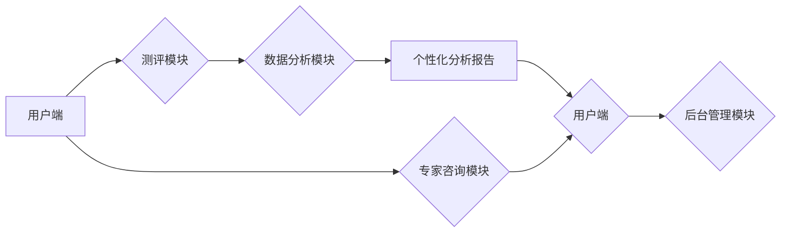

                 

## 如何利用知识付费实现在线心理测评与性格分析？

> 关键词：心理测评、性格分析、知识付费、人工智能、机器学习、自然语言处理、数据分析、在线平台

## 1. 背景介绍

近年来，随着互联网技术的快速发展和移动互联网的普及，人们对心理健康和自我认知的需求日益增长。在线心理测评和性格分析平台应运而生，为用户提供便捷、高效、个性化的服务。知识付费模式也逐渐成为一种流行的商业模式，为在线心理测评和性格分析平台提供了新的发展机遇。

传统的心理测评和性格分析通常需要用户前往线下机构进行测试和咨询，成本较高，时间也相对较长。而在线平台则可以打破地域限制，降低成本，方便用户随时随地进行测评和分析。知识付费模式则可以帮助平台提供更优质的服务，并实现可持续发展。

## 2. 核心概念与联系

**2.1 心理测评与性格分析**

心理测评是指通过科学的方法和工具，对个体的心理状态、性格特点、认知能力等进行量化评估的过程。性格分析则是根据测评结果，对个体的性格特点进行解读和分析，帮助用户更好地了解自己。

**2.2 知识付费模式**

知识付费模式是指通过提供有价值的知识和服务，向用户收取费用的一种商业模式。在线心理测评和性格分析平台可以利用知识付费模式，提供付费测评、个性化分析报告、在线咨询等服务。

**2.3 在线平台架构**

在线心理测评和性格分析平台通常由以下几个模块组成：

* **用户端:** 用户可以通过网页或移动应用程序访问平台，进行测评、查看分析报告、与专家咨询等。
* **测评模块:** 包含各种类型的测评问卷，例如性格测试、情绪测试、压力测试等。
* **数据分析模块:** 对用户测评数据进行分析和处理，生成个性化分析报告。
* **专家咨询模块:** 用户可以与平台上的心理咨询师进行在线咨询。
* **后台管理模块:** 用于管理平台用户、测评内容、数据分析等。

**2.4 Mermaid 流程图**



## 3. 核心算法原理 & 具体操作步骤

**3.1 算法原理概述**

在线心理测评和性格分析平台通常采用机器学习算法对用户测评数据进行分析和处理。常见的机器学习算法包括：

* **分类算法:** 用于将用户分为不同的性格类型，例如Myers-Briggs Type Indicator (MBTI) 的 16 种性格类型。
* **回归算法:** 用于预测用户的心理状态或行为，例如压力水平、情绪状态等。
* **聚类算法:** 用于将用户根据性格特点进行分组，例如找到具有相似性格特质的用户群体。

**3.2 算法步骤详解**

1. **数据收集:** 收集用户测评数据，包括问卷答案、个人信息等。
2. **数据预处理:** 对数据进行清洗、转换、编码等操作，使其适合机器学习算法的训练。
3. **模型训练:** 选择合适的机器学习算法，并使用训练数据对模型进行训练。
4. **模型评估:** 使用测试数据对模型进行评估，评估模型的准确率、召回率、F1-score等指标。
5. **模型部署:** 将训练好的模型部署到在线平台，用于对新用户的测评数据进行分析和处理。

**3.3 算法优缺点**

* **优点:**

    * 自动化程度高，可以快速处理大量数据。
    * 能够发现隐藏的模式和关系。
    * 可以根据用户数据进行个性化分析。

* **缺点:**

    * 需要大量的训练数据。
    * 模型的准确性依赖于训练数据的质量。
    * 算法本身可能存在偏差。

**3.4 算法应用领域**

* **心理咨询:** 为心理咨询师提供辅助诊断和治疗建议。
* **教育培训:** 为学生提供个性化的学习建议和职业规划指导。
* **人力资源:** 为企业进行员工性格分析、团队建设等。
* **市场营销:** 为企业进行用户画像、精准营销等。

## 4. 数学模型和公式 & 详细讲解 & 举例说明

**4.1 数学模型构建**

在线心理测评和性格分析平台通常使用统计学模型和机器学习模型来构建数学模型。

* **统计学模型:** 例如，可以使用因子分析来提取测评问卷中的潜在因素，并对用户在这些因素上的得分进行量化。
* **机器学习模型:** 例如，可以使用支持向量机 (SVM) 或决策树来对用户进行分类或预测。

**4.2 公式推导过程**

具体的公式推导过程取决于所使用的算法和模型。例如，支持向量机的核心公式是最大化间隔，即找到一个超平面，将不同类别的数据点尽可能地分开。

**4.3 案例分析与讲解**

假设我们使用因子分析来构建一个性格模型，并提取出三个潜在因素：外向性、宜人性、责任感。我们可以使用以下公式来计算用户的每个因素得分：

```latex
F_i = \sum_{j=1}^{n} w_{ij} x_j
```

其中：

* $F_i$ 是用户在第 $i$ 个因素上的得分。
* $w_{ij}$ 是第 $j$ 个测评项目对第 $i$ 个因素的权重。
* $x_j$ 是用户在第 $j$ 个测评项目上的得分。

通过计算每个因素的得分，我们可以对用户的性格特点进行量化描述。

## 5. 项目实践：代码实例和详细解释说明

**5.1 开发环境搭建**

* **操作系统:** Linux 或 macOS
* **编程语言:** Python
* **开发工具:** Jupyter Notebook 或 VS Code
* **库和框架:**

    * NumPy: 用于数值计算
    * Pandas: 用于数据处理
    * Scikit-learn: 用于机器学习算法
    * Flask 或 Django: 用于构建 web 应用

**5.2 源代码详细实现**

```python
import numpy as np
from sklearn.linear_model import LogisticRegression

# 训练数据
X = np.array([[1, 2, 3], [4, 5, 6], [7, 8, 9]])
y = np.array([0, 1, 0])

# 创建 LogisticRegression 模型
model = LogisticRegression()

# 训练模型
model.fit(X, y)

# 预测新数据
new_data = np.array([[10, 11, 12]])
prediction = model.predict(new_data)

# 打印预测结果
print(prediction)
```

**5.3 代码解读与分析**

* 首先，我们导入必要的库和框架。
* 然后，我们定义训练数据和目标变量。
* 接下来，我们创建 LogisticRegression 模型，并使用 fit() 方法训练模型。
* 最后，我们使用 predict() 方法对新数据进行预测，并打印预测结果。

**5.4 运行结果展示**

运行上述代码，可以得到以下预测结果：

```
[0]
```

这表示新数据属于类别 0。

## 6. 实际应用场景

在线心理测评和性格分析平台可以应用于以下场景：

* **个人成长:** 用户可以了解自己的性格特点、优势和劣势，并制定个性化的成长计划。
* **职业发展:** 用户可以根据自己的性格特点选择适合自己的职业方向，并提高职业竞争力。
* **人际关系:** 用户可以了解他人的性格特点，更好地进行沟通和相处。
* **心理健康:** 用户可以利用平台提供的测评和咨询服务，及时发现和解决心理问题。

**6.4 未来应用展望**

随着人工智能技术的不断发展，在线心理测评和性格分析平台将更加智能化、个性化和便捷化。未来，平台可能具备以下功能：

* **实时分析:** 基于用户输入的文字、语音或表情等数据，实时分析用户的内心状态和情绪变化。
* **个性化推荐:** 根据用户的性格特点和需求，推荐个性化的学习资源、职业规划建议、心理咨询服务等。
* **虚拟陪伴:** 利用人工智能技术，开发虚拟陪伴机器人，为用户提供情感支持和心理疏导。

## 7. 工具和资源推荐

**7.1 学习资源推荐**

* **书籍:**

    * 《Python机器学习实战》
    * 《自然语言处理入门》
    * 《深度学习》

* **在线课程:**

    * Coursera: 机器学习、深度学习
    * edX: 人工智能、数据科学
    * Udemy: Python编程、数据分析

**7.2 开发工具推荐**

* **IDE:** Jupyter Notebook、VS Code
* **机器学习库:** Scikit-learn、TensorFlow、PyTorch
* **数据分析库:** Pandas、NumPy
* **web框架:** Flask、Django

**7.3 相关论文推荐**

* **Personality Prediction Using Deep Learning**
* **A Survey of Personality Recognition Using Social Media Data**
* **Towards a Unified Framework for Personality Assessment**

## 8. 总结：未来发展趋势与挑战

**8.1 研究成果总结**

在线心理测评和性格分析平台已经取得了一定的成果，能够为用户提供便捷、高效、个性化的服务。

**8.2 未来发展趋势**

未来，在线心理测评和性格分析平台将更加智能化、个性化和便捷化，并应用于更广泛的领域。

**8.3 面临的挑战**

* **数据隐私和安全:** 在线平台需要妥善处理用户数据，保障用户隐私和数据安全。
* **算法的准确性和可靠性:** 算法的准确性和可靠性直接影响到测评结果的质量，需要不断改进和优化算法模型。
* **伦理问题:** 在线心理测评和性格分析平台需要考虑伦理问题，避免算法歧视或误导用户。

**8.4 研究展望**

未来，需要进一步研究以下问题：

* 如何开发更准确、更可靠的算法模型？
* 如何保障用户数据隐私和安全？
* 如何解决算法的伦理问题？


## 9. 附录：常见问题与解答

**9.1 问:** 在线心理测评和性格分析平台的测评结果是否准确？

**答:** 在线平台的测评结果有一定的参考价值，但不能完全替代专业的心理咨询。测评结果仅供参考，用户需要结合自身情况进行判断。

**9.2 问:** 在线平台的数据是否安全？

**答:**  reputable 在线平台会采取严格的安全措施来保护用户数据，例如加密传输、数据匿名化等。用户在选择平台时，需要关注平台的隐私政策和安全措施。

**9.3 问:** 在线心理测评和性格分析平台可以替代专业的心理咨询吗？

**答:** 在线平台可以提供一些心理健康方面的建议和支持，但不能替代专业的心理咨询。如果用户有严重的心理问题，需要及时寻求专业的心理咨询师的帮助。


作者：禅与计算机程序设计艺术 / Zen and the Art of Computer Programming 
<end_of_turn>

