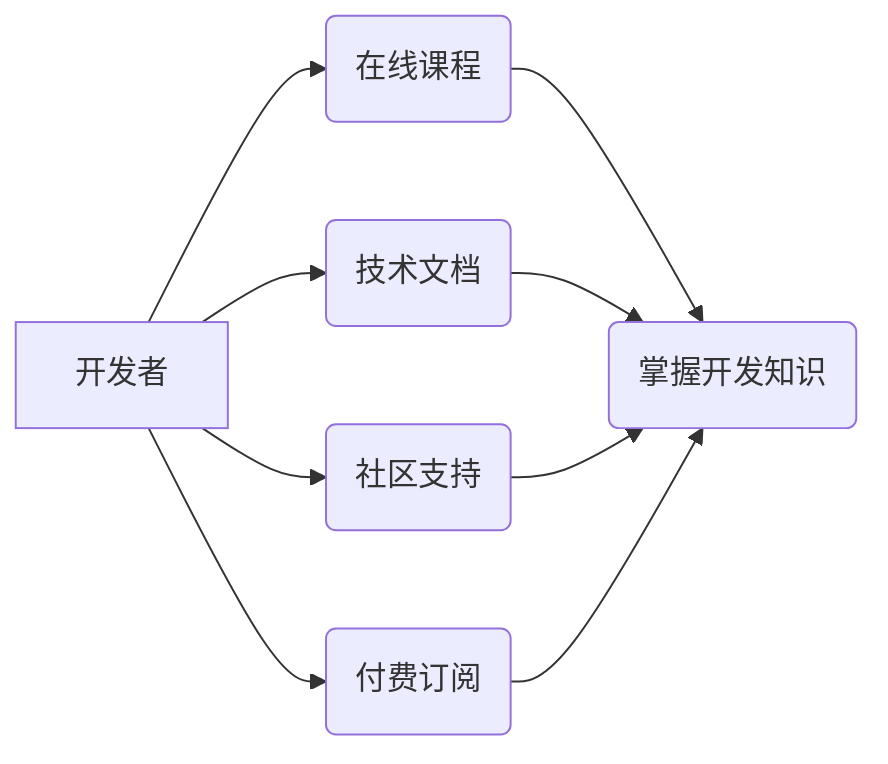

                 

## 如何利用知识付费实现移动应用与小程序开发？

> 关键词：知识付费、移动应用开发、小程序开发、在线课程、技术文档、社区支持、付费订阅、知识产权

## 1. 背景介绍

移动互联网的蓬勃发展，为开发者提供了广阔的市场空间。移动应用和小程序作为移动互联网的重要组成部分，越来越受到用户和企业的关注。然而，开发高质量的移动应用和小程序需要专业的技术知识和经验，这对许多初学者和中小企业来说是一个巨大的挑战。

知识付费作为一种新型的商业模式，在教育、培训等领域取得了成功。它以知识和技能为核心产品，通过线上平台提供付费学习资源，满足用户个性化学习需求。近年来，知识付费模式也逐渐应用于移动应用和小程序开发领域，为开发者提供了更便捷、高效的学习途径。

## 2. 核心概念与联系

知识付费在移动应用和小程序开发领域的应用，主要围绕着以下核心概念：

* **在线课程:** 提供移动应用和小程序开发相关的视频课程、文字教程、代码示例等学习资源。
* **技术文档:**  发布详细的开发文档、API说明、案例分析等技术资料，帮助开发者快速掌握开发知识。
* **社区支持:** 建立线上社区，提供开发者交流、提问、解答的平台，促进知识共享和经验交流。
* **付费订阅:**  提供不同等级的付费订阅服务，用户可以根据自身需求选择不同的学习内容和服务。

**核心概念架构图:**



## 3. 核心算法原理 & 具体操作步骤

### 3.1  算法原理概述

知识付费模式的成功应用，离不开一系列算法的支撑，例如推荐算法、内容分发算法、用户行为分析算法等。这些算法通过分析用户数据，个性化推荐学习资源，优化内容分发，提升用户学习体验。

### 3.2  算法步骤详解

* **推荐算法:** 基于用户的学习历史、兴趣偏好、学习进度等数据，推荐相关的课程、文档、案例等学习资源。常用的推荐算法包括协同过滤、内容过滤、混合推荐等。
* **内容分发算法:** 根据用户的学习行为、平台规则等因素，优化内容的展示顺序和推荐位置，提高用户参与度和学习效率。
* **用户行为分析算法:** 分析用户的学习行为数据，例如学习时长、学习进度、知识点掌握情况等，为开发者提供用户学习情况的反馈，帮助开发者改进课程内容和学习方式。

### 3.3  算法优缺点

* **优点:** 能够根据用户的个性化需求提供精准的学习资源，提升学习效率和用户体验。
* **缺点:** 需要大量的用户数据进行训练和优化，算法的准确性依赖于数据质量和算法模型的复杂度。

### 3.4  算法应用领域

* **移动应用开发:** 推荐相关技术文档、课程、案例，帮助开发者快速掌握移动应用开发知识。
* **小程序开发:** 推荐小程序开发相关的技术文档、课程、案例，帮助开发者快速掌握小程序开发知识。
* **其他领域:**  例如游戏开发、数据分析、人工智能等领域，都可以应用知识付费模式和相关算法。

## 4. 数学模型和公式 & 详细讲解 & 举例说明

### 4.1  数学模型构建

推荐算法的数学模型通常基于用户-项目交互矩阵，该矩阵表示用户对项目的评分或偏好程度。

**用户-项目交互矩阵:**

$$
M = \begin{bmatrix}
u_1, p_1 \\
u_2, p_2 \\
\vdots \\
u_n, p_m
\end{bmatrix}
$$

其中：

* $u_i$ 表示第 $i$ 个用户
* $p_j$ 表示第 $j$ 个项目
* $M_{ij}$ 表示用户 $u_i$ 对项目 $p_j$ 的评分或偏好程度

### 4.2  公式推导过程

协同过滤算法是一种常用的推荐算法，它基于用户的相似度和项目的相似度进行推荐。

**用户相似度计算公式:**

$$
Sim(u_i, u_j) = \frac{\sum_{k=1}^{n} (r_{ik} - \bar{r}_i)(r_{jk} - \bar{r}_j)}{\sqrt{\sum_{k=1}^{n} (r_{ik} - \bar{r}_i)^2} \sqrt{\sum_{k=1}^{n} (r_{jk} - \bar{r}_j)^2}}
$$

其中：

* $Sim(u_i, u_j)$ 表示用户 $u_i$ 和 $u_j$ 的相似度
* $r_{ik}$ 表示用户 $u_i$ 对项目 $k$ 的评分
* $\bar{r}_i$ 表示用户 $u_i$ 的平均评分

**项目相似度计算公式:**

$$
Sim(p_i, p_j) = \frac{\sum_{u=1}^{m} (r_{ui} - \bar{r}_u)(r_{uj} - \bar{r}_u)}{\sqrt{\sum_{u=1}^{m} (r_{ui} - \bar{r}_u)^2} \sqrt{\sum_{u=1}^{m} (r_{uj} - \bar{r}_u)^2}}
$$

其中：

* $Sim(p_i, p_j)$ 表示项目 $p_i$ 和 $p_j$ 的相似度
* $r_{ui}$ 表示用户 $u$ 对项目 $i$ 的评分
* $\bar{r}_u$ 表示用户 $u$ 的平均评分

### 4.3  案例分析与讲解

假设有一个用户 $u_1$ 喜欢观看关于移动应用开发的课程，而另一个用户 $u_2$ 喜欢观看关于小程序开发的课程。如果系统发现 $u_1$ 和 $u_2$ 在某些技术点上存在相似性，例如都对UI设计感兴趣，那么系统就可以推荐 $u_1$ 一些关于小程序开发的课程，并推荐 $u_2$ 一些关于移动应用开发的课程。

## 5. 项目实践：代码实例和详细解释说明

### 5.1  开发环境搭建

* **操作系统:** Windows、macOS、Linux
* **编程语言:** Python、Java、JavaScript
* **开发工具:**  Android Studio、Xcode、WebStorm、VS Code

### 5.2  源代码详细实现

以下是一个简单的 Python 代码示例，用于实现基于协同过滤算法的推荐系统：

```python
import numpy as np

# 用户-项目交互矩阵
ratings = np.array([
    [5, 4, 3, 2, 1],
    [4, 5, 2, 1, 3],
    [3, 2, 5, 4, 1],
    [2, 1, 4, 5, 3],
    [1, 3, 1, 3, 5]
])

# 计算用户相似度
def calculate_user_similarity(ratings):
    # ...

# 计算项目相似度
def calculate_item_similarity(ratings):
    # ...

# 基于用户相似度进行推荐
def recommend_based_on_user_similarity(user_id, ratings, user_similarity):
    # ...

# 基于项目相似度进行推荐
def recommend_based_on_item_similarity(user_id, ratings, item_similarity):
    # ...

# 获取用户 ID
user_id = 0

# 计算用户相似度和项目相似度
user_similarity = calculate_user_similarity(ratings)
item_similarity = calculate_item_similarity(ratings)

# 基于用户相似度和项目相似度进行推荐
recommendations = recommend_based_on_user_similarity(user_id, ratings, user_similarity)
recommendations += recommend_based_on_item_similarity(user_id, ratings, item_similarity)

# 打印推荐结果
print(recommendations)
```

### 5.3  代码解读与分析

* **用户-项目交互矩阵:**  存储了用户对项目的评分或偏好程度。
* **相似度计算函数:**  计算用户之间的相似度和项目之间的相似度。
* **推荐函数:**  根据用户相似度和项目相似度，推荐相关的项目。

### 5.4  运行结果展示

运行上述代码后，将输出一个包含推荐项目的列表。

## 6. 实际应用场景

### 6.1  移动应用开发平台

移动应用开发平台可以提供在线课程、技术文档、社区支持等服务，帮助开发者快速掌握移动应用开发知识。

### 6.2  小程序开发平台

小程序开发平台可以提供在线课程、技术文档、社区支持等服务，帮助开发者快速掌握小程序开发知识。

### 6.3  在线教育平台

在线教育平台可以提供移动应用和小程序开发相关的课程，满足不同用户的学习需求。

### 6.4  未来应用展望

随着移动互联网的持续发展，知识付费模式在移动应用和小程序开发领域的应用将更加广泛。未来，知识付费平台可能会提供更加个性化、智能化的学习体验，例如：

* **基于人工智能的个性化推荐:**  根据用户的学习行为和兴趣偏好，提供更加精准的学习资源推荐。
* **虚拟现实和增强现实技术:**  利用虚拟现实和增强现实技术，打造更加沉浸式的学习体验。
* **区块链技术:**  利用区块链技术，保障知识产权，提升平台的信任度。

## 7. 工具和资源推荐

### 7.1  学习资源推荐

* **慕课网:** https://www.imooc.com/
* **Udemy:** https://www.udemy.com/
* **Coursera:** https://www.coursera.org/

### 7.2  开发工具推荐

* **Android Studio:** https://developer.android.com/studio
* **Xcode:** https://developer.apple.com/xcode/
* **WebStorm:** https://www.jetbrains.com/webstorm/

### 7.3  相关论文推荐

* **Collaborative Filtering for Recommender Systems:** https://dl.acm.org/doi/10.1145/300765.300800
* **Matrix Factorization Techniques for Recommender Systems:** https://dl.acm.org/doi/10.1145/1201711.1201716

## 8. 总结：未来发展趋势与挑战

### 8.1  研究成果总结

知识付费模式在移动应用和小程序开发领域的应用取得了显著成果，为开发者提供了更加便捷、高效的学习途径。

### 8.2  未来发展趋势

未来，知识付费模式将更加智能化、个性化，并与其他技术融合，例如人工智能、虚拟现实、增强现实等。

### 8.3  面临的挑战

* **内容质量:**  需要不断提升知识付费平台的内容质量，提供更加专业、实用、有价值的学习资源。
* **用户体验:**  需要不断优化用户体验，提供更加便捷、高效、个性化的学习服务。
* **知识产权保护:**  需要加强知识产权保护，防止知识盗版和侵权行为。

### 8.4  研究展望

未来，需要进一步研究知识付费模式在移动应用和小程序开发领域的应用，探索更加有效的学习方法和模式，为开发者提供更加优质的学习体验。

## 9. 附录：常见问题与解答

**1. 如何选择合适的知识付费平台？**

选择知识付费平台时，需要考虑平台的内容质量、用户评价、价格、服务等因素。

**2. 如何保证知识付费平台的知识产权？**

知识付费平台可以通过以下方式保障知识产权：

* 使用数字水印技术
* 使用加密技术保护知识内容
* 建立完善的版权保护机制

**3. 如何提高知识付费平台的用户粘性？**

提高知识付费平台的用户粘性可以通过以下方式实现：

* 提供个性化推荐服务
* 建立活跃的社区氛围
* 定期举办线上线下活动


作者：禅与计算机程序设计艺术 / Zen and the Art of Computer Programming 
<end_of_turn>

