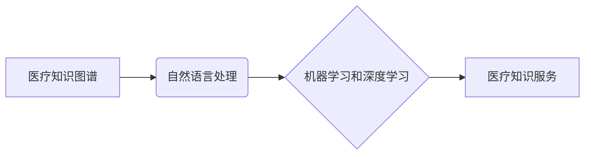

                 

## 如何实现医疗健康领域的知识服务创新

> 关键词：医疗知识服务、人工智能、自然语言处理、机器学习、深度学习、知识图谱、医疗诊断、个性化医疗

## 1. 背景介绍

医疗健康领域正处于数字化转型和智能化升级的关键时期。海量医疗数据、先进的计算技术和不断涌现的创新应用，为医疗健康领域的知识服务创新提供了前所未有的机遇。知识服务，是指利用人工智能技术，对医疗数据进行分析和理解，为医生、患者和医疗机构提供精准、高效、个性化的医疗知识和服务。

传统的医疗知识服务模式主要依赖于医生的经验和专业知识，存在着信息获取效率低、知识更新慢、知识传播不畅等问题。而人工智能技术的应用，能够有效解决这些问题，为医疗健康领域带来革命性的变革。

## 2. 核心概念与联系

### 2.1 医疗知识图谱

医疗知识图谱是医疗健康领域知识服务的核心基础。它是一种基于知识表示的结构化数据模型，能够将医疗领域中的各种实体（如疾病、药物、症状、患者等）及其关系（如诊断、治疗、副作用等）进行统一的表示和组织。

通过构建医疗知识图谱，可以实现以下功能：

* **知识整合和共享:** 将分散的医疗知识进行整合，方便医生和患者获取和共享。
* **知识推理和发现:** 基于知识图谱中的关系，进行逻辑推理和知识发现，辅助医生进行诊断和治疗决策。
* **个性化医疗服务:** 根据患者的个体特征和病史，从知识图谱中获取个性化的医疗建议和方案。

### 2.2 自然语言处理

自然语言处理（NLP）是人工智能领域的重要分支，旨在使计算机能够理解和处理人类语言。在医疗健康领域，NLP技术可以用于：

* **医疗文本分析:** 从患者病历、医学文献等文本中提取关键信息，如症状、诊断、治疗方案等。
* **医生-患者对话:** 开发智能聊天机器人，帮助医生与患者进行沟通，提供医疗咨询和指导。
* **语音识别:** 将患者的语音指令转换为文本，方便医生记录和处理患者信息。

### 2.3 机器学习和深度学习

机器学习和深度学习是人工智能领域的核心技术，能够从数据中学习模式和规律，并进行预测和决策。在医疗健康领域，机器学习和深度学习技术可以用于：

* **疾病诊断:** 基于患者的症状、检查结果等数据，训练机器学习模型进行疾病诊断。
* **药物研发:** 利用机器学习算法分析药物分子结构和生物活性，加速药物研发过程。
* **医疗影像分析:** 利用深度学习模型分析医学影像数据，辅助医生进行疾病诊断和治疗方案制定。

**核心概念与联系流程图**



## 3. 核心算法原理 & 具体操作步骤

### 3.1 算法原理概述

在医疗健康领域的知识服务创新中，常用的算法包括：

* **知识抽取算法:** 从医疗文本中提取实体和关系，构建知识图谱。
* **关系推理算法:** 基于知识图谱中的关系，进行逻辑推理，发现新的知识。
* **机器学习分类算法:** 用于疾病诊断、药物研发等领域，根据患者数据进行分类预测。
* **深度学习图像识别算法:** 用于医疗影像分析，识别和定位疾病特征。

### 3.2 算法步骤详解

以知识抽取算法为例，其具体操作步骤如下：

1. **数据预处理:** 对医疗文本进行清洗、格式化和标注，以便后续算法训练和应用。
2. **特征提取:** 利用自然语言处理技术，从文本中提取实体和关系的特征，如词语、词性、依存关系等。
3. **模型训练:** 利用机器学习算法，训练知识抽取模型，使其能够准确识别实体和关系。
4. **知识图谱构建:** 将抽取出的实体和关系存储到知识图谱中，形成结构化的医疗知识库。

### 3.3 算法优缺点

**知识抽取算法:**

* **优点:** 可以自动提取大量医疗知识，提高知识获取效率。
* **缺点:** 算法精度受限于训练数据质量，对于复杂的关系识别能力有限。

**机器学习分类算法:**

* **优点:** 可以根据患者数据进行精准的分类预测，辅助医生进行诊断和治疗决策。
* **缺点:** 需要大量的训练数据，对数据质量要求较高。

### 3.4 算法应用领域

* **疾病诊断:** 基于患者症状、检查结果等数据，训练机器学习模型进行疾病诊断。
* **药物研发:** 利用机器学习算法分析药物分子结构和生物活性，加速药物研发过程。
* **个性化医疗:** 根据患者的个体特征和病史，从知识图谱中获取个性化的医疗建议和方案。
* **医疗影像分析:** 利用深度学习模型分析医学影像数据，辅助医生进行疾病诊断和治疗方案制定。

## 4. 数学模型和公式 & 详细讲解 & 举例说明

### 4.1 数学模型构建

在医疗知识服务中，常用的数学模型包括：

* **贝叶斯网络:** 用于表示医疗知识中的概率关系，可以进行疾病诊断和风险评估。
* **逻辑回归:** 用于分类预测，例如判断患者是否患有某种疾病。
* **支持向量机:** 用于分类和回归预测，可以用于疾病诊断和药物研发。

### 4.2 公式推导过程

以贝叶斯网络为例，其核心公式为：

$$P(A|B) = \frac{P(B|A)P(A)}{P(B)}$$

其中：

* $P(A|B)$ 表示在已知事件 B 发生的情况下，事件 A 发生的概率。
* $P(B|A)$ 表示在已知事件 A 发生的情况下，事件 B 发生的概率。
* $P(A)$ 表示事件 A 发生的概率。
* $P(B)$ 表示事件 B 发生的概率。

### 4.3 案例分析与讲解

假设我们想要预测患者是否患有糖尿病，我们可以构建一个贝叶斯网络，其中节点表示疾病、症状、检查结果等因素，边表示这些因素之间的概率关系。

例如，我们可以将“家族史有糖尿病”作为节点 A， “高血糖”作为节点 B， “糖尿病诊断”作为节点 C。

根据医学知识，我们可以设定以下概率关系：

* $P(B|A) = 0.8$ (如果患者有家族史有糖尿病，患高血糖的概率为 80%)
* $P(A) = 0.2$ (患者有家族史有糖尿病的概率为 20%)
* $P(C|B) = 0.9$ (如果患者有高血糖，患糖尿病的概率为 90%)

利用贝叶斯公式，我们可以计算出患者患糖尿病的概率。

## 5. 项目实践：代码实例和详细解释说明

### 5.1 开发环境搭建

* **操作系统:** Ubuntu 18.04 LTS
* **编程语言:** Python 3.7
* **深度学习框架:** TensorFlow 2.0
* **自然语言处理库:** spaCy

### 5.2 源代码详细实现

```python
# 导入必要的库
import spacy

# 加载 spaCy 模型
nlp = spacy.load("en_core_web_sm")

# 定义一个函数，用于从文本中提取实体
def extract_entities(text):
    doc = nlp(text)
    entities = [(ent.text, ent.label_) for ent in doc.ents]
    return entities

# 示例文本
text = "The patient presented with fever, cough, and shortness of breath."

# 提取实体
entities = extract_entities(text)

# 打印实体
print(entities)
```

### 5.3 代码解读与分析

* 该代码首先导入 spaCy 库，并加载预训练的英文语言模型。
* 然后定义了一个函数 `extract_entities`，用于从文本中提取实体。该函数使用 spaCy 的 `doc.ents` 属性获取文本中的所有实体，并返回实体的文本和标签。
* 示例文本是一个简单的医疗描述，代码将其输入到 `extract_entities` 函数中，并打印出提取到的实体。

### 5.4 运行结果展示

```
[('fever', 'DISORDER'), ('cough', 'SYMPTOM'), ('shortness of breath', 'SYMPTOM')]
```

## 6. 实际应用场景

### 6.1 疾病诊断辅助系统

利用机器学习和深度学习算法，从患者的症状、检查结果、病历等数据中进行分析，辅助医生进行疾病诊断。

### 6.2 药物研发加速平台

利用机器学习算法分析药物分子结构和生物活性，加速药物研发过程，降低研发成本和时间。

### 6.3 个性化医疗方案推荐

根据患者的个体特征和病史，从知识图谱中获取个性化的医疗建议和方案，提高医疗服务效率和精准度。

### 6.4 医疗影像分析系统

利用深度学习模型分析医学影像数据，辅助医生进行疾病诊断和治疗方案制定，提高诊断准确率和治疗效果。

## 7. 工具和资源推荐

### 7.1 学习资源推荐

* **斯坦福大学 CS224N 自然语言处理课程:** https://web.stanford.edu/class/cs224n/
* **DeepLearning.AI 深度学习专业证书课程:** https://www.deeplearning.ai/
* **Hugging Face Transformers 库:** https://huggingface.co/transformers/

### 7.2 开发工具推荐

* **TensorFlow:** https://www.tensorflow.org/
* **PyTorch:** https://pytorch.org/
* **spaCy:** https://spacy.io/

### 7.3 相关论文推荐

* **Attention Is All You Need:** https://arxiv.org/abs/1706.03762
* **BERT: Pre-training of Deep Bidirectional Transformers for Language Understanding:** https://arxiv.org/abs/1810.04805
* **Knowledge Graph Embedding: A Survey:** https://arxiv.org/abs/1901.08067

## 8. 总结：未来发展趋势与挑战

### 8.1 研究成果总结

医疗健康领域的知识服务创新取得了显著进展，人工智能技术在疾病诊断、药物研发、个性化医疗等领域发挥着越来越重要的作用。

### 8.2 未来发展趋势

* **更精准的知识服务:** 利用更先进的机器学习和深度学习算法，提高知识服务精准度和效率。
* **更个性化的医疗服务:** 基于患者的个体特征和病史，提供更个性化的医疗建议和方案。
* **更智能的医疗助手:** 开发更智能的医疗助手，帮助医生和患者进行沟通和协作。
* **更安全的医疗数据管理:** 加强医疗数据安全管理，保障患者隐私和数据安全。

### 8.3 面临的挑战

* **数据质量和隐私问题:** 医疗数据质量参差不齐，隐私保护也面临挑战。
* **算法解释性和可信度:** 许多机器学习算法的决策过程难以解释，缺乏可信度。
* **伦理和法律问题:** 医疗知识服务的应用涉及伦理和法律问题，需要进一步探讨和规范。

### 8.4 研究展望

未来，医疗健康领域的知识服务创新将继续朝着更精准、更个性化、更智能的方向发展。需要加强基础研究，解决数据质量、算法解释性和伦理等问题，推动医疗知识服务的健康发展。

## 9. 附录：常见问题与解答

* **Q1: 医疗知识图谱的构建需要哪些数据？**

* **A1:** 构建医疗知识图谱需要多种类型的医疗数据，包括病历、医学文献、药品信息、基因数据等。

* **Q2: 如何保证医疗知识服务的准确性和可靠性？**

* **A2:** 确保医疗知识服务的准确性和可靠性需要从多个方面入手，包括数据质量控制、算法模型训练、性能评估和持续改进。

* **Q3: 医疗知识服务的应用有哪些伦理和法律风险？**

* **A3:** 医疗知识服务的应用涉及患者隐私保护、算法偏见、责任归属等伦理和法律风险，需要制定相应的规范和制度进行监管。


作者：禅与计算机程序设计艺术 / Zen and the Art of Computer Programming 
<end_of_turn>

