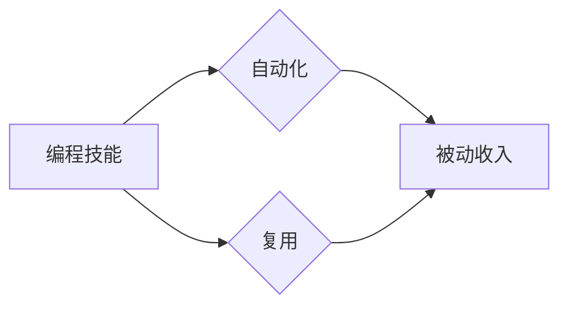

                 

## 如何将编程技能转化为被动收入

> 关键词：编程技能、被动收入、软件开发、开源项目、API、自动化、云计算、数据分析

### 1. 背景介绍

在当今数字时代，编程技能已成为一项宝贵的资产，它不仅能为个人带来丰厚的职业回报，更能为我们打开通往被动收入的大门。被动收入是指无需持续投入时间和精力就能持续获得收益的收入模式。对于程序员来说，将编程技能转化为被动收入，可以实现财务自由，并拥有更多时间去追求个人兴趣和梦想。

然而，将编程技能转化为被动收入并非易事，需要我们深入思考并掌握一些关键的策略和方法。本文将从核心概念、算法原理、项目实践、实际应用场景等多个方面，详细探讨如何将编程技能转化为被动收入，并为读者提供一些实用的建议和资源。

### 2. 核心概念与联系

将编程技能转化为被动收入的核心概念在于**自动化**和**复用**。

* **自动化**: 通过编写程序，我们可以自动化完成一些重复性的任务，例如数据处理、网站更新、邮件发送等，从而节省时间和精力，并提高效率。
* **复用**: 通过开发可复用的软件组件、API或工具，我们可以将我们的编程成果推广到更广泛的市场，并获得持续的收益。

**核心概念关系图:**



### 3. 核心算法原理 & 具体操作步骤

为了实现自动化和复用，我们需要掌握一些核心算法原理和操作步骤。以下是一些常见的例子：

#### 3.1  算法原理概述

* **爬虫算法**: 用于自动抓取网页内容，可以用于数据收集、信息分析等。
* **机器学习算法**: 用于从数据中学习模式，可以用于自动分类、预测等。
* **自然语言处理算法**: 用于处理和理解自然语言，可以用于自动翻译、文本摘要等。

#### 3.2  算法步骤详解

* **爬虫算法**:
    1. 确定目标网站和抓取内容。
    2. 使用爬虫框架（如Scrapy）编写爬虫程序。
    3. 设置爬虫规则，例如抓取频率、页面深度等。
    4. 保存抓取到的数据到本地文件或数据库。
* **机器学习算法**:
    1. 收集和预处理训练数据。
    2. 选择合适的机器学习模型（如线性回归、决策树等）。
    3. 训练机器学习模型，并评估模型性能。
    4. 使用训练好的模型进行预测或分类。

#### 3.3  算法优缺点

* **爬虫算法**:
    * 优点: 可以快速抓取大量数据，成本低。
    * 缺点: 容易被网站封禁，数据质量可能不高。
* **机器学习算法**:
    * 优点: 可以学习复杂模式，预测精度高。
    * 缺点: 需要大量数据进行训练，模型复杂度高。

#### 3.4  算法应用领域

* **爬虫算法**: 数据挖掘、市场调研、信息收集等。
* **机器学习算法**: 欺诈检测、推荐系统、图像识别等。

### 4. 数学模型和公式 & 详细讲解 & 举例说明

在某些情况下，我们可以使用数学模型和公式来描述和优化我们的程序，从而提高效率和准确性。例如，在机器学习领域，我们经常使用损失函数来评估模型的性能，并通过梯度下降算法来优化模型参数。

#### 4.1  数学模型构建

损失函数通常是模型预测值与真实值的差值的平方，其公式如下：

$$
L(y, \hat{y}) = \frac{1}{n} \sum_{i=1}^{n} (y_i - \hat{y}_i)^2
$$

其中：

* $L(y, \hat{y})$ 表示损失函数
* $y$ 表示真实值
* $\hat{y}$ 表示预测值
* $n$ 表示样本数量

#### 4.2  公式推导过程

梯度下降算法的目标是找到最小化损失函数的参数值。其更新规则如下：

$$
\theta = \theta - \alpha \nabla L(\theta)
$$

其中：

* $\theta$ 表示模型参数
* $\alpha$ 表示学习率
* $\nabla L(\theta)$ 表示损失函数对参数的梯度

#### 4.3  案例分析与讲解

例如，在训练一个线性回归模型时，我们可以使用均方误差作为损失函数，并使用梯度下降算法来优化模型参数。通过不断迭代更新参数，模型的预测精度会逐渐提高。

### 5. 项目实践：代码实例和详细解释说明

以下是一个简单的代码实例，演示如何使用Python编写一个爬虫程序抓取新闻网站的标题：

#### 5.1  开发环境搭建

* Python 3.x
* Requests 库
* Beautiful Soup 4 库

#### 5.2  源代码详细实现

```python
import requests
from bs4 import BeautifulSoup

def get_news_titles(url):
    response = requests.get(url)
    response.raise_for_status()  # 检查请求是否成功

    soup = BeautifulSoup(response.content, 'html.parser')
    news_titles = soup.find_all('h2', class_='news-title')  # 找到新闻标题元素

    return [title.text.strip() for title in news_titles]

if __name__ == '__main__':
    news_url = 'https://www.example.com/news'
    titles = get_news_titles(news_url)
    for title in titles:
        print(title)
```

#### 5.3  代码解读与分析

* 该程序首先使用 `requests` 库发送 HTTP 请求获取新闻网站的 HTML 内容。
* 然后使用 `BeautifulSoup` 库解析 HTML 内容，并找到所有具有 `news-title` 类的 `h2` 元素，这些元素通常包含新闻标题。
* 最后，程序将所有标题文本提取出来，并打印到控制台。

#### 5.4  运行结果展示

程序运行后，将打印出新闻网站上所有新闻的标题。

### 6. 实际应用场景

将编程技能转化为被动收入的应用场景非常广泛，以下是一些例子：

#### 6.1  开源软件开发

开发开源软件组件、库或工具，并通过赞助、捐赠或商业支持获得收入。

#### 6.2  API 开发

开发并提供 API 接口，供其他开发者使用，并通过 API 调用次数收费或订阅模式获得收入。

#### 6.3  自动化工具

开发自动化工具，例如数据处理工具、网站测试工具、代码生成工具等，并通过销售或订阅模式获得收入。

#### 6.4  数据分析服务

利用数据分析技能，为企业提供数据分析服务，例如市场调研、用户行为分析等，并通过项目收费获得收入。

#### 6.5  在线课程和教程

将编程知识和经验录制成在线课程或教程，并通过平台销售或订阅模式获得收入。

### 7. 工具和资源推荐

#### 7.1  学习资源推荐

* **在线学习平台**: Coursera, edX, Udemy
* **编程书籍**: 《Python编程从入门到实践》、《深入理解Python》
* **技术博客**: Hacker News, Stack Overflow

#### 7.2  开发工具推荐

* **代码编辑器**: VS Code, Sublime Text, Atom
* **版本控制系统**: Git, GitHub
* **云计算平台**: AWS, Azure, Google Cloud

#### 7.3  相关论文推荐

* **机器学习**: 《深度学习》
* **自然语言处理**: 《自然语言处理入门》

### 8. 总结：未来发展趋势与挑战

将编程技能转化为被动收入是一个充满机遇和挑战的领域。未来，随着人工智能、云计算等技术的不断发展，将会有更多新的应用场景和模式出现。

#### 8.1  研究成果总结

* **自动化**: 自动化技术将更加成熟，能够完成更复杂的任务，例如自动写作、自动设计等。
* **人工智能**: 人工智能技术将更加强大，能够更好地理解和处理自然语言，并提供更个性化的服务。
* **云计算**: 云计算平台将更加普及，为开发者提供更便捷的开发和部署环境。

#### 8.2  未来发展趋势

* **更智能的自动化工具**: 能够根据用户的需求自动生成代码、测试用例等。
* **更个性化的服务**: 基于人工智能技术的个性化推荐、定制化服务等。
* **更便捷的开发平台**: 云计算平台将提供更完善的开发工具和服务，降低开发门槛。

#### 8.3  面临的挑战

* **技术更新迭代**: 需要不断学习新的技术和工具，才能保持竞争力。
* **市场竞争**: 竞争日益激烈，需要不断创新和提升产品质量。
* **知识产权保护**: 需要重视知识产权保护，避免被盗用或抄袭。

#### 8.4  研究展望

未来，我们将继续探索新的编程模式和应用场景，并致力于开发更智能、更便捷的自动化工具，帮助开发者更轻松地将编程技能转化为被动收入。

### 9. 附录：常见问题与解答

* **如何选择合适的项目？**

选择一个你感兴趣且有市场需求的项目，并确保你具备相关的技术能力。

* **如何推广我的产品？**

可以通过开源社区、社交媒体、技术博客等渠道推广你的产品。

* **如何保护我的知识产权？**

可以通过开源协议、版权声明、专利申请等方式保护你的知识产权。


作者：禅与计算机程序设计艺术 / Zen and the Art of Computer Programming 
<end_of_turn>

