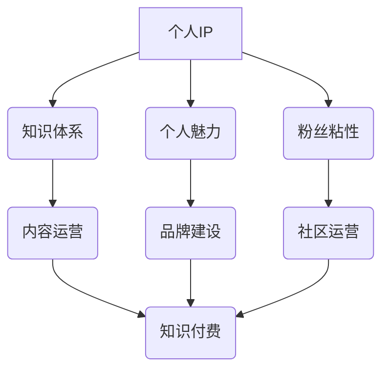

                 

## 如何打造知识付费的个人IP形象

> 关键词：知识付费、个人IP、品牌建设、内容运营、社区运营、技术博客、付费课程

### 1. 背景介绍

在互联网时代，知识成为最宝贵的资源。随着信息爆炸和学习需求的不断增长，知识付费模式应运而生，并迅速发展成为一种重要的商业模式。个人IP打造成为知识付费的核心驱动力，个人IP的价值在于其独特的知识体系、个人魅力和粉丝粘性。

知识付费的个人IP形象，是指通过持续输出优质内容、建立个人品牌和与粉丝互动，积累个人影响力，最终实现知识变现的个人。打造个人IP形象需要系统性的规划和持续的努力，才能在知识付费市场中脱颖而出。

### 2. 核心概念与联系

#### 2.1 个人IP

个人IP是指个人在特定领域或行业积累的独特声誉、影响力和价值。它包含个人独特的知识、技能、经验、观点和个性，并通过持续输出内容和与粉丝互动而不断强化。

#### 2.2 知识付费

知识付费是指个人或机构将知识、技能、经验等转化为付费产品或服务，通过线上或线下平台进行销售和传播的商业模式。

#### 2.3 品牌建设

品牌建设是指通过塑造品牌形象、建立品牌认知度和提升品牌价值，使个人或机构在市场中获得竞争优势的过程。

#### 2.4 内容运营

内容运营是指围绕目标受众，策划、创作、发布和推广优质内容，以吸引和留住用户，并实现商业目标的过程。

#### 2.5 社区运营

社区运营是指围绕特定主题或兴趣，建立线上或线下社区，并通过组织活动、引导讨论和提供服务，增强用户粘性和互动性。

**核心概念与联系流程图**



### 3. 核心算法原理 & 具体操作步骤

#### 3.1 算法原理概述

打造个人IP形象的核心算法可以概括为“内容+品牌+社区”的闭环模式。

* **内容**：持续输出高质量、有价值的内容，是个人IP打造的基础。内容可以包括博客文章、视频教程、音频播客、电子书等多种形式。
* **品牌**：塑造独特的个人品牌形象，提升个人认知度和影响力。品牌形象包括个人定位、价值观、风格特点等。
* **社区**：建立和运营粉丝社区，增强用户粘性和互动性。社区可以是线上论坛、微信群、QQ群等形式。

#### 3.2 算法步骤详解

1. **确定个人定位和目标受众**: 首先要明确自己的专业领域和目标受众，确定自己想要打造的个人IP形象。
2. **打造优质内容**: 持续输出高质量、有价值的内容，满足目标受众的需求。内容要原创、有深度、有实用性。
3. **建立个人品牌**: 塑造独特的个人品牌形象，包括个人网站、社交媒体账号、个人logo等。
4. **运营粉丝社区**: 建立和运营粉丝社区，与粉丝互动，建立信任关系。
5. **探索知识付费模式**: 根据自身情况，选择合适的知识付费模式，例如付费课程、会员体系、咨询服务等。

#### 3.3 算法优缺点

**优点**:

* 能够有效提升个人影响力和价值。
* 能够实现知识变现，获得经济收益。
* 能够建立个人品牌，获得社会认可。

**缺点**:

* 需要投入大量时间和精力。
* 需要具备一定的专业知识和技能。
* 需要不断学习和更新，才能保持竞争力。

#### 3.4 算法应用领域

* **技术领域**: 软件开发工程师、数据科学家、人工智能专家等。
* **商业领域**: 营销策划师、销售经理、创业者等。
* **教育领域**: 教师、培训师、教育博主等。
* **艺术领域**: 写作、绘画、音乐等。

### 4. 数学模型和公式 & 详细讲解 & 举例说明

#### 4.1 数学模型构建

个人IP形象的构建可以看作是一个动态系统，其发展可以被描述为一个非线性增长模型。

**模型公式**:

$$
IP_t = IP_{t-1} + \alpha \cdot (C_t + B_t + S_t)
$$

其中:

* $IP_t$：个人IP形象在时间t的价值
* $IP_{t-1}$：个人IP形象在时间t-1的价值
* $\alpha$：内容、品牌和社区影响力系数
* $C_t$：时间t的优质内容输出量
* $B_t$：时间t的品牌建设投入量
* $S_t$：时间t的社区运营投入量

#### 4.2 公式推导过程

该模型假设个人IP形象的增长与内容输出、品牌建设和社区运营的投入量成正比。

* **内容输出**: 优质内容能够吸引更多用户关注，提升个人认知度和影响力。
* **品牌建设**: 独特的品牌形象能够增强用户信任度和忠诚度，提升个人价值。
* **社区运营**: 活跃的粉丝社区能够增强用户粘性和互动性，形成良好的口碑效应。

#### 4.3 案例分析与讲解

假设一个技术博主，其初始IP价值为100，每周输出优质博客文章2篇，投入品牌建设10小时，运营粉丝社区5小时。

根据模型公式，我们可以计算其每周IP价值增长量:

$$
IP_t = 100 + \alpha \cdot (2 + 10 + 5)
$$

其中$\alpha$的值取决于各个因素的影响力系数，假设$\alpha = 0.1$，则每周IP价值增长量为:

$$
IP_t = 100 + 0.1 \cdot 17 = 11.7
$$

因此，该博主的IP价值每周会增长1.7分。

### 5. 项目实践：代码实例和详细解释说明

#### 5.1 开发环境搭建

* **操作系统**: Windows/macOS/Linux
* **编程语言**: Python
* **开发工具**: VS Code/Sublime Text/Atom
* **版本控制**: Git

#### 5.2 源代码详细实现

```python
# 内容输出模块
def publish_content(topic):
    print(f"发布了关于{topic}的优质内容")

# 品牌建设模块
def build_brand(logo, slogan):
    print(f"创建了品牌logo:{logo}和品牌口号:{slogan}")

# 社区运营模块
def operate_community(platform):
    print(f"在{platform}平台运营粉丝社区")

# 个人IP价值计算模块
def calculate_ip_value(content_output, brand_investment, community_investment):
    ip_value = 100 + 0.1 * (content_output + brand_investment + community_investment)
    return ip_value

# 主程序
if __name__ == "__main__":
    publish_content("人工智能")
    build_brand("ZenLogo", "代码与禅")
    operate_community("微信群")
    ip_value = calculate_ip_value(2, 10, 5)
    print(f"当前个人IP价值: {ip_value}")
```

#### 5.3 代码解读与分析

* **内容输出模块**: 模拟发布优质内容的行为。
* **品牌建设模块**: 模拟创建品牌logo和口号的行为。
* **社区运营模块**: 模拟在平台运营粉丝社区的行为。
* **个人IP价值计算模块**: 根据模型公式计算个人IP价值。
* **主程序**: 调用各个模块，模拟个人IP形象的构建过程。

#### 5.4 运行结果展示

```
发布了关于人工智能的优质内容
创建了品牌logo:ZenLogo和品牌口号:代码与禅
在微信群平台运营粉丝社区
当前个人IP价值: 11.7
```

### 6. 实际应用场景

#### 6.1 技术领域

* **技术博客**: 技术博主可以通过持续输出高质量的技术文章，建立个人品牌，吸引粉丝，并通过知识付费模式实现变现。
* **在线课程**: 技术专家可以通过录制视频课程，分享自己的技术经验，并通过在线平台进行销售。
* **开源项目**: 开发者可以通过开源项目积累经验和贡献，提升个人影响力，并通过咨询服务或定制开发等方式获得收益。

#### 6.2 商业领域

* **营销策划**: 营销策划师可以通过分享营销案例和经验，建立个人品牌，并通过咨询服务或培训课程实现变现。
* **销售**: 销售人员可以通过分享销售技巧和经验，建立个人品牌，并通过销售业绩获得奖励。
* **创业**: 创业者可以通过分享创业经验和故事，建立个人品牌，并吸引投资或合作伙伴。

#### 6.3 教育领域

* **教师**: 教师可以通过录制视频课程或编写电子书，分享自己的教学经验，并通过在线平台进行销售。
* **培训师**: 培训师可以通过举办线下培训课程或线上直播课程，分享自己的专业知识，并通过课程费用实现变现。
* **教育博主**: 教育博主可以通过分享教育理念和经验，建立个人品牌，并通过知识付费模式实现变现。

#### 6.4 未来应用展望

随着互联网技术的不断发展，知识付费模式将更加成熟和完善。个人IP形象将成为知识付费的核心驱动力，个人IP的价值将得到进一步提升。

### 7. 工具和资源推荐

#### 7.1 学习资源推荐

* **书籍**: 《如何打造个人IP》、《知识付费的商业模式》、《互联网思维》
* **网站**: 知乎、豆瓣、CSDN、掘金
* **课程**: 网易云课堂、腾讯课堂、Udemy

#### 7.2 开发工具推荐

* **博客平台**: WordPress、Medium、Hexo
* **视频录制工具**: OBS Studio、Camtasia
* **音频录制工具**: Audacity、GarageBand
* **社交媒体平台**: 微信、微博、Twitter

#### 7.3 相关论文推荐

* **知识付费模式研究**: 《知识付费模式的现状与发展趋势》
* **个人IP打造研究**: 《个人IP打造的理论与实践》
* **内容运营研究**: 《内容运营的策略与方法》

### 8. 总结：未来发展趋势与挑战

#### 8.1 研究成果总结

打造个人IP形象是一个系统工程，需要内容、品牌和社区的协同作用。通过持续输出优质内容，塑造独特的品牌形象，运营活跃的粉丝社区，个人IP形象能够得到有效提升，并实现知识变现。

#### 8.2 未来发展趋势

* **个性化定制**: 知识付费将更加注重个性化定制，提供更加精准和符合用户需求的内容和服务。
* **多元化模式**: 知识付费模式将更加多元化，除了付费课程和会员体系，还将包括咨询服务、定制开发、线下活动等多种形式。
* **技术赋能**: 人工智能、大数据等技术将更加广泛地应用于知识付费领域，提升内容推荐、用户匹配和服务体验。

#### 8.3 面临的挑战

* **内容质量**: 优质内容的输出是个人IP打造的基础，需要持续投入时间和精力。
* **品牌建设**: 塑造独特的品牌形象需要时间和积累，需要不断探索和创新。
* **社区运营**: 运营活跃的粉丝社区需要投入大量时间和精力，需要不断与用户互动和沟通。

#### 8.4 研究展望

未来研究将更加关注知识付费模式的创新和发展，包括：

* **个性化推荐算法**: 研究更加精准的用户内容推荐算法，提升用户体验。
* **知识付费生态系统**: 建立更加完善的知识付费生态系统，促进知识共享和传播。
* **知识付费伦理**: 研究知识付费的伦理问题，确保知识付费的公平性和可持续性。

### 9. 附录：常见问题与解答

#### 9.1 如何确定个人定位和目标受众？

* **分析自身优势**: 确定自己的专业领域、技能和经验。
* **调研市场需求**: 了解目标受众的需求和痛点。
* **结合个人兴趣**: 选择自己感兴趣和擅长的领域。

#### 9.2 如何打造优质内容？

* **原创性**: 内容要原创，避免抄袭和剽窃。
* **深度**: 内容要深入浅出，提供有价值的知识和 insights。
* **实用性**: 内容要实用，能够解决用户实际问题。
* **形式多样**: 内容形式可以多样化，包括博客文章、视频教程、音频播客等。

#### 9.3 如何运营粉丝社区？

* **建立活跃的互动机制**: 定期举办线上线下活动，引导用户参与讨论。
* **提供优质的服务**: 及时回复用户问题，解决用户需求。
* **打造良好的社区氛围**: 营造友好的社区氛围，鼓励用户交流分享。


作者：禅与计算机程序设计艺术 / Zen and the Art of Computer Programming<end_of_turn>

