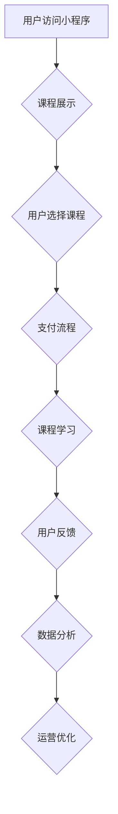

                 

## 如何打造知识付费的微信小程序

> 关键词：微信小程序、知识付费、课程体系、用户运营、支付系统、数据分析、营销推广

### 1. 背景介绍

近年来，随着移动互联网的普及和用户对在线学习需求的不断增长，知识付费市场呈现出爆发式发展趋势。微信小程序作为轻量级、便捷易用的移动应用平台，为知识付费提供了新的发展机遇。其无需下载安装，即可直接在微信内使用，用户体验良好，且开发成本相对较低，吸引了众多创作者和企业入局。

知识付费微信小程序的模式主要包括：

* **在线课程:** 提供各种主题的线上课程，通过视频、音频、文字等形式进行知识传递。
* **付费会员:** 用户通过订阅会员，获得持续更新的课程内容、专属福利和社区互动等服务。
* **付费咨询:** 提供一对一或群组咨询服务，解答用户的问题，提供专业指导。
* **付费直播:** 通过直播平台进行知识分享，与用户实时互动，解答问题。

### 2. 核心概念与联系

#### 2.1 知识付费微信小程序架构

知识付费微信小程序的架构通常包含以下几个核心模块：

* **课程体系:** 包含课程分类、课程列表、课程详情、学习进度等功能。
* **用户管理:** 用户注册、登录、资料管理、支付记录等功能。
* **支付系统:** 支持微信支付、支付宝支付等多种支付方式。
* **数据分析:** 收集用户行为数据，进行分析和运营。
* **营销推广:** 推广课程、吸引用户，提升用户转化率。

#### 2.2  微信小程序架构流程图



### 3. 核心算法原理 & 具体操作步骤

#### 3.1 算法原理概述

知识付费微信小程序的核心算法主要围绕用户行为分析、课程推荐和支付安全等方面。

* **用户行为分析:** 通过分析用户访问课程、学习进度、评论点赞等行为数据，构建用户画像，了解用户兴趣偏好和学习习惯。
* **课程推荐:** 基于用户画像和课程标签信息，采用协同过滤、内容过滤等算法，推荐用户感兴趣的课程。
* **支付安全:** 使用微信支付等第三方支付平台，保障用户支付安全，防止资金损失。

#### 3.2 算法步骤详解

* **用户行为分析:**
    1. 收集用户行为数据，包括课程浏览、学习时长、点赞评论等。
    2. 使用数据清洗和预处理技术，去除无效数据，格式化数据。
    3. 利用机器学习算法，如K-Means聚类、决策树等，对用户行为进行分析，构建用户画像。
* **课程推荐:**
    1. 建立课程标签体系，对课程进行分类和打标签。
    2. 使用协同过滤算法，根据用户历史行为和相似用户行为，推荐相关课程。
    3. 使用内容过滤算法，根据用户兴趣偏好和课程标签信息，推荐匹配课程。
* **支付安全:**
    1. 使用微信支付等第三方支付平台，进行支付处理。
    2. 采用加密技术，保护用户支付信息安全。
    3. 实时监控支付交易，防止欺诈行为。

#### 3.3 算法优缺点

* **用户行为分析:**
    * 优点: 可以精准了解用户需求，提供个性化推荐。
    * 缺点: 需要大量数据支持，算法复杂度较高。
* **课程推荐:**
    * 优点: 可以提高用户学习效率，提升用户体验。
    * 缺点: 算法需要不断优化，避免推荐偏差。
* **支付安全:**
    * 优点: 使用第三方支付平台，保障支付安全。
    * 缺点: 需要与第三方平台进行集成，存在一定的技术难度。

#### 3.4 算法应用领域

* **在线教育:** 推荐课程、个性化学习路径。
* **电商平台:** 商品推荐、用户画像分析。
* **社交媒体:** 内容推荐、用户兴趣分析。

### 4. 数学模型和公式 & 详细讲解 & 举例说明

#### 4.1 数学模型构建

用户行为分析中，可以使用协同过滤算法构建用户-课程评分矩阵，并利用矩阵分解技术进行模型训练。

#### 4.2 公式推导过程

假设用户-课程评分矩阵为R，其中R(u,i)表示用户u对课程i的评分。

目标是学习用户偏好向量pu和课程特征向量qi，使得预测评分与实际评分尽可能接近。

损失函数可以定义为：

$$
L = \sum_{u,i} (R(u,i) - \hat{R}(u,i))^2
$$

其中，$\hat{R}(u,i)$为预测评分。

使用梯度下降算法优化损失函数，更新用户偏好向量pu和课程特征向量qi。

#### 4.3 案例分析与讲解

假设用户A对课程1评分为4，对课程2评分为3，用户B对课程1评分为5，对课程2评分为4。

构建用户-课程评分矩阵：

```
R = [
    [4, 3],
    [5, 4]
]
```

使用矩阵分解技术，学习用户偏好向量和课程特征向量，可以得到用户A对课程1的预测评分为4.2，对课程2的预测评分为3.1，用户B对课程1的预测评分为4.8，对课程2的预测评分为3.9。

### 5. 项目实践：代码实例和详细解释说明

#### 5.1 开发环境搭建

* **微信开发者工具:** 用于开发微信小程序。
* **编程语言:** 使用微信小程序支持的语言，如JavaScript。
* **数据库:** 选择合适的数据库，如云数据库、本地数据库等。

#### 5.2 源代码详细实现

```javascript
// 用户登录
function login() {
  // 调用微信小程序登录接口
  wx.login({
    success: function(res) {
      // 获取用户登录凭证
      var code = res.code;
      // 发送请求到服务器，获取用户openid
      wx.request({
        url: 'https://api.example.com/login',
        data: {
          code: code
        },
        success: function(res) {
          // 获取用户openid
          var openid = res.data.openid;
          // 保存用户openid
          wx.setStorageSync('openid', openid);
          // 跳转到课程列表页面
          wx.redirectTo({
            url: '/pages/course/list'
          });
        }
      });
    }
  });
}

// 课程列表
Page({
  data: {
    courses: []
  },
  onLoad: function() {
    // 获取课程列表数据
    wx.request({
      url: 'https://api.example.com/courses',
      success: function(res) {
        // 设置课程列表数据
        this.setData({
          courses: res.data
        });
      }
    });
  }
});
```

#### 5.3 代码解读与分析

* 用户登录: 使用微信小程序登录接口获取用户登录凭证，发送请求到服务器获取用户openid，并保存到本地存储。
* 课程列表: 使用网络请求获取课程列表数据，并设置到页面数据中。

#### 5.4 运行结果展示

用户打开小程序，可以进行登录操作，登录成功后，跳转到课程列表页面，查看可供选择的课程。

### 6. 实际应用场景

知识付费微信小程序已广泛应用于教育、培训、咨询、娱乐等领域。

* **在线教育:** 提供各种主题的在线课程，例如编程、设计、语言学习等。
* **职业技能培训:** 提供职业技能培训课程，帮助用户提升职业竞争力。
* **个人成长咨询:** 提供个人成长咨询服务，帮助用户解决生活和工作中的问题。
* **兴趣爱好分享:** 分享个人兴趣爱好知识，例如摄影、绘画、音乐等。

#### 6.4 未来应用展望

随着微信小程序生态的不断发展，知识付费微信小程序将迎来更广阔的发展空间。

* **更个性化的学习体验:** 利用人工智能技术，提供更个性化的学习路径和推荐。
* **更丰富的课程内容:** 涵盖更多领域和主题的课程，满足用户多样化的学习需求。
* **更便捷的学习方式:** 支持多种学习方式，例如直播、互动、线下活动等。
* **更完善的社区互动:** 建立更完善的社区互动机制，促进用户之间的交流和学习。

### 7. 工具和资源推荐

#### 7.1 学习资源推荐

* **微信小程序官方文档:** https://developers.weixin.qq.com/miniprogram/dev/
* **微信小程序开发教程:** https://mp.weixin.qq.com/debug/wxadoc/introduction.html
* **微信小程序社区:** https://developers.weixin.qq.com/community/

#### 7.2 开发工具推荐

* **微信开发者工具:** https://developers.weixin.qq.com/miniprogram/dev/devtools/
* **VSCode:** https://code.visualstudio.com/
* **WebStorm:** https://www.jetbrains.com/webstorm/

#### 7.3 相关论文推荐

* **Collaborative Filtering for Recommender Systems:** https://dl.acm.org/doi/10.1145/300765.300800
* **Matrix Factorization Techniques for Recommender Systems:** https://dl.acm.org/doi/10.1145/1201717.1201728

### 8. 总结：未来发展趋势与挑战

#### 8.1 研究成果总结

知识付费微信小程序的发展取得了显著成果，为用户提供了便捷的学习方式，也为创作者提供了新的盈利模式。

#### 8.2 未来发展趋势

* **人工智能技术应用:** 利用人工智能技术，提供更个性化的学习体验和更精准的课程推荐。
* **沉浸式学习体验:** 采用VR/AR技术，打造更沉浸式的学习体验。
* **跨平台融合:** 与其他平台进行融合，例如社交媒体、电商平台等，拓展知识付费的应用场景。

#### 8.3 面临的挑战

* **内容质量控制:** 确保课程内容的质量和权威性。
* **用户隐私保护:** 妥善处理用户数据，保障用户隐私安全。
* **商业模式创新:** 探索新的商业模式，实现可持续发展。

#### 8.4 研究展望

未来，知识付费微信小程序将继续朝着更智能化、更个性化、更沉浸式的方向发展，为用户提供更优质的学习体验。


### 9. 附录：常见问题与解答

* **如何选择合适的课程?**

建议根据自己的兴趣爱好、学习目标和时间安排选择课程。可以参考课程评价、课程介绍和课程导师信息等。

* **如何支付课程费用?**

可以使用微信支付、支付宝支付等多种支付方式。

* **如何获取课程学习资料?**

课程学习资料通常会通过微信小程序平台提供，例如视频、音频、文字等。

* **如何与课程导师互动?**

部分课程提供在线答疑、直播互动等功能，可以与课程导师进行互动交流。


作者：禅与计算机程序设计艺术 / Zen and the Art of Computer Programming 
<end_of_turn>

