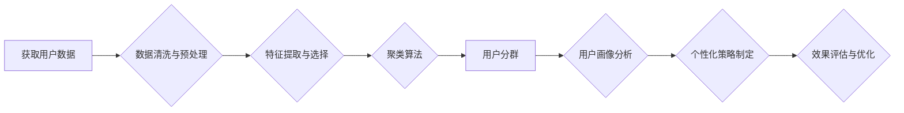

                 

## 如何进行有效的用户分群管理

> 关键词：用户分群、用户画像、机器学习、聚类算法、数据挖掘、个性化推荐、客户关系管理

## 1. 背景介绍

在当今数据爆炸的时代，企业拥有海量用户数据，如何有效地利用这些数据来提升用户体验、提高营销效率，成为一个重要的挑战。用户分群管理作为一种数据驱动型策略，通过对用户进行细致的分类和分析，帮助企业更精准地了解用户需求，提供个性化的服务和产品推荐，从而实现用户粘性提升、转化率提高和商业价值最大化。

传统的用户分群管理方法往往依赖于人工经验和规则，效率低下，难以应对海量数据带来的挑战。随着机器学习和数据挖掘技术的快速发展，基于算法的自动用户分群管理方法逐渐成为主流，能够更准确、更有效地识别用户群体，并为企业提供更深入的用户洞察。

## 2. 核心概念与联系

用户分群管理的核心概念是将用户按照一定的特征进行分类，形成不同的用户群体。每个用户群体拥有相似的行为模式、需求特征和价值偏好。通过对不同用户群体的分析和理解，企业可以制定针对性的营销策略、个性化产品推荐和用户服务方案，从而提升用户体验和商业效益。

**用户分群管理流程图:**



## 3. 核心算法原理 & 具体操作步骤

### 3.1  算法原理概述

用户分群管理的核心算法是聚类算法，它旨在将数据点按照相似性进行分组，形成不同的簇。常见的聚类算法包括K-means、层次聚类、DBSCAN等。

**K-means算法:**

K-means算法是一种迭代算法，它首先随机选择K个数据点作为初始聚类中心，然后将每个数据点分配到距离其最近的聚类中心所属的簇。算法不断迭代，更新聚类中心的位置，直到聚类结果收敛。

**层次聚类算法:**

层次聚类算法将数据点从单个点开始，逐步合并相似的簇，最终形成一个包含所有数据点的最大簇。层次聚类算法可以分为凝聚聚类和分裂聚类两种类型。

**DBSCAN算法:**

DBSCAN算法是一种基于密度的聚类算法，它将数据点按照密度进行分组。DBSCAN算法定义了两个参数：eps（邻域半径）和minPts（最小点数）。如果一个数据点与其邻域内至少有minPts个数据点，则该数据点被认为是核心点，否则被认为是边界点或噪声点。

### 3.2  算法步骤详解

**K-means算法步骤:**

1. 随机选择K个数据点作为初始聚类中心。
2. 计算每个数据点到所有聚类中心的距离。
3. 将每个数据点分配到距离其最近的聚类中心所属的簇。
4. 更新每个聚类中心的坐标，为该簇中所有数据点的平均值。
5. 重复步骤2-4，直到聚类结果收敛。

**层次聚类算法步骤:**

1. 将每个数据点作为一个单独的簇。
2. 计算相邻簇之间的距离，并合并距离最近的两个簇。
3. 重复步骤2，直到所有数据点合并到一个最大簇中。

**DBSCAN算法步骤:**

1. 对于每个数据点，计算其邻域内数据点的数量。
2. 如果一个数据点与其邻域内至少有minPts个数据点，则该数据点被认为是核心点。
3. 将所有核心点连接起来，形成一个簇。
4. 将所有边界点和核心点相邻的数据点添加到对应的簇中。
5. 将所有噪声点排除在外。

### 3.3  算法优缺点

**K-means算法:**

* **优点:** 简单易实现，计算效率高。
* **缺点:** 需要预先指定聚类数K，对初始聚类中心的选择敏感，容易陷入局部最优解。

**层次聚类算法:**

* **优点:** 不需要预先指定聚类数，可以生成不同层次的聚类结构。
* **缺点:** 计算复杂度高，对于大规模数据处理效率较低。

**DBSCAN算法:**

* **优点:** 可以发现任意形状的簇，对噪声点具有鲁棒性。
* **缺点:** 需要选择合适的eps和minPts参数，对数据分布敏感。

### 3.4  算法应用领域

用户分群管理算法广泛应用于以下领域:

* **电商平台:** 根据用户购买历史、浏览记录、评价行为等特征，进行用户分群，实现个性化商品推荐、精准营销和会员服务。
* **社交媒体:** 根据用户兴趣爱好、社交关系、行为模式等特征，进行用户分群，实现精准广告投放、内容推荐和社区运营。
* **金融服务:** 根据用户信用评分、交易记录、投资偏好等特征，进行用户分群，实现精准贷款、理财产品推荐和风险管理。
* **教育行业:** 根据学生学习成绩、学习习惯、兴趣爱好等特征，进行用户分群，实现个性化学习辅导、课程推荐和教学策略优化。

## 4. 数学模型和公式 & 详细讲解 & 举例说明

### 4.1  数学模型构建

用户分群管理的数学模型通常基于距离度量和相似性计算。常见的距离度量包括欧氏距离、曼哈顿距离、余弦相似度等。

**欧氏距离:**

$$
d(x,y) = \sqrt{\sum_{i=1}^{n}(x_i - y_i)^2}
$$

其中，$x$和$y$是两个数据点，$x_i$和$y_i$是数据点在第i个特征上的值，n是特征数。

**曼哈顿距离:**

$$
d(x,y) = \sum_{i=1}^{n}|x_i - y_i|
$$

**余弦相似度:**

$$
sim(x,y) = \frac{x \cdot y}{||x|| ||y||}
$$

其中，$x \cdot y$是$x$和$y$的点积，$||x||$和$||y||$是$x$和$y$的模长。

### 4.2  公式推导过程

聚类算法的具体推导过程取决于所选用的算法类型。例如，K-means算法的迭代更新公式如下：

$$
\mu_k = \frac{1}{n_k} \sum_{i=1}^{n_k} x_i
$$

其中，$\mu_k$是第k个聚类中心的坐标，$n_k$是第k个聚类中数据点的数量，$x_i$是第i个数据点。

### 4.3  案例分析与讲解

假设我们有一组用户数据，包含用户的年龄、性别、收入、消费习惯等特征。我们可以使用K-means算法将用户进行分群，例如将用户分为高收入用户、中收入用户和低收入用户三个群体。

通过分析不同用户群体的特征，我们可以发现高收入用户更倾向于购买奢侈品，中收入用户更倾向于购买中档商品，低收入用户更倾向于购买平价商品。

## 5. 项目实践：代码实例和详细解释说明

### 5.1  开发环境搭建

用户分群管理项目可以使用Python语言进行开发，常用的库包括Scikit-learn、Pandas、NumPy等。

### 5.2  源代码详细实现

```python
import pandas as pd
from sklearn.cluster import KMeans

# 加载用户数据
data = pd.read_csv('user_data.csv')

# 选择特征进行分群
features = ['age', 'income', 'consumption']
X = data[features]

# 使用K-means算法进行分群
kmeans = KMeans(n_clusters=3)
kmeans.fit(X)

# 获取用户所属的聚类标签
labels = kmeans.labels_

# 将聚类标签添加到用户数据中
data['cluster'] = labels

# 保存结果
data.to_csv('user_data_clustered.csv', index=False)
```

### 5.3  代码解读与分析

这段代码首先加载用户数据，然后选择年龄、收入和消费习惯作为特征进行分群。使用K-means算法进行分群，并获取用户所属的聚类标签。最后将聚类标签添加到用户数据中，并保存结果。

### 5.4  运行结果展示

运行代码后，将生成一个新的用户数据文件，其中包含用户的聚类标签。我们可以通过分析不同聚类标签的用户特征，了解不同用户群体的特点。

## 6. 实际应用场景

### 6.1  电商平台

电商平台可以根据用户的购买历史、浏览记录、评价行为等特征，进行用户分群，实现个性化商品推荐、精准营销和会员服务。例如，可以将用户分为高价值用户、忠诚用户、潜在用户等不同群体，制定针对性的营销策略和服务方案。

### 6.2  社交媒体

社交媒体平台可以根据用户的兴趣爱好、社交关系、行为模式等特征，进行用户分群，实现精准广告投放、内容推荐和社区运营。例如，可以将用户分为游戏爱好者、电影爱好者、新闻爱好者等不同群体，推送相关的广告和内容。

### 6.3  金融服务

金融服务机构可以根据用户的信用评分、交易记录、投资偏好等特征，进行用户分群，实现精准贷款、理财产品推荐和风险管理。例如，可以将用户分为高风险用户、中风险用户、低风险用户等不同群体，制定不同的贷款利率和风险控制策略。

### 6.4  未来应用展望

随着人工智能技术的不断发展，用户分群管理将更加智能化、个性化和精准化。未来，用户分群管理将应用于更多领域，例如医疗保健、教育培训、旅游出行等，为用户提供更加个性化的服务和体验。

## 7. 工具和资源推荐

### 7.1  学习资源推荐

* **书籍:**
    * 《数据挖掘：概念与技术》
    * 《机器学习》
    * 《Python数据科学手册》
* **在线课程:**
    * Coursera: 数据挖掘与机器学习
    * edX: 人工智能导论
    * Udemy: Python数据科学

### 7.2  开发工具推荐

* **Python:** 
    * Scikit-learn: 机器学习库
    * Pandas: 数据分析库
    * NumPy: 数值计算库
* **R:** 
    * caret: 机器学习库
    * dplyr: 数据处理库
    * ggplot2: 数据可视化库

### 7.3  相关论文推荐

* **K-means聚类算法:**
    * Lloyd, S. (1982). Least squares quantization in PCM. IEEE Transactions on Information Theory, 28(4), 49–60.
* **层次聚类算法:**
    * Ward, J. H. (1963). Hierarchical grouping to optimize an objective function. Journal of the American Statistical Association, 58(303), 236–244.
* **DBSCAN聚类算法:**
    * Ester, M., Kriegel, H. P., Sander, J., & Xu, X. (1996). A density-based algorithm for discovering clusters in large spatial databases with noise. In KDD (pp. 226–231). ACM.

## 8. 总结：未来发展趋势与挑战

### 8.1  研究成果总结

用户分群管理技术已经取得了显著的成果，能够有效地帮助企业了解用户需求，提供个性化服务和产品推荐。

### 8.2  未来发展趋势

未来，用户分群管理技术将朝着以下方向发展:

* **更加智能化:** 利用深度学习等先进算法，实现更加智能、精准的用户分群。
* **更加个性化:** 结合用户行为、偏好、上下文等多方面信息，提供更加个性化的服务和体验。
* **更加动态化:** 随着用户行为和环境的变化，用户分群标签也需要动态更新，实现更加灵活、适应性的分群策略。

### 8.3  面临的挑战

用户分群管理技术也面临着一些挑战:

* **数据质量:** 用户数据往往存在缺失、错误、不完整等问题，需要进行有效的数据清洗和预处理。
* **算法选择:** 不同的聚类算法适用于不同的数据类型和场景，需要根据实际情况选择合适的算法。
* **隐私保护:** 用户数据涉及个人隐私，需要采取有效的措施保护用户数据安全。

### 8.4  研究展望

未来，用户分群管理技术的研究将更加注重以下方面:

* **开发更加鲁棒、高效的聚类算法:** 能够处理大规模、高维、复杂的数据。
* **探索新的用户特征和分群策略:** 挖掘用户行为背后的隐含模式，实现更加精准的用户分群。
* **研究用户分群管理的伦理问题:** 确保用户数据安全和隐私，避免算法歧视和偏见。

## 9. 附录：常见问题与解答

**Q1: 如何确定合适的聚类数K？**

**A1:** 可以使用肘部法则、Silhouette分析等方法来确定合适的聚类数K。

**Q2: 如何评估聚类结果的质量？**

**A2:** 可以使用聚类指标，例如Silhouette系数、Dunn指数等来评估聚类结果的质量。

**Q3: 如何处理缺失数据？**

**A3:** 可以使用插值法、删除缺失数据点等方法处理缺失数据。

**Q4: 如何避免算法歧视和偏见？**

**A4:** 可以使用公平性评估指标，并对算法进行调优，以减少算法歧视和偏见。


作者：禅与计算机程序设计艺术 / Zen and the Art of Computer Programming<end_of_turn>

