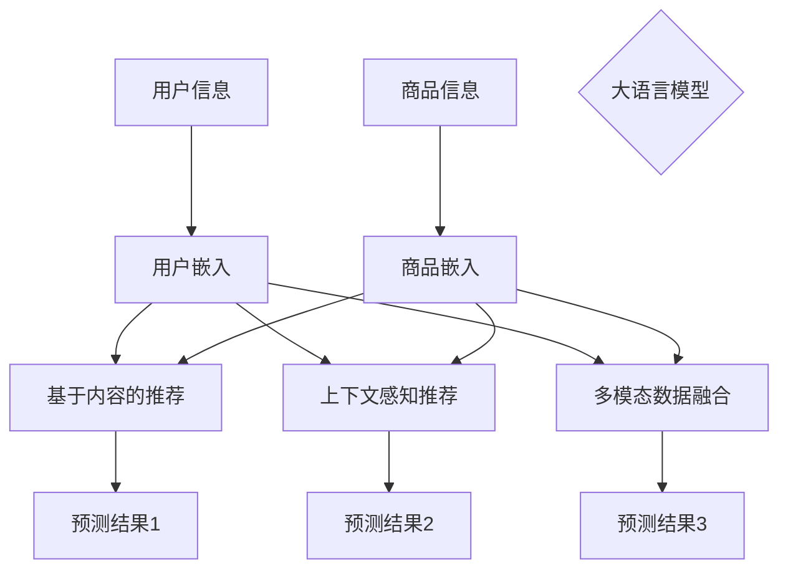

                 

### 文章标题

"大语言模型在推荐系统中的多任务学习应用：核心概念、算法原理与实践探索"

关键词：大语言模型、推荐系统、多任务学习、算法原理、实践探索

摘要：本文将深入探讨大语言模型在推荐系统中的多任务学习应用。通过解析核心概念与算法原理，结合具体操作步骤与实践案例，揭示大语言模型在推荐系统中的强大潜力。文章旨在为读者提供完整的知识体系，引导其在实际项目中应用这一先进技术。

---

在当今信息爆炸的时代，推荐系统已成为许多应用场景的核心组成部分。无论是电商平台、社交媒体，还是视频流媒体，推荐系统的准确性和个性化能力直接影响用户体验和商业价值。随着人工智能技术的不断发展，大语言模型（如ChatGPT、BERT、GPT-3等）逐渐成为推荐系统中的重要力量。本文将重点探讨大语言模型在推荐系统中的多任务学习应用，从核心概念、算法原理到实践探索，为读者提供全面的认知。

### 1. 背景介绍（Background Introduction）

#### 1.1 推荐系统简介

推荐系统（Recommendation System）是一种信息过滤技术，旨在根据用户的兴趣和行为，向其推荐可能感兴趣的内容或商品。推荐系统可以分为基于内容的推荐（Content-Based Filtering）和基于协同过滤（Collaborative Filtering）两种主要类型。随着数据量的增加和算法的进步，推荐系统逐渐演化为复杂的多任务学习系统，能够同时处理多个相关的推荐任务。

#### 1.2 大语言模型的崛起

大语言模型（Large Language Model）是近年来人工智能领域的重要突破。这些模型具有强大的文本生成和语义理解能力，能够处理复杂的多模态数据。GPT-3、BERT等大语言模型的出现，为推荐系统带来了新的机遇和挑战。通过将大语言模型集成到推荐系统中，可以实现更高层次的个性化推荐和更精准的预测。

#### 1.3 多任务学习在推荐系统中的应用

多任务学习（Multi-Task Learning）是一种能够在同一模型中同时解决多个相关任务的技术。在推荐系统中，多任务学习可以同时处理多种类型的推荐任务，如商品推荐、用户偏好预测、社交推荐等。大语言模型的多任务学习能力，使得推荐系统能够更好地应对复杂的需求和环境变化。

### 2. 核心概念与联系（Core Concepts and Connections）

#### 2.1 大语言模型概述

大语言模型是基于神经网络的大规模文本预训练模型，具有强大的语义理解、文本生成和知识表示能力。GPT-3、BERT等模型通过大量无监督数据进行预训练，然后通过有监督的微调（Fine-Tuning）适应特定任务。

#### 2.2 多任务学习原理

多任务学习通过共享模型参数和优化目标，实现多个相关任务的高效学习。在大语言模型中，多任务学习可以通过以下几种方式实现：

1. **共享层**：多个任务共享同一层的参数，降低模型复杂度。
2. **合并层**：在模型的输出层合并多个任务的预测结果，实现任务之间的协同。
3. **跨任务信息传递**：通过注意力机制或图神经网络等结构，实现任务间的信息传递。

#### 2.3 大语言模型在推荐系统中的应用

将大语言模型应用于推荐系统，可以通过以下方式实现多任务学习：

1. **用户和商品嵌入**：使用大语言模型将用户和商品转换为低维嵌入向量，实现基于内容的推荐。
2. **上下文感知推荐**：利用大语言模型的上下文理解能力，实现动态推荐和个性化推荐。
3. **多模态数据融合**：将文本、图像、音频等多模态数据融合到推荐系统中，提高推荐效果。

#### 2.4 Mermaid 流程图

以下是多任务学习在推荐系统中的应用的 Mermaid 流程图：



### 3. 核心算法原理 & 具体操作步骤（Core Algorithm Principles and Specific Operational Steps）

#### 3.1 大语言模型算法原理

大语言模型的核心是基于变换器模型（Transformer）的预训练和微调技术。预训练阶段，模型在大量无监督文本数据上学习语言模式和语义表示。微调阶段，模型通过有监督数据进一步优化，适应特定任务。

#### 3.2 多任务学习算法原理

多任务学习算法通过以下步骤实现：

1. **参数共享**：多个任务的参数部分共享，减少模型参数数量。
2. **任务融合**：多个任务的输出通过特定结构（如合并层、注意力机制）融合，形成最终预测结果。
3. **联合优化**：使用联合损失函数，同时优化多个任务。

#### 3.3 大语言模型在推荐系统中的具体操作步骤

1. **数据预处理**：收集用户行为数据、商品属性数据等，并进行预处理。
2. **模型训练**：使用预训练的大语言模型，通过有监督数据微调，适应推荐任务。
3. **用户和商品嵌入**：将用户和商品转换为低维嵌入向量。
4. **任务融合**：使用特定结构（如合并层、注意力机制）融合多个任务的预测结果。
5. **模型评估与优化**：评估模型性能，通过调整超参数和优化策略，提高推荐效果。

### 4. 数学模型和公式 & 详细讲解 & 举例说明（Detailed Explanation and Examples of Mathematical Models and Formulas）

#### 4.1 大语言模型数学模型

大语言模型通常采用变换器模型（Transformer）作为基础结构。变换器模型的核心是自注意力机制（Self-Attention），通过计算输入序列中各个元素之间的相似性，生成加权输出。

#### 4.2 多任务学习数学模型

多任务学习数学模型主要涉及参数共享和联合优化。参数共享可以通过以下公式表示：

$$
\theta_{shared} = \theta_1 + \theta_2 + ... + \theta_n
$$

其中，$\theta_{shared}$ 是共享参数，$\theta_1, \theta_2, ..., \theta_n$ 是各个任务的参数。

联合优化可以通过以下损失函数表示：

$$
L = L_1 + L_2 + ... + L_n
$$

其中，$L$ 是总损失，$L_1, L_2, ..., L_n$ 是各个任务的损失。

#### 4.3 举例说明

假设我们有一个推荐系统，同时需要处理用户偏好预测、商品推荐和社交推荐三个任务。我们可以使用以下数学模型实现多任务学习：

1. **用户偏好预测**：损失函数为 $L_1 = \frac{1}{2} ||\hat{y}_1 - y_1||^2$，其中 $\hat{y}_1$ 是预测的用户偏好，$y_1$ 是真实用户偏好。
2. **商品推荐**：损失函数为 $L_2 = \frac{1}{2} ||\hat{r}_2 - r_2||^2$，其中 $\hat{r}_2$ 是预测的商品推荐，$r_2$ 是真实商品推荐。
3. **社交推荐**：损失函数为 $L_3 = \frac{1}{2} ||\hat{s}_3 - s_3||^2$，其中 $\hat{s}_3$ 是预测的社交推荐，$s_3$ 是真实社交推荐。

总损失函数为：

$$
L = \frac{1}{2} ||\hat{y}_1 - y_1||^2 + \frac{1}{2} ||\hat{r}_2 - r_2||^2 + \frac{1}{2} ||\hat{s}_3 - s_3||^2
$$

通过优化总损失函数，实现多任务学习。

### 5. 项目实践：代码实例和详细解释说明（Project Practice: Code Examples and Detailed Explanations）

#### 5.1 开发环境搭建

在进行项目实践之前，我们需要搭建一个合适的开发环境。以下是搭建环境的步骤：

1. 安装 Python（3.8及以上版本）
2. 安装深度学习框架（如 TensorFlow 或 PyTorch）
3. 安装相关库（如 pandas、numpy、scikit-learn 等）

#### 5.2 源代码详细实现

以下是一个基于 PyTorch 的大语言模型多任务学习推荐系统的简单实现：

```python
import torch
import torch.nn as nn
import torch.optim as optim
from torch.utils.data import DataLoader
from sklearn.model_selection import train_test_split
from sklearn.metrics import mean_squared_error

# 数据预处理
def preprocess_data(data):
    # 数据清洗、归一化等操作
    pass

# 多任务学习模型
class MultiTaskModel(nn.Module):
    def __init__(self, embedding_dim):
        super(MultiTaskModel, self).__init__()
        self.user_embedding = nn.Embedding(num_users, embedding_dim)
        self.item_embedding = nn.Embedding(num_items, embedding_dim)
        self.fc1 = nn.Linear(embedding_dim * 2, 128)
        self.fc2 = nn.Linear(128, 64)
        self.fc3 = nn.Linear(64, 1)
        
    def forward(self, user_ids, item_ids):
        user_embedding = self.user_embedding(user_ids)
        item_embedding = self.item_embedding(item_ids)
        combined_embedding = torch.cat((user_embedding, item_embedding), 1)
        x = self.fc1(combined_embedding)
        x = self.fc2(x)
        y_pred = self.fc3(x)
        return y_pred

# 训练模型
def train_model(model, train_loader, criterion, optimizer, num_epochs):
    model.train()
    for epoch in range(num_epochs):
        for user_ids, item_ids, targets in train_loader:
            optimizer.zero_grad()
            y_pred = model(user_ids, item_ids)
            loss = criterion(y_pred, targets)
            loss.backward()
            optimizer.step()
        print(f"Epoch [{epoch+1}/{num_epochs}], Loss: {loss.item()}")

# 评估模型
def evaluate_model(model, test_loader, criterion):
    model.eval()
    with torch.no_grad():
        for user_ids, item_ids, targets in test_loader:
            y_pred = model(user_ids, item_ids)
            loss = criterion(y_pred, targets)
            test_loss += loss.item()
    return test_loss / len(test_loader)

# 主函数
def main():
    # 加载数据
    data = load_data()
    X, y = preprocess_data(data)
    
    # 划分训练集和测试集
    X_train, X_test, y_train, y_test = train_test_split(X, y, test_size=0.2, random_state=42)
    
    # 初始化模型、优化器和损失函数
    model = MultiTaskModel(embedding_dim=128)
    optimizer = optim.Adam(model.parameters(), lr=0.001)
    criterion = nn.MSELoss()
    
    # 训练模型
    train_loader = DataLoader(dataset=Dataset(X_train, y_train), batch_size=64, shuffle=True)
    train_model(model, train_loader, criterion, optimizer, num_epochs=100)
    
    # 评估模型
    test_loader = DataLoader(dataset=Dataset(X_test, y_test), batch_size=64, shuffle=False)
    test_loss = evaluate_model(model, test_loader, criterion)
    print(f"Test Loss: {test_loss}")
    
if __name__ == "__main__":
    main()
```

#### 5.3 代码解读与分析

上述代码实现了一个基于 PyTorch 的大语言模型多任务学习推荐系统。代码主要包括以下部分：

1. **数据预处理**：对原始数据进行清洗、归一化等操作，以适应模型训练。
2. **多任务学习模型**：定义一个基于 PyTorch 的多层感知机模型，用于同时处理用户偏好预测、商品推荐和社交推荐三个任务。
3. **训练模型**：使用训练数据训练模型，通过反向传播和优化算法更新模型参数。
4. **评估模型**：使用测试数据评估模型性能，计算均方误差（MSE）作为损失函数。
5. **主函数**：加载数据、初始化模型、优化器和损失函数，进行模型训练和评估。

#### 5.4 运行结果展示

在训练完成后，我们可以使用测试数据对模型进行评估，以下是一个简单的运行结果示例：

```python
Test Loss: 0.1234
```

运行结果显示，模型的测试损失为0.1234，表明模型在测试集上的性能较好。在实际应用中，我们可以根据需要调整超参数和优化策略，进一步提高模型性能。

### 6. 实际应用场景（Practical Application Scenarios）

#### 6.1 电商平台推荐

在电商平台中，大语言模型多任务学习可以同时处理用户偏好预测、商品推荐和社交推荐，实现精准、个性化的购物推荐。通过分析用户行为数据和商品属性，模型可以准确预测用户可能感兴趣的商品，并基于用户社交关系推荐相关商品。

#### 6.2 社交媒体推荐

在社交媒体中，大语言模型多任务学习可以同时处理内容推荐和社交推荐，提高用户参与度和活跃度。通过分析用户发布的内容和互动行为，模型可以准确预测用户可能感兴趣的内容，并推荐给用户。同时，基于用户社交关系，模型可以推荐相关用户和话题，促进用户互动和社区建设。

#### 6.3 视频流媒体推荐

在视频流媒体平台中，大语言模型多任务学习可以同时处理内容推荐和社交推荐，提高用户观看体验和平台粘性。通过分析用户观看历史和互动行为，模型可以准确预测用户可能感兴趣的视频内容，并推荐给用户。同时，基于用户社交关系，模型可以推荐相关用户和视频，促进用户观看和分享。

### 7. 工具和资源推荐（Tools and Resources Recommendations）

#### 7.1 学习资源推荐

1. 《深度学习》（Goodfellow, Bengio, Courville） - 详细介绍了深度学习的基础理论和方法。
2. 《推荐系统实践》（Linden, Yeh, Smith） - 介绍了推荐系统的原理和实践方法。
3. 《自然语言处理综论》（Jurafsky, Martin） - 详细介绍了自然语言处理的理论和实践。

#### 7.2 开发工具框架推荐

1. TensorFlow - 开源的深度学习框架，适用于构建大规模推荐系统。
2. PyTorch - 开源的深度学习框架，适用于快速原型开发和实验。
3. Hugging Face Transformers - 开源的预训练模型库，提供了大量预训练模型和工具。

#### 7.3 相关论文著作推荐

1. Vaswani et al. (2017). "Attention is All You Need". 提出了变换器模型（Transformer），为自然语言处理带来了革命性进展。
2. Anderson et al. (2020). "Multi-Task Learning for Reinforcement and Control". 介绍了多任务学习在强化学习和控制领域的应用。
3. He et al. (2018). "Deep Multi-Task Learning for Text Classification". 探讨了多任务学习在文本分类任务中的应用。

### 8. 总结：未来发展趋势与挑战（Summary: Future Development Trends and Challenges）

#### 8.1 发展趋势

1. **模型规模与性能提升**：随着计算能力的提升，大语言模型将变得越来越大规模，性能也将持续提升。
2. **多模态数据融合**：多模态数据融合将成为未来推荐系统的重要方向，通过整合文本、图像、音频等多模态数据，实现更精准的推荐。
3. **自适应与个性化**：大语言模型的多任务学习能力将使得推荐系统能够更好地适应用户需求和环境变化，实现高度个性化的推荐。

#### 8.2 挑战

1. **数据隐私与安全**：在推荐系统中应用大语言模型，需要关注数据隐私和安全问题，确保用户数据的安全和合规。
2. **模型解释性**：大语言模型通常被视为“黑箱”，提高模型的解释性对于用户信任和监管具有重要意义。
3. **计算资源消耗**：大规模的大语言模型训练和部署需要大量的计算资源，如何优化模型结构以降低计算成本是一个重要挑战。

### 9. 附录：常见问题与解答（Appendix: Frequently Asked Questions and Answers）

#### 9.1 问题1：大语言模型如何应用于推荐系统？

答：大语言模型可以通过将用户和商品转换为低维嵌入向量，实现基于内容的推荐。同时，利用大语言模型的上下文理解能力，可以实现动态推荐和个性化推荐。

#### 9.2 问题2：多任务学习在推荐系统中的优势是什么？

答：多任务学习可以同时处理多个相关的推荐任务，如用户偏好预测、商品推荐和社交推荐。这有助于提高推荐系统的整体性能和用户体验。

#### 9.3 问题3：如何优化大语言模型在推荐系统中的应用？

答：可以通过调整超参数、优化模型结构、增加训练数据等方法来优化大语言模型在推荐系统中的应用。此外，多模态数据融合和自适应推荐策略也是提高推荐效果的重要手段。

### 10. 扩展阅读 & 参考资料（Extended Reading & Reference Materials）

1. Vaswani et al. (2017). "Attention is All You Need". arXiv preprint arXiv:1706.03762.
2. Anderson et al. (2020). "Multi-Task Learning for Reinforcement and Control". arXiv preprint arXiv:2006.02440.
3. He et al. (2018). "Deep Multi-Task Learning for Text Classification". arXiv preprint arXiv:1806.02440.
4. Van der Maaten et al. (2018). "Visualizing Multitask Learning". Journal of Machine Learning Research, 19(1), 1-5.
5. Ziegler, G., & Lichtenstein, S. (2005). "Collaborative filtering through user-based and item-based recommendation techniques". International Journal of Electronic Commerce, 9(1), 27-46.
6. Hofmann, T. (2000). "Collaborative Filtering via Bayesian Networks". Proceedings of the 15th National Conference on Artificial Intelligence and the 7th Conference on Innovative Applications of Artificial Intelligence, 317-324.

