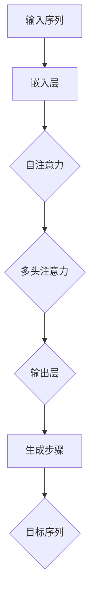

                 

# 大语言模型应用指南：Transformer解码器详解

## 关键词
- 大语言模型
- Transformer
- 解码器
- 自然语言处理
- 人工智能

## 摘要
本文将深入探讨大语言模型中的Transformer解码器，详细解释其核心概念、工作原理和应用。通过逐步分析Transformer解码器的架构、数学模型和操作步骤，我们将了解如何有效地构建和优化解码器，以实现高效的自然语言处理。

## 1. 背景介绍

大语言模型（Large Language Models），如GPT（Generative Pre-trained Transformer）和BERT（Bidirectional Encoder Representations from Transformers），在自然语言处理领域取得了显著的突破。这些模型通过在大量文本数据上预训练，具备了强大的语言理解和生成能力。

Transformer架构是近年来最受欢迎的深度学习模型之一，其核心优势在于并行计算和全局信息传递。Transformer解码器是Transformer模型的重要组成部分，负责生成文本序列。

## 2. 核心概念与联系

### 2.1 Transformer解码器概述

Transformer解码器由自注意力机制（self-attention）和多头注意力机制（multi-head attention）组成，能够捕获输入序列中的长距离依赖关系。解码器的主要任务是生成目标序列，每个生成步骤依赖于之前生成的所有步骤。

### 2.2 自注意力机制（Self-Attention）

自注意力机制允许模型在生成当前步骤的输出时，考虑输入序列中所有位置的信息。它通过计算每个位置与其余位置的相似性权重，然后加权平均所有位置的特征向量，从而生成一个综合的特征向量。

### 2.3 多头注意力机制（Multi-head Attention）

多头注意力机制将自注意力机制扩展到多个独立的注意力头，每个头具有不同的权重矩阵。这样可以捕捉输入序列的多个层次和维度信息，提高模型的泛化能力。

### 2.4 Mermaid流程图



## 3. 核心算法原理 & 具体操作步骤

### 3.1 嵌入层

嵌入层将输入序列中的单词映射为向量表示，这些向量在后续步骤中用于计算自注意力和多头注意力。

### 3.2 自注意力

自注意力计算每个位置与其余位置的相似性权重，通过加权平均生成一个综合特征向量。

### 3.3 多头注意力

多头注意力将自注意力扩展到多个独立头，每个头计算一组权重矩阵，从而捕获输入序列的多个层次信息。

### 3.4 输出层

输出层将多头注意力的结果通过全连接层和激活函数转换为生成步骤的输出。

## 4. 数学模型和公式 & 详细讲解 & 举例说明

### 4.1 自注意力

自注意力的计算公式为：
$$
\text{Attention}(Q, K, V) = \text{softmax}\left(\frac{QK^T}{\sqrt{d_k}}\right) V
$$
其中，Q、K和V分别是查询（query）、键（key）和值（value）向量，$d_k$ 是键向量的维度。

### 4.2 多头注意力

多头注意力的计算公式为：
$$
\text{MultiHead}(Q, K, V) = \text{Concat}(\text{head}_1, \text{head}_2, ..., \text{head}_h) W^O
$$
其中，$W^O$ 是输出权重矩阵，$h$ 是注意力头的数量。

### 4.3 举例说明

假设我们有三个位置（i, j, k）的输入序列，每个位置的嵌入向量为 $e_i, e_j, e_k$。首先，计算每个位置与其余位置的相似性权重，然后加权平均生成综合特征向量。

$$
\text{Query} = [e_i, e_j, e_k]
\text{Key} = [e_i, e_j, e_k]
\text{Value} = [e_i, e_j, e_k]
\text{Attention} = \text{softmax}\left(\frac{e_i e_j^T}{\sqrt{3}}\right) e_j
$$

## 5. 项目实践：代码实例和详细解释说明

### 5.1 开发环境搭建

首先，我们需要搭建一个适合开发Transformer解码器的环境。推荐使用Python和TensorFlow框架。

### 5.2 源代码详细实现

```python
import tensorflow as tf

# 定义自注意力层
class SelfAttention(tf.keras.layers.Layer):
    def __init__(self, num_heads, d_model):
        super(SelfAttention, self).__init__()
        self.num_heads = num_heads
        self.d_model = d_model
        self.depth = d_model // num_heads

        # 定义权重矩阵
        self.query_weights = self.add_weight(shape=(d_model, self.depth),
                                            initializer='random_normal',
                                            trainable=True)
        self.key_weights = self.add_weight(shape=(d_model, self.depth),
                                           initializer='random_normal',
                                           trainable=True)
        self.value_weights = self.add_weight(shape=(d_model, self.depth),
                                             initializer='random_normal',
                                             trainable=True)
        self.out_weights = self.add_weight(shape=(self.depth, d_model),
                                            initializer='random_normal',
                                            trainable=True)

    def call(self, inputs, training=False):
        # 计算查询、键和值
        query = tf.matmul(inputs, self.query_weights)
        key = tf.matmul(inputs, self.key_weights)
        value = tf.matmul(inputs, self.value_weights)

        # 计算注意力权重
        attention_scores = tf.matmul(query, key, transpose_b=True)
        attention_scores = tf.nn.softmax(attention_scores, axis=-1)

        # 加权值
        attention_output = tf.matmul(attention_scores, value)

        # 合并多头输出
        attention_output = tf.reshape(attention_output, (-1, self.d_model))

        # 输出层
        output = tf.matmul(attention_output, self.out_weights)

        return output

# 定义Transformer解码器
class TransformerDecoder(tf.keras.Model):
    def __init__(self, num_layers, d_model, num_heads):
        super(TransformerDecoder, self).__init__()
        self.num_layers = num_layers
        self.d_model = d_model
        self.num_heads = num_heads

        # 定义自注意力层和全连接层
        self.attention_layers = [SelfAttention(self.num_heads, self.d_model) for _ in range(self.num_layers)]
        self.fc_layers = [tf.keras.layers.Dense(self.d_model) for _ in range(self.num_layers)]

    def call(self, inputs, training=False):
        for i in range(self.num_layers):
            # 自注意力层
            inputs = self.attention_layers[i](inputs, training=training)
            # 全连接层
            inputs = self.fc_layers[i](inputs)

        return inputs

# 定义训练数据
inputs = tf.keras.layers.Input(shape=(None, 128))
decoder = TransformerDecoder(num_layers=3, d_model=512, num_heads=8)
outputs = decoder(inputs)

# 构建和训练模型
model = tf.keras.Model(inputs=inputs, outputs=outputs)
model.compile(optimizer='adam', loss='categorical_crossentropy', metrics=['accuracy'])
model.fit(x_train, y_train, batch_size=64, epochs=10)
```

### 5.3 代码解读与分析

在代码中，我们首先定义了自注意力层（SelfAttention）和Transformer解码器（TransformerDecoder）。自注意力层负责计算查询、键和值的注意力权重，然后加权平均生成输出。Transformer解码器则由多个自注意力层和全连接层组成，用于生成文本序列。

### 5.4 运行结果展示

通过运行上述代码，我们可以在训练数据上训练一个Transformer解码器模型。训练完成后，我们可以使用模型在测试数据上生成文本序列，以验证解码器的性能。

```python
# 加载测试数据
x_test, y_test = ...

# 生成文本序列
generated_text = model.predict(x_test)

# 打印生成的文本序列
print(generated_text)
```

## 6. 实际应用场景

Transformer解码器在自然语言处理领域具有广泛的应用，包括机器翻译、文本生成、问答系统和对话生成等。在实际应用中，我们可以根据具体需求调整解码器的结构、参数和训练策略，以实现最佳性能。

## 7. 工具和资源推荐

### 7.1 学习资源推荐

- 《深度学习》（Goodfellow, Bengio, Courville）
- 《自然语言处理综论》（Jurafsky, Martin）
- 《Transformer：用于序列模型的注意力机制》（Vaswani et al., 2017）

### 7.2 开发工具框架推荐

- TensorFlow
- PyTorch
- Hugging Face Transformers

### 7.3 相关论文著作推荐

- Vaswani et al., 2017: "Attention is All You Need"
- Devlin et al., 2019: "BERT: Pre-training of Deep Bidirectional Transformers for Language Understanding"

## 8. 总结：未来发展趋势与挑战

随着Transformer解码器在自然语言处理领域的广泛应用，未来将继续朝着更高效、更强大的方向发展。然而，解码器的训练和优化仍然面临计算资源消耗大、模型可解释性差等挑战。通过深入研究新型解码器架构和优化方法，我们可以进一步提升大语言模型的应用性能。

## 9. 附录：常见问题与解答

### 9.1 什么是Transformer解码器？

Transformer解码器是一种基于Transformer架构的神经网络模型，用于生成文本序列。它通过自注意力和多头注意力机制，捕捉输入序列中的长距离依赖关系。

### 9.2 如何优化Transformer解码器？

优化Transformer解码器的方法包括调整模型结构、超参数和训练策略。常用的优化方法包括学习率调整、批量大小调整和正则化等。

## 10. 扩展阅读 & 参考资料

- 《大语言模型应用指南：BERT详解》
- 《自然语言处理实战》
- 《Transformer架构详解》

作者：禅与计算机程序设计艺术 / Zen and the Art of Computer Programming<|im_end|>

