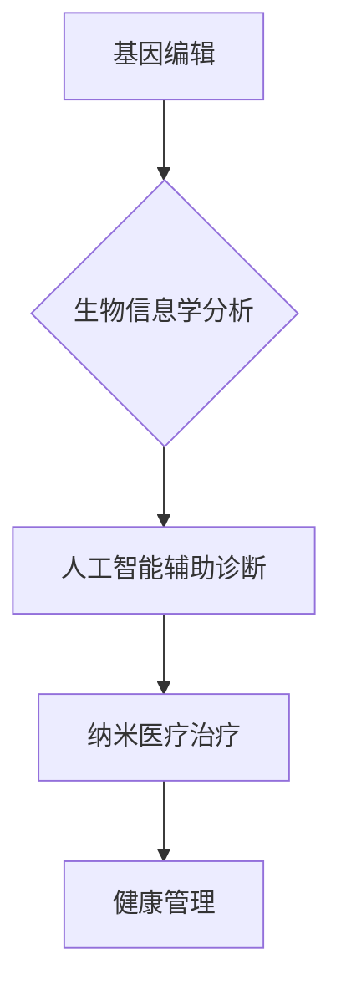

                 

## 2050年的医疗健康：从基因编辑到纳米医疗的健康管理革命

> 关键词：基因编辑、纳米医疗、人工智能、精准医疗、健康管理、生物信息学、量子计算、区块链

### 1. 背景介绍

21世纪的医疗健康领域正经历着前所未有的变革。从传统的疾病治疗模式向预防、个性化和精准医疗的转变，标志着医疗健康进入了一个全新的时代。随着人工智能、生物信息学、纳米技术等技术的飞速发展，2050年的医疗健康将呈现出更加智能化、个性化和精准化的趋势。

**1.1  传统医疗模式的局限性**

传统的医疗模式主要以疾病的诊断和治疗为中心，往往采取“一刀切”的治疗方案，缺乏针对性和个性化。这种模式存在着以下局限性：

* **诊断滞后:** 许多疾病在早期阶段缺乏明显的症状，导致诊断滞后，错失最佳治疗时机。
* **治疗效果不佳:** 传统的治疗方案往往难以根治疾病，且存在一定的副作用。
* **医疗成本高昂:** 复杂的医疗设备、昂贵的药物和漫长的住院时间导致医疗成本居高不下。

**1.2  精准医疗的崛起**

精准医疗的核心是根据个体的基因、环境和生活方式等因素，制定个性化的治疗方案。它利用生物信息学、基因组学、人工智能等技术，对疾病进行更深入的理解，并开发更有效的治疗方法。

**1.3  纳米医疗的潜力**

纳米医疗利用纳米材料和技术，对疾病进行精准的诊断和治疗。纳米机器人能够进入人体内部，精确地识别和清除病变细胞，同时还能将药物直接输送到病灶部位，提高治疗效果并减少副作用。

### 2. 核心概念与联系

**2.1  基因编辑**

基因编辑是指对生物基因组进行精确的修改技术。CRISPR-Cas9技术是目前最常用的基因编辑工具，它能够识别和切割特定的DNA序列，从而实现基因的插入、删除或替换。

**2.2  纳米医疗**

纳米医疗是指利用纳米材料和技术，对疾病进行精准的诊断和治疗。纳米材料具有独特的物理、化学和生物学特性，使其能够在医疗领域发挥重要的作用。

**2.3  人工智能**

人工智能是指模拟人类智能的计算机系统。人工智能技术能够分析海量医疗数据，识别疾病模式，预测疾病风险，并辅助医生做出更精准的诊断和治疗决策。

**2.4  生物信息学**

生物信息学是指利用计算机科学和统计学等方法，分析和处理生物学数据。生物信息学技术能够帮助我们理解基因组、蛋白质和代谢网络等复杂生物系统，并为精准医疗提供重要的数据支持。

**2.5  健康管理**

健康管理是指通过科学的方法和手段，预防疾病、控制慢性病、提高生活质量。

**2.6  流程图**



### 3. 核心算法原理 & 具体操作步骤

**3.1  算法原理概述**

基因编辑算法的核心是利用CRISPR-Cas9系统对DNA序列进行精准的切割和修改。CRISPR-Cas9系统由两个主要部分组成：

* **CRISPR:** 是一种细菌免疫系统，能够识别和切割入侵的病毒DNA。
* **Cas9:** 是一种核酸酶，能够根据CRISPR的指导，切割特定的DNA序列。

**3.2  算法步骤详解**

1. **设计gRNA:** 根据目标基因序列，设计一个能够与目标序列特异性结合的gRNA分子。
2. **构建Cas9-gRNA复合物:** 将Cas9蛋白与gRNA分子结合，形成Cas9-gRNA复合物。
3. **导入细胞:** 将Cas9-gRNA复合物导入目标细胞。
4. **切割DNA:** Cas9-gRNA复合物识别并切割目标DNA序列。
5. **修复DNA:** 细胞自身的DNA修复机制会修复切割后的DNA断裂，从而实现基因的插入、删除或替换。

**3.3  算法优缺点**

**优点:**

* **精准性高:** CRISPR-Cas9系统能够识别和切割特定的DNA序列，实现基因的精准编辑。
* **效率高:** CRISPR-Cas9系统具有较高的基因编辑效率。
* **操作简便:** CRISPR-Cas9系统的操作相对简单，成本也较低。

**缺点:**

* **脱靶效应:** CRISPR-Cas9系统可能存在脱靶效应，即非目标DNA序列也被切割，导致基因组的不可预知改变。
* **免疫反应:** CRISPR-Cas9系统可能引发免疫反应，影响治疗效果。

**3.4  算法应用领域**

* **基因治疗:** 用于治疗遗传性疾病，例如囊性纤维化、血友病等。
* **癌症治疗:** 用于增强免疫细胞的杀伤能力，提高癌症治疗效果。
* **农业生物技术:** 用于提高作物产量、抗病性等。

### 4. 数学模型和公式 & 详细讲解 & 举例说明

**4.1  数学模型构建**

基因编辑的效率可以用以下数学模型来描述：

$$
Efficiency = \frac{Number\ of\ successful\ edits}{Total\ number\ of\ cells}
$$

其中：

* **Efficiency:** 基因编辑效率
* **Number of successful edits:** 成功编辑的细胞数量
* **Total number of cells:** 总细胞数量

**4.2  公式推导过程**

基因编辑效率受多种因素影响，例如gRNA设计、Cas9蛋白浓度、细胞类型等。这些因素可以通过实验数据进行量化，并构建相应的数学模型进行分析。

**4.3  案例分析与讲解**

例如，研究人员通过实验发现，gRNA长度与基因编辑效率呈正相关，即gRNA长度越长，基因编辑效率越高。

$$
Efficiency = a \cdot Length + b
$$

其中：

* **a:** gRNA长度与基因编辑效率的比例系数
* **b:** gRNA长度为0时的基因编辑效率

通过实验数据拟合该模型，可以得到a和b的值，从而预测不同长度gRNA的基因编辑效率。

### 5. 项目实践：代码实例和详细解释说明

**5.1  开发环境搭建**

* **操作系统:** Linux
* **编程语言:** Python
* **软件工具:** CRISPR Design Tool, Biopython, Jupyter Notebook

**5.2  源代码详细实现**

```python
# 使用CRISPR Design Tool设计gRNA
# 使用Biopython分析基因序列
# 使用Jupyter Notebook进行数据分析和可视化
```

**5.3  代码解读与分析**

代码实现过程需要根据具体的基因编辑目标和实验设计进行调整。

**5.4  运行结果展示**

运行结果可以展示基因编辑效率、脱靶效应等信息，并进行数据可视化分析。

### 6. 实际应用场景

**6.1  基因治疗**

基因编辑技术可以用于治疗遗传性疾病，例如囊性纤维化、血友病等。通过编辑患者的基因，可以修复缺陷基因，从而治愈疾病。

**6.2  癌症治疗**

基因编辑技术可以增强免疫细胞的杀伤能力，提高癌症治疗效果。例如，可以编辑T细胞基因，使其能够识别和杀伤癌细胞。

**6.3  农业生物技术**

基因编辑技术可以用于提高作物产量、抗病性等。例如，可以编辑作物基因，使其能够抵抗病虫害，提高产量。

**6.4  未来应用展望**

未来，基因编辑技术将应用于更广泛的领域，例如：

* **个性化医疗:** 根据个体的基因信息，制定个性化的治疗方案。
* **疾病预防:** 通过编辑基因，预防遗传性疾病的发生。
* **器官移植:** 利用基因编辑技术，培育供体器官，解决器官移植的供需矛盾。

### 7. 工具和资源推荐

**7.1  学习资源推荐**

* **CRISPR-Cas9基因编辑技术入门指南:** https://www.nature.com/articles/nmeth.4291
* **基因编辑伦理与社会影响:** https://www.ncbi.nlm.nih.gov/pmc/articles/PMC5973731/

**7.2  开发工具推荐**

* **CRISPR Design Tool:** https://crispr.mit.edu/
* **Biopython:** https://biopython.org/

**7.3  相关论文推荐**

* **A Programmable Dual-RNA-Guided DNA Endonuclease in Adaptive Bacterial Immunity:** https://www.science.org/doi/10.1126/science.1240955
* **CRISPR-Cas9: A Versatile Tool for Genome Engineering:** https://www.cell.com/cell/fulltext/S0092-8674(15)00581-X

### 8. 总结：未来发展趋势与挑战

**8.1  研究成果总结**

基因编辑技术的发展取得了重大突破，为治疗遗传性疾病、癌症等疾病提供了新的希望。纳米医疗技术也取得了显著进展，为精准诊断和治疗提供了新的手段。

**8.2  未来发展趋势**

未来，基因编辑和纳米医疗技术将继续发展，并与人工智能、生物信息学等技术深度融合，推动医疗健康领域实现更加智能化、个性化和精准化的发展。

**8.3  面临的挑战**

基因编辑技术还面临着一些挑战，例如脱靶效应、免疫反应等。纳米医疗技术也面临着安全性、可控性等挑战。

**8.4  研究展望**

未来研究需要重点解决基因编辑技术的安全性、效率和可控性问题，并探索纳米医疗技术的应用场景和安全性。同时，还需要加强基因编辑和纳米医疗技术的伦理和社会影响研究，确保其安全、有效和可持续地发展。

### 9. 附录：常见问题与解答

**9.1  基因编辑技术是否安全？**

基因编辑技术目前还处于发展阶段，存在着一些安全风险，例如脱靶效应、免疫反应等。

**9.2  纳米医疗技术是否安全？**

纳米医疗技术也面临着安全性挑战，例如纳米材料的毒性、生物累积等。

**9.3  基因编辑和纳米医疗技术伦理问题有哪些？**

基因编辑和纳米医疗技术涉及到伦理问题，例如基因编辑的“设计婴儿”问题、纳米医疗技术的隐私问题等。

**9.4  基因编辑和纳米医疗技术未来发展前景如何？**

基因编辑和纳米医疗技术未来发展前景广阔，有望在医疗健康领域带来革命性的改变。


作者：禅与计算机程序设计艺术 / Zen and the Art of Computer Programming 
<end_of_turn>

