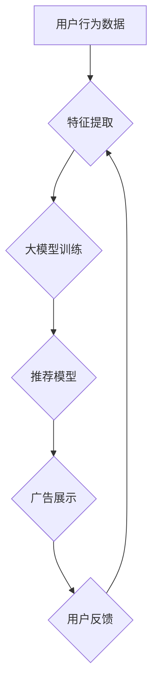

                 

## 广告推荐的未来：大模型的潜力

> 关键词：广告推荐、大模型、深度学习、Transformer、个性化推荐、多模态推荐、因果推理、可解释性

### 1. 背景介绍

广告推荐作为数字经济的重要支柱，在连接用户需求与商家营销之间扮演着关键角色。传统的广告推荐系统主要依赖于基于规则和协同过滤等方法，但随着用户行为数据的爆炸式增长和推荐场景的多样化，这些方法逐渐面临着挑战。

近年来，深度学习技术的飞速发展为广告推荐领域带来了新的机遇。大模型，作为深度学习领域的新兴技术，凭借其强大的学习能力和泛化能力，展现出巨大的潜力，为广告推荐的未来发展指明了方向。

### 2. 核心概念与联系

#### 2.1 大模型概述

大模型是指参数规模庞大、训练数据海量、训练成本高昂的深度学习模型。与传统深度学习模型相比，大模型具有以下特点：

* **参数规模巨大:** 大模型通常拥有数十亿甚至数千亿个参数，这使得它们能够学习到更复杂的特征和模式。
* **训练数据量庞大:** 大模型的训练需要海量的数据，才能充分发挥其学习能力。
* **计算资源需求高:** 训练大模型需要强大的计算资源，例如高性能GPU集群。

#### 2.2 广告推荐与大模型的结合

大模型可以应用于广告推荐的各个环节，例如：

* **特征工程:** 大模型可以自动学习用户和广告的特征，无需人工设计特征，提高特征的表达能力和准确性。
* **模型训练:** 大模型可以用于训练更精准的广告推荐模型，例如基于深度学习的推荐模型。
* **个性化推荐:** 大模型可以根据用户的兴趣、行为和偏好，提供更个性化的广告推荐。
* **多模态推荐:** 大模型可以处理多种类型的广告数据，例如文本、图片、视频等，实现多模态的广告推荐。

#### 2.3 大模型架构



### 3. 核心算法原理 & 具体操作步骤

#### 3.1 算法原理概述

大模型在广告推荐领域主要应用于Transformer模型，其核心原理是利用自注意力机制学习用户和广告之间的关系。自注意力机制能够捕捉到用户行为数据中的长距离依赖关系，从而提高推荐模型的准确性。

#### 3.2 算法步骤详解

1. **数据预处理:** 收集用户行为数据，例如点击记录、浏览历史、购买记录等，并进行清洗、转换和编码。
2. **特征提取:** 使用词嵌入模型将文本数据转换为向量表示，并提取用户和广告的特征。
3. **模型训练:** 使用Transformer模型训练广告推荐模型，并使用交叉熵损失函数进行优化。
4. **模型评估:** 使用测试数据评估模型的性能，例如点击率、转化率等。
5. **模型部署:** 将训练好的模型部署到线上环境，进行实时广告推荐。

#### 3.3 算法优缺点

**优点:**

* **高准确性:** Transformer模型能够学习到更复杂的特征和模式，提高推荐模型的准确性。
* **个性化推荐:** Transformer模型可以根据用户的兴趣和行为，提供更个性化的广告推荐。
* **多模态推荐:** Transformer模型可以处理多种类型的广告数据，实现多模态的广告推荐。

**缺点:**

* **训练成本高:** 训练大模型需要大量的计算资源和时间。
* **可解释性差:** Transformer模型的内部机制比较复杂，难以解释其推荐结果。

#### 3.4 算法应用领域

Transformer模型在广告推荐领域有着广泛的应用，例如：

* **搜索广告推荐:** 根据用户的搜索关键词，推荐相关的广告。
* **展示广告推荐:** 根据用户的兴趣和行为，推荐相关的展示广告。
* **视频广告推荐:** 根据用户的观看历史，推荐相关的视频广告。

### 4. 数学模型和公式 & 详细讲解 & 举例说明

#### 4.1 数学模型构建

广告推荐的数学模型通常基于用户-物品交互矩阵，其中用户和物品分别表示为行和列。每个元素代表用户对物品的评分或交互行为。

#### 4.2 公式推导过程

Transformer模型的核心是自注意力机制，其计算公式如下：

$$
Attention(Q, K, V) = \frac{exp(Q \cdot K^T / \sqrt{d_k})}{exp(Q \cdot K^T / \sqrt{d_k})} \cdot V
$$

其中：

* $Q$：查询矩阵
* $K$：键矩阵
* $V$：值矩阵
* $d_k$：键向量的维度

#### 4.3 案例分析与讲解

假设我们有一个用户-物品交互矩阵，其中用户和物品分别表示为1到10。我们可以使用Transformer模型学习用户和物品之间的关系，并预测用户对物品的评分。

### 5. 项目实践：代码实例和详细解释说明

#### 5.1 开发环境搭建

* Python 3.7+
* TensorFlow 2.0+
* PyTorch 1.0+
* CUDA 10.0+

#### 5.2 源代码详细实现

```python
# 导入必要的库
import tensorflow as tf

# 定义Transformer模型
class Transformer(tf.keras.Model):
    def __init__(self, vocab_size, embedding_dim, num_heads, num_layers):
        super(Transformer, self).__init__()
        self.embedding = tf.keras.layers.Embedding(vocab_size, embedding_dim)
        self.transformer_layers = tf.keras.layers.StackedRNNCells([tf.keras.layers.MultiHeadAttention(num_heads=num_heads, key_dim=embedding_dim) for _ in range(num_layers)])
        self.fc = tf.keras.layers.Dense(vocab_size)

    def call(self, inputs):
        x = self.embedding(inputs)
        x = self.transformer_layers(x)
        x = self.fc(x)
        return x

# 实例化Transformer模型
model = Transformer(vocab_size=10000, embedding_dim=128, num_heads=8, num_layers=6)

# 训练模型
model.compile(optimizer='adam', loss='mse')
model.fit(x_train, y_train, epochs=10)

# 预测结果
predictions = model.predict(x_test)
```

#### 5.3 代码解读与分析

* 代码首先导入必要的库，然后定义Transformer模型的结构。
* Transformer模型包含三个主要部分：嵌入层、Transformer层和全连接层。
* 嵌入层将文本数据转换为向量表示。
* Transformer层利用自注意力机制学习用户和物品之间的关系。
* 全连接层将Transformer层的输出转换为预测结果。
* 代码然后实例化Transformer模型，并使用Adam优化器和均方误差损失函数进行训练。
* 最后，代码使用训练好的模型预测测试数据的结果。

#### 5.4 运行结果展示

训练完成后，可以评估模型的性能，例如点击率、转化率等。

### 6. 实际应用场景

#### 6.1 搜索广告推荐

当用户在搜索引擎中输入关键词时，搜索引擎会根据用户的搜索历史、地理位置、设备信息等因素，推荐相关的广告。

#### 6.2 展示广告推荐

在网站、APP等平台上，广告平台会根据用户的兴趣、行为和偏好，推荐相关的展示广告。

#### 6.3 视频广告推荐

视频平台会根据用户的观看历史、点赞记录、评论等信息，推荐相关的视频广告。

#### 6.4 未来应用展望

大模型在广告推荐领域还有巨大的潜力，未来可能应用于以下场景：

* **个性化广告内容生成:** 利用大模型生成个性化的广告文案和创意，提高广告的吸引力。
* **跨模态广告推荐:** 将文本、图片、视频等多种模态数据融合，实现更精准的广告推荐。
* **因果推理广告推荐:** 利用大模型学习用户行为和广告效果之间的因果关系，提高广告投放的效率。
* **可解释性广告推荐:** 研究如何提高大模型的透明度和可解释性，让广告主和用户更好地理解推荐结果。

### 7. 工具和资源推荐

#### 7.1 学习资源推荐

* **书籍:**
    * 《深度学习》
    * 《自然语言处理》
    * 《Transformer模型》
* **在线课程:**
    * Coursera: 深度学习
    * Udacity: 自然语言处理
    * fast.ai: 深度学习

#### 7.2 开发工具推荐

* **TensorFlow:** 开源深度学习框架
* **PyTorch:** 开源深度学习框架
* **HuggingFace:** 提供预训练的大模型和工具

#### 7.3 相关论文推荐

* 《Attention Is All You Need》
* 《BERT: Pre-training of Deep Bidirectional Transformers for Language Understanding》
* 《GPT-3: Language Models are Few-Shot Learners》

### 8. 总结：未来发展趋势与挑战

#### 8.1 研究成果总结

大模型在广告推荐领域取得了显著的成果，提高了推荐模型的准确性和个性化程度。

#### 8.2 未来发展趋势

* **模型规模进一步扩大:** 随着计算资源的不断发展，大模型的规模将进一步扩大，学习能力将得到提升。
* **多模态推荐的深入研究:** 大模型将能够处理多种类型的广告数据，实现更精准的跨模态推荐。
* **因果推理广告推荐的探索:** 研究如何利用大模型学习用户行为和广告效果之间的因果关系，提高广告投放的效率。
* **可解释性广告推荐的提升:** 研究如何提高大模型的透明度和可解释性，让广告主和用户更好地理解推荐结果。

#### 8.3 面临的挑战

* **训练成本高:** 训练大模型需要大量的计算资源和时间，成本较高。
* **数据安全和隐私问题:** 大模型的训练需要海量数据，如何保证数据安全和用户隐私是一个重要的挑战。
* **可解释性问题:** 大模型的内部机制比较复杂，难以解释其推荐结果，这可能会导致用户对推荐结果的信任度降低。

#### 8.4 研究展望

未来，大模型在广告推荐领域将继续发挥重要作用，为用户提供更精准、更个性化的广告体验。


### 9. 附录：常见问题与解答

* **Q1: 大模型的训练需要多少计算资源？**

A1: 大模型的训练需要大量的计算资源，例如高性能GPU集群。

* **Q2: 如何保证大模型的训练数据安全和用户隐私？**

A2: 在训练大模型时，需要采取相应的措施来保证数据安全和用户隐私，例如数据脱敏、加密等。

* **Q3: 如何提高大模型的可解释性？**

A3: 研究如何利用可解释性技术来解释大模型的推荐结果，例如注意力机制可视化、局部解释等。


作者：禅与计算机程序设计艺术 / Zen and the Art of Computer Programming 
<end_of_turn>

