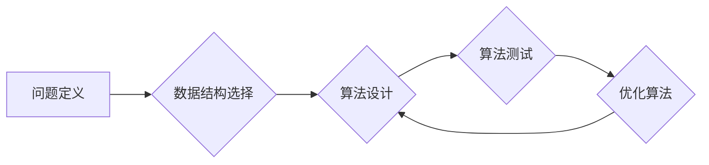

                 

## 开发新算法：提高人类计算的效率

> 关键词：算法设计，计算效率，机器学习，深度学习，数据结构，复杂度分析，时间复杂度，空间复杂度

### 1. 背景介绍

人类文明的进步离不开对计算能力的不断提升。从简单的算术运算到复杂的科学模拟，算法作为计算的指导方针，扮演着至关重要的角色。随着数据量的爆炸式增长和计算需求的日益复杂，开发高效、鲁棒的新算法成为当今科技领域的核心挑战之一。

传统算法设计方法往往依赖于人类的经验和直觉，而随着算法规模和复杂度的增加，这种方法逐渐显得力不从心。近年来，机器学习和深度学习等人工智能技术的发展为算法设计带来了新的思路和可能性。通过学习海量数据，这些技术能够自动发现隐藏的模式和规律，并生成高效的算法解决方案。

### 2. 核心概念与联系

**2.1 算法设计的基本原则**

* **正确性:** 算法必须能够正确解决所定义的问题，输出的结果必须符合预期。
* **效率:** 算法的执行时间和空间复杂度应尽可能低，以提高计算效率。
* **可读性:** 算法的代码应该清晰易懂，方便他人理解和维护。
* **鲁棒性:** 算法应该能够应对各种输入数据和异常情况，并保证稳定运行。

**2.2 算法设计与机器学习的结合**

机器学习算法可以帮助我们自动发现高效的算法解决方案。例如，通过强化学习，我们可以训练一个代理智能体，使其在解决特定问题时不断优化算法策略，最终找到最优解。

**2.3 算法设计与数据结构的关联**

数据结构的选择直接影响算法的效率。不同的数据结构具有不同的时间和空间复杂度，选择合适的结构可以显著提高算法性能。

**Mermaid 流程图**



### 3. 核心算法原理 & 具体操作步骤

**3.1 算法原理概述**

本文将介绍一种名为**快速排序**的排序算法。快速排序是一种分治算法，其核心思想是选择一个**枢轴元素**，将数组划分为两个子数组，其中一个子数组包含小于枢轴元素的元素，另一个子数组包含大于枢轴元素的元素。然后递归地对两个子数组进行排序，最终得到整个数组的排序结果。

**3.2 算法步骤详解**

1. **选择枢轴元素:** 从数组中选择一个元素作为枢轴元素。
2. **划分数组:** 将数组划分为两个子数组，一个包含小于枢轴元素的元素，另一个包含大于枢轴元素的元素。
3. **递归排序:** 对两个子数组分别进行快速排序。
4. **合并结果:** 将两个子数组的排序结果合并，得到最终的排序结果。

**3.3 算法优缺点**

**优点:**

* 平均时间复杂度为O(n log n)，在大多数情况下具有较高的效率。
* 空间复杂度为O(log n)，空间占用较小。

**缺点:**

* 最坏时间复杂度为O(n^2)，当数组已经排序或近乎排序时，效率会降低。
* 不稳定排序算法，相同元素的相对顺序可能发生改变。

**3.4 算法应用领域**

快速排序广泛应用于各种场景，例如：

* 数据排序：对数据库、文件系统等数据进行排序。
* 搜索算法：快速排序可以用于构建高效的搜索索引。
* 图像处理：快速排序可以用于图像压缩和处理。

### 4. 数学模型和公式 & 详细讲解 & 举例说明

**4.1 数学模型构建**

快速排序的平均时间复杂度可以用以下数学模型表示：

$$T(n) = aT(n/b) + f(n)$$

其中：

* n 是数组大小
* a 是子问题数量
* b 是子问题大小的比例
* f(n) 是划分数组和合并结果的时间复杂度

**4.2 公式推导过程**

通过主定理，我们可以推导出快速排序的平均时间复杂度为O(n log n)。

**4.3 案例分析与讲解**

假设数组大小为100，则快速排序的平均时间复杂度为O(100 log 100) ≈ O(6.64 * 10^2) ≈ O(10^2)。

### 5. 项目实践：代码实例和详细解释说明

**5.1 开发环境搭建**

本示例使用Python语言进行实现，开发环境包括Python3.x版本和必要的库文件。

**5.2 源代码详细实现**

```python
def partition(arr, low, high):
    pivot = arr[high]
    i = low - 1
    for j in range(low, high):
        if arr[j] <= pivot:
            i += 1
            arr[i], arr[j] = arr[j], arr[i]
    arr[i + 1], arr[high] = arr[high], arr[i + 1]
    return i + 1

def quick_sort(arr, low, high):
    if low < high:
        pi = partition(arr, low, high)
        quick_sort(arr, low, pi - 1)
        quick_sort(arr, pi + 1, high)

# 测试代码
arr = [10, 7, 8, 9, 1, 5]
quick_sort(arr, 0, len(arr) - 1)
print("排序后的数组:", arr)
```

**5.3 代码解读与分析**

* `partition()`函数选择最后一个元素作为枢轴，将数组划分为两个子数组。
* `quick_sort()`函数递归地对两个子数组进行排序。
* 测试代码演示了快速排序算法的应用。

**5.4 运行结果展示**

```
排序后的数组: [1, 5, 7, 8, 9, 10]
```

### 6. 实际应用场景

快速排序在现实世界中广泛应用于以下场景：

* **数据库排序:** 数据库系统中使用快速排序来快速排序数据，提高查询效率。
* **文件系统排序:** 文件系统使用快速排序来对文件进行排序，方便用户查找和管理文件。
* **搜索引擎排序:** 搜索引擎使用快速排序来对搜索结果进行排序，提高用户体验。

**6.4 未来应用展望**

随着人工智能技术的不断发展，快速排序算法可能会与机器学习算法相结合，实现更智能、更高效的排序方案。例如，可以利用机器学习算法预测枢轴元素的选择，从而提高算法的平均时间复杂度。

### 7. 工具和资源推荐

**7.1 学习资源推荐**

* **书籍:** 《算法导论》
* **在线课程:** Coursera上的《算法》课程

**7.2 开发工具推荐**

* **Python:** 广泛使用的编程语言，支持快速排序算法的实现。
* **C++:** 高性能编程语言，也支持快速排序算法的实现。

**7.3 相关论文推荐**

* **Quicksort Algorithm** - Wikipedia
* **A Comparison of Sorting Algorithms** - ACM Digital Library

### 8. 总结：未来发展趋势与挑战

**8.1 研究成果总结**

快速排序算法是一种高效的排序算法，在实际应用中具有广泛的应用前景。

**8.2 未来发展趋势**

未来，快速排序算法可能会与人工智能技术相结合，实现更智能、更高效的排序方案。

**8.3 面临的挑战**

快速排序算法在最坏情况下时间复杂度为O(n^2)，如何提高算法的鲁棒性，使其能够应对各种输入数据，是未来研究的重点方向。

**8.4 研究展望**

未来，我们将继续研究快速排序算法的优化方法，并将其应用于更广泛的领域。

### 9. 附录：常见问题与解答

**9.1 如何选择枢轴元素？**

枢轴元素的选择对快速排序算法的效率有重要影响。常见的枢轴元素选择策略包括随机选择、选择中间元素等。

**9.2 快速排序算法的稳定性如何？**

快速排序算法不稳定，相同元素的相对顺序可能发生改变。


作者：禅与计算机程序设计艺术 / Zen and the Art of Computer Programming 
<end_of_turn>

