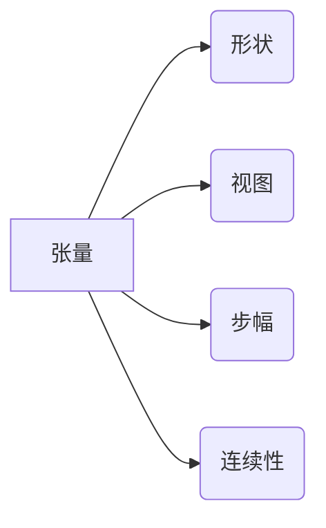

                 

## 张量操作精讲：形状、视图、步幅和连续性

> 关键词：张量、形状、视图、步幅、连续性、广播、索引、切片、深度学习

## 1. 背景介绍

张量是深度学习领域的核心数据结构，它以多维数组的形式存储数据，并通过一系列操作进行处理和分析。理解张量的形状、视图、步幅和连续性对于掌握深度学习算法和实现高效的代码至关重要。

随着深度学习技术的蓬勃发展，对张量操作的需求日益增长。高效、灵活的张量操作不仅可以提高模型训练速度，还能降低内存占用，从而提升模型的性能和可扩展性。

本文将深入探讨张量操作的各个方面，包括形状、视图、步幅和连续性，并通过具体的例子和代码实现，帮助读者理解这些概念，掌握张量操作的技巧。

## 2. 核心概念与联系

### 2.1 张量

张量是一种多维数组，可以表示各种类型的数值数据，例如图像、文本和音频。张量的维度数称为其秩，例如，一个二维张量可以表示一个矩阵，一个三维张量可以表示一个立方体。

### 2.2 形状

张量的形状描述了其维度的大小。例如，一个形状为 (2, 3) 的张量表示一个有两个维度，分别为 2 和 3 的数组。

### 2.3 视图

视图是指对同一个张量的不同排列方式。通过改变视图，可以从不同的角度观察和操作张量数据。

### 2.4 步幅

步幅是指访问张量元素时，沿着每个维度移动的步长。

### 2.5 连续性

连续性是指张量元素是否存储在连续的内存地址中。连续的张量可以进行更有效的内存访问和操作。

**核心概念关系流程图**



## 3. 核心算法原理 & 具体操作步骤

### 3.1 算法原理概述

张量操作的核心算法原理是基于数组操作和线性代数运算。通过对张量的形状、视图、步幅和连续性进行分析和处理，可以实现各种高效的张量操作，例如：

* **广播:** 将一个张量扩展到另一个张量的形状，以便进行元素级运算。
* **索引:** 根据索引值访问张量中的特定元素。
* **切片:** 从张量中提取子数组。
* **拼接:** 将多个张量沿着指定维度连接起来。

### 3.2 算法步骤详解

1. **确定张量形状:** 首先需要了解参与操作的张量形状，以便确定操作的范围和结果形状。
2. **分析视图:** 根据操作需求，选择合适的张量视图，以便高效地访问和操作数据。
3. **计算步幅:** 根据张量形状和视图，计算访问每个元素所需的步幅。
4. **执行操作:** 根据操作类型，执行相应的算法，例如广播、索引、切片或拼接。
5. **处理结果:** 处理操作结果，例如调整形状或类型，以便满足后续操作需求。

### 3.3 算法优缺点

**优点:**

* **高效性:** 基于数组操作和线性代数运算，张量操作算法具有高效率。
* **灵活性:** 可以通过改变视图和步幅，实现对张量数据的灵活操作。
* **可扩展性:** 张量操作算法可以轻松扩展到处理大型数据。

**缺点:**

* **复杂性:** 张量操作算法涉及多个概念和步骤，需要一定的学习成本。
* **内存占用:** 处理大型张量时，可能会占用大量内存。

### 3.4 算法应用领域

张量操作算法广泛应用于深度学习领域，例如：

* **神经网络训练:** 计算神经网络的激活函数、权重更新和损失函数。
* **图像处理:** 进行图像卷积、池化和反卷积操作。
* **自然语言处理:** 处理文本数据，例如词嵌入、文本分类和机器翻译。

## 4. 数学模型和公式 & 详细讲解 & 举例说明

### 4.1 数学模型构建

张量可以表示为一个多维数组，其元素可以是实数、整数或其他数据类型。

**数学模型:**

```latex
T = (t_{i_1, i_2, ..., i_n})
```

其中：

* $T$ 表示张量。
* $t_{i_1, i_2, ..., i_n}$ 表示张量中位于索引 $(i_1, i_2, ..., i_n)$ 的元素。
* $n$ 表示张量的秩（维度数）。

### 4.2 公式推导过程

**形状:**

张量的形状是一个元组，表示每个维度的元素个数。

```latex
shape(T) = (d_1, d_2, ..., d_n)
```

其中：

* $d_i$ 表示张量第 $i$ 维度的元素个数。

**视图:**

视图是指对同一个张量进行不同排列方式的表示。

**步幅:**

步幅是指访问张量元素时，沿着每个维度移动的步长。

```latex
stride(T, i) = prod(d_{j}, j=i+1, n)
```

其中：

* $stride(T, i)$ 表示张量 $T$ 在第 $i$ 维度的步幅。

### 4.3 案例分析与讲解

**示例:**

一个形状为 (2, 3, 4) 的张量，其步幅为：

```
stride(T, 0) = 3 * 4 = 12
stride(T, 1) = 4 = 4
stride(T, 2) = 1 = 1
```

**解释:**

* 第 0 维度的步幅为 12，表示沿着第 0 维度移动一个元素需要访问 12 个元素。
* 第 1 维度的步幅为 4，表示沿着第 1 维度移动一个元素需要访问 4 个元素。
* 第 2 维度的步幅为 1，表示沿着第 2 维度移动一个元素需要访问 1 个元素。

## 5. 项目实践：代码实例和详细解释说明

### 5.1 开发环境搭建

本示例使用 Python 语言和 NumPy 库进行实现。

**依赖:**

```
pip install numpy
```

### 5.2 源代码详细实现

```python
import numpy as np

# 创建一个形状为 (2, 3, 4) 的张量
tensor = np.arange(24).reshape((2, 3, 4))

# 打印张量形状
print("张量形状:", tensor.shape)

# 打印张量步幅
print("张量步幅:", tensor.strides)

# 访问张量元素
element = tensor[0, 1, 2]
print("元素:", element)

# 切片张量
sliced_tensor = tensor[0, :, :]
print("切片张量:\n", sliced_tensor)

# 广播张量
scalar = 5
broadcasted_tensor = tensor + scalar
print("广播张量:\n", broadcasted_tensor)
```

### 5.3 代码解读与分析

* `np.arange(24).reshape((2, 3, 4))`: 创建一个形状为 (2, 3, 4) 的张量，并填充从 0 到 23 的数字。
* `tensor.shape`: 获取张量形状。
* `tensor.strides`: 获取张量步幅。
* `tensor[0, 1, 2]`: 访问张量中索引为 (0, 1, 2) 的元素。
* `tensor[0, :, :]`: 切片张量，提取第一个维度的所有元素。
* `tensor + scalar`: 广播张量，将标量值 5 加到每个张量元素上。

### 5.4 运行结果展示

```
张量形状: (2, 3, 4)
张量步幅: (24, 8, 4)
元素: 8
切片张量:
 [[ 4  5  6  7]
 [ 8  9 10 11]]
广播张量:
 [[ 5  6  7  8]
 [13 14 15 16]]
```

## 6. 实际应用场景

张量操作在深度学习领域有着广泛的应用场景，例如：

### 6.1 图像处理

* **卷积操作:** 使用卷积核对图像进行卷积，提取图像特征。
* **池化操作:** 对图像进行池化，降低图像维度，提高模型鲁棒性。
* **反卷积操作:** 对特征图进行反卷积，恢复图像尺寸。

### 6.2 自然语言处理

* **词嵌入:** 将单词映射到低维向量空间，捕捉单词之间的语义关系。
* **文本分类:** 使用卷积神经网络或循环神经网络对文本进行分类。
* **机器翻译:** 使用序列到序列模型对文本进行翻译。

### 6.3 其他应用

* **语音识别:** 使用循环神经网络或卷积神经网络对语音信号进行识别。
* **时间序列预测:** 使用循环神经网络对时间序列数据进行预测。
* **推荐系统:** 使用协同过滤或深度学习模型对用户进行推荐。

### 6.4 未来应用展望

随着深度学习技术的不断发展，张量操作将在更多领域得到应用，例如：

* **自动驾驶:** 用于处理图像、传感器数据和地图信息。
* **医疗诊断:** 用于分析医学图像、基因序列和患者数据。
* **科学研究:** 用于模拟物理现象、分析大数据和加速科学发现。

## 7. 工具和资源推荐

### 7.1 学习资源推荐

* **书籍:**
    * Deep Learning with Python by Francois Chollet
    * Hands-On Machine Learning with Scikit-Learn, Keras & TensorFlow by Aurélien Géron
* **在线课程:**
    * Deep Learning Specialization by Andrew Ng (Coursera)
    * Fast.ai Practical Deep Learning for Coders
* **博客和网站:**
    * TensorFlow Blog
    * PyTorch Blog
    * Towards Data Science

### 7.2 开发工具推荐

* **NumPy:** Python 的数值计算库，提供高效的张量操作。
* **TensorFlow:** Google 开发的开源深度学习框架，支持张量操作和模型训练。
* **PyTorch:** Facebook 开发的开源深度学习框架，以其灵活性和易用性而闻名。
* **JAX:** Google 开发的自动微分和高性能计算库，支持张量操作和硬件加速。

### 7.3 相关论文推荐

* **Attention Is All You Need** (Vaswani et al., 2017)
* **Deep Residual Learning for Image Recognition** (He et al., 2015)
* **Generative Adversarial Networks** (Goodfellow et al., 2014)

## 8. 总结：未来发展趋势与挑战

### 8.1 研究成果总结

张量操作在深度学习领域取得了显著的成果，推动了模型性能的提升和应用范围的扩展。

### 8.2 未来发展趋势

* **更高效的张量操作算法:** 研究更高效的张量操作算法，例如基于并行计算和硬件加速的算法。
* **更灵活的张量视图:** 开发更灵活的张量视图，支持更复杂的张量操作和数据分析。
* **自动张量操作优化:** 研究自动张量操作优化的技术，自动生成高效的张量操作代码。

### 8.3 面临的挑战

* **张量操作的复杂性:** 张量操作算法涉及多个概念和步骤，需要一定的学习成本。
* **内存占用:** 处理大型张量时，可能会占用大量内存。
* **硬件限制:** 某些张量操作算法对硬件性能要求较高。

### 8.4 研究展望

未来，张量操作研究将继续朝着更高效、更灵活、更自动的方向发展，为深度学习的进一步发展提供强大的技术支撑。

## 9. 附录：常见问题与解答

**问题 1:** 如何理解张量的连续性？

**解答:** 张量的连续性是指张量元素是否存储在连续的内存地址中。连续的张量可以进行更有效的内存访问和操作。

**问题 2:** 如何计算张量的步幅？

**解答:** 张量步幅是指访问张量元素时，沿着每个维度移动的步长。可以使用以下公式计算张量步幅：

```latex
stride(T, i) = prod(d_{j}, j=i+1, n)
```

**问题 3:** 如何实现张量的广播操作？

**解答:** 广播操作是指将一个张量扩展到另一个张量的形状，以便进行元素级运算。

在 NumPy 中，可以使用简单的加法运算实现广播操作。例如，将标量值 5 加到每个张量元素上：

```python
tensor = np.arange(24).reshape((2, 3, 4))
scalar = 5
broadcasted_tensor = tensor + scalar
```

**问题 4:** 如何切片张量？

**解答:** 切片张量是指从张量中提取子数组。可以使用切片语法来实现：

```python
sliced_tensor = tensor[start:stop:step]
```

其中：

* `start` 表示开始索引。
* `stop` 表示结束索引（不包含）。
* `step` 表示步长。


作者：禅与计算机程序设计艺术 / Zen and the Art of Computer Programming<end_of_turn>

