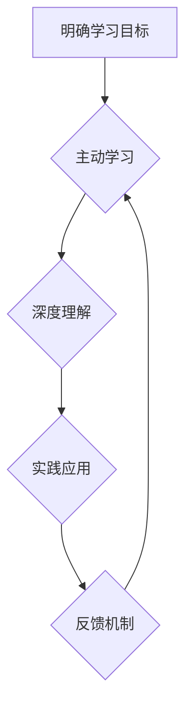

                 

## 快速学习:立于不败之地根本

> 关键词：快速学习,高效学习,知识获取,学习策略,学习方法,深度学习,认知科学

### 1. 背景介绍

在当今瞬息万变的科技时代，知识更新迭代的速度前所未有。想要立于不败之地，必须具备快速学习的能力，不断提升自身的技术水平和知识储备。然而，传统的学习方式往往效率低下，难以适应快速发展的时代需求。因此，探索高效的学习方法，掌握快速学习的技巧，成为每个IT从业者和知识工作者迫切需要解决的问题。

### 2. 核心概念与联系

快速学习的核心在于 **高效地获取、理解和应用知识**。它并非仅仅是学习更多内容，而是要 **提升学习效率，深度理解知识，并将其应用于实际问题解决**。

**高效学习的要素:**

* **目标明确:**  明确学习目标，知道自己想要学习什么，以及为什么学习。
* **主动学习:**  积极主动地参与学习过程，而不是被动地接受信息。
* **深度理解:**  不只是记住知识点，而是要理解知识背后的原理和逻辑。
* **实践应用:**  将所学知识应用于实际项目或场景中，巩固理解并提升应用能力。
* **反馈机制:**  定期回顾学习内容，并根据反馈进行调整和优化。

**学习方法与学习策略:**

* **番茄工作法:**  将学习时间划分为25分钟的间隔，每间隔后休息5分钟，提高学习效率。
* **主动回忆:**  在学习后主动回忆知识点，帮助记忆巩固。
* ** spaced repetition:**  利用间隔重复学习，提高记忆效率。
* **批判性思维:**  对学习到的知识进行批判性思考，分析其优缺点，并与已有知识进行关联。
* **知识图谱:**  构建知识图谱，将不同知识点进行关联，形成完整的知识体系。

**Mermaid 流程图:**



### 3. 核心算法原理 & 具体操作步骤

**3.1 算法原理概述**

快速学习的核心算法原理是基于 **认知科学** 和 **人工智能** 的研究成果，旨在 **优化学习过程，提高学习效率**。

**主要算法包括:**

* **深度学习算法:**  用于提取知识的隐藏模式和关系，提高知识理解深度。
* **强化学习算法:**  通过奖励机制，引导学习者朝着正确的方向学习，提高学习效率。
* **自然语言处理算法:**  用于分析和理解文本信息，提取关键知识点。

**3.2 算法步骤详解**

1. **数据收集:**  收集相关学习资料，包括文本、视频、音频等多种形式。
2. **数据预处理:**  对收集到的数据进行清洗、格式化和转换，使其适合算法处理。
3. **模型训练:**  利用深度学习、强化学习等算法，对预处理后的数据进行训练，构建学习模型。
4. **知识提取:**  利用训练好的模型，从学习资料中提取关键知识点和关系。
5. **知识表示:**  将提取的知识点以图谱、知识库等形式进行表示，方便理解和应用。
6. **个性化学习:**  根据用户的学习目标、学习风格和知识水平，个性化推荐学习内容和学习路径。

**3.3 算法优缺点**

**优点:**

* **提高学习效率:**  自动化学习过程，减少重复劳动，提高学习效率。
* **深度理解知识:**  利用深度学习算法，提取知识的隐藏模式和关系，提高知识理解深度。
* **个性化学习:**  根据用户的特点，提供个性化的学习内容和学习路径。

**缺点:**

* **数据依赖:**  算法的性能依赖于数据的质量和数量。
* **算法复杂:**  一些算法的训练和部署需要较高的技术水平。
* **伦理问题:**  数据隐私和算法偏见等伦理问题需要得到重视。

**3.4 算法应用领域**

* **教育领域:**  个性化学习、智能辅导、自动批改等。
* **企业培训:**  知识管理、技能提升、员工培训等。
* **个人学习:**  知识获取、技能学习、兴趣培养等。

### 4. 数学模型和公式 & 详细讲解 & 举例说明

**4.1 数学模型构建**

快速学习算法通常基于 **概率模型** 和 **神经网络模型**。

* **概率模型:**  用于描述知识的分布和关系，例如贝叶斯网络、隐马尔可夫模型等。
* **神经网络模型:**  模拟人脑神经网络的结构和功能，用于提取知识的隐藏模式和关系，例如卷积神经网络、循环神经网络等。

**4.2 公式推导过程**

具体的公式推导过程取决于所使用的算法和模型。例如，深度学习算法中的反向传播算法利用梯度下降法更新模型参数，其公式如下:

$$
\theta = \theta - \alpha \frac{\partial L}{\partial \theta}
$$

其中:

* $\theta$ 是模型参数
* $\alpha$ 是学习率
* $L$ 是损失函数

**4.3 案例分析与讲解**

假设我们使用深度学习算法训练一个文本分类模型，目标是将新闻文章分类为体育、财经、娱乐等类别。

* **数据:**  收集大量新闻文章，并标注其类别。
* **模型:**  使用卷积神经网络 (CNN) 作为模型架构。
* **训练:**  利用训练数据训练 CNN 模型，并通过反向传播算法更新模型参数。
* **评估:**  使用测试数据评估模型的分类准确率。

通过训练和评估，我们可以得到一个能够准确分类新闻文章的 CNN 模型。

### 5. 项目实践：代码实例和详细解释说明

**5.1 开发环境搭建**

* **操作系统:**  Linux, macOS, Windows
* **编程语言:**  Python
* **深度学习框架:**  TensorFlow, PyTorch
* **其他工具:**  Git, Jupyter Notebook

**5.2 源代码详细实现**

```python
import tensorflow as tf

# 定义模型结构
model = tf.keras.models.Sequential([
    tf.keras.layers.Embedding(input_dim=10000, output_dim=128),
    tf.keras.layers.Conv1D(filters=64, kernel_size=5, activation='relu'),
    tf.keras.layers.MaxPooling1D(pool_size=2),
    tf.keras.layers.Flatten(),
    tf.keras.layers.Dense(units=10, activation='softmax')
])

# 编译模型
model.compile(optimizer='adam',
              loss='sparse_categorical_crossentropy',
              metrics=['accuracy'])

# 训练模型
model.fit(x_train, y_train, epochs=10)

# 评估模型
loss, accuracy = model.evaluate(x_test, y_test)
print('Loss:', loss)
print('Accuracy:', accuracy)
```

**5.3 代码解读与分析**

* **模型结构:**  该代码定义了一个简单的 CNN 模型，用于文本分类任务。
* **数据预处理:**  代码中没有显示数据预处理步骤，但在实际应用中需要对文本数据进行预处理，例如词嵌入、文本长度调整等。
* **模型训练:**  代码使用 Adam 优化器和交叉熵损失函数训练模型，并设置 10 个 epochs。
* **模型评估:**  代码使用测试数据评估模型的性能，并打印损失和准确率。

**5.4 运行结果展示**

运行结果会显示模型的训练过程和最终的评估结果，例如损失值和准确率。

### 6. 实际应用场景

快速学习算法在教育、企业培训、个人学习等领域都有广泛的应用场景。

* **教育领域:**  个性化学习平台、智能辅导系统、自动批改系统等。
* **企业培训:**  知识管理系统、技能提升平台、员工培训系统等。
* **个人学习:**  在线学习平台、知识库、学习助手等。

**6.4 未来应用展望**

随着人工智能技术的不断发展，快速学习算法将更加智能化、个性化和高效化。未来，快速学习算法将应用于更广泛的领域，例如：

* **医疗领域:**  辅助医生诊断、个性化治疗方案推荐等。
* **金融领域:**  风险评估、投资决策、欺诈检测等。
* **科学研究:**  加速科研成果发现、优化实验设计等。

### 7. 工具和资源推荐

**7.1 学习资源推荐**

* **书籍:**  《深度学习》、《机器学习》、《人工智能导论》
* **在线课程:**  Coursera, edX, Udacity
* **博客和论坛:**  Towards Data Science, Machine Learning Mastery

**7.2 开发工具推荐**

* **深度学习框架:**  TensorFlow, PyTorch, Keras
* **编程语言:**  Python
* **数据处理工具:**  Pandas, NumPy

**7.3 相关论文推荐**

* **深度学习论文:**  《ImageNet Classification with Deep Convolutional Neural Networks》
* **强化学习论文:**  《Deep Reinforcement Learning》
* **自然语言处理论文:**  《Attention Is All You Need》

### 8. 总结：未来发展趋势与挑战

**8.1 研究成果总结**

快速学习算法取得了显著的成果，在知识获取、技能学习、个性化学习等方面展现出巨大的潜力。

**8.2 未来发展趋势**

* **更加智能化:**  利用更先进的算法和模型，提高学习效率和准确性。
* **更加个性化:**  根据用户的学习目标、学习风格和知识水平，提供个性化的学习内容和学习路径。
* **更加融合:**  与其他技术领域融合，例如虚拟现实、增强现实等，打造更加沉浸式的学习体验。

**8.3 面临的挑战**

* **数据质量:**  算法的性能依赖于数据的质量和数量，高质量数据的获取和处理仍然是一个挑战。
* **算法解释性:**  一些深度学习算法的决策过程难以解释，这限制了其在一些领域中的应用。
* **伦理问题:**  数据隐私、算法偏见等伦理问题需要得到重视和解决。

**8.4 研究展望**

未来，快速学习算法的研究将继续深入，探索更智能、更个性化、更融合的学习模式，为每个人提供更加高效、便捷的学习体验。

### 9. 附录：常见问题与解答

**常见问题:**

* **快速学习算法真的能提高学习效率吗?**

  是的，快速学习算法通过优化学习过程，可以显著提高学习效率。

* **快速学习算法适合所有学习者吗?**

  快速学习算法可以为大多数学习者提供帮助，但具体效果取决于用户的学习目标、学习风格和知识水平。

* **如何选择合适的快速学习算法?**

  选择合适的算法需要根据具体的学习任务和数据特点进行评估。

* **快速学习算法有哪些伦理问题?**

  快速学习算法可能存在数据隐私、算法偏见等伦理问题，需要得到重视和解决。


作者：禅与计算机程序设计艺术 / Zen and the Art of Computer Programming 
<end_of_turn>

