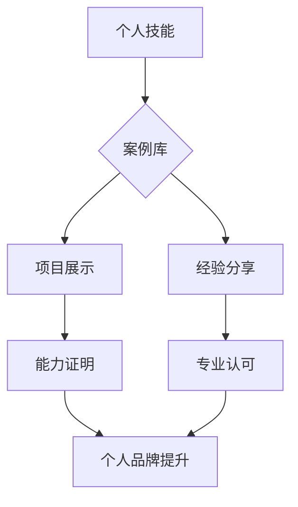

                 

## 打造个人品牌案例库：用实际成果说话

> 关键词：个人品牌、案例库、成果展示、技术博客、职业发展

### 1. 背景介绍

在当今竞争激烈的科技行业，个人品牌建设已成为技术人员职业发展的关键。一个强大的个人品牌可以帮助你脱颖而出，吸引更多机会，提升个人价值。然而，仅仅拥有丰富的技术技能并不能保证个人品牌的成功。你需要用实际成果说话，让你的能力和价值得到认可。

个人品牌案例库正是实现这一目标的有效途径。它可以作为你个人品牌的展示平台，向潜在雇主、客户或合作伙伴展示你的能力、经验和成就。通过精心策划和构建的案例库，你可以有效地提升个人品牌影响力，推动职业发展。

### 2. 核心概念与联系

#### 2.1 个人品牌

个人品牌是指个人在特定领域或行业内所建立的独特形象和声誉。它涵盖了个人技能、经验、价值观、个性特质等多方面，并通过各种渠道向外界传播。

#### 2.2 案例库

案例库是指收集和展示个人项目、作品、经验等成果的平台。它可以以博客文章、技术文档、视频演示、开源项目等多种形式呈现。

#### 2.3 联系

个人品牌案例库是个人品牌建设的重要组成部分。通过展示实际成果，案例库可以有效地证明个人能力，增强个人品牌信誉，并吸引更多关注和机会。

**Mermaid 流程图**

### 3. 核心算法原理 & 具体操作步骤

#### 3.1 算法原理概述

打造个人品牌案例库的核心算法原理在于“内容为王，形式为辅”。

* **内容为王:** 案例库的核心内容应是你的实际成果，例如项目代码、技术文档、博客文章、演讲视频等。这些内容需要真实、有价值、具有可操作性。
* **形式为辅:** 案例库的形式可以多样化，例如博客网站、GitHub仓库、技术文档平台等。选择合适的平台和形式可以更好地展示你的内容，吸引目标受众。

#### 3.2 算法步骤详解

1. **确定目标受众:** 首先要明确你的目标受众是谁，例如潜在雇主、客户或合作伙伴。了解他们的需求和兴趣，才能更好地策划和构建你的案例库。
2. **选择合适的平台:** 根据你的目标受众和内容类型，选择合适的平台。例如，如果你想展示开源项目，可以选择GitHub；如果你想分享技术博客文章，可以选择Medium或个人博客网站。
3. **收集和整理成果:** 收集你的所有项目、作品、经验等成果，并进行整理和分类。可以根据项目类型、技术领域、时间顺序等进行分类。
4. **撰写高质量内容:** 为每个项目或成果撰写详细的描述，包括项目背景、技术方案、实现过程、成果展示、经验总结等。内容要清晰、简洁、易懂，并使用专业的技术语言。
5. **优化案例库结构:** 将案例库结构化，方便用户浏览和查找。可以使用目录、标签、搜索功能等方式进行优化。
6. **持续更新和维护:** 案例库不是一蹴而就的，需要持续更新和维护。定期添加新的项目和成果，并更新已有内容，保持案例库的活跃度和时效性。

#### 3.3 算法优缺点

**优点:**

* **有效展示个人能力:** 案例库可以直观地展示你的技术能力、项目经验和解决问题的能力。
* **提升个人品牌影响力:** 通过案例库，你可以向更多人展示你的专业知识和经验，提升个人品牌知名度和影响力。
* **吸引更多机会:** 案例库可以作为你求职、合作或创业的敲门砖，吸引更多潜在雇主、客户或合作伙伴。

**缺点:**

* **需要投入时间和精力:** 打造一个高质量的案例库需要投入一定的时间和精力，包括收集、整理、撰写和维护。
* **需要持续更新:** 案例库需要持续更新和维护，才能保持其时效性和吸引力。
* **需要一定的技术基础:** 为了更好地展示你的技术能力，你需要有一定的技术基础和写作能力。

#### 3.4 算法应用领域

个人品牌案例库的应用领域非常广泛，包括：

* **软件开发:** 展示你的项目代码、技术文档、博客文章等，吸引潜在雇主或客户。
* **数据科学:** 展示你的数据分析项目、模型开发、算法研究等成果，吸引数据科学岗位的招聘。
* **人工智能:** 展示你的机器学习项目、深度学习模型、自然语言处理等成果，吸引人工智能领域的合作机会。
* **创业:** 展示你的创业项目、产品原型、市场调研等成果，吸引投资人或合作伙伴。

### 4. 数学模型和公式 & 详细讲解 & 举例说明

#### 4.1 数学模型构建

个人品牌案例库的构建可以抽象为一个数学模型，其中：

* **个人能力 (C):** 包括你的技术技能、经验、知识、创造力等。
* **案例质量 (Q):** 指你的案例内容的真实性、价值、可操作性、专业性等。
* **平台影响力 (P):** 指你选择平台的知名度、用户规模、行业影响力等。
* **个人品牌价值 (V):**  是你的个人品牌在目标受众中的认知度、信誉度、影响力等综合体现。

**数学模型:**

$$V = f(C, Q, P)$$

其中，f() 是一个复杂的非线性函数，代表个人品牌价值与个人能力、案例质量、平台影响力之间的关系。

#### 4.2 公式推导过程

由于个人品牌价值是一个多因素综合影响的结果，其公式推导过程非常复杂，需要考虑各种因素之间的相互作用和权重。

#### 4.3 案例分析与讲解

假设有两个软件开发人员，A和B，他们都拥有相同的技术技能和经验。

* A 选择了一个知名度较高的技术博客平台，并发布了高质量的项目案例和技术文章，获得了较高的阅读量和点赞数。
* B 选择了一个小众的开源项目平台，发布了几个功能简单的项目代码，但没有进行详细的文档和介绍。

根据数学模型，A 的个人品牌价值更高，因为他的案例质量和平台影响力都更高。

### 5. 项目实践：代码实例和详细解释说明

#### 5.1 开发环境搭建

为了展示如何构建个人品牌案例库，我们可以使用 GitHub 平台作为案例库的搭建平台。

* 创建一个新的 GitHub 账号。
* 创建一个新的个人仓库，用于存放你的案例库。

#### 5.2 源代码详细实现

在 GitHub 仓库中，你可以创建以下文件夹和文件：

* **docs:** 用于存放你的技术文档、博客文章等内容。
* **projects:** 用于存放你的项目代码、项目描述、运行环境等信息。
* **about:** 用于介绍你的个人信息、技能、经验等。

#### 5.3 代码解读与分析

你可以使用 Markdown 语法编写你的技术文档和博客文章，并使用 Git 版本控制系统管理你的代码和文档。

#### 5.4 运行结果展示

你可以将你的项目代码部署到云平台或本地服务器，并提供运行结果的展示。

### 6. 实际应用场景

#### 6.1 求职

在求职过程中，你可以将你的个人品牌案例库作为你的简历的一部分，向潜在雇主展示你的技术能力和项目经验。

#### 6.2 合作

如果你想寻找合作伙伴，可以将你的案例库作为你的合作平台，展示你的专业知识和经验，吸引志同道合的人。

#### 6.3 创业

如果你想创业，可以将你的案例库作为你的产品展示平台，吸引投资人或用户。

#### 6.4 未来应用展望

随着技术的不断发展，个人品牌案例库的应用场景将会更加广泛。例如，未来可以利用人工智能技术自动生成案例库，并进行个性化推荐。

### 7. 工具和资源推荐

#### 7.1 学习资源推荐

* **书籍:** 《构建个人品牌》、《打造个人品牌》、《技术博客写作指南》
* **网站:** GitHub, Medium, Dev.to, Stack Overflow
* **课程:** Udemy, Coursera, edX

#### 7.2 开发工具推荐

* **版本控制系统:** Git
* **代码编辑器:** VS Code, Atom, Sublime Text
* **博客平台:** WordPress, Medium, Ghost

#### 7.3 相关论文推荐

* **个人品牌研究:** "The Impact of Personal Branding on Career Success"
* **案例库研究:** "The Role of Case Studies in Knowledge Management"

### 8. 总结：未来发展趋势与挑战

#### 8.1 研究成果总结

打造个人品牌案例库是个人品牌建设的重要途径，可以有效地展示个人能力、提升个人品牌影响力，并吸引更多机会。

#### 8.2 未来发展趋势

未来，个人品牌案例库将会更加智能化、个性化和互动化。

* **智能化:** 利用人工智能技术自动生成案例库，并进行个性化推荐。
* **个性化:** 根据用户的兴趣和需求，定制个性化的案例库。
* **互动化:** 鼓励用户与案例库进行互动，例如评论、点赞、分享等。

#### 8.3 面临的挑战

* **内容质量:** 确保案例库内容的真实性、价值和可操作性。
* **平台选择:** 选择合适的平台，才能更好地展示你的内容。
* **持续更新:** 需要持续更新和维护案例库，才能保持其时效性和吸引力。

#### 8.4 研究展望

未来，我们可以进一步研究个人品牌案例库的构建方法、评估指标和应用场景，并探索人工智能技术在个人品牌案例库中的应用。

### 9. 附录：常见问题与解答

#### 9.1 如何选择合适的案例库平台？

选择合适的案例库平台需要根据你的目标受众、内容类型和个人需求进行考虑。

#### 9.2 如何撰写高质量的案例库内容？

高质量的案例库内容需要真实、有价值、具有可操作性，并使用专业的技术语言。

#### 9.3 如何持续更新和维护案例库？

需要定期添加新的项目和成果，并更新已有内容，保持案例库的活跃度和时效性。

作者：禅与计算机程序设计艺术 / Zen and the Art of Computer Programming 
<end_of_turn>

