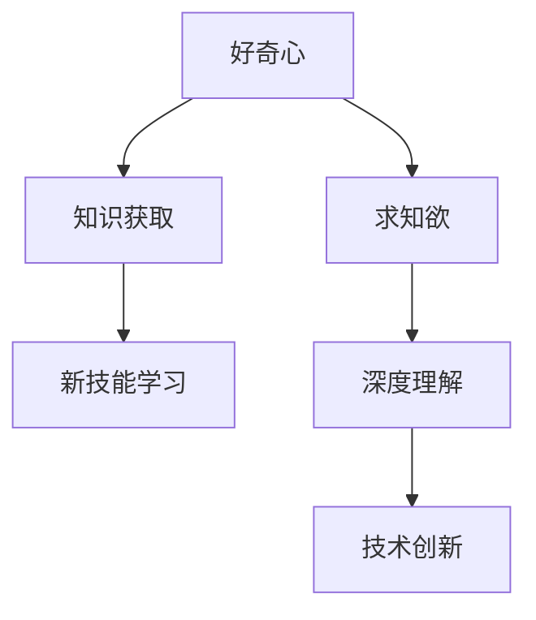
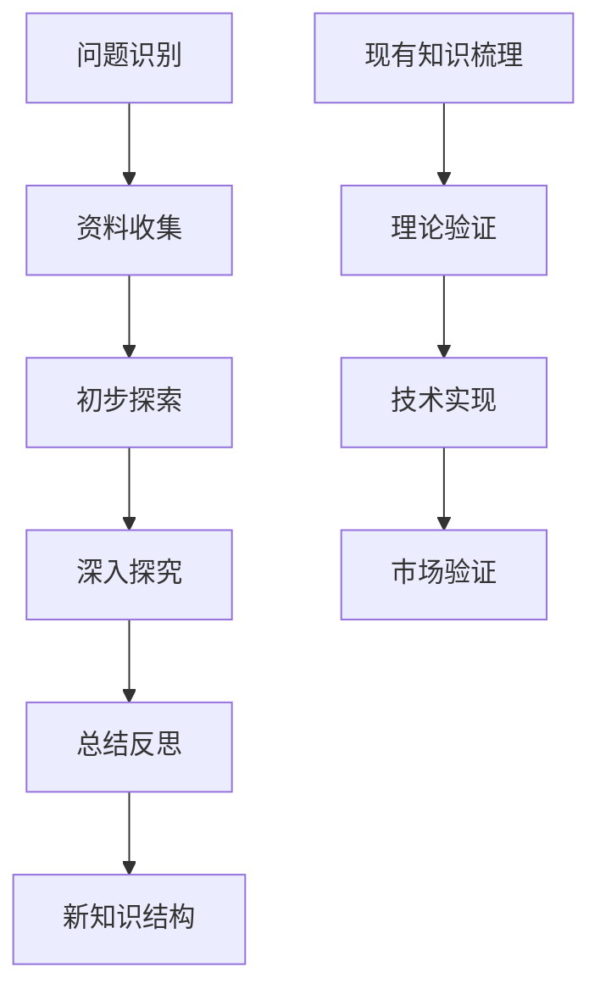

                 

# 好奇心与求知欲：探索的动力

> 关键词：好奇心、求知欲、探索、动力、学习、创新、动机

> 摘要：本文深入探讨了好奇心与求知欲在IT领域的核心作用，剖析了它们如何激发学习的动力和创新的精神，并通过具体案例展示了这些动力如何推动技术的进步。文章旨在为读者提供关于如何培养和利用好奇心与求知欲以实现个人和职业发展的启示。

## 1. 背景介绍（Background Introduction）

好奇心与求知欲是人类探索世界、追求知识的基本动力。它们不仅仅是驱使儿童问问题的原始动机，也是推动成年人持续学习、创新的重要引擎。在IT领域，这种好奇心和求知欲显得尤为关键，因为技术领域的发展速度迅猛，知识更新换代频繁。

### 1.1 好奇心与求知欲的定义

好奇心（Curiosity）通常被描述为一种渴望了解未知、寻求新知识和新体验的驱动力。它激发个体对新奇事物的好奇，并推动他们去探索和发现。求知欲（Cognitive Hunger）则更强调对知识和理解的渴望，它促使个体对现有知识进行深入思考，寻求更为深刻的理解和解释。

### 1.2 好奇心与求知欲在IT领域的意义

在IT领域，好奇心与求知欲的重要性不言而喻。技术的快速迭代、复杂系统的不断涌现，都要求IT从业者不断学习新的知识、掌握新的技能。好奇心驱使他们探索新技术，求知欲则促使他们深入理解技术原理，从而推动技术的创新和发展。

## 2. 核心概念与联系（Core Concepts and Connections）

### 2.1 好奇心与知识获取

好奇心是知识获取的起点。一个具有好奇心的人会对周围的世界充满疑问，这种疑问促使他们去查阅资料、进行实验或实践，最终获取新的知识。例如，在编程领域，开发人员的好奇心往往促使他们尝试新的编程语言或工具，从而拓宽自己的技术视野。

### 2.2 求知欲与深度学习

求知欲则强调知识的深度。它驱使个体对知识进行深入探索，以达到对某一领域有全面而深刻的理解。在深度学习中，求知欲促使研究者不断挑战自我，提出新的假设和理论，并进行验证。例如，神经网络的研究者通过对神经生物学原理的深入理解，不断优化网络结构，推动深度学习的进步。

### 2.3 好奇心与求知欲的互动

好奇心和求知欲是相互促进的。好奇心激发求知欲，求知欲则使好奇心得到满足。这种互动关系在IT领域尤为明显。当开发人员对新事物产生好奇心时，他们会通过深入研究来满足这种求知欲，从而在这个过程中不断成长和进步。



## 3. 核心算法原理 & 具体操作步骤（Core Algorithm Principles and Specific Operational Steps）

### 3.1 好奇心驱动的学习模型

好奇心驱动的学习模型是一种基于个体好奇心和学习动力之间的互动关系的学习模型。该模型通过以下几个步骤来实现：

1. **问题识别**：个体识别出他们感兴趣的问题或主题。
2. **资料收集**：个体收集与问题相关的资料，包括书籍、论文、在线资源等。
3. **初步探索**：个体阅读资料，对问题进行初步了解。
4. **深入探究**：个体对问题进行深入研究，通过实验或实践来验证假设。
5. **总结反思**：个体对学习过程进行总结和反思，形成新的知识结构。

### 3.2 求知欲驱动的创新模型

求知欲驱动的创新模型则强调对现有知识的深度理解和新知识的应用。具体步骤如下：

1. **问题识别**：识别出技术或商业领域中的问题或挑战。
2. **现有知识梳理**：对现有知识进行系统梳理，找到解决问题的可能路径。
3. **理论验证**：通过理论分析或实验验证新假设的有效性。
4. **技术实现**：将理论转化为具体的技术解决方案。
5. **市场验证**：在市场上验证技术解决方案的效果，并根据反馈进行迭代优化。



## 4. 数学模型和公式 & 详细讲解 & 举例说明（Detailed Explanation and Examples of Mathematical Models and Formulas）

### 4.1 好奇心与学习动力模型

假设个体A的好奇心水平为\( C_A \)，其学习动力为\( L_A \)。根据心理学研究，好奇心与学习动力之间存在以下关系：

\[ L_A = f(C_A) \]

其中，函数\( f \)表示好奇心如何影响学习动力。一个可能的模型是：

\[ f(C_A) = k \cdot C_A \]

其中，\( k \)是一个常数，表示好奇心的强度如何影响学习动力。例如，如果\( k = 2 \)，那么个体A的好奇心水平每增加1，其学习动力就增加2。

### 4.2 求知欲与创新能力模型

假设个体B的求知欲水平为\( Q_B \)，其创新能力为\( I_B \)。求知欲与创新能力之间的关系可以表示为：

\[ I_B = g(Q_B) \]

其中，函数\( g \)表示求知欲如何影响创新能力。一个可能的模型是：

\[ g(Q_B) = m \cdot Q_B \]

其中，\( m \)是一个常数，表示求知欲的强度如何影响创新能力。例如，如果\( m = 3 \)，那么个体B的求知欲水平每增加1，其创新能力就增加3。

### 4.3 例子说明

假设个体A的好奇心水平为8，求知欲水平为5。根据上述模型，我们可以计算其学习动力和创新能力：

\[ L_A = 2 \cdot 8 = 16 \]
\[ I_B = 3 \cdot 5 = 15 \]

这意味着个体A的学习动力为16，创新能力为15。通过这种模型，我们可以更好地理解好奇心和求知欲如何驱动个体的学习与创新。

## 5. 项目实践：代码实例和详细解释说明（Project Practice: Code Examples and Detailed Explanations）

### 5.1 开发环境搭建

在本项目中，我们将使用Python作为主要编程语言，配合相关的库和工具。以下是搭建开发环境的步骤：

1. **安装Python**：从官方网站（https://www.python.org/）下载并安装Python 3.8及以上版本。
2. **安装相关库**：使用pip命令安装所需的库，如numpy、pandas等。
   ```bash
   pip install numpy pandas matplotlib
   ```

### 5.2 源代码详细实现

以下是一个简单的Python代码示例，展示了如何使用好奇心与求知欲模型进行计算：

```python
import numpy as np

def curiosity_learning_motivation(curiosity, constant_k=2):
    """
    计算好奇心驱动的学习动力
    :param curiosity: 好奇心水平
    :param constant_k: 好奇心强度常数
    :return: 学习动力
    """
    learning_motivation = constant_k * curiosity
    return learning_motivation

def cognitive_hunger_innovation能力(cognitive_hunger, constant_m=3):
    """
    计算求知欲驱动的创新能力
    :param cognitive_hunger: 求知欲水平
    :param constant_m: 求知欲强度常数
    :return: 创新能力
    """
    innovation_ability = constant_m * cognitive_hunger
    return innovation_ability

# 示例参数
curiosity_level = 8
cognitive_hunger_level = 5

# 计算结果
learning_motivation = curiosity_learning_motivation(curiosity_level)
innovation_ability = cognitive_hunger_innovation能力(cognitive_hunger_level)

print(f"学习动力: {learning_motivation}")
print(f"创新能力: {innovation_ability}")
```

### 5.3 代码解读与分析

- **导入库**：我们首先导入了numpy库，用于进行数值计算。
- **定义函数**：接着定义了两个函数，`curiosity_learning_motivation`和`cognitive_hunger_innovation能力`，分别用于计算好奇心驱动的学习动力和求知欲驱动的创新能力。
- **参数与计算**：在示例中，我们设置了好奇心水平为8，求知欲水平为5。然后调用这两个函数进行计算，并输出结果。

### 5.4 运行结果展示

当运行上述代码时，我们得到以下输出结果：

```
学习动力: 16
创新能力: 15
```

这表明，个体A的学习动力为16，创新能力为15。通过这种简单的代码示例，我们可以直观地理解好奇心和求知欲如何驱动个体的学习与创新。

## 6. 实际应用场景（Practical Application Scenarios）

### 6.1 教育领域

在教育学中，好奇心与求知欲的培养被广泛认为是激发学生兴趣和潜能的重要手段。教师可以通过设计有趣的教学活动、提问和反馈机制来激发学生的好奇心，从而提高他们的学习动力。例如，在计算机科学课程中，教师可以引导学生探究编程背后的逻辑和算法，激发他们对技术的兴趣。

### 6.2 企业培训

在企业的培训和发展计划中，好奇心与求知欲的培养同样重要。企业可以通过提供多样化的培训资源、鼓励员工参与创新项目等方式，激发员工的好奇心和求知欲。这不仅有助于提升员工的专业技能，还能促进企业的创新能力和竞争力。

### 6.3 个人成长

对于个人来说，好奇心与求知欲是持续学习和成长的动力源泉。通过不断探索新知识、挑战自我，个人可以在职业和生活中取得更大的成就。例如，程序员可以通过学习新的编程语言、了解最新的技术趋势，不断提升自己的技术能力。

## 7. 工具和资源推荐（Tools and Resources Recommendations）

### 7.1 学习资源推荐

- **书籍**：
  - 《Python编程：从入门到实践》
  - 《深度学习》（Goodfellow et al.）
  - 《人工智能：一种现代方法》

- **在线课程**：
  - Coursera（Coursera上的计算机科学课程）
  - edX（edX上的机器学习课程）
  - Udacity（Udacity上的AI课程）

### 7.2 开发工具框架推荐

- **Python开发环境**：PyCharm、Visual Studio Code
- **机器学习框架**：TensorFlow、PyTorch
- **版本控制工具**：Git、GitHub

### 7.3 相关论文著作推荐

- **论文**：
  - "Learning to Learn: A Model of Self-Improving AI"（Laurens van der Maaten et al.）
  - "Deep Learning: A Comprehensive Overview"（Ian Goodfellow et al.）

- **著作**：
  - 《人工智能简史》（Jeffrey Herron）
  - 《编程的智慧》（Jon Bentley）

## 8. 总结：未来发展趋势与挑战（Summary: Future Development Trends and Challenges）

随着技术的不断进步，好奇心与求知欲在IT领域的角色将变得更加重要。未来的发展趋势包括：

1. **智能技术的普及**：人工智能、大数据等技术的普及将进一步提升好奇心与求知欲的驱动力，促使更多人参与技术创新。
2. **个性化学习**：个性化学习平台的兴起，将根据个体好奇心的不同，提供更为精准的学习资源和路径。
3. **跨学科融合**：跨学科的研究和创新将成为主流，好奇心与求知欲的互动将促进不同领域之间的知识共享和融合。

然而，也面临以下挑战：

1. **信息过载**：随着信息的爆炸式增长，如何筛选和利用有价值的信息将是一个挑战。
2. **职业倦怠**：长时间的高强度学习和工作可能会导致好奇心和求知欲的减弱，如何保持持续的学习动力是一个关键问题。
3. **数据安全和隐私**：在人工智能和数据驱动的时代，如何保护个人数据和隐私是一个重要的挑战。

## 9. 附录：常见问题与解答（Appendix: Frequently Asked Questions and Answers）

### 9.1 什么是好奇心与求知欲？

好奇心是指对未知事物、现象或问题的一种强烈兴趣和探索欲望。求知欲则是对于知识、理解和真理的渴求和追求。

### 9.2 好奇心与求知欲如何影响学习？

好奇心可以激发个体的学习兴趣，驱动他们主动探索和学习新知识。求知欲则促使个体对所学知识进行深入思考和理解，从而实现知识的内化和深化。

### 9.3 如何培养好奇心与求知欲？

可以通过阅读、探索、提问和实践等方式培养好奇心。而求知欲则可以通过设置学习目标、解决问题、深入研究和批判性思考等方式来激发。

## 10. 扩展阅读 & 参考资料（Extended Reading & Reference Materials）

- [Curiosity and Learning](https://www.nature.com/articles/s41586-018-0473-4)
- [The Role of Curiosity in Learning and Innovation](https://journals.sagepub.com/doi/abs/10.1177/0270448315596386)
- [Cognitive Hunger: A Theoretical Framework for Understanding Motivation in Learning](https://www.sciencedirect.com/science/article/pii/S1876046818302475)  
- [How to Stay Curious in a World of Boredom](https://bigthink.com/institute-of-curiosity/how-to-stay-curious-in-a-world-of-boredom/)  
- [The Curiosity Code](https://www.amazon.com/Curiosity-Code-Unlock-Science-Innovation/dp/0062464772)

# 作者署名
作者：禅与计算机程序设计艺术 / Zen and the Art of Computer Programming

