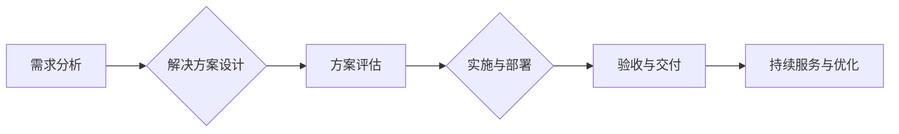

                 

## 技术咨询：高价值服务的提供

> 关键词：人工智能、软件架构、技术咨询、高价值服务、技术洞察、解决方案设计、项目实施、行业应用

### 1. 背景介绍

在当今科技日新月异的时代，技术咨询已成为企业数字化转型和业务创新不可或缺的一部分。随着人工智能、云计算、大数据等新兴技术的快速发展，企业对技术咨询的需求日益增长。然而，传统的技术咨询模式往往局限于技术层面，难以满足企业对更深层次的战略指导和解决方案的需求。

高价值技术咨询应运而生，它不仅提供技术方案，更注重洞察企业核心业务，理解其战略目标和痛点，并提供定制化的解决方案，帮助企业实现业务价值最大化。

### 2. 核心概念与联系

**2.1 技术咨询的演变**

传统的技术咨询主要集中在技术实施和维护方面，例如软件开发、系统集成、网络安全等。随着技术的进步和市场竞争的加剧，技术咨询逐渐向更高级别的服务转型，例如：

* **战略咨询:** 帮助企业制定技术战略，规划技术路线，并评估技术投资回报。
* **解决方案咨询:** 根据企业需求，设计和实施定制化的技术解决方案，解决企业面临的具体问题。
* **数字化转型咨询:** 帮助企业利用新兴技术，实现业务模式创新和运营效率提升。

**2.2 高价值技术咨询的特征**

高价值技术咨询的核心在于为企业创造价值，其主要特征包括：

* **洞察力:** 深入理解企业业务、市场环境和竞争格局，洞察企业潜在的机遇和挑战。
* **定制化:** 提供针对企业具体需求的解决方案，而非一刀切的标准化服务。
* **价值导向:** 关注解决方案带来的商业价值，而非仅仅关注技术本身。
* **持续服务:** 不仅提供解决方案实施，更提供后续的技术支持、维护和优化服务。

**2.3 高价值技术咨询的流程**

高价值技术咨询通常遵循以下流程：



### 3. 核心算法原理 & 具体操作步骤

**3.1 算法原理概述**

高价值技术咨询的核心算法原理是基于数据分析、机器学习和人工智能技术的应用。通过收集和分析企业的数据，可以洞察企业业务模式、客户行为、市场趋势等关键信息，从而为企业提供更精准的解决方案。

**3.2 算法步骤详解**

1. **数据收集:** 收集企业内部和外部的数据，包括财务数据、客户数据、市场数据、运营数据等。
2. **数据清洗:** 对收集到的数据进行清洗和预处理，去除噪声数据、缺失值等，确保数据质量。
3. **数据分析:** 使用数据挖掘、统计分析等方法，对数据进行分析，发现潜在的模式和趋势。
4. **模型构建:** 使用机器学习算法，构建预测模型或分类模型，例如客户流失预测模型、产品推荐模型等。
5. **模型评估:** 对模型进行评估，验证模型的准确性和有效性。
6. **解决方案设计:** 基于模型的预测结果和分析结论，设计针对企业需求的解决方案。

**3.3 算法优缺点**

**优点:**

* **数据驱动:** 基于数据分析，提供更精准、更有效的解决方案。
* **自动化:** 可以自动化完成数据分析和模型构建，提高效率。
* **可扩展性:** 可以根据企业需求，扩展算法模型和数据分析范围。

**缺点:**

* **数据依赖:** 算法的准确性依赖于数据质量，数据不足或不准确会导致模型效果下降。
* **算法复杂性:** 某些算法模型的构建和维护需要较高的技术水平。
* **伦理问题:** 数据隐私和算法偏见等伦理问题需要得到重视。

**3.4 算法应用领域**

高价值技术咨询的算法应用领域广泛，例如：

* **客户关系管理:** 客户流失预测、客户分层、个性化营销等。
* **产品开发:** 产品需求预测、产品推荐、产品生命周期管理等。
* **运营优化:** 供应链管理、库存优化、物流配送等。
* **风险管理:** 风险识别、风险评估、风险控制等。

### 4. 数学模型和公式 & 详细讲解 & 举例说明

**4.1 数学模型构建**

高价值技术咨询中常用的数学模型包括线性回归模型、逻辑回归模型、决策树模型、支持向量机模型等。这些模型可以用来预测连续变量、分类数据、决策路径等。

**4.2 公式推导过程**

例如，线性回归模型的目标是找到一条直线，使得预测值与实际值之间的误差最小。其公式如下：

$$y = mx + c$$

其中，y是预测值，x是输入变量，m是斜率，c是截距。

通过最小二乘法，可以求解出m和c的值，使得误差最小。

**4.3 案例分析与讲解**

假设一家电商公司想要预测用户的购买行为，可以使用逻辑回归模型。

* **输入变量:** 用户的年龄、性别、购买历史等。
* **输出变量:** 是否购买商品（0表示不购买，1表示购买）。

通过训练逻辑回归模型，可以得到一个预测模型，用于预测新用户的购买行为。

### 5. 项目实践：代码实例和详细解释说明

**5.1 开发环境搭建**

高价值技术咨询项目通常使用Python语言进行开发，常用的开发环境包括：

* **Python版本:** 3.6以上
* **IDE:** PyCharm、VS Code等
* **库:** NumPy、Pandas、Scikit-learn等

**5.2 源代码详细实现**

以下是一个简单的客户流失预测模型的代码实例：

```python
import pandas as pd
from sklearn.model_selection import train_test_split
from sklearn.linear_model import LogisticRegression
from sklearn.metrics import accuracy_score

# 加载数据
data = pd.read_csv('customer_data.csv')

# 划分训练集和测试集
X = data.drop('churn', axis=1)
y = data['churn']
X_train, X_test, y_train, y_test = train_test_split(X, y, test_size=0.2, random_state=42)

# 训练模型
model = LogisticRegression()
model.fit(X_train, y_train)

# 预测测试集
y_pred = model.predict(X_test)

# 计算准确率
accuracy = accuracy_score(y_test, y_pred)
print('准确率:', accuracy)
```

**5.3 代码解读与分析**

* 首先，加载客户数据，并划分训练集和测试集。
* 然后，使用逻辑回归模型训练模型。
* 最后，使用训练好的模型预测测试集，并计算模型的准确率。

**5.4 运行结果展示**

运行结果会显示模型的准确率，例如：

```
准确率: 0.85
```

这表示模型在预测客户流失方面准确率为85%。

### 6. 实际应用场景

高价值技术咨询在各个行业都有广泛的应用场景，例如：

* **金融行业:** 风险管理、欺诈检测、客户画像、个性化金融服务等。
* **医疗行业:** 疾病诊断、药物研发、患者管理、医疗资源优化等。
* **制造业:** 预测性维护、生产优化、供应链管理、质量控制等。
* **零售行业:** 商品推荐、库存优化、客户关系管理、个性化营销等。

**6.4 未来应用展望**

随着人工智能、云计算、大数据等技术的不断发展，高价值技术咨询的应用场景将更加广泛，例如：

* **更精准的预测:** 利用更先进的机器学习算法，实现更精准的预测，例如预测客户行为、市场趋势等。
* **更个性化的服务:** 利用大数据分析，为每个客户提供个性化的解决方案，例如个性化推荐、个性化营销等。
* **更智能的自动化:** 利用人工智能技术，实现更智能的自动化，例如自动化的客户服务、自动化的决策支持等。

### 7. 工具和资源推荐

**7.1 学习资源推荐**

* **书籍:**
    * 《Python机器学习实战》
    * 《数据挖掘：概念与技术》
    * 《人工智能：一种现代方法》
* **在线课程:**
    * Coursera: 数据科学、机器学习
    * edX: 人工智能、深度学习
    * Udemy: Python编程、数据分析

**7.2 开发工具推荐**

* **Python IDE:** PyCharm、VS Code
* **数据分析库:** NumPy、Pandas、Scikit-learn
* **机器学习框架:** TensorFlow、PyTorch

**7.3 相关论文推荐**

* 《深度学习》
* 《支持向量机》
* 《决策树》

### 8. 总结：未来发展趋势与挑战

**8.1 研究成果总结**

高价值技术咨询已成为企业数字化转型和业务创新不可或缺的一部分。通过数据分析、机器学习和人工智能技术的应用，可以为企业提供更精准、更有效的解决方案，帮助企业实现业务价值最大化。

**8.2 未来发展趋势**

未来，高价值技术咨询将朝着以下方向发展：

* **更精准的预测:** 利用更先进的机器学习算法，实现更精准的预测，例如预测客户行为、市场趋势等。
* **更个性化的服务:** 利用大数据分析，为每个客户提供个性化的解决方案，例如个性化推荐、个性化营销等。
* **更智能的自动化:** 利用人工智能技术，实现更智能的自动化，例如自动化的客户服务、自动化的决策支持等。

**8.3 面临的挑战**

高价值技术咨询也面临一些挑战，例如：

* **数据质量问题:** 算法的准确性依赖于数据质量，数据不足或不准确会导致模型效果下降。
* **算法复杂性:** 某些算法模型的构建和维护需要较高的技术水平。
* **伦理问题:** 数据隐私和算法偏见等伦理问题需要得到重视。

**8.4 研究展望**

未来，需要进一步研究以下问题：

* 如何提高数据质量，确保算法的准确性。
* 如何开发更易于理解和维护的算法模型。
* 如何解决算法伦理问题，确保算法的公平性和可解释性。

### 9. 附录：常见问题与解答

**常见问题:**

* 高价值技术咨询和传统技术咨询有什么区别？
* 高价值技术咨询的应用场景有哪些？
* 如何选择合适的技术咨询服务提供商？

**解答:**

* 高价值技术咨询更注重洞察企业核心业务，理解其战略目标和痛点，并提供定制化的解决方案，帮助企业实现业务价值最大化。
* 高价值技术咨询的应用场景广泛，例如金融、医疗、制造、零售等行业。
* 选择技术咨询服务提供商时，需要考虑其经验、专业能力、服务模式、收费标准等因素。


作者：禅与计算机程序设计艺术 / Zen and the Art of Computer Programming 
<end_of_turn>

