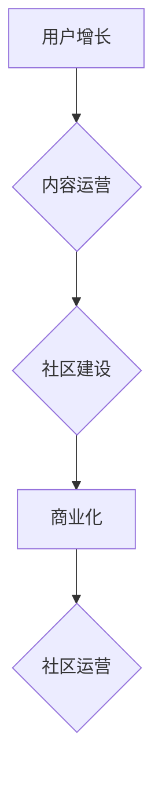

                 

## 技术社区运营：从管理到盈利模式

> 关键词：技术社区、社区运营、社区管理、盈利模式、用户增长、内容运营、商业化

### 1. 背景介绍

在当今数字时代，技术社区已成为科技创新和知识共享的重要平台。从开源软件开发到人工智能研究，从游戏玩家到数据科学家，技术社区为人们提供了一个交流、学习和合作的空间。然而，仅仅建立一个技术社区还不够，如何有效运营和管理社区，使其成为一个活跃、有价值的平台，并最终实现盈利，则是摆在社区运营者面前的重大挑战。

随着互联网的发展和移动互联网的普及，技术社区的规模和影响力不断扩大。越来越多的企业和组织意识到技术社区的价值，纷纷开始建立自己的社区。但如何运营一个成功的技术社区，使其能够吸引和留住用户，并最终实现盈利，仍然是一个需要深入探讨的问题。

### 2. 核心概念与联系

**2.1 技术社区运营的核心概念**

技术社区运营的核心概念包括：

* **用户增长:** 吸引和留住用户是社区运营的首要任务。
* **内容运营:** 提供高质量、有价值的内容是社区活跃的关键。
* **社区建设:** 营造一个友好的、包容的社区氛围，鼓励用户参与和互动。
* **商业化:** 探索可持续的盈利模式，确保社区的长期发展。

**2.2 技术社区运营的架构**

技术社区运营是一个复杂的过程，涉及多个环节和要素。以下是一个简单的技术社区运营架构图：



**2.3 核心概念的联系**

用户增长、内容运营、社区建设和商业化是技术社区运营的四个核心概念，它们相互关联，共同影响着社区的整体发展。

* 用户增长为社区提供基础，内容运营吸引和留住用户，社区建设营造良好的互动氛围，商业化则为社区提供可持续发展动力。

* 只有四个核心概念相互协同，才能构建一个健康、活跃、有价值的技术社区。

### 3. 核心算法原理 & 具体操作步骤

**3.1 算法原理概述**

在技术社区运营中，算法可以用于用户增长、内容推荐、社区管理等多个方面。例如，推荐算法可以根据用户的兴趣和行为推荐相关内容，提高用户粘性；社区管理算法可以识别和过滤恶意内容，维护社区秩序。

**3.2 算法步骤详解**

以下是一个简单的用户推荐算法步骤详解：

1. **数据收集:** 收集用户的行为数据，例如浏览历史、点赞记录、评论内容等。
2. **特征提取:** 从用户行为数据中提取特征，例如用户喜欢的主题、关注的用户、浏览过的页面等。
3. **模型训练:** 使用机器学习算法训练推荐模型，例如协同过滤算法、内容基准算法等。
4. **推荐生成:** 根据用户的特征和模型预测，生成个性化的内容推荐。
5. **效果评估:** 评估推荐算法的准确性和有效性，并不断优化模型参数。

**3.3 算法优缺点**

推荐算法的优点包括：

* **个性化:** 可以根据用户的兴趣和需求提供个性化的内容推荐。
* **效率:** 可以自动生成大量推荐，提高效率。
* **可扩展性:** 可以根据数据量的增加灵活调整模型参数。

推荐算法的缺点包括：

* **数据依赖:** 需要大量的数据进行训练，否则效果不佳。
* **冷启动问题:** 对新用户和新内容的推荐效果较差。
* **过滤泡:** 可能导致用户只看到自己感兴趣的内容，缺乏多样性。

**3.4 算法应用领域**

推荐算法广泛应用于技术社区运营中，例如：

* **内容推荐:** 推荐用户感兴趣的文章、博客、视频等。
* **用户匹配:** 将用户与具有共同兴趣的其他人匹配，促进交流和合作。
* **话题推荐:** 推荐用户参与的热门话题和讨论。

### 4. 数学模型和公式 & 详细讲解 & 举例说明

**4.1 数学模型构建**

在技术社区运营中，可以使用数学模型来描述用户行为、内容传播和社区发展等现象。例如，可以使用巴贝洛夫的条件反射理论来解释用户对特定内容的兴趣和关注。

**4.2 公式推导过程**

巴贝洛夫的条件反射理论可以用以下公式来表示：

$$
U(A) + CS \rightarrow UCR
$$

其中：

* $U(A)$ 表示无条件刺激，例如食物。
* $CS$ 表示条件刺激，例如铃声。
* $UCR$ 表示无条件反应，例如唾液分泌。

当条件刺激和无条件刺激多次配对出现时，条件刺激本身就会引起无条件反应。

**4.3 案例分析与讲解**

在技术社区中，我们可以将用户对特定内容的兴趣视为无条件反应，而社区平台的推荐算法可以视为条件刺激。当用户多次通过推荐算法获得感兴趣的内容时，他们就会对该算法的推荐产生信任，并更倾向于点击和阅读推荐的内容。

### 5. 项目实践：代码实例和详细解释说明

**5.1 开发环境搭建**

为了实现技术社区运营的项目实践，我们需要搭建一个开发环境。常用的开发环境包括：

* **操作系统:** Linux、macOS、Windows
* **编程语言:** Python、Java、JavaScript
* **数据库:** MySQL、PostgreSQL、MongoDB
* **框架:** Django、Flask、Node.js

**5.2 源代码详细实现**

以下是一个简单的技术社区用户注册功能的源代码示例，使用 Python 和 Flask 框架实现：

```python
from flask import Flask, render_template, request, redirect, url_for

app = Flask(__name__)

# 数据库连接

@app.route('/register', methods=['GET', 'POST'])
def register():
    if request.method == 'POST':
        username = request.form['username']
        password = request.form['password']
        # 处理用户注册逻辑，例如验证用户名和密码，插入数据库
        return redirect(url_for('login'))
    else:
        return render_template('register.html')

if __name__ == '__main__':
    app.run(debug=True)
```

**5.3 代码解读与分析**

这段代码定义了一个简单的用户注册功能。当用户访问 `/register` 路由时，如果使用 POST 方法提交表单，则会处理用户注册逻辑，例如验证用户名和密码，并插入数据库。否则，会渲染 `register.html` 模板页面，供用户填写注册信息。

**5.4 运行结果展示**

运行这段代码后，用户可以访问 `/register` 路由，填写用户名和密码进行注册。

### 6. 实际应用场景

**6.1 技术社区运营的实际应用场景**

技术社区运营的实际应用场景非常广泛，例如：

* **开源软件社区:** 帮助开源软件项目吸引贡献者、解决问题、推广项目。
* **企业内部社区:** 促进员工之间的交流和协作，分享知识和经验。
* **行业论坛:** 汇聚行业专家和从业者，促进行业交流和发展。

**6.2 案例分析**

* **Stack Overflow:** 一个全球最大的开源软件开发社区，提供技术问答、代码示例和学习资源。
* **GitHub:** 一个全球最大的代码托管平台，也是一个活跃的技术社区，开发者可以分享代码、参与项目和交流经验。

**6.3 未来应用展望**

随着人工智能、大数据和云计算技术的不断发展，技术社区运营将迎来更多新的应用场景和发展机遇。例如：

* **个性化学习:** 基于用户的学习兴趣和需求，提供个性化的学习路径和内容推荐。
* **智能化社区管理:** 使用人工智能技术自动识别和过滤恶意内容，维护社区秩序。
* **虚拟现实技术:** 利用虚拟现实技术构建沉浸式的社区体验，促进用户之间的互动和交流。

### 7. 工具和资源推荐

**7.1 学习资源推荐**

* **书籍:** 《社区运营实战》、《用户增长黑客》、《内容运营指南》
* **网站:** 社区运营网、社区运营学院、产品经理大学
* **课程:** Udemy、Coursera、Udacity

**7.2 开发工具推荐**

* **社区平台:** Discourse、NodeBB、Flarum
* **内容管理系统:** WordPress、Drupal、Ghost
* **数据库:** MySQL、PostgreSQL、MongoDB

**7.3 相关论文推荐**

* **社区网络分析:** "Community Structure in Social Networks"
* **内容推荐算法:** "Collaborative Filtering for Recommender Systems"
* **用户增长模型:** "The Lean Startup"

### 8. 总结：未来发展趋势与挑战

**8.1 研究成果总结**

技术社区运营是一个不断发展和演变的领域。近年来，随着互联网技术的进步和用户需求的变化，技术社区运营取得了显著的成果，例如：

* **用户增长:** 社区运营者通过各种手段吸引和留住用户，社区规模不断扩大。
* **内容运营:** 社区运营者提供高质量、有价值的内容，提高用户粘性。
* **商业化:** 社区运营者探索可持续的盈利模式，确保社区的长期发展。

**8.2 未来发展趋势**

未来，技术社区运营将朝着以下几个方向发展：

* **更个性化:** 基于用户的兴趣和需求，提供更个性化的内容推荐和社区体验。
* **更智能化:** 使用人工智能技术自动管理社区，提高运营效率。
* **更融合化:** 与其他平台和服务融合，提供更丰富的功能和体验。

**8.3 面临的挑战**

技术社区运营也面临着一些挑战，例如：

* **用户增长:** 如何吸引和留住用户，是社区运营的首要任务。
* **内容运营:** 如何提供高质量、有价值的内容，是社区活跃的关键。
* **商业化:** 如何探索可持续的盈利模式，是社区长期发展的保障。

**8.4 研究展望**

未来，我们需要继续深入研究技术社区运营的各个方面，例如：

* **用户行为分析:** 更好地理解用户的行为模式，提供更精准的个性化服务。
* **内容推荐算法:** 开发更先进的推荐算法，提高推荐的准确性和有效性。
* **社区治理机制:** 建立更完善的社区治理机制，维护社区秩序和健康发展。


### 9. 附录：常见问题与解答

**9.1 如何吸引用户加入技术社区？**

* 提供高质量、有价值的内容
* 建立活跃的社区氛围
* 举办线下活动
* 与其他平台和服务合作

**9.2 如何留住用户？**

* 提供个性化的内容推荐
* 建立用户之间的互动机制
* 营造友好的社区氛围
* 及时解决用户问题

**9.3 如何实现技术社区的盈利？**

* 广告收入
* 会员订阅
* 付费服务
* 知识付费

**9.4 如何管理技术社区？**

* 建立社区规则和规范
* 识别和过滤恶意内容
* 维护社区秩序
* 鼓励用户参与和贡献

**9.5 如何评估技术社区的运营效果？**

* 用户增长
* 内容活跃度
* 社区参与度
* 盈利能力


作者：禅与计算机程序设计艺术 / Zen and the Art of Computer Programming 
<end_of_turn>

