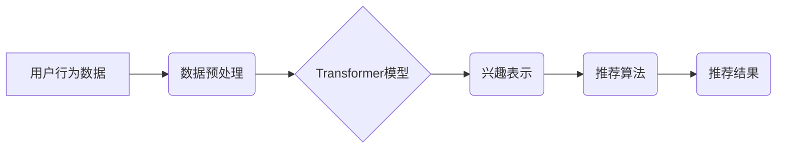

                 

## 推荐系统中AI大模型的长期用户兴趣建模

> 关键词：推荐系统、AI大模型、长期用户兴趣建模、Transformer、用户行为分析、个性化推荐

## 1. 背景介绍

推荐系统作为互联网时代的重要组成部分，旨在根据用户的历史行为、偏好和上下文信息，预测用户对潜在项目的兴趣，并提供个性化的推荐结果。传统的推荐系统主要依赖于协同过滤、内容过滤等方法，但这些方法在捕捉用户长期兴趣变化、处理稀疏数据和应对冷启动问题方面存在局限性。

近年来，随着深度学习技术的快速发展，基于AI大模型的推荐系统逐渐成为研究热点。AI大模型，例如Transformer，凭借其强大的语义理解和序列建模能力，能够更好地捕捉用户长期兴趣的演变趋势，并生成更精准、更个性化的推荐结果。

## 2. 核心概念与联系

### 2.1 用户长期兴趣建模

用户长期兴趣建模是指通过分析用户的历史行为、偏好和上下文信息，构建用户兴趣的动态模型，并预测用户未来对项目的兴趣。传统的推荐系统往往将用户兴趣视为静态的，而AI大模型能够捕捉用户兴趣随时间变化的动态特征，从而实现更精准的兴趣建模。

### 2.2 Transformer模型

Transformer是一种基于深度学习的序列建模模型，其核心是自注意力机制，能够捕捉序列中不同元素之间的长距离依赖关系。Transformer在自然语言处理领域取得了突破性进展，也逐渐应用于推荐系统领域，用于建模用户兴趣序列。

### 2.3 推荐系统架构

基于AI大模型的推荐系统通常采用以下架构：



**流程图说明:**

1. 用户行为数据，例如点击、浏览、购买等行为，被收集并进行预处理。
2. 预处理后的数据输入到Transformer模型中，模型通过自注意力机制学习用户兴趣的动态特征。
3. Transformer模型输出用户兴趣的表示，例如用户兴趣向量。
4. 用户兴趣向量作为输入，结合其他推荐算法，例如基于内容的过滤或协同过滤，生成推荐结果。
5. 推荐结果展示给用户。

## 3. 核心算法原理 & 具体操作步骤

### 3.1 算法原理概述

基于Transformer的长期用户兴趣建模主要基于以下原理：

1. **序列建模:** Transformer能够有效地建模用户行为序列，捕捉用户兴趣随时间变化的动态特征。
2. **自注意力机制:** 自注意力机制能够捕捉用户行为序列中不同时间点的元素之间的关系，识别用户兴趣的潜在关联。
3. **兴趣表示学习:** Transformer模型学习用户兴趣的低维表示，能够更有效地进行兴趣比较和推荐。

### 3.2 算法步骤详解

1. **数据预处理:** 收集用户行为数据，例如点击、浏览、购买等行为，并进行清洗、转换和编码。
2. **Transformer模型训练:** 使用预处理后的数据训练Transformer模型，模型参数通过反向传播算法进行优化。
3. **兴趣表示提取:** 将用户行为序列输入到训练好的Transformer模型中，模型输出用户兴趣的表示，例如用户兴趣向量。
4. **推荐算法:** 将用户兴趣向量作为输入，结合其他推荐算法，例如基于内容的过滤或协同过滤，生成推荐结果。

### 3.3 算法优缺点

**优点:**

* 能够捕捉用户长期兴趣的动态变化。
* 能够处理稀疏数据和冷启动问题。
* 生成更精准、更个性化的推荐结果。

**缺点:**

* 模型训练需要大量数据和计算资源。
* 模型参数复杂，需要专业的知识进行调优。

### 3.4 算法应用领域

* **电商推荐:** 推荐商品、优惠券、促销活动等。
* **内容推荐:** 推荐文章、视频、音乐等内容。
* **社交推荐:** 推荐好友、群组、活动等。
* **个性化教育:** 推荐学习资源、课程、辅导等。

## 4. 数学模型和公式 & 详细讲解 & 举例说明

### 4.1 数学模型构建

用户长期兴趣建模可以使用以下数学模型：

$$
\mathbf{h}_t = \text{Transformer}(\mathbf{x}_1, \mathbf{x}_2, ..., \mathbf{x}_t)
$$

其中：

* $\mathbf{h}_t$ 表示用户在时间 $t$ 的兴趣表示。
* $\mathbf{x}_1, \mathbf{x}_2, ..., \mathbf{x}_t$ 表示用户在时间 $1$ 到 $t$ 的行为序列。
* Transformer 是一个深度学习模型，例如BERT或GPT。

### 4.2 公式推导过程

Transformer模型的具体推导过程较为复杂，涉及到多层感知机、自注意力机制、位置编码等多个模块。

### 4.3 案例分析与讲解

假设用户在电商平台上浏览了以下商品：

* 时间 1: 手机
* 时间 2: 耳机
* 时间 3: 手机壳
* 时间 4: 充电器

可以使用Transformer模型学习用户的兴趣表示，例如 $\mathbf{h}_4$，该向量能够反映用户对手机、耳机、手机壳、充电器等商品的兴趣程度。

## 5. 项目实践：代码实例和详细解释说明

### 5.1 开发环境搭建

* Python 3.7+
* TensorFlow 2.0+
* PyTorch 1.0+
* CUDA Toolkit 10.2+

### 5.2 源代码详细实现

```python
import tensorflow as tf

# 定义Transformer模型
class Transformer(tf.keras.Model):
    def __init__(self, vocab_size, embedding_dim, num_heads, num_layers):
        super(Transformer, self).__init__()
        self.embedding = tf.keras.layers.Embedding(vocab_size, embedding_dim)
        self.transformer_layers = tf.keras.layers.StackedRNNCells([
            tf.keras.layers.MultiHeadAttention(num_heads=num_heads, key_dim=embedding_dim)
            for _ in range(num_layers)
        ])

    def call(self, inputs):
        embedded = self.embedding(inputs)
        output = self.transformer_layers(embedded)
        return output

# 训练Transformer模型
model = Transformer(vocab_size=10000, embedding_dim=128, num_heads=8, num_layers=6)
model.compile(optimizer='adam', loss='mse')
model.fit(train_data, train_labels, epochs=10)

# 预测用户兴趣表示
user_behavior = tf.constant([[1, 2, 3, 4]])
user_interest = model(user_behavior)
```

### 5.3 代码解读与分析

* 代码首先定义了一个Transformer模型，包含嵌入层、多头注意力层和堆叠的RNN单元。
* 然后使用训练数据训练模型，并使用均方误差作为损失函数。
* 最后，使用用户行为序列作为输入，预测用户的兴趣表示。

### 5.4 运行结果展示

运行结果展示用户兴趣表示，例如一个128维的向量，该向量能够反映用户对不同商品的兴趣程度。

## 6. 实际应用场景

### 6.1 电商推荐

基于AI大模型的长期用户兴趣建模可以用于电商平台的个性化商品推荐。例如，可以根据用户的浏览、购买和评价历史，预测用户对未来商品的兴趣，并推荐更符合用户需求的商品。

### 6.2 内容推荐

在内容推荐领域，AI大模型可以用于推荐个性化的文章、视频、音乐等内容。例如，可以根据用户的阅读、观看和点赞历史，预测用户对未来内容的兴趣，并推荐更符合用户口味的内容。

### 6.3 社交推荐

AI大模型也可以用于社交平台的推荐，例如推荐好友、群组和活动。例如，可以根据用户的社交行为、兴趣爱好和好友关系，预测用户对未来社交内容的兴趣，并推荐更符合用户需求的社交内容。

### 6.4 未来应用展望

随着AI技术的不断发展，基于AI大模型的长期用户兴趣建模将在更多领域得到应用，例如个性化教育、医疗保健、金融服务等。

## 7. 工具和资源推荐

### 7.1 学习资源推荐

* **书籍:**
    * Deep Learning by Ian Goodfellow, Yoshua Bengio, and Aaron Courville
    * Attention Is All You Need by Ashish Vaswani et al.
* **课程:**
    * Stanford CS224N: Natural Language Processing with Deep Learning
    * Deep Learning Specialization by Andrew Ng

### 7.2 开发工具推荐

* **TensorFlow:** https://www.tensorflow.org/
* **PyTorch:** https://pytorch.org/
* **Hugging Face Transformers:** https://huggingface.co/transformers/

### 7.3 相关论文推荐

* **Attention Is All You Need:** https://arxiv.org/abs/1706.03762
* **BERT: Pre-training of Deep Bidirectional Transformers for Language Understanding:** https://arxiv.org/abs/1810.04805

## 8. 总结：未来发展趋势与挑战

### 8.1 研究成果总结

基于AI大模型的长期用户兴趣建模取得了显著进展，能够更好地捕捉用户兴趣的动态特征，并生成更精准、更个性化的推荐结果。

### 8.2 未来发展趋势

* **模型架构创新:** 研究更强大的Transformer变体，例如T5、GPT-3等，提升模型的表达能力和泛化能力。
* **多模态兴趣建模:** 将文本、图像、音频等多模态数据融合，构建更全面的用户兴趣模型。
* **联邦学习:** 利用联邦学习技术，在保护用户隐私的前提下，进行用户兴趣建模和推荐。

### 8.3 面临的挑战

* **数据稀疏性:** 用户行为数据往往是稀疏的，需要采用有效的处理方法，例如数据增强和迁移学习。
* **模型可解释性:** AI大模型的决策过程往往难以解释，需要研究更可解释的模型架构和解释方法。
* **公平性与偏见:** AI模型可能存在公平性问题和偏见，需要进行公平性评估和缓解措施。

### 8.4 研究展望

未来，基于AI大模型的长期用户兴趣建模将继续朝着更精准、更个性化、更可解释的方向发展，为用户提供更优质的体验。

## 9. 附录：常见问题与解答

* **Q1: Transformer模型的训练需要多少数据？**

A1: Transformer模型的训练需要大量数据，一般来说，需要至少几万条用户行为数据才能达到较好的效果。

* **Q2: 如何评估AI大模型的推荐效果？**

A2: 可以使用各种指标来评估AI大模型的推荐效果，例如点击率、转化率、用户满意度等。

* **Q3: 如何解决AI模型的公平性问题？**

A3: 可以采用多种方法来解决AI模型的公平性问题，例如数据预处理、模型调优和公平性评估。


作者：禅与计算机程序设计艺术 / Zen and the Art of Computer Programming 
<end_of_turn>

