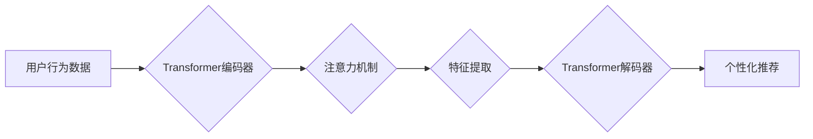

                 

## 推荐系统中的时序依赖：AI大模型的新解决方案

> 关键词：推荐系统、时序依赖、AI大模型、Transformer、自回归模型、序列数据、个性化推荐

## 1. 背景介绍

推荐系统作为信息过滤和个性化内容展示的重要工具，在电商、社交媒体、视频平台等领域发挥着越来越重要的作用。传统的推荐系统主要基于用户历史行为和物品特征进行协同过滤或基于内容的推荐，但这些方法往往难以捕捉用户行为的动态变化和时间依赖性。随着大规模数据和人工智能技术的快速发展，基于AI大模型的推荐系统逐渐成为研究热点。

AI大模型，特别是Transformer模型，凭借其强大的序列建模能力，为解决推荐系统中的时序依赖问题提供了新的思路。Transformer模型能够有效地捕捉序列数据中的长距离依赖关系，从而更准确地预测用户的未来行为。

## 2. 核心概念与联系

### 2.1 时序依赖

时序依赖是指用户行为或物品属性随时间推移而发生变化的趋势。例如，用户的兴趣爱好、消费习惯、观看偏好等都会随着时间推移而发生变化。推荐系统需要能够捕捉这些变化，才能提供更精准、更个性化的推荐。

### 2.2 AI大模型

AI大模型是指拥有大量参数、训练数据和计算资源的深度学习模型。它们能够学习复杂的模式和关系，并应用于各种任务，例如自然语言处理、图像识别、语音合成等。

### 2.3 Transformer模型

Transformer模型是一种基于注意力机制的深度学习模型，能够有效地捕捉序列数据中的长距离依赖关系。它由编码器和解码器两部分组成，编码器用于提取序列数据的特征，解码器用于根据编码器的输出生成目标序列。

**Mermaid 流程图**



## 3. 核心算法原理 & 具体操作步骤

### 3.1 算法原理概述

基于Transformer模型的推荐系统通常采用自回归模型的架构。自回归模型预测下一个时间步的输出，基于之前的时间步的输出和输入。在推荐系统中，用户行为序列作为输入，模型预测用户下一个点击、购买或观看的物品。

### 3.2 算法步骤详解

1. **数据预处理:** 将用户行为数据转换为序列格式，例如用户历史点击记录、购买记录、观看记录等。
2. **特征编码:** 使用词嵌入或其他方法将物品和用户特征编码为向量表示。
3. **Transformer模型训练:** 使用训练数据训练Transformer模型，模型学习用户行为序列的时序依赖关系。
4. **预测:** 将新用户的行为序列作为输入，模型预测用户下一个可能的行为。
5. **推荐结果排序:** 根据模型预测结果对推荐物品进行排序，并返回给用户。

### 3.3 算法优缺点

**优点:**

* 能够有效地捕捉用户行为的时序依赖关系。
* 能够处理长序列数据，并学习长距离依赖关系。
* 具有强大的泛化能力，能够适用于不同的推荐场景。

**缺点:**

* 训练成本较高，需要大量的计算资源和训练数据。
* 模型复杂度高，需要专业的技术人员进行开发和维护。

### 3.4 算法应用领域

* **电商推荐:** 推荐商品、优惠券、促销活动等。
* **视频推荐:** 推荐视频、电视剧、电影等。
* **音乐推荐:** 推荐歌曲、专辑、音乐人等。
* **新闻推荐:** 推荐新闻文章、博客文章、视频等。

## 4. 数学模型和公式 & 详细讲解 & 举例说明

### 4.1 数学模型构建

假设用户行为序列为 $x = (x_1, x_2, ..., x_T)$，其中 $x_t$ 表示用户在时间步 $t$ 的行为。目标是预测用户在时间步 $T+1$ 的行为 $x_{T+1}$。

基于Transformer模型的推荐系统可以构建如下数学模型：

$$
\hat{x}_{T+1} = f(x_1, x_2, ..., x_T, \theta)
$$

其中，$f$ 是Transformer模型的输出函数，$\theta$ 是模型的参数。

### 4.2 公式推导过程

Transformer模型的输出函数 $f$ 包含编码器和解码器两部分。编码器用于提取用户行为序列的特征，解码器用于根据编码器的输出预测下一个行为。

编码器部分使用多层Transformer模块，每个模块包含多头注意力机制和前馈神经网络。注意力机制能够捕捉序列数据中的长距离依赖关系，而前馈神经网络能够学习复杂的非线性关系。

解码器部分也使用多层Transformer模块，并使用掩码机制防止模型预测未来的信息。

### 4.3 案例分析与讲解

例如，在电商推荐场景中，用户行为序列可以表示为用户历史点击商品的ID。Transformer模型可以学习用户点击商品的时序依赖关系，并预测用户下一个可能点击的商品。

## 5. 项目实践：代码实例和详细解释说明

### 5.1 开发环境搭建

* Python 3.6+
* PyTorch 1.0+
* CUDA 10.0+

### 5.2 源代码详细实现

```python
import torch
import torch.nn as nn

class TransformerRecommender(nn.Module):
    def __init__(self, embedding_dim, num_heads, num_layers, vocab_size):
        super(TransformerRecommender, self).__init__()
        self.embedding = nn.Embedding(vocab_size, embedding_dim)
        self.transformer = nn.Transformer(embedding_dim, num_heads, num_layers)
        self.fc = nn.Linear(embedding_dim, vocab_size)

    def forward(self, x):
        embedded = self.embedding(x)
        output = self.transformer(embedded)
        output = self.fc(output[:, -1, :])
        return output

# 实例化模型
model = TransformerRecommender(embedding_dim=128, num_heads=8, num_layers=6, vocab_size=10000)

# 训练模型
# ...

# 预测
user_history = torch.tensor([1, 2, 3, 4])
prediction = model(user_history)
```

### 5.3 代码解读与分析

* `embedding`: 将物品ID转换为向量表示。
* `transformer`: 使用Transformer模型提取用户行为序列的特征。
* `fc`: 将Transformer模型的输出转换为预测概率分布。

### 5.4 运行结果展示

训练完成后，模型可以用于预测用户的下一个行为。例如，如果用户的历史行为序列为 [1, 2, 3, 4]，模型可以预测用户下一个可能点击的物品ID。

## 6. 实际应用场景

### 6.1 电商推荐

基于Transformer模型的推荐系统可以根据用户的历史购买记录、浏览记录、收藏记录等信息，推荐用户可能感兴趣的商品。

### 6.2 视频推荐

基于Transformer模型的推荐系统可以根据用户的观看历史、点赞记录、评论记录等信息，推荐用户可能感兴趣的视频。

### 6.3 音乐推荐

基于Transformer模型的推荐系统可以根据用户的播放历史、收藏记录、点赞记录等信息，推荐用户可能感兴趣的歌曲、专辑、音乐人等。

### 6.4 未来应用展望

随着AI技术的不断发展，基于Transformer模型的推荐系统将应用于更多领域，例如新闻推荐、游戏推荐、教育推荐等。

## 7. 工具和资源推荐

### 7.1 学习资源推荐

* **论文:**
    * Vaswani, A., Shazeer, N., Parmar, N., Uszkoreit, J., Jones, L., Gomez, A. N., ... & Polosukhin, I. (2017). Attention is all you need. In Advances in neural information processing systems (pp. 5998-6008).
* **书籍:**
    * Deep Learning with PyTorch by Eli Stevens, Luca Antiga, and Thomas Viehmann
* **在线课程:**
    * Deep Learning Specialization by Andrew Ng

### 7.2 开发工具推荐

* **PyTorch:** 深度学习框架
* **TensorFlow:** 深度学习框架
* **Hugging Face Transformers:** 预训练Transformer模型库

### 7.3 相关论文推荐

* [BERT for Recommender Systems](https://arxiv.org/abs/1908.03838)
* [Recurrent Neural Networks for Recommender Systems](https://arxiv.org/abs/1506.05739)
* [Deep Learning for Recommender Systems](https://arxiv.org/abs/1606.00094)

## 8. 总结：未来发展趋势与挑战

### 8.1 研究成果总结

基于Transformer模型的推荐系统取得了显著的成果，能够有效地捕捉用户行为的时序依赖关系，并提供更精准、更个性化的推荐。

### 8.2 未来发展趋势

* **多模态推荐:** 将文本、图像、视频等多种模态信息融合到推荐系统中。
* **联邦学习:** 在保护用户隐私的前提下，利用联邦学习技术训练推荐模型。
* **个性化解释:** 为用户提供推荐结果的解释，提高用户对推荐结果的信任度。

### 8.3 面临的挑战

* **数据稀疏性:** 用户行为数据往往是稀疏的，需要采用有效的处理方法。
* **模型复杂度:** Transformer模型的复杂度较高，需要更强大的计算资源进行训练和推理。
* **公平性与可解释性:** 需要确保推荐系统公平公正，并提供可解释的推荐结果。

### 8.4 研究展望

未来，基于Transformer模型的推荐系统将继续朝着更智能、更个性化、更公平的方向发展。

## 9. 附录：常见问题与解答

* **Q: Transformer模型的训练成本很高吗？**

A: 是的，Transformer模型的训练成本较高，需要大量的计算资源和训练数据。

* **Q: Transformer模型只能处理文本数据吗？**

A: 不仅限于文本数据，Transformer模型也可以处理其他类型的序列数据，例如音频、视频等。

* **Q: 如何评估Transformer模型的推荐效果？**

A: 可以使用各种指标来评估Transformer模型的推荐效果，例如点击率、转化率、用户满意度等。


作者：禅与计算机程序设计艺术 / Zen and the Art of Computer Programming 
<end_of_turn>

