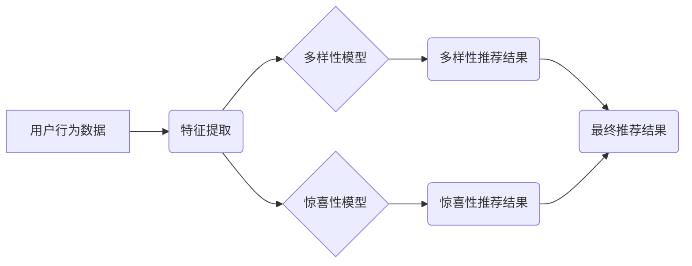

                 

## 推荐系统的多样性与惊喜性优化

> 关键词：推荐系统、多样性、惊喜性、个性化推荐、冷启动问题、协同过滤、内容过滤、模型融合

## 1. 背景介绍

推荐系统作为互联网时代的重要技术支柱，旨在根据用户的历史行为、偏好和上下文信息，预测用户对潜在物品的兴趣，并提供个性化的推荐结果。传统的推荐系统主要关注准确性，即推荐结果与用户真实偏好程度的匹配度。然而，随着用户需求的不断变化和推荐系统的不断发展，多样性和惊喜性也逐渐成为推荐系统的重要目标。

多样性是指推荐结果的种类丰富，避免推荐系统陷入“同质化”的困境，提供更广泛的选择范围，满足用户探索新内容的需求。惊喜性是指推荐结果能够超出用户的预期，带来意想不到的惊喜感，激发用户的兴趣和参与度。

## 2. 核心概念与联系

**2.1  概念定义**

* **多样性:** 推荐结果的类别、主题、风格等方面的丰富性，避免推荐系统陷入“同质化”的困境。
* **惊喜性:** 推荐结果能够超出用户的预期，带来意想不到的惊喜感，激发用户的兴趣和参与度。

**2.2  核心概念联系**

多样性和惊喜性是相互关联的，两者共同构成了推荐系统的“个性化”和“趣味性”。

* **多样性**为用户提供更广泛的选择范围，增加用户探索新内容的机会。
* **惊喜性**则通过超出用户预期，激发用户的兴趣和参与度，提升用户体验。

**2.3  架构图**



## 3. 核心算法原理 & 具体操作步骤

**3.1  算法原理概述**

推荐系统的多样性和惊喜性优化通常采用以下两种主要算法：

* **基于内容的过滤:** 根据用户历史行为和物品的特征，预测用户对潜在物品的兴趣。
* **协同过滤:** 基于用户的相似性或物品的相似性，预测用户对潜在物品的兴趣。

**3.2  算法步骤详解**

**基于内容的过滤:**

1. **数据预处理:** 收集用户行为数据，例如用户评分、浏览记录、购买历史等，并对数据进行清洗、转换和特征提取。
2. **物品特征构建:** 将物品信息转换为可量化的特征，例如物品类别、主题、风格、作者等。
3. **用户兴趣建模:** 根据用户历史行为数据，构建用户兴趣模型，例如用户评分向量、用户偏好矩阵等。
4. **推荐结果生成:** 根据用户兴趣模型和物品特征，计算用户对潜在物品的兴趣评分，并根据评分排序推荐结果。

**协同过滤:**

1. **用户相似度计算:** 基于用户的评分或行为数据，计算用户之间的相似度，例如余弦相似度、皮尔逊相关系数等。
2. **物品相似度计算:** 基于用户的评分或行为数据，计算物品之间的相似度，例如余弦相似度、皮尔逊相关系数等。
3. **推荐结果生成:** 根据用户相似度或物品相似度，推荐用户可能感兴趣的物品。

**3.3  算法优缺点**

**基于内容的过滤:**

* **优点:** 能够提供个性化推荐，不受冷启动问题影响，易于解释。
* **缺点:** 难以捕捉用户隐性偏好，容易陷入“同质化”的困境。

**协同过滤:**

* **优点:** 能够捕捉用户隐性偏好，推荐结果更丰富多样。
* **缺点:** 容易受到数据稀疏性和冷启动问题的影响，难以解释。

**3.4  算法应用领域**

* **电子商务:** 商品推荐、个性化营销
* **娱乐:** 电影推荐、音乐推荐、游戏推荐
* **社交媒体:** 朋友推荐、内容推荐
* **新闻:** 新闻推荐、个性化资讯

## 4. 数学模型和公式 & 详细讲解 & 举例说明

**4.1  数学模型构建**

**基于内容的过滤:**

假设用户 $u$ 的兴趣向量为 $u$, 物品 $i$ 的特征向量为 $v_i$, 则用户 $u$ 对物品 $i$ 的兴趣评分可以表示为:

$$
r_{ui} = u \cdot v_i
$$

其中，$\cdot$ 表示向量的内积。

**协同过滤:**

假设用户 $u$ 和用户 $v$ 的相似度为 $sim(u,v)$, 则用户 $u$ 对物品 $i$ 的兴趣评分可以表示为:

$$
\hat{r}_{ui} = r_{uv} \cdot sim(u,v)
$$

其中，$r_{uv}$ 表示用户 $v$ 对物品 $i$ 的评分。

**4.2  公式推导过程**

**基于内容的过滤:**

用户兴趣向量 $u$ 和物品特征向量 $v_i$ 的内积可以表示为:

$$
u \cdot v_i = \sum_{j=1}^{n} u_j \cdot v_{ij}
$$

其中，$u_j$ 表示用户 $u$ 在特征 $j$ 上的兴趣值，$v_{ij}$ 表示物品 $i$ 在特征 $j$ 上的特征值。

**协同过滤:**

用户相似度 $sim(u,v)$ 可以使用余弦相似度计算:

$$
sim(u,v) = \frac{u \cdot v}{||u|| ||v||}
$$

其中，$||u||$ 和 $||v||$ 分别表示用户 $u$ 和用户 $v$ 的兴趣向量的长度。

**4.3  案例分析与讲解**

**基于内容的过滤:**

假设用户 $u$ 喜欢动作电影，物品 $i$ 是动作电影，则用户 $u$ 对物品 $i$ 的兴趣评分较高。

**协同过滤:**

假设用户 $u$ 和用户 $v$ 都喜欢动作电影，并且用户 $v$ 对一部科幻电影 $i$ 给出了高评分，则用户 $u$ 也可能喜欢这部科幻电影 $i$。

## 5. 项目实践：代码实例和详细解释说明

**5.1  开发环境搭建**

* Python 3.x
* scikit-learn
* pandas
* numpy

**5.2  源代码详细实现**

```python
# 基于内容的过滤推荐
from sklearn.metrics.pairwise import cosine_similarity

# 用户兴趣矩阵
user_interest = {
    'user1': [1, 0, 1, 0],
    'user2': [0, 1, 1, 1],
    'user3': [1, 1, 0, 0]
}

# 物品特征矩阵
item_features = {
    'item1': [1, 0, 0, 1],
    'item2': [0, 1, 1, 0],
    'item3': [1, 0, 1, 0],
    'item4': [0, 1, 0, 1]
}

# 计算用户兴趣向量和物品特征向量的余弦相似度
similarity_matrix = cosine_similarity(user_interest.values(), item_features.values())

# 获取用户1对所有物品的推荐评分
user1_recommendations = similarity_matrix[0]

# 排序推荐结果
sorted_recommendations = sorted(enumerate(user1_recommendations), key=lambda x: x[1], reverse=True)

# 打印推荐结果
print(f"用户1的推荐结果: {sorted_recommendations}")

# 协同过滤推荐
from sklearn.metrics.pairwise import cosine_similarity

# 用户评分矩阵
user_ratings = {
    'user1': {'item1': 5, 'item2': 3, 'item3': 4},
    'user2': {'item1': 4, 'item2': 5, 'item3': 2, 'item4': 3},
    'user3': {'item1': 3, 'item2': 4, 'item3': 5}
}

# 计算用户相似度矩阵
user_similarity = cosine_similarity(list(user_ratings.values()))

# 获取用户1对物品4的推荐评分
user1_rating_for_item4 = user_ratings['user1'].get('item4', 0)
user1_similarity_with_other_users = user_similarity[0]
predicted_rating_for_item4 = user1_rating_for_item4 * user1_similarity_with_other_users

# 打印预测评分
print(f"用户1对物品4的预测评分: {predicted_rating_for_item4}")
```

**5.3  代码解读与分析**

* 基于内容的过滤代码示例展示了如何使用余弦相似度计算用户兴趣向量和物品特征向量的相似度，并根据相似度进行推荐。
* 协同过滤代码示例展示了如何使用余弦相似度计算用户相似度矩阵，并根据用户相似度预测用户对物品的评分。

**5.4  运行结果展示**

运行上述代码后，可以得到用户1的推荐结果和用户1对物品4的预测评分。

## 6. 实际应用场景

**6.1  电子商务**

* **商品推荐:** 根据用户的浏览历史、购买记录和评分等信息，推荐用户可能感兴趣的商品。
* **个性化营销:** 根据用户的兴趣爱好和购买偏好，推送个性化的广告和促销信息。

**6.2  娱乐**

* **电影推荐:** 根据用户的观看历史、评分和喜好，推荐用户可能感兴趣的电影。
* **音乐推荐:** 根据用户的播放历史、评分和喜好，推荐用户可能感兴趣的音乐。
* **游戏推荐:** 根据用户的游戏历史、评分和喜好，推荐用户可能感兴趣的游戏。

**6.3  社交媒体**

* **朋友推荐:** 根据用户的社交关系和兴趣爱好，推荐用户可能感兴趣的朋友。
* **内容推荐:** 根据用户的浏览历史、点赞和评论等信息，推荐用户可能感兴趣的内容。

**6.4  未来应用展望**

* **多模态推荐:** 将文本、图像、音频等多种模态信息融合，提供更丰富的推荐结果。
* **实时推荐:** 基于用户的实时行为和上下文信息，提供更精准的推荐结果。
* **个性化解释:** 为推荐结果提供个性化的解释，帮助用户理解推荐背后的逻辑。

## 7. 工具和资源推荐

**7.1  学习资源推荐**

* **书籍:**
    * 推荐系统设计与实现
    * The Netflix Recommender System: Algorithms, Business Value, and Innovation
* **在线课程:**
    * Coursera: Recommender Systems
    * Udacity: Machine Learning Engineer Nanodegree

**7.2  开发工具推荐**

* **Python:** 广泛应用于推荐系统开发，拥有丰富的机器学习库和工具。
* **Spark:** 用于大规模数据处理，可以处理海量用户行为数据。
* **TensorFlow/PyTorch:** 深度学习框架，可以用于构建更复杂的推荐模型。

**7.3  相关论文推荐**

* **Collaborative Filtering for Implicit Feedback Datasets**
* **Matrix Factorization Techniques for Recommender Systems**
* **Hybrid Recommender Systems: A Survey**

## 8. 总结：未来发展趋势与挑战

**8.1  研究成果总结**

近年来，推荐系统领域取得了显著进展，多样性和惊喜性也逐渐成为研究热点。基于内容的过滤和协同过滤算法得到了广泛应用，深度学习技术也为推荐系统带来了新的突破。

**8.2  未来发展趋势**

* **多模态推荐:** 将文本、图像、音频等多种模态信息融合，提供更丰富的推荐结果。
* **个性化解释:** 为推荐结果提供个性化的解释，帮助用户理解推荐背后的逻辑。
* **联邦学习:** 保护用户隐私，同时实现推荐系统的个性化和协同性。

**8.3  面临的挑战**

* **数据稀疏性:** 用户行为数据往往是稀疏的，难以构建准确的推荐模型。
* **冷启动问题:** 新用户和新物品难以获得推荐，需要开发新的算法和策略。
* **用户隐私保护:** 推荐系统需要处理大量用户敏感信息，需要采取有效的隐私保护措施。

**8.4  研究展望**

未来，推荐系统研究将更加注重多样性、惊喜性和个性化，并探索新的算法、技术和应用场景。


## 9. 附录：常见问题与解答

**9.1  问题:** 如何解决推荐系统的数据稀疏性问题？

**解答:**

* 使用协同过滤算法，利用用户的相似性进行推荐。
* 使用内容过滤算法，利用物品的特征进行推荐。
* 使用混合推荐算法，结合协同过滤和内容过滤算法的优势。
* 使用深度学习技术，挖掘用户行为数据中的隐性特征。

**9.2  问题:** 如何解决推荐系统中的冷启动问题？

**解答:**

* 使用基于内容的过滤算法，利用物品的特征进行推荐。
* 使用基于用户的协同过滤算法，利用用户的相似性进行推荐。
* 使用知识图谱，补充用户和物品的信息。
* 使用人工标注数据，训练推荐模型。


作者：禅与计算机程序设计艺术 / Zen and the Art of Computer Programming 
<end_of_turn>

