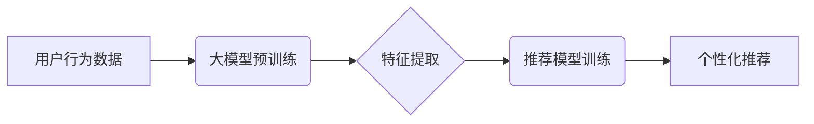

                 

## 推荐系统的未来发展方向：大模型的主流化

> 关键词：推荐系统、大模型、Transformer、迁移学习、个性化推荐、冷启动问题、数据隐私

### 1. 背景介绍

推荐系统作为信息过滤和个性化内容展示的重要工具，已渗透到我们生活的方方面面，从电商平台的商品推荐到社交媒体的动态推荐，无处不在。传统的推荐系统主要依赖于协同过滤、内容过滤和基于知识图谱的方法，但这些方法在面对海量数据、用户行为复杂性和内容多样的挑战时，表现力逐渐不足。

近年来，大模型的兴起为推荐系统的发展带来了新的机遇。大模型，特别是基于Transformer架构的大模型，凭借其强大的语义理解能力和泛化能力，展现出在推荐系统领域的巨大潜力。

### 2. 核心概念与联系

**2.1 推荐系统概述**

推荐系统旨在根据用户的历史行为、偏好和上下文信息，预测用户对特定物品的兴趣，并推荐最相关的物品。

**2.2 大模型概述**

大模型是指参数规模庞大、训练数据海量的人工智能模型。它们通常通过深度学习技术，例如Transformer架构，学习复杂的模式和关系，从而具备强大的泛化能力和语义理解能力。

**2.3 大模型与推荐系统的联系**

大模型可以为推荐系统提供以下方面的提升：

* **更精准的语义理解:** 大模型可以理解用户输入的文本信息，例如搜索词、评论等，并提取出其潜在的含义和意图，从而更精准地理解用户的需求。
* **更丰富的特征表达:** 大模型可以学习到用户和物品之间的复杂关系，并生成更丰富的特征表示，从而提高推荐的准确性和个性化程度。
* **更好的泛化能力:** 大模型在海量数据上进行训练，可以更好地泛化到新的用户和物品，从而提高推荐系统的鲁棒性和可扩展性。

**2.4  推荐系统与大模型的架构**



### 3. 核心算法原理 & 具体操作步骤

**3.1 算法原理概述**

大模型在推荐系统中的应用主要基于以下两种核心算法：

* **基于Transformer的推荐模型:** Transformer架构是一种强大的深度学习模型，其自注意力机制可以捕捉用户和物品之间的长距离依赖关系，从而提高推荐的准确性和个性化程度。
* **迁移学习:** 迁移学习是指将预训练的大模型在特定任务上进行微调，从而提高模型的效率和性能。

**3.2 算法步骤详解**

1. **数据预处理:** 收集用户行为数据，例如点击、购买、浏览等，并进行清洗、转换和特征工程。
2. **大模型预训练:** 使用海量文本数据对Transformer模型进行预训练，使其具备强大的语义理解能力和泛化能力。
3. **特征提取:** 将用户行为数据和物品信息输入到预训练好的大模型中，提取出用户和物品的特征表示。
4. **推荐模型训练:** 使用提取到的特征表示，训练基于Transformer的推荐模型，例如BERT-Rec、RoBERTa-Rec等。
5. **个性化推荐:** 将训练好的推荐模型应用于新的用户和物品，预测用户对特定物品的兴趣，并生成个性化的推荐列表。

**3.3 算法优缺点**

**优点:**

* **更高的准确率:** 大模型可以学习到更复杂的模式和关系，从而提高推荐的准确性和个性化程度。
* **更好的泛化能力:** 预训练好的大模型可以更好地泛化到新的用户和物品，从而提高推荐系统的鲁棒性和可扩展性。
* **更丰富的特征表达:** 大模型可以学习到用户和物品之间的多方面关系，从而生成更丰富的特征表示，为推荐提供更全面的信息。

**缺点:**

* **训练成本高:** 大模型的训练需要大量的计算资源和时间。
* **数据依赖性强:** 大模型的性能依赖于训练数据的质量和规模。
* **解释性差:** 大模型的决策过程较为复杂，难以解释其推荐结果背后的逻辑。

**3.4 算法应用领域**

* **电商推荐:** 推荐商品、优惠券、促销活动等。
* **内容推荐:** 推荐新闻、视频、音乐、书籍等。
* **社交推荐:** 推荐好友、群组、话题等。
* **广告推荐:** 推荐精准广告，提高广告点击率和转化率。

### 4. 数学模型和公式 & 详细讲解 & 举例说明

**4.1 数学模型构建**

推荐系统的核心目标是预测用户对物品的评分或点击概率。可以使用以下数学模型来表示：

* **线性模型:**

$$
\hat{r}_{u,i} = w_0 + \sum_{k=1}^{n} w_k x_{u,k} x_{i,k}
$$

其中：

* $\hat{r}_{u,i}$ 是模型预测的用户 $u$ 对物品 $i$ 的评分。
* $w_0$ 是模型的偏置项。
* $w_k$ 是模型的权重参数。
* $x_{u,k}$ 是用户 $u$ 的特征 $k$ 的值。
* $x_{i,k}$ 是物品 $i$ 的特征 $k$ 的值。

* **神经网络模型:**

神经网络模型可以学习更复杂的非线性关系，其结构通常包括多层感知机、卷积神经网络、循环神经网络等。

**4.2 公式推导过程**

具体的公式推导过程取决于所使用的模型架构和损失函数。例如，对于基于Transformer的推荐模型，其公式推导过程涉及到自注意力机制、多头注意力、位置编码等方面的知识。

**4.3 案例分析与讲解**

假设我们有一个电商平台，想要推荐商品给用户。我们可以使用线性模型来预测用户对商品的评分。用户特征包括年龄、性别、购买历史等，商品特征包括价格、类别、品牌等。通过训练模型，我们可以得到每个特征对应的权重参数，然后根据用户的特征和商品的特征，计算出用户对商品的评分预测值。

### 5. 项目实践：代码实例和详细解释说明

**5.1 开发环境搭建**

* Python 3.7+
* PyTorch 或 TensorFlow
* CUDA 和 cuDNN

**5.2 源代码详细实现**

```python
import torch
import torch.nn as nn

class RecommenderModel(nn.Module):
    def __init__(self, user_dim, item_dim, embedding_dim):
        super(RecommenderModel, self).__init__()
        self.user_embedding = nn.Embedding(user_dim, embedding_dim)
        self.item_embedding = nn.Embedding(item_dim, embedding_dim)
        self.linear = nn.Linear(embedding_dim, 1)

    def forward(self, user_ids, item_ids):
        user_embeddings = self.user_embedding(user_ids)
        item_embeddings = self.item_embedding(item_ids)
        combined_embeddings = user_embeddings * item_embeddings
        scores = self.linear(combined_embeddings)
        return scores

# ... (其他代码，例如数据加载、模型训练、评估等)
```

**5.3 代码解读与分析**

* `RecommenderModel` 类定义了一个简单的推荐模型，它包含用户嵌入层、物品嵌入层和线性层。
* `user_embedding` 和 `item_embedding` 是嵌入层，用于将用户 ID 和物品 ID 映射到低维向量空间。
* `linear` 是线性层，用于计算用户和物品的嵌入向量之间的点积，得到评分预测值。
* `forward` 方法定义了模型的计算流程。

**5.4 运行结果展示**

通过训练模型并测试其性能，我们可以评估模型的推荐效果，例如准确率、召回率、NDCG 等指标。

### 6. 实际应用场景

**6.1 电商推荐**

* 商品推荐: 根据用户的浏览历史、购买记录、购物车内容等信息，推荐相关的商品。
* 个性化促销: 根据用户的消费习惯和偏好，推荐个性化的优惠券和促销活动。

**6.2 内容推荐**

* 新闻推荐: 根据用户的阅读历史、兴趣标签等信息，推荐相关的新闻文章。
* 视频推荐: 根据用户的观看历史、点赞记录等信息，推荐相关的视频内容。

**6.3 社交推荐**

* 好友推荐: 根据用户的社交关系和兴趣爱好，推荐潜在的好友。
* 群组推荐: 根据用户的兴趣标签和活动参与记录，推荐相关的群组。

**6.4 未来应用展望**

* **更精准的个性化推荐:** 大模型可以学习到用户的更细粒度的兴趣和偏好，从而提供更精准的个性化推荐。
* **跨模态推荐:** 大模型可以处理多种类型的输入数据，例如文本、图像、音频等，从而实现跨模态的推荐。
* **动态推荐:** 大模型可以根据用户的实时行为和上下文信息，动态调整推荐结果。

### 7. 工具和资源推荐

**7.1 学习资源推荐**

* **书籍:**
    * 《深度学习》
    * 《自然语言处理》
    * 《推荐系统》
* **在线课程:**
    * Coursera: 深度学习
    * edX: 自然语言处理
    * fast.ai: 深度学习

**7.2 开发工具推荐**

* **PyTorch:** 深度学习框架
* **TensorFlow:** 深度学习框架
* **HuggingFace Transformers:** 预训练大模型库

**7.3 相关论文推荐**

* BERT: Pre-training of Deep Bidirectional Transformers for Language Understanding
* RoBERTa: A Robustly Optimized BERT Pretraining Approach
* Transformer-XL: Attentive Language Models with Gated Recurrence

### 8. 总结：未来发展趋势与挑战

**8.1 研究成果总结**

大模型在推荐系统领域取得了显著的成果，例如提高了推荐的准确率和个性化程度，并为推荐系统带来了新的可能性。

**8.2 未来发展趋势**

* **更强大的大模型:** 随着计算资源的不断提升，我们将看到更大规模、更强大的大模型的出现。
* **更有效的迁移学习方法:** 迁移学习将成为大模型在推荐系统中的重要应用方式，可以降低模型训练成本和时间。
* **更个性化的推荐:** 大模型可以学习到用户的更细粒度的兴趣和偏好，从而提供更精准的个性化推荐。

**8.3 面临的挑战**

* **数据隐私:** 大模型的训练需要海量数据，如何保护用户数据隐私是一个重要的挑战。
* **模型解释性:** 大模型的决策过程较为复杂，难以解释其推荐结果背后的逻辑，这可能会导致用户对推荐结果的信任度降低。
* **可解释性与公平性:** 如何确保大模型的推荐结果是可解释的、公平的、不带有偏见，是需要进一步研究的课题。

**8.4 研究展望**

未来，大模型在推荐系统领域将继续发挥重要作用，并推动推荐系统的不断发展。我们需要关注以下几个方面：

* **开发更有效的迁移学习方法，降低模型训练成本和时间。**
* **研究大模型的解释性，提高用户对推荐结果的信任度。**
* **确保大模型的推荐结果是公平的、不带有偏见。**
* **探索大模型在跨模态推荐、动态推荐等方面的应用。**


### 9. 附录：常见问题与解答

**9.1 如何选择合适的推荐模型？**

选择合适的推荐模型需要根据具体应用场景和数据特点进行考虑。

* **数据规模:** 如果数据规模较小，可以使用线性模型或简单的神经网络模型。
* **特征类型:** 如果特征类型复杂，可以使用 Transformer 架构的模型。
* **推荐任务:** 如果需要进行个性化推荐，可以使用基于用户和物品的协同过滤模型或基于内容的推荐模型。

**9.2 如何评估推荐模型的性能？**

常用的推荐模型性能评估指标包括准确率、召回率、NDCG 等。

* **准确率:** 指模型预测正确的结果占总结果的比例。
* **召回率:** 指模型预测出的正确结果占所有实际正确结果的比例。
* **NDCG:** 指 Normalized Discounted Cumulative Gain，用于衡量推荐结果的排序质量。

**9.3 如何解决冷启动问题？**

冷启动问题是指新用户或新物品难以获得推荐结果的情况。

* **利用用户画像:** 根据用户的基本信息，例如年龄、性别、兴趣爱好等，进行初步的推荐。
* **利用物品属性:** 根据物品的类别、品牌、价格等属性，进行初步的推荐。
* **利用协同过滤:** 利用已有的用户行为数据，进行协同过滤推荐。


作者：禅与计算机程序设计艺术 / Zen and the Art of Computer Programming 
<end_of_turn>

