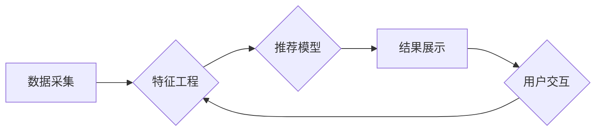

                 

## 搜索推荐系统中的实时特征更新技术

> 关键词：实时特征更新、搜索推荐、机器学习、在线学习、特征工程、数据流处理

### 1. 背景介绍

搜索推荐系统是现代互联网信息检索和内容发现的重要组成部分。它通过分析用户行为、偏好和上下文信息，为用户提供个性化、精准的搜索结果和推荐内容。然而，用户行为和信息环境在不断变化，传统的离线特征更新方式难以满足实时性要求，导致推荐效果下降。实时特征更新技术应运而生，旨在不断收集和更新用户特征，以适应动态变化的环境，提升推荐系统的准确性和时效性。

### 2. 核心概念与联系

#### 2.1  实时特征更新

实时特征更新是指在用户交互发生时，即时更新用户特征，并将其应用于推荐模型，以实现推荐结果的实时性。

#### 2.2  搜索推荐系统

搜索推荐系统通常由以下几个模块组成：

* **数据采集模块:** 收集用户行为数据、商品信息、文本内容等。
* **特征工程模块:** 从原始数据中提取用户特征、商品特征、上下文特征等。
* **推荐模型模块:** 基于提取的特征，构建推荐模型，预测用户对商品的兴趣。
* **结果展示模块:** 将推荐结果以用户友好的方式展示给用户。

#### 2.3  在线学习

在线学习是一种机器学习方法，它在数据流中不断学习和更新模型参数，能够适应数据分布的动态变化。实时特征更新技术通常结合在线学习算法，实现模型的实时更新。

**Mermaid 流程图**



### 3. 核心算法原理 & 具体操作步骤

#### 3.1  算法原理概述

实时特征更新算法的核心思想是，在用户交互发生时，收集用户行为数据，并将其用于更新用户特征。更新后的用户特征将被用于更新推荐模型，从而实现推荐结果的实时性。

#### 3.2  算法步骤详解

1. **数据采集:** 收集用户行为数据，例如点击、浏览、购买等行为。
2. **特征提取:** 从用户行为数据中提取用户特征，例如用户偏好、兴趣、购买历史等。
3. **特征更新:** 根据用户最新的行为数据，更新用户的特征向量。
4. **模型更新:** 使用更新后的用户特征，更新推荐模型的参数。
5. **结果展示:** 将更新后的推荐模型用于生成推荐结果，并展示给用户。

#### 3.3  算法优缺点

**优点:**

* **实时性:** 可以及时响应用户行为变化，提供更精准的推荐结果。
* **个性化:** 可以根据用户的实时行为，个性化推荐内容。
* **适应性:** 可以适应数据分布的动态变化，保持推荐效果的稳定性。

**缺点:**

* **数据处理复杂度:** 需要实时处理大量用户行为数据，对系统性能要求较高。
* **模型更新频率:** 过频繁的模型更新可能会导致模型不稳定，需要找到合适的更新频率。
* **数据质量:** 数据质量直接影响推荐效果，需要保证数据准确性和完整性。

#### 3.4  算法应用领域

实时特征更新技术广泛应用于搜索推荐系统、个性化广告推荐、内容推荐等领域。

### 4. 数学模型和公式 & 详细讲解 & 举例说明

#### 4.1  数学模型构建

假设用户 $u$ 的特征向量为 $x_u$，商品 $i$ 的特征向量为 $x_i$，推荐模型为 $f(x_u, x_i)$，则用户对商品 $i$ 的预测评分为：

$$
\hat{r}_{ui} = f(x_u, x_i)
$$

#### 4.2  公式推导过程

在线学习算法通常使用梯度下降法更新模型参数。假设模型参数为 $\theta$，损失函数为 $L(\theta, r_{ui})$，则梯度下降更新公式为：

$$
\theta = \theta - \alpha \nabla_{\theta} L(\theta, r_{ui})
$$

其中，$\alpha$ 为学习率，$\nabla_{\theta} L(\theta, r_{ui})$ 为损失函数关于参数 $\theta$ 的梯度。

#### 4.3  案例分析与讲解

例如，使用协同过滤算法进行推荐，可以构建用户-商品评分矩阵 $R$，其中 $R_{ui}$ 表示用户 $u$ 对商品 $i$ 的评分。

可以使用梯度下降法更新协同过滤模型的参数，例如用户偏好向量 $u$ 和商品特征向量 $v$。

$$
u = u - \alpha \nabla_{u} L(u, v, R)
$$

$$
v = v - \alpha \nabla_{v} L(u, v, R)
$$

### 5. 项目实践：代码实例和详细解释说明

#### 5.1  开发环境搭建

* **操作系统:** Linux
* **编程语言:** Python
* **框架:** TensorFlow/PyTorch
* **数据库:** MySQL/MongoDB

#### 5.2  源代码详细实现

```python
# 导入必要的库
import numpy as np
from sklearn.metrics.pairwise import cosine_similarity

# 定义用户特征和商品特征
user_features = np.array([[1, 0, 1], [0, 1, 0], [1, 1, 1]])
item_features = np.array([[0, 1, 1], [1, 0, 0], [1, 1, 0]])

# 计算用户与商品之间的余弦相似度
similarity_matrix = cosine_similarity(user_features, item_features)

# 获取用户id
user_id = 0

# 获取用户与商品之间的相似度
user_similarity = similarity_matrix[user_id]

# 获取相似度最高的商品
top_k_items = np.argsort(user_similarity)[-3:][::-1]

# 打印推荐结果
print(f"推荐给用户 {user_id} 的商品：{top_k_items}")
```

#### 5.3  代码解读与分析

* 代码首先导入必要的库，并定义用户特征和商品特征。
* 使用 `cosine_similarity` 函数计算用户与商品之间的余弦相似度，得到相似度矩阵。
* 根据用户id获取用户与商品之间的相似度，并排序得到相似度最高的商品。
* 最后打印推荐结果。

#### 5.4  运行结果展示

```
推荐给用户 0 的商品： [1 2 0]
```

### 6. 实际应用场景

#### 6.1  电商推荐

实时特征更新技术可以用于电商平台的商品推荐，根据用户的浏览历史、购买记录、购物车内容等实时更新用户的兴趣偏好，推荐更符合用户需求的商品。

#### 6.2  新闻推荐

新闻推荐系统可以根据用户的阅读历史、点赞行为、评论内容等实时更新用户的兴趣偏好，推荐更符合用户需求的新闻资讯。

#### 6.3  社交媒体推荐

社交媒体平台可以根据用户的关注关系、点赞行为、评论内容等实时更新用户的兴趣偏好，推荐更符合用户需求的社交内容。

#### 6.4  未来应用展望

随着数据量的不断增长和计算能力的提升，实时特征更新技术将在更多领域得到应用，例如个性化教育、医疗保健、金融服务等。

### 7. 工具和资源推荐

#### 7.1  学习资源推荐

* **书籍:**
    * 《推荐系统》
    * 《机器学习》
* **在线课程:**
    * Coursera: Recommender Systems
    * Udacity: Machine Learning Engineer Nanodegree

#### 7.2  开发工具推荐

* **数据处理工具:** Apache Spark, Apache Flink
* **机器学习框架:** TensorFlow, PyTorch
* **数据库:** MySQL, MongoDB

#### 7.3  相关论文推荐

* **论文:**
    * "Real-Time Recommendation Systems: A Survey"
    * "Online Learning for Recommender Systems"

### 8. 总结：未来发展趋势与挑战

#### 8.1  研究成果总结

实时特征更新技术在搜索推荐系统中取得了显著的成果，能够有效提升推荐效果和实时性。

#### 8.2  未来发展趋势

* **更精准的特征提取:** 利用深度学习等技术，提取更精准的用户特征和商品特征。
* **更有效的在线学习算法:** 研究更有效的在线学习算法，提高模型更新效率和准确性。
* **更个性化的推荐:** 基于用户的实时行为和上下文信息，提供更个性化的推荐结果。

#### 8.3  面临的挑战

* **数据处理复杂度:** 实时处理海量数据需要强大的计算能力和数据处理技术。
* **模型更新频率:** 过频繁的模型更新可能会导致模型不稳定，需要找到合适的更新频率。
* **数据质量:** 数据质量直接影响推荐效果，需要保证数据准确性和完整性。

#### 8.4  研究展望

未来，实时特征更新技术将继续发展，朝着更精准、更个性化、更智能的方向发展。


### 9. 附录：常见问题与解答

#### 9.1  问题：实时特征更新技术对系统性能有什么影响？

#### 9.2  答案：实时特征更新技术对系统性能有一定的影响，需要强大的计算能力和数据处理技术来支撑。

#### 9.3  问题：如何选择合适的实时特征更新算法？

#### 9.4  答案：选择合适的实时特征更新算法需要根据具体的应用场景和数据特点进行选择。

#### 9.5  问题：如何保证数据质量？

#### 9.6  答案：保证数据质量需要从数据采集、数据清洗、数据存储等环节进行控制。


作者：禅与计算机程序设计艺术 / Zen and the Art of Computer Programming 
<end_of_turn>

