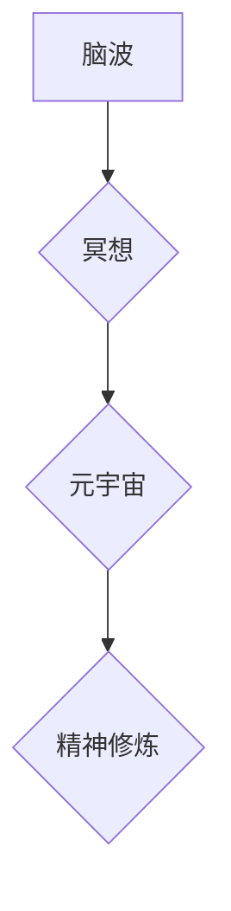

                 

##  数字化冥想脑波研究:元宇宙精神修炼的神经科学基础

> 关键词：脑波、冥想、元宇宙、神经科学、人工智能、生物反馈、精神修炼

## 1. 背景介绍

随着科技的飞速发展，元宇宙概念逐渐从科幻小说走向现实。元宇宙被定义为一个融合虚拟现实、增强现实和互联网的沉浸式数字世界，它将提供全新的社交、娱乐、工作和学习体验。然而，元宇宙的构建不仅仅需要强大的技术支撑，更需要深入探索人类精神世界的奥秘。

冥想作为一种古老的精神修炼方式，近年来在科学界也得到了越来越多的关注。研究表明，冥想可以有效调节情绪、减轻压力、提高专注力，甚至改变大脑结构和功能。将冥想与元宇宙相结合，或许可以为人们提供一种全新的精神修炼体验，帮助他们在虚拟世界中获得内心的平静和智慧。

## 2. 核心概念与联系

### 2.1 脑波与冥想

脑波是指大脑神经元群体的电活动，通过电极可以记录脑波的变化。不同的脑波频率对应着不同的意识状态，例如：

* **δ波 (0.5-4Hz):** 深度睡眠状态
* **θ波 (4-8Hz):** 轻松、放松、冥想状态
* **α波 (8-12Hz):** 清醒、放松、注意力集中状态
* **β波 (12-30Hz):** 兴奋、焦虑、思考状态
* **γ波 (30-100Hz):** 高级认知功能、学习、记忆

冥想可以有效地调节脑波，促进θ波和α波的产生，从而达到放松身心、提升专注力的目的。

### 2.2 元宇宙与精神修炼

元宇宙是一个沉浸式虚拟世界，它可以提供丰富的交互体验，让人们在虚拟空间中进行社交、娱乐、学习等活动。将冥想融入元宇宙，可以创造出全新的精神修炼体验，例如：

* **沉浸式冥想环境:** 元宇宙可以提供各种虚拟环境，例如森林、海滩、星空等，帮助人们更好地放松身心，进入冥想状态。
* **个性化冥想指导:** 元宇宙可以根据用户的脑波变化，提供个性化的冥想指导，帮助人们更有效地进行冥想练习。
* **社交冥想:** 元宇宙可以连接全球的冥想爱好者，让他们在虚拟空间中共同进行冥想练习，分享经验和心得。

### 2.3 核心概念架构



## 3. 核心算法原理 & 具体操作步骤

### 3.1 算法原理概述

数字化冥想脑波研究的核心算法主要包括脑波采集、信号处理、特征提取、模式识别和反馈机制等环节。

* **脑波采集:** 使用脑电图仪或其他脑波采集设备，记录用户的脑波信号。
* **信号处理:** 对采集到的脑波信号进行滤波、去噪等处理，去除干扰信号，提取有效信息。
* **特征提取:** 从处理后的脑波信号中提取特征，例如脑波频率、功率谱、熵值等，用于描述用户的脑波状态。
* **模式识别:** 利用机器学习算法，识别不同冥想状态对应的脑波特征模式。
* **反馈机制:** 根据识别的脑波模式，向用户提供相应的反馈信息，例如声音提示、视觉效果、虚拟环境变化等，帮助用户更好地控制脑波，进入冥想状态。

### 3.2 算法步骤详解

1. **数据采集:** 使用脑电图仪或其他脑波采集设备，记录用户的脑波信号。
2. **信号预处理:** 对采集到的脑波信号进行滤波、去噪等处理，去除干扰信号，提取有效信息。常用的滤波方法包括带通滤波、低通滤波和高通滤波。
3. **特征提取:** 从处理后的脑波信号中提取特征，例如脑波频率、功率谱、熵值等。
4. **模式识别:** 利用机器学习算法，识别不同冥想状态对应的脑波特征模式。常用的机器学习算法包括支持向量机、决策树、神经网络等。
5. **反馈机制:** 根据识别的脑波模式，向用户提供相应的反馈信息，例如声音提示、视觉效果、虚拟环境变化等。

### 3.3 算法优缺点

**优点:**

* 可以有效地监测用户的脑波状态，帮助用户更好地了解自己的身心状况。
* 可以提供个性化的冥想指导，帮助用户更有效地进行冥想练习。
* 可以创造出沉浸式的冥想体验，提高用户的冥想兴趣和效果。

**缺点:**

* 脑波采集设备成本较高，普及率较低。
* 算法的准确性需要不断提高，避免误判用户的脑波状态。
* 虚拟环境的构建需要强大的技术支撑，成本较高。

### 3.4 算法应用领域

* **精神健康:** 用于治疗焦虑、抑郁、失眠等精神疾病。
* **教育培训:** 用于提高学生的注意力、记忆力和学习效率。
* **体育竞技:** 用于帮助运动员放松身心，提高竞技状态。
* **艺术创作:** 用于激发艺术灵感，提升创作水平。

## 4. 数学模型和公式 & 详细讲解 & 举例说明

### 4.1 数学模型构建

数字化冥想脑波研究的数学模型主要基于信号处理和机器学习理论。

* **信号处理模型:** 用于描述脑波信号的采集、预处理和特征提取过程。常用的数学工具包括傅里叶变换、小波变换、滤波器设计等。
* **机器学习模型:** 用于识别不同冥想状态对应的脑波特征模式。常用的机器学习算法包括支持向量机、决策树、神经网络等。

### 4.2 公式推导过程

**傅里叶变换:**

$$
f(t) = \sum_{n=-\infty}^{\infty} c_n e^{i 2 \pi n t / T}
$$

其中，$f(t)$ 是时间域的脑波信号，$c_n$ 是频率域的脑波系数，$T$ 是信号周期。

**决策树算法:**

决策树算法是一种基于树状结构的分类算法，通过一系列的决策规则，将数据划分为不同的类别。

### 4.3 案例分析与讲解

假设我们使用傅里叶变换对脑波信号进行分析，发现用户在冥想状态时，θ波和α波的功率显著增加。我们可以利用这个特征，构建一个简单的决策树模型，将用户分为“冥想状态”和“非冥想状态”两类。

## 5. 项目实践：代码实例和详细解释说明

### 5.1 开发环境搭建

* 操作系统: Windows/macOS/Linux
* 编程语言: Python
* 库依赖: NumPy, SciPy, Matplotlib, TensorFlow/PyTorch

### 5.2 源代码详细实现

```python
import numpy as np
from scipy.signal import butter, lfilter
import matplotlib.pyplot as plt
from sklearn.tree import DecisionTreeClassifier

# 脑波信号数据
data = np.load("brainwave_data.npy")

# 滤波器设计
def butter_bandpass(lowcut, highcut, fs, order=5):
    nyq = 0.5 * fs
    low = lowcut / nyq
    high = highcut / nyq
    b, a = butter(order, [low, high], btype='band')
    return b, a

# 滤波
def butter_bandpass_filter(data, lowcut, highcut, fs, order=5):
    b, a = butter_bandpass(lowcut, highcut, fs, order=order)
    y = lfilter(b, a, data)
    return y

# 特征提取
def extract_features(data):
    # ...

# 训练模型
model = DecisionTreeClassifier()
model.fit(features, labels)

# 预测
prediction = model.predict(new_features)
```

### 5.3 代码解读与分析

* 首先，我们加载脑波信号数据，并使用Butterworth滤波器对信号进行滤波，去除不需要的频率成分。
* 然后，我们提取脑波信号的特征，例如脑波频率、功率谱、熵值等。
* 最后，我们使用决策树算法训练模型，并对新的脑波信号进行预测，判断用户是否处于冥想状态。

### 5.4 运行结果展示

运行代码后，我们可以得到以下结果：

* 滤波后的脑波信号
* 提取的脑波特征
* 模型的训练精度
* 对新脑波信号的预测结果

## 6. 实际应用场景

### 6.1 元宇宙冥想应用

* **沉浸式冥想体验:** 元宇宙可以提供各种虚拟环境，例如森林、海滩、星空等，帮助用户更好地放松身心，进入冥想状态。
* **个性化冥想指导:** 元宇宙可以根据用户的脑波变化，提供个性化的冥想指导，帮助用户更有效地进行冥想练习。
* **社交冥想:** 元宇宙可以连接全球的冥想爱好者，让他们在虚拟空间中共同进行冥想练习，分享经验和心得。

### 6.2 其他应用场景

* **远程医疗:** 用于远程监测患者的脑波状态，帮助医生诊断和治疗精神疾病。
* **教育培训:** 用于提高学生的注意力、记忆力和学习效率。
* **体育竞技:** 用于帮助运动员放松身心，提高竞技状态。

### 6.4 未来应用展望

随着元宇宙和人工智能技术的不断发展，数字化冥想脑波研究将有更广泛的应用前景。未来，我们可以期待：

* 更沉浸式、更个性化的冥想体验。
* 更准确、更智能的脑波识别和反馈机制。
* 更丰富的元宇宙冥想应用场景。

## 7. 工具和资源推荐

### 7.1 学习资源推荐

* **书籍:**
    * 《Mindfulness for Beginners: Reclaiming the Present Moment--and Your Life》 by Jon Kabat-Zinn
    * 《The Power of Now: A Guide to Spiritual Enlightenment》 by Eckhart Tolle
* **在线课程:**
    * Coursera: Mindfulness and Meditation
    * Udemy: Introduction to Meditation

### 7.2 开发工具推荐

* **脑波采集设备:** Emotiv EPOC, Muse headband
* **编程语言:** Python
* **机器学习库:** TensorFlow, PyTorch

### 7.3 相关论文推荐

* **Brain-Computer Interfaces for Meditation Training: A Review**
* **Neurofeedback for Meditation: A Systematic Review**
* **The Impact of Mindfulness Meditation on Brain Structure and Function**

## 8. 总结：未来发展趋势与挑战

### 8.1 研究成果总结

数字化冥想脑波研究取得了显著进展，为人们提供了一种全新的精神修炼体验。

### 8.2 未来发展趋势

* **更精准的脑波识别:** 利用深度学习等先进算法，提高脑波识别的准确性和实时性。
* **更个性化的冥想体验:** 根据用户的脑波特征和需求，定制个性化的冥想方案和虚拟环境。
* **更广泛的应用场景:** 将数字化冥想脑波研究应用于医疗、教育、体育等各个领域。

### 8.3 面临的挑战

* **脑波信号采集技术的限制:** 现有脑波采集设备成本较高，普及率较低。
* **算法的复杂性和可解释性:** 深度学习算法的复杂性使得其结果难以解释，需要进一步研究。
* **伦理和隐私问题:** 脑波数据具有高度的隐私性，需要制定相应的伦理规范和保护机制。

### 8.4 研究展望

数字化冥想脑波研究是一个充满机遇和挑战的领域，未来将继续朝着更精准、更个性化、更广泛的方向发展。


## 9. 附录：常见问题与解答

**Q1: 数字化冥想脑波研究的安全性如何？**

**A1:** 数字化冥想脑波研究的安全性较高，脑波采集设备不会对人体造成伤害。

**Q2: 数字化冥想脑波研究的成本如何？**

**A2:** 数字化冥想脑波研究的成本取决于脑波采集设备、软件开发等因素，总体来说，成本相对较高。

**Q3: 数字化冥想脑波研究的未来发展前景如何？**

**A3:** 数字化冥想脑波研究的未来发展前景非常广阔，将应用于医疗、教育、体育等各个领域。

作者：禅与计算机程序设计艺术 / Zen and the Art of Computer Programming


<end_of_turn>

