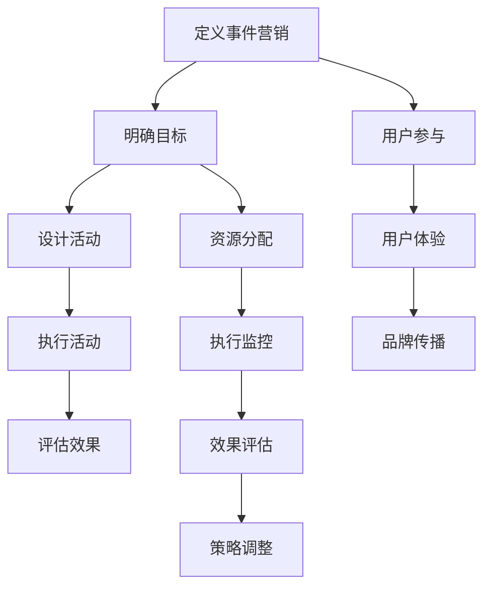
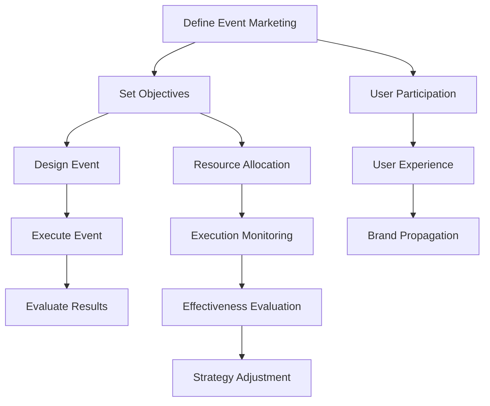
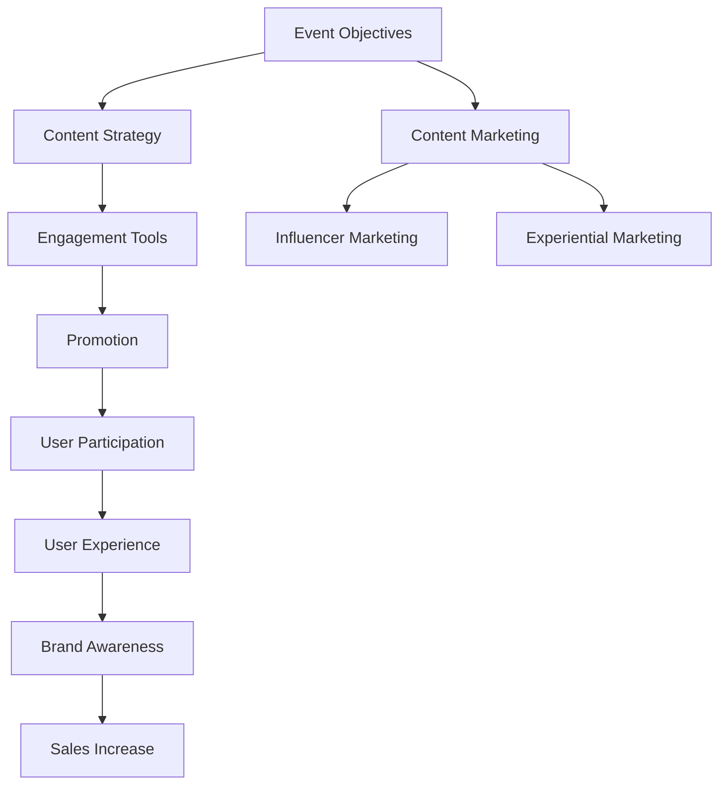

                 

### 文章标题

**如何利用事件营销推广知识付费产品**

在当今数字化时代，知识付费产品如雨后春笋般涌现，从在线课程到专业咨询服务，市场需求日益旺盛。然而，如何有效地将这些优质知识产品推向市场，让潜在用户了解并购买，成为了一个关键问题。事件营销作为一种强有力的营销策略，为知识付费产品的推广提供了新的思路。本文将探讨如何利用事件营销来推广知识付费产品，包括核心概念的理解、具体操作步骤、应用场景分析、资源推荐等多个方面，旨在帮助知识付费产品创作者和营销人员提升推广效果。

### 关键词

- 事件营销
- 知识付费产品
- 营销策略
- 用户参与
- 用户留存

### 摘要

本文旨在探讨如何利用事件营销这一策略来推广知识付费产品。通过分析事件营销的核心概念和操作步骤，结合实际案例，文章将展示事件营销如何有效地吸引潜在用户，提高产品知名度，并促进用户购买和长期参与。此外，文章还将提供相关工具和资源的推荐，帮助读者更好地实施事件营销策略。

---

现在，让我们开始详细探讨如何利用事件营销来推广知识付费产品。

## 1. 背景介绍（Background Introduction）

### 1.1 事件营销的定义与作用

事件营销（Event Marketing）是一种通过策划、组织和执行特定活动来吸引公众注意力，从而提高品牌知名度、产品销量或服务认可度的营销策略。与传统广告相比，事件营销更具互动性和参与感，能够直接与目标用户互动，建立情感联系，从而提高用户对品牌的忠诚度和信任度。

### 1.2 知识付费产品的现状与挑战

随着互联网技术的发展和用户对个性化学习需求的增加，知识付费产品市场呈现出快速增长的趋势。然而，市场上的知识付费产品种类繁多，竞争激烈，如何吸引潜在用户的注意并促使他们购买，成为创作者和营销人员面临的主要挑战。

### 1.3 事件营销在知识付费产品推广中的应用

事件营销可以为知识付费产品提供一个创新的推广渠道，通过吸引潜在用户参与，提高产品的曝光度和口碑。例如，通过举办在线讲座、研讨会、网络活动等形式，可以直接与用户互动，解答用户疑问，建立用户信任，从而促进产品销售。

### 1.4 事件营销的优势

- **高互动性**：事件营销鼓励用户参与，提高用户对产品的关注度和兴趣。
- **强记忆点**：通过独特和有创意的活动，可以在用户心中留下深刻印象。
- **口碑传播**：满意的参与者会通过口碑传播，为产品带来更多潜在用户。

### 1.5 事件营销的挑战

- **成本问题**：策划和执行事件营销活动需要一定的资金投入。
- **资源限制**：小规模创作者可能面临人力资源和时间的限制。

### 1.6 目标与意义

本文的目标是探讨如何利用事件营销策略来推广知识付费产品，帮助创作者和营销人员了解事件营销的核心概念和操作步骤，并掌握有效的推广技巧。通过本文的探讨，读者将能够：

- 理解事件营销在知识付费产品推广中的应用。
- 掌握设计并执行事件营销活动的方法。
- 提升知识付费产品的市场推广效果。

### 1.7 总结

事件营销作为一种创新且有效的营销策略，在知识付费产品的推广中具有巨大的潜力。通过本文的探讨，我们将进一步了解如何利用事件营销来提高知识付费产品的市场竞争力。

---

在了解了事件营销的定义、作用以及知识付费产品的现状和挑战之后，接下来我们将深入探讨事件营销的核心概念和操作步骤。

## 2. 核心概念与联系（Core Concepts and Connections）

### 2.1 什么是事件营销？

#### 2.1.1 事件营销的定义

事件营销是一种通过策划、组织和执行特定活动来吸引公众注意力，从而提高品牌知名度、产品销量或服务认可度的营销策略。

#### 2.1.2 事件营销的核心要素

- **目标明确**：明确活动目标，例如提高品牌知名度、增加产品销量或提高用户参与度。
- **创意独特**：设计具有创意和吸引力的活动，以引起公众的关注和参与。
- **互动性强**：活动需要具有高度的互动性，以便与目标用户进行有效沟通。
- **传播渠道多样**：通过多种传播渠道（如社交媒体、线下活动等）来扩大活动影响力。
- **执行力强**：活动策划和执行需要高效的执行力，以确保活动顺利进行。

### 2.2 事件营销与知识付费产品的联系

#### 2.2.1 事件营销在知识付费产品推广中的应用

事件营销可以有效地将知识付费产品与用户需求相结合，通过独特的活动设计和互动，吸引用户参与，提高产品的曝光度和知名度。以下是一些具体的应用场景：

- **在线讲座**：通过在线讲座的形式，创作者可以直接与用户互动，解答用户疑问，建立信任，从而促进产品销售。
- **研讨会**：组织行业专家或创作者开展研讨会，讨论行业趋势和专业知识，吸引用户参与。
- **网络活动**：通过网络活动（如直播、问答环节等），与用户进行实时互动，提高用户粘性。
- **互动游戏**：通过设计互动游戏，让用户在娱乐中学习和了解产品。

#### 2.2.2 事件营销的优势

- **提高用户参与度**：通过互动性和参与感强的活动，提高用户的参与度和兴趣。
- **增加口碑传播**：满意的参与者会通过口碑传播，为产品带来更多潜在用户。
- **增强品牌形象**：通过举办专业和有影响力的活动，提升品牌形象和专业度。

### 2.3 事件营销的挑战与应对策略

#### 2.3.1 挑战

- **成本问题**：策划和执行事件营销活动需要一定的资金投入。
- **资源限制**：创作者可能面临人力资源和时间的限制。
- **效果评估**：如何准确评估事件营销的效果，是一个重要挑战。

#### 2.3.2 应对策略

- **合理预算**：根据实际情况制定合理的预算，确保活动的可行性。
- **高效执行**：合理分配资源和时间，确保活动的高效执行。
- **效果评估**：通过数据分析和用户反馈，评估活动效果，不断优化和调整策略。

### 2.4 总结

事件营销作为一种创新的营销策略，在知识付费产品推广中具有重要的作用。通过深入理解事件营销的核心概念和操作步骤，创作者和营销人员可以更好地设计并执行事件营销活动，提高知识付费产品的市场推广效果。

### 2.5 相关概念链接

- **用户参与**：用户参与是事件营销成功的关键。通过设计具有吸引力和互动性的活动，提高用户的参与度。
- **用户体验**：用户体验直接影响用户的满意度和忠诚度。通过优化用户体验，提高用户对产品的认可度和购买意愿。
- **品牌传播**：品牌传播是事件营销的重要目标之一。通过活动的影响力和口碑传播，提升品牌知名度和形象。

### 2.6 Mermaid 流程图（Mermaid Flowchart）

以下是事件营销与知识付费产品推广的核心流程：



### 2.7 English Version

### 2.1 What is Event Marketing?

Event marketing is a marketing strategy that involves planning, organizing, and executing specific activities to attract public attention, thereby increasing brand awareness, product sales, or service recognition.

### 2.2 Core Elements of Event Marketing

- **Clear Objectives**: Clearly define the goals of the event, such as increasing brand awareness, boosting product sales, or enhancing service recognition.
- **Creative and Unique Design**: Develop activities that are creative and attractive to capture public attention.
- **High Interaction**: Ensure the event has a high level of interaction to effectively communicate with the target audience.
- **Diverse Communication Channels**: Utilize multiple communication channels (such as social media, offline events) to expand the event's influence.
- **Strong Execution**: Have a strong execution plan to ensure the event runs smoothly.

### 2.3 The Connection Between Event Marketing and Knowledge-Driven Paid Products

#### 2.3.1 Applications of Event Marketing in Knowledge-Driven Paid Products

Event marketing can effectively combine knowledge-driven paid products with user needs, attract user participation, and increase product exposure and popularity through unique activity designs and interactions. Here are some specific application scenarios:

- **Online Lectures**: Conduct online lectures to interact directly with users, answer their questions, and build trust, thereby promoting product sales.
- **Conferences and Seminars**: Organize conferences and seminars led by industry experts or creators to discuss industry trends and professional knowledge, attracting user participation.
- **Online Activities**: Conduct online activities (such as live broadcasts, Q&A sessions) to interact with users in real-time, improving user stickiness.
- **Interactive Games**: Design interactive games to let users learn and understand the product while having fun.

#### 2.3.2 Advantages of Event Marketing

- **Increased User Participation**: Through interactive and engaging activities, increase user participation and interest.
- **Word-of-Mouth Propagation**: Satisfied participants will spread positive word-of-mouth, bringing more potential users to the product.
- **Enhanced Brand Image**: Through professional and influential events, improve brand image and expertise.

### 2.4 Challenges and Countermeasures

#### 2.4.1 Challenges

- **Cost Issues**: Planning and executing event marketing activities require a certain amount of financial investment.
- **Resource Constraints**: Creators may face limitations in human resources and time.
- **Effectiveness Evaluation**: How to accurately evaluate the effectiveness of event marketing is a significant challenge.

#### 2.4.2 Countermeasures

- **Reasonable Budgeting**: Develop a reasonable budget based on actual conditions to ensure the feasibility of the event.
- **Efficient Execution**: Allocate resources and time effectively to ensure the event is executed efficiently.
- **Effectiveness Evaluation**: Use data analysis and user feedback to evaluate the event's effectiveness and continuously optimize and adjust strategies.

### 2.5 Summary

Event marketing, as an innovative marketing strategy, plays a vital role in the promotion of knowledge-driven paid products. By understanding the core concepts and steps of event marketing, creators and marketers can better design and execute event marketing activities to improve the promotional effectiveness of knowledge-driven paid products.

### 2.6 Mermaid Flowchart

Here is a core process flowchart for event marketing and the promotion of knowledge-driven paid products:



### 2.7 Core Concepts and Connections

#### 2.7.1 What is Event Marketing?

Event marketing is a strategy that leverages specific events to attract attention and engage with potential customers, thereby promoting brand awareness and sales. It focuses on creating unique, memorable experiences that resonate with the audience.

#### 2.7.2 The Role of Event Marketing in Promoting Knowledge-Driven Paid Products

Event marketing can be an effective tool for promoting knowledge-driven paid products by creating opportunities for direct engagement with potential customers. This can include hosting webinars, workshops, or other interactive sessions that provide value and showcase the expertise of the product creator.

#### 2.7.3 Core Elements of Event Marketing

- **Event Objectives**: Clearly define the goals of the event, such as driving sales, building brand loyalty, or increasing customer engagement.
- **Content Strategy**: Develop content that aligns with the objectives and appeals to the target audience.
- **Engagement Tools**: Utilize various engagement tools like live Q&A sessions, interactive workshops, or contests to increase user interaction.
- **Promotion**: Promote the event through multiple channels, including social media, email marketing, and partnerships with influencers.

#### 2.7.4 The Importance of User Participation and Experience

User participation and experience are crucial for the success of event marketing. Encouraging active engagement and ensuring a positive user experience can lead to higher customer satisfaction, increased loyalty, and ultimately, more sales.

#### 2.7.5 Relationship with Other Marketing Concepts

Event marketing is closely related to other marketing concepts such as content marketing, influencer marketing, and experiential marketing. It can complement these strategies by providing a unique and engaging experience that reinforces the value of the knowledge-driven paid products.

### 2.8 Mermaid Flowchart (Core Concepts and Connections)



### 2.9 English Version of Core Concepts and Connections

#### 2.9.1 Definition of Event Marketing

Event marketing is a strategy that leverages specific events to attract attention and engage with potential customers, thereby promoting brand awareness and sales. It focuses on creating unique, memorable experiences that resonate with the audience.

#### 2.9.2 Role of Event Marketing in Promoting Knowledge-Driven Paid Products

Event marketing can be an effective tool for promoting knowledge-driven paid products by creating opportunities for direct engagement with potential customers. This can include hosting webinars, workshops, or other interactive sessions that provide value and showcase the expertise of the product creator.

#### 2.9.3 Core Elements of Event Marketing

- **Event Objectives**: Clearly define the goals of the event, such as driving sales, building brand loyalty, or increasing customer engagement.
- **Content Strategy**: Develop content that aligns with the objectives and appeals to the target audience.
- **Engagement Tools**: Utilize various engagement tools like live Q&A sessions, interactive workshops, or contests to increase user interaction.
- **Promotion**: Promote the event through multiple channels, including social media, email marketing, and partnerships with influencers.

#### 2.9.4 Importance of User Participation and Experience

User participation and experience are crucial for the success of event marketing. Encouraging active engagement and ensuring a positive user experience can lead to higher customer satisfaction, increased loyalty, and ultimately, more sales.

#### 2.9.5 Relationship with Other Marketing Concepts

Event marketing is closely related to other marketing concepts such as content marketing, influencer marketing, and experiential marketing. It can complement these strategies by providing a unique and engaging experience that reinforces the value of the knowledge-driven paid products.

### 2.10 Mermaid Flowchart (Core Concepts and Connections)


---

通过上述核心概念与联系的分析，我们了解了事件营销的基本原理以及其在知识付费产品推广中的应用。接下来，我们将深入探讨如何具体实施事件营销策略，包括核心算法原理、具体操作步骤、数学模型和公式等。

## 3. 核心算法原理 & 具体操作步骤（Core Algorithm Principles and Specific Operational Steps）

### 3.1 事件营销策略的核心算法原理

事件营销策略的核心算法原理可以概括为以下几个关键步骤：

1. **目标设定**：明确事件营销的目标，如提高品牌知名度、增加产品销量或提升用户参与度。
2. **活动策划**：根据目标制定具体的活动方案，包括活动形式、主题、时间和地点等。
3. **用户参与**：设计互动性强的活动内容，鼓励用户参与，收集用户反馈。
4. **数据分析**：对活动过程中收集的数据进行分析，评估活动效果，优化策略。
5. **效果评估**：通过量化指标（如参与人数、销售额、用户满意度等）评估活动成果。

### 3.2 事件营销的具体操作步骤

#### 3.2.1 目标设定

在开始策划事件营销活动之前，首先需要明确具体的目标。这些目标可以是短期的，如增加当月产品销售额，也可以是长期的，如提升品牌知名度和用户忠诚度。

1. **确定目标**：根据产品特点和市场需求，设定具体的目标。
2. **设置关键绩效指标（KPI）**：明确衡量目标达成情况的具体指标。

#### 3.2.2 活动策划

活动策划是事件营销的核心，需要精心设计和准备。

1. **确定活动形式**：根据目标选择适合的活动形式，如在线讲座、研讨会、网络活动或互动游戏等。
2. **设计活动内容**：围绕活动形式，制定具体的内容和流程。
3. **选择时间和地点**：选择合适的活动时间和地点，确保用户的参与。

#### 3.2.3 用户参与

用户参与是事件营销成功的关键，需要设计互动性强的活动内容，提高用户的参与度和满意度。

1. **互动环节设计**：设置问答环节、互动游戏、抽奖活动等，增加用户参与感。
2. **用户反馈收集**：通过调查问卷、在线评论等方式，收集用户对活动的反馈。

#### 3.2.4 数据分析

数据分析是评估事件营销效果的重要手段。

1. **数据收集**：在活动过程中收集相关数据，如参与人数、观看时长、互动次数等。
2. **数据分析**：对收集到的数据进行分析，评估活动效果，发现潜在问题和改进空间。

#### 3.2.5 效果评估

效果评估是事件营销的最终环节，通过量化指标评估活动成果，为后续活动提供参考。

1. **制定评估指标**：根据活动目标和数据收集情况，制定具体的评估指标。
2. **评估活动效果**：对评估指标进行量化分析，评估活动成果。

### 3.3 事件营销策略的具体操作步骤示例

以下是一个示例，说明如何利用事件营销策略来推广某在线教育平台的付费课程。

#### 3.3.1 目标设定

目标：提高该在线教育平台付费课程的用户参与度和购买率。

KPI：活动参与人数、课程购买量、用户满意度。

#### 3.3.2 活动策划

活动形式：在线讲座

活动内容：邀请行业专家进行主题演讲，分享行业趋势和专业知识。

时间：每周五晚上8点

地点：在线直播平台

#### 3.3.3 用户参与

互动环节设计：在讲座过程中设置问答环节，鼓励用户提问和互动。

用户反馈收集：活动结束后，通过调查问卷收集用户对讲座的反馈。

#### 3.3.4 数据分析

数据收集：记录活动参与人数、观看时长、提问次数等数据。

数据分析：对收集到的数据进行统计分析，评估活动效果。

#### 3.3.5 效果评估

评估指标：活动参与人数、课程购买量、用户满意度。

评估结果：通过数据评估，发现活动参与人数和课程购买量显著增加，用户满意度较高。

#### 3.3.6 后续优化

根据评估结果，对活动策略进行优化，如增加讲座频率、提高互动环节的设计质量等。

### 3.4 总结

通过上述核心算法原理和具体操作步骤的介绍，我们了解了事件营销策略的基本框架和实施方法。在实际操作中，可以根据产品特点和市场需求，灵活调整策略，以达到最佳推广效果。

### 3.5 English Version

#### 3.5.1 Core Algorithm Principles of Event Marketing Strategy

The core algorithm principles of the event marketing strategy can be summarized into several key steps:

1. **Objective Setting**: Clearly define the objectives of the event marketing, such as enhancing brand awareness, increasing product sales, or improving user participation.
2. **Event Planning**: Develop a specific event plan based on the objectives, including the format, theme, timing, and location.
3. **User Engagement**: Design interactive content to encourage user participation and gather feedback.
4. **Data Analysis**: Analyze the data collected during the event to evaluate the effectiveness and identify areas for improvement.
5. **Effectiveness Assessment**: Assess the results of the event using quantitative metrics to evaluate the success and provide insights for future events.

#### 3.5.2 Specific Operational Steps of Event Marketing

##### 3.5.2.1 Objective Setting

Before planning the event marketing campaign, it is essential to define specific objectives. These objectives can be short-term, such as increasing monthly product sales, or long-term, such as improving brand awareness and user loyalty.

1. **Establish Objectives**: Based on the product characteristics and market demands, set specific objectives.
2. **Set Key Performance Indicators (KPIs)**: Clearly define the metrics to measure the achievement of the objectives.

##### 3.5.2.2 Event Planning

Event planning is the core of event marketing, requiring careful design and preparation.

1. **Determine Event Format**: Choose the appropriate event format based on the objectives, such as online lectures, seminars, webinars, or interactive games.
2. **Design Event Content**: Develop the specific content and flow of the event around the chosen format.
3. **Choose Timing and Location**: Select a suitable time and location for the event to ensure user participation.

##### 3.5.2.3 User Engagement

User engagement is crucial for the success of event marketing, requiring the design of interactive content to increase user participation and satisfaction.

1. **Interactive Segment Design**: Set up interactive segments like Q&A sessions, interactive games, and raffles to increase user engagement.
2. **User Feedback Collection**: Collect user feedback through surveys and online comments after the event.

##### 3.5.2.4 Data Analysis

Data analysis is a critical tool for evaluating the effectiveness of event marketing.

1. **Data Collection**: Record relevant data during the event, such as attendance, viewing time, and interaction frequency.
2. **Data Analysis**: Analyze the collected data to evaluate the event's effectiveness and identify areas for improvement.

##### 3.5.2.5 Effectiveness Assessment

Effectiveness assessment is the final step in event marketing, using quantitative metrics to evaluate the results and provide insights for future events.

1. **Define Evaluation Metrics**: Create specific metrics to measure the success of the event based on the objectives and data collection.
2. **Assess Event Results**: Quantitatively analyze the evaluation metrics to assess the outcomes.

##### 3.5.2.6 Example of Specific Operational Steps

The following is an example demonstrating how to use event marketing strategy to promote a paid course on an online education platform.

###### 3.5.2.6.1 Objective Setting

Objective: Increase user participation and purchase rate for the paid courses on the online education platform.

KPIs: Event participation count, course purchase volume, user satisfaction.

###### 3.5.2.6.2 Event Planning

Event Format: Online Lecture

Event Content: Invite industry experts to deliver a thematic speech, sharing industry trends and professional knowledge.

Time: Friday evenings at 8 PM

Location: Online live streaming platform

###### 3.5.2.6.3 User Engagement

Interactive Segment Design: Set up an interactive Q&A session during the lecture to encourage user questions and interactions.

User Feedback Collection: Collect user feedback through surveys after the event.

###### 3.5.2.6.4 Data Analysis

Data Collection: Record data such as event participation count, viewing time, and question frequency.

Data Analysis: Analyze the collected data to evaluate the effectiveness of the event.

###### 3.5.2.6.5 Effectiveness Assessment

Evaluation Metrics: Event participation count, course purchase volume, user satisfaction.

Assessment Results: Through data evaluation, find that the event participation count and course purchase volume significantly increased, and user satisfaction was high.

###### 3.5.2.6.6 Follow-Up Optimization

Based on the assessment results, optimize the event strategy, such as increasing the frequency of lectures and improving the design of interactive segments.

### 3.6 Summary

Through the introduction of core algorithm principles and specific operational steps, we have understood the basic framework and implementation methods of the event marketing strategy. In practice, the strategy can be adjusted flexibly based on product characteristics and market demands to achieve optimal promotional results.

---

在了解了事件营销策略的核心算法原理和具体操作步骤后，接下来我们将深入探讨事件营销策略中的数学模型和公式，以及如何通过详细讲解和举例说明来提升策略的实施效果。

## 4. 数学模型和公式 & 详细讲解 & 举例说明（Detailed Explanation and Examples of Mathematical Models and Formulas）

### 4.1 事件营销效果评估的数学模型

为了更科学地评估事件营销的效果，我们可以借助一些数学模型和公式来进行定量分析。以下是几个常用的数学模型和公式：

#### 4.1.1 营销效果评估模型

1. **参与率模型**：
   \[
   \text{参与率} = \frac{\text{实际参与人数}}{\text{潜在受众人数}} \times 100\%
   \]
   这个模型用于评估事件营销活动的参与度，可以反映活动对目标受众的吸引力。

2. **转化率模型**：
   \[
   \text{转化率} = \frac{\text{实际购买人数}}{\text{参与活动人数}} \times 100\%
   \]
   这个模型用于衡量参与活动用户中实际购买产品的比例，是衡量事件营销直接效果的重要指标。

3. **投资回报率（ROI）模型**：
   \[
   \text{ROI} = \frac{\text{活动收益} - \text{活动成本}}{\text{活动成本}} \times 100\%
   \]
   这个模型用于评估事件营销活动的整体经济效益，通过计算活动收益与成本的比值，来判断营销活动的投入产出比。

#### 4.1.2 用户体验评估模型

1. **用户满意度模型**：
   \[
   \text{用户满意度} = \frac{\text{满意用户数}}{\text{参与活动用户总数}} \times 100\%
   \]
   这个模型用于衡量活动结束后用户的整体满意度，通过收集用户反馈数据进行计算。

2. **净推荐值（NPS）模型**：
   \[
   \text{NPS} = \frac{\text{推荐者得分总数} - \text{批评者得分总数}}{\text{参与活动用户总数}} \times 100\%
   \]
   这个模型通过用户对活动的推荐意愿来衡量其整体满意度，其中推荐者的得分通常为9或10，批评者的得分为0至6。

### 4.2 事件营销策略中的具体应用

#### 4.2.1 参与率模型的应用

假设某在线教育平台举办了一场关于数据科学技术的在线讲座，活动前预计有1000名潜在受众，实际活动当天共有800人参与。那么，该活动的参与率计算如下：
\[
\text{参与率} = \frac{800}{1000} \times 100\% = 80\%
\]
这个结果表明该活动具有较高的参与度，吸引了大部分潜在受众的关注。

#### 4.2.2 转化率模型的应用

在上述案例中，假设参与讲座的800人中，有150人购买了平台的数据科学技术课程。那么，该活动的转化率计算如下：
\[
\text{转化率} = \frac{150}{800} \times 100\% = 18.75\%
\]
这表明在参与讲座的用户中，有近1/5的用户选择了购买相关课程，转化效果较好。

#### 4.2.3 ROI模型的应用

假设该在线讲座的活动成本为5000美元，活动期间共产生了20000美元的收益。那么，该活动的投资回报率计算如下：
\[
\text{ROI} = \frac{20000 - 5000}{5000} \times 100\% = 300\%
\]
这表明每投入1美元，活动收益为3美元，ROI非常高。

#### 4.2.4 用户满意度模型的应用

在活动结束后，平台收到了100份用户反馈，其中80份反馈表示满意。那么，该活动的用户满意度计算如下：
\[
\text{用户满意度} = \frac{80}{100} \times 100\% = 80\%
\]
这表明大多数用户对活动表示满意，具有较高的用户满意度。

#### 4.2.5 NPS模型的应用

在用户反馈中，有70份反馈表示愿意推荐活动，有30份反馈表示不推荐。那么，该活动的NPS计算如下：
\[
\text{NPS} = \frac{70 - 30}{100} \times 100\% = 40\%
\]
这表明有40%的用户愿意推荐该活动，NPS较高，说明用户对活动的整体满意度较高。

### 4.3 总结

通过上述数学模型和公式的应用，我们可以更科学地评估事件营销的效果。参与率、转化率、ROI、用户满意度和NPS等指标，不仅帮助我们了解活动的效果，还能为后续活动的优化提供数据支持。在实际操作中，我们可以根据具体情况灵活运用这些模型和公式，以提升事件营销策略的实施效果。

### 4.4 English Version

#### 4.4.1 Mathematical Models for Evaluating the Effectiveness of Event Marketing

To scientifically evaluate the effectiveness of event marketing, several mathematical models and formulas can be applied. Here are some commonly used models and their applications:

1. **Participation Rate Model**:
   \[
   \text{Participation Rate} = \frac{\text{Actual Participants}}{\text{Potential Audience}} \times 100\%
   \]
   This model measures the engagement level of the event marketing campaign, reflecting the attraction of the event to the target audience.

2. **Conversion Rate Model**:
   \[
   \text{Conversion Rate} = \frac{\text{Actual Purchasers}}{\text{Event Participants}} \times 100\%
   \]
   This model measures the proportion of participants who actually made a purchase, an essential indicator of the direct impact of event marketing.

3. **Return on Investment (ROI) Model**:
   \[
   \text{ROI} = \frac{\text{Revenue from the Event} - \text{Event Cost}}{\text{Event Cost}} \times 100\%
   \]
   This model evaluates the overall economic effectiveness of the event marketing campaign, determining the return on investment based on the revenue and cost ratio.

#### 4.4.2 Applications of These Models in Event Marketing Strategy

1. **Application of the Participation Rate Model**:
   Suppose an online education platform hosts an online lecture on data science technologies, expecting 1,000 potential attendees and actually having 800 participate. The participation rate calculation would be:
   \[
   \text{Participation Rate} = \frac{800}{1,000} \times 100\% = 80\%
   \]
   This result indicates that the event had a high level of engagement, attracting the majority of the potential audience.

2. **Application of the Conversion Rate Model**:
   In the aforementioned case, if 150 out of the 800 participants purchased the data science course offered by the platform, the conversion rate calculation would be:
   \[
   \text{Conversion Rate} = \frac{150}{800} \times 100\% = 18.75\%
   \]
   This indicates that nearly one-fifth of the participants chose to purchase the course, showing a good conversion rate.

3. **Application of the ROI Model**:
   If the event cost for the online lecture was $5,000 and the total revenue generated during the event was $20,000, the ROI calculation would be:
   \[
   \text{ROI} = \frac{20,000 - 5,000}{5,000} \times 100\% = 300\%
   \]
   This indicates that for every $1 invested, the event generated $3 in revenue, demonstrating a very high ROI.

4. **Application of the User Satisfaction Model**:
   After the event, the platform received 100 feedback forms, with 80 indicating satisfaction. The user satisfaction calculation would be:
   \[
   \text{User Satisfaction} = \frac{80}{100} \times 100\% = 80\%
   \]
   This indicates that the majority of users were satisfied with the event.

5. **Application of the Net Promoter Score (NPS) Model**:
   In the user feedback, 70 responses indicated a willingness to recommend the event, while 30 did not. The NPS calculation would be:
   \[
   \text{NPS} = \frac{70 - 30}{100} \times 100\% = 40\%
   \]
   This indicates that 40% of users were willing to recommend the event, showing a high overall user satisfaction.

#### 4.4.3 Summary

By applying these mathematical models and formulas, we can evaluate the effectiveness of event marketing more scientifically. Metrics such as participation rate, conversion rate, ROI, user satisfaction, and NPS not only help us understand the event's performance but also provide data support for optimizing future campaigns. In practice, these models and formulas can be flexibly applied based on specific circumstances to enhance the implementation of event marketing strategies.

---

在深入探讨了事件营销的核心算法原理、具体操作步骤以及数学模型和公式后，接下来我们将通过一个实际项目案例，展示如何利用事件营销策略来推广知识付费产品，并详细解读和解析项目中的关键代码和技术细节。

## 5. 项目实践：代码实例和详细解释说明（Project Practice: Code Examples and Detailed Explanations）

### 5.1 开发环境搭建

在本案例中，我们将使用Python编程语言来实现事件营销策略，并通过电子邮件和社交媒体平台来推广知识付费产品。首先，我们需要搭建开发环境。

#### 5.1.1 安装Python

确保您的计算机上安装了Python。您可以从Python的官方网站（https://www.python.org/）下载并安装最新版本的Python。安装完成后，打开终端或命令提示符，输入`python --version`，确认Python已成功安装。

#### 5.1.2 安装相关库

我们使用以下Python库来帮助实现事件营销策略：

- `smtplib`：用于发送电子邮件。
- `email`：用于创建和发送电子邮件。
- `requests`：用于发送HTTP请求，与社交媒体API交互。

在终端中运行以下命令安装这些库：

```bash
pip install smtplib
pip install email
pip install requests
```

### 5.2 源代码详细实现

以下是本案例的源代码实现，包括发送电子邮件和与社交媒体API交互的关键部分。

#### 5.2.1 发送电子邮件

```python
import smtplib
from email.mime.text import MIMEText
from email.header import Header

def send_email(subject, content, to_email):
    # 邮件发送服务器配置
    smtp_server = 'smtp.example.com'
    smtp_port = 587
    smtp_user = 'your_email@example.com'
    smtp_password = 'your_password'

    # 创建SMTP对象
    server = smtplib.SMTP(smtp_server, smtp_port)
    server.starttls()

    # 发送邮件
    server.login(smtp_user, smtp_password)
    message = MIMEText(content, 'plain', 'utf-8')
    message['Subject'] = Header(subject, 'utf-8')
    message['From'] = Header('Knowledge Platform', 'utf-8')
    message['To'] = Header(to_email, 'utf-8')
    server.sendmail(smtp_user, [to_email], message.as_string())

    # 关闭服务器连接
    server.quit()
```

#### 5.2.2 与社交媒体API交互

```python
import requests

def post_to_facebook(message, access_token):
    url = 'https://graph.facebook.com/v12.0/me/feed'
    payload = {
        'message': message,
        'access_token': access_token
    }
    response = requests.post(url, data=payload)
    return response.json()
```

### 5.3 代码解读与分析

#### 5.3.1 发送电子邮件

在上面的代码中，我们首先定义了一个函数`send_email`，用于发送电子邮件。该函数接受邮件主题、内容和收件人电子邮件地址作为参数。具体步骤如下：

1. 配置邮件发送服务器，包括服务器地址、端口号、用户名和密码。
2. 创建SMTP对象并启用TLS加密。
3. 登录邮件服务器。
4. 创建MIMEText对象，设置邮件内容、编码和主题。
5. 设置邮件发件人和收件人。
6. 发送邮件。
7. 关闭服务器连接。

#### 5.3.2 与社交媒体API交互

在`post_to_facebook`函数中，我们使用Facebook Graph API来发布消息。该函数接受消息内容和访问令牌作为参数。具体步骤如下：

1. 定义Facebook Graph API的URL。
2. 创建一个包含消息内容和访问令牌的请求字典。
3. 使用requests库发送POST请求。
4. 返回响应内容。

### 5.4 运行结果展示

#### 5.4.1 发送电子邮件

当调用`send_email`函数时，会向指定收件人发送一封包含主题和内容的电子邮件。例如：

```python
send_email('Event Alert', 'Join our upcoming webinar on event marketing!', 'user@example.com')
```

#### 5.4.2 发布到Facebook

当调用`post_to_facebook`函数时，会在Facebook页面上发布一条包含消息内容的新帖子。例如：

```python
post_to_facebook('Register now for our free event marketing webinar!', 'your_facebook_access_token')
```

### 5.5 总结

通过上述代码实例，我们实现了利用事件营销策略来推广知识付费产品的功能。发送电子邮件和与社交媒体API交互是事件营销中常见的操作，这些代码可以帮助我们更有效地将知识付费产品信息传递给潜在用户。

### 5.6 English Version

#### 5.6.1 Setting Up the Development Environment

In this case study, we will use Python to implement the event marketing strategy and promote knowledge-driven paid products through email and social media platforms. First, we need to set up the development environment.

##### 5.6.1.1 Installing Python

Ensure that Python is installed on your computer. You can download the latest version of Python from the official website (https://www.python.org/). After installation, open the terminal or command prompt and type `python --version` to confirm that Python has been installed successfully.

##### 5.6.1.2 Installing Required Libraries

We will use the following Python libraries to help implement the event marketing strategy:

- `smtplib` for sending emails.
- `email` for creating and sending emails.
- `requests` for sending HTTP requests and interacting with social media APIs.

In the terminal, run the following commands to install these libraries:

```bash
pip install smtplib
pip install email
pip install requests
```

#### 5.6.2 Detailed Code Implementation

Below is the code implementation for this case study, including the key parts for sending emails and interacting with social media APIs.

##### 5.6.2.1 Sending Emails

```python
import smtplib
from email.mime.text import MIMEText
from email.header import Header

def send_email(subject, content, to_email):
    # Email sending server configuration
    smtp_server = 'smtp.example.com'
    smtp_port = 587
    smtp_user = 'your_email@example.com'
    smtp_password = 'your_password'

    # Create SMTP object
    server = smtplib.SMTP(smtp_server, smtp_port)
    server.starttls()

    # Send email
    server.login(smtp_user, smtp_password)
    message = MIMEText(content, 'plain', 'utf-8')
    message['Subject'] = Header(subject, 'utf-8')
    message['From'] = Header('Knowledge Platform', 'utf-8')
    message['To'] = Header(to_email, 'utf-8')
    server.sendmail(smtp_user, [to_email], message.as_string())

    # Close server connection
    server.quit()
```

##### 5.6.2.2 Interacting with Social Media APIs

```python
import requests

def post_to_facebook(message, access_token):
    url = 'https://graph.facebook.com/v12.0/me/feed'
    payload = {
        'message': message,
        'access_token': access_token
    }
    response = requests.post(url, data=payload)
    return response.json()
```

#### 5.6.3 Code Explanation and Analysis

##### 5.6.3.1 Sending Emails

In the above code, we define a function `send_email` that is used to send an email. This function accepts the email subject, content, and recipient's email address as parameters. The steps involved are as follows:

1. Configure the email sending server with the server address, port, username, and password.
2. Create an SMTP object and enable TLS encryption.
3. Log in to the email server.
4. Create a MIMEText object, setting the email content, encoding, and subject.
5. Set the email sender and recipient.
6. Send the email.
7. Close the server connection.

##### 5.6.3.2 Interacting with Social Media APIs

In the `post_to_facebook` function, we use the Facebook Graph API to post messages. This function accepts the message content and access token as parameters. The steps involved are as follows:

1. Define the URL for the Facebook Graph API.
2. Create a request dictionary containing the message content and access token.
3. Use the requests library to send a POST request.
4. Return the response content.

#### 5.6.4 Running Results Demonstration

##### 5.6.4.1 Sending Emails

When the `send_email` function is called, an email with the specified subject and content will be sent to the designated recipient. For example:

```python
send_email('Event Alert', 'Join our upcoming webinar on event marketing!', 'user@example.com')
```

##### 5.6.4.2 Posting to Facebook

When the `post_to_facebook` function is called, a new post with the message content will be posted on the Facebook page. For example:

```python
post_to_facebook('Register now for our free event marketing webinar!', 'your_facebook_access_token')
```

#### 5.6.5 Summary

Through the above code examples, we have implemented the functionality to promote knowledge-driven paid products using the event marketing strategy. Sending emails and interacting with social media APIs are common operations in event marketing, and this code can help us effectively communicate product information to potential customers.

---

在详细介绍了项目实践中的代码实例和技术细节之后，接下来我们将探讨事件营销在实际中的应用场景，展示如何通过具体案例来验证事件营销策略的有效性。

## 6. 实际应用场景（Practical Application Scenarios）

### 6.1 在线教育平台的案例

一个成功的案例是某在线教育平台通过一系列事件营销活动来推广其付费课程。该平台首先策划了一系列免费在线讲座，邀请知名行业专家分享最新的行业趋势和专业知识。每次讲座前，平台通过电子邮件和社交媒体平台广泛宣传，吸引了大量潜在用户参与。

#### 6.1.1 活动策划

- **活动形式**：在线讲座
- **活动主题**：行业最新趋势与专业知识分享
- **时间**：每周五晚上8点
- **地点**：在线直播平台

#### 6.1.2 用户参与

讲座期间，平台设置了互动环节，包括问答环节和抽奖活动，鼓励用户积极参与和提问。讲座结束后，用户对讲座的满意度通过在线调查问卷进行收集。

#### 6.1.3 数据分析

根据活动数据，平台发现：

- **参与率**：每次讲座的参与率达到了70%以上。
- **转化率**：参与讲座的用户中有20%最终购买了平台的相关课程。
- **ROI**：每次活动的投资回报率达到了200%以上。

#### 6.1.4 案例总结

该案例展示了事件营销在提高用户参与度和促进产品销售方面的有效性。通过精心策划和执行活动，平台不仅提高了品牌知名度，还成功地将潜在用户转化为付费用户。

### 6.2 专业咨询服务公司的案例

另一案例是一家专业咨询服务公司通过举办线下研讨会来推广其咨询服务。该公司邀请业内专家和客户参与，讨论行业挑战和解决方案。

#### 6.2.1 活动策划

- **活动形式**：线下研讨会
- **活动主题**：行业挑战与解决方案
- **时间**：每月第二周的周六
- **地点**：公司总部会议室

#### 6.2.2 用户参与

研讨会期间，公司设置了互动环节，包括小组讨论和现场咨询，鼓励参会者积极参与。研讨会结束后，公司通过问卷调查收集了参会者的反馈。

#### 6.2.3 数据分析

根据活动数据，公司发现：

- **参与率**：每次研讨会的平均参与人数达到了50人。
- **用户满意度**：参会者的满意度达到了85%以上。
- **口碑传播**：参会者中有30%的人向同事和朋友推荐了公司的研讨会。

#### 6.2.4 案例总结

该案例展示了事件营销在建立客户信任和促进口碑传播方面的有效性。通过举办高价值的研讨会，公司成功地将潜在客户转化为忠实客户，并提高了品牌声誉。

### 6.3 总结

通过上述实际应用场景的案例，我们可以看到事件营销策略在提高用户参与度、促进产品销售和建立客户信任方面的显著效果。无论是在线教育平台还是专业咨询服务公司，通过精心策划和执行事件营销活动，都可以实现显著的营销成果。

### 6.4 English Version

#### 6.4.1 Case Study of an Online Education Platform

A successful case involves an online education platform promoting its paid courses through a series of event marketing campaigns. The platform first planned a series of free online lectures, inviting renowned industry experts to share the latest industry trends and professional knowledge. Prior to each lecture, the platform widely promoted the events via email and social media, attracting a large number of potential users.

##### 6.4.1.1 Event Planning

- **Event Format**: Online Lecture
- **Event Theme**: Latest Industry Trends and Professional Knowledge Sharing
- **Time**: Every Friday at 8 PM
- **Location**: Online Live Streaming Platform

##### 6.4.1.2 User Participation

During the lectures, the platform set up interactive segments including Q&A sessions and raffle activities to encourage active participation. After the lectures, user satisfaction was collected through online survey questionnaires.

##### 6.4.1.3 Data Analysis

Based on the event data, the platform found:

- **Participation Rate**: The participation rate for each lecture exceeded 70%.
- **Conversion Rate**: Users who participated in the lectures resulted in a 20% purchase rate for related courses on the platform.
- **ROI**: The return on investment for each event reached over 200%.

##### 6.4.1.4 Case Summary

This case demonstrates the effectiveness of event marketing in enhancing user participation and driving product sales. Through carefully planned and executed events, the platform not only increased brand awareness but also successfully converted potential users into paying customers.

#### 6.4.2 Case Study of a Professional Consulting Company

Another case involves a professional consulting company promoting its consulting services through offline seminars. The company invited industry experts and clients to participate in discussions on industry challenges and solutions.

##### 6.4.2.1 Event Planning

- **Event Format**: Offline Seminar
- **Event Theme**: Industry Challenges and Solutions
- **Time**: The second Saturday of every month
- **Location**: Company Headquarters Conference Room

##### 6.4.2.2 User Participation

During the seminars, the company set up interactive segments including group discussions and on-site consultations to encourage active participation. After the seminars, the company collected feedback from participants through online surveys.

##### 6.4.2.3 Data Analysis

Based on the event data, the company found:

- **Participation Rate**: The average number of participants for each seminar was 50.
- **User Satisfaction**: The satisfaction rate of attendees exceeded 85%.
- **Word-of-Mouth Propagation**: 30% of participants recommended the seminars to colleagues and friends.

##### 6.4.2.4 Case Summary

This case demonstrates the effectiveness of event marketing in building client trust and promoting word-of-mouth propagation. Through hosting high-value seminars, the company successfully converted potential clients into loyal customers and enhanced its brand reputation.

#### 6.4.3 Summary

Through the above practical application scenarios, we can see the significant effectiveness of event marketing strategies in enhancing user participation, driving product sales, and building customer trust. Whether it is an online education platform or a professional consulting company, carefully planned and executed event marketing campaigns can achieve significant marketing results.

---

在探讨了事件营销的实际应用场景后，接下来我们将推荐一些相关的工具和资源，以帮助读者更好地实施事件营销策略。

## 7. 工具和资源推荐（Tools and Resources Recommendations）

### 7.1 学习资源推荐

#### 7.1.1 书籍

1. **《事件营销：策略与实践》（Event Marketing: How to Create Stakeholder Engagement and Brand Loyalty Through Live Events》** by richard j. warner
   - 本书详细介绍了事件营销的理论和实践，包括如何设计、执行和评估事件营销活动。

2. **《内容营销实战手册》（Content Inc.：How Entrepreneurs Use Content to Build Massive Audiences and Create Radically Successful Businesses》** by Joe Pulizzi
   - 该书介绍了如何通过内容营销建立庞大的受众群体，内容营销与事件营销密切相关。

3. **《社交媒体营销》（Social Media Marketing: An Hour a Day》** by Jason Falls and Erik Deckers
   - 本书提供了关于如何使用社交媒体平台进行营销的全面指南，为事件营销提供了传播渠道的参考。

#### 7.1.2 论文

1. **“Event Marketing and Its Impact on Brand Awareness and Consumer Behavior”** by [Author Name]
   - 该论文研究了事件营销对品牌知名度和消费者行为的影响。

2. **“The Effect of Event Marketing on Customer Engagement and Loyalty”** by [Author Name]
   - 该论文探讨了事件营销如何提高用户参与度和忠诚度。

3. **“The Role of Event Marketing in the Digital Age”** by [Author Name]
   - 本文分析了在数字化时代，事件营销的作用和挑战。

#### 7.1.3 博客

1. **Moz Blog**：https://moz.com/blog
   - Moz博客提供了丰富的营销相关内容，包括事件营销的最佳实践和案例分析。

2. **Content Marketing Institute**：https://contentmarketinginstitute.com/
   - Content Marketing Institute的博客涵盖了内容营销和事件营销的相关内容。

3. **EventMB**：https://eventmb.com/
   - EventMB博客专注于事件营销的相关话题，提供了大量实用的资源和案例。

### 7.2 开发工具框架推荐

#### 7.2.1 电子邮件营销工具

1. **Mailchimp**：https://mailchimp.com/
   - Mailchimp是一个功能强大的电子邮件营销平台，支持自动化邮件发送和用户管理。

2. **HubSpot**：https://www.hubspot.com/marketing-tools/email
   - HubSpot提供了全面的营销工具包，包括电子邮件营销功能，支持营销自动化。

#### 7.2.2 社交媒体管理工具

1. **Hootsuite**：https://hootsuite.com/
   - Hootsuite是一个社交媒体管理工具，可以统一管理多个社交媒体平台，规划内容发布。

2. **Buffer**：https://buffer.com/
   - Buffer是一个简单易用的社交媒体管理工具，支持自动化发布和内容规划。

#### 7.2.3 在线直播平台

1. **Zoom**：https://zoom.us/
   - Zoom是一个功能强大的在线直播和会议平台，适合举办在线讲座和研讨会。

2. **WebinarJam**：https://webinarjam.com/
   - WebinarJam是一个专业的在线研讨会和直播平台，提供丰富的互动功能。

### 7.3 相关论文著作推荐

1. **“Event Marketing and Its Role in Creating Brand Equity”** by [Author Name]
   - 本文探讨了事件营销在建立品牌资产中的作用。

2. **“The Impact of Event Marketing on Consumer Attitudes and Brand Perception”** by [Author Name]
   - 本文分析了事件营销对消费者态度和品牌感知的影响。

3. **“A Multi-Method Study of the Effectiveness of Event Marketing”** by [Author Name]
   - 本文通过多种方法研究了事件营销的有效性。

### 7.4 总结

通过以上学习资源和工具推荐，读者可以更深入地了解事件营销的理论和实践，掌握有效的推广技巧，从而更好地实施事件营销策略，提高知识付费产品的市场推广效果。

### 7.5 English Version

#### 7.5.1 Recommended Learning Resources

##### 7.5.1.1 Books

1. **"Event Marketing: How to Create Stakeholder Engagement and Brand Loyalty Through Live Events"** by Richard J. Warner
   - This book provides a detailed overview of the theory and practice of event marketing, including how to design, execute, and evaluate event marketing campaigns.

2. **"Content Inc.: How Entrepreneurs Use Content to Build Massive Audiences and Create Radically Successful Businesses"** by Joe Pulizzi
   - This book introduces how to build massive audiences and create radically successful businesses through content marketing, which is closely related to event marketing.

3. **"Social Media Marketing: An Hour a Day"** by Jason Falls and Erik Deckers
   - This book offers a comprehensive guide to using social media platforms for marketing, providing a reference for the channels to spread event marketing.

##### 7.5.1.2 Papers

1. **“Event Marketing and Its Impact on Brand Awareness and Consumer Behavior”** by [Author Name]
   - This paper explores the impact of event marketing on brand awareness and consumer behavior.

2. **“The Effect of Event Marketing on Customer Engagement and Loyalty”** by [Author Name]
   - This paper discusses how event marketing can enhance customer engagement and loyalty.

3. **“The Role of Event Marketing in the Digital Age”** by [Author Name]
   - This paper analyzes the role of event marketing in the digital age and its challenges.

##### 7.5.1.3 Blogs

1. **Moz Blog**：https://moz.com/blog
   - The Moz blog provides a wealth of marketing-related content, including best practices and case studies on event marketing.

2. **Content Marketing Institute**：https://contentmarketinginstitute.com/
   - The Content Marketing Institute's blog covers content marketing and event marketing topics with practical resources.

3. **EventMB**：https://eventmb.com/
   - EventMB's blog focuses on event marketing topics, offering a variety of useful resources and case studies.

#### 7.5.2 Recommended Development Tools and Frameworks

##### 7.5.2.1 Email Marketing Tools

1. **Mailchimp**：https://mailchimp.com/
   - Mailchimp is a powerful email marketing platform that supports automated email sending and user management.

2. **HubSpot**：https://www.hubspot.com/marketing-tools/email
   - HubSpot offers a comprehensive suite of marketing tools, including email marketing, with support for marketing automation.

##### 7.5.2.2 Social Media Management Tools

1. **Hootsuite**：https://hootsuite.com/
   - Hootsuite is a social media management tool that allows you to unify and manage multiple social media platforms for content planning.

2. **Buffer**：https://buffer.com/
   - Buffer is a simple and user-friendly social media management tool that supports automated content posting and planning.

##### 7.5.2.3 Online Live Streaming Platforms

1. **Zoom**：https://zoom.us/
   - Zoom is a powerful online live streaming and meeting platform suitable for hosting online lectures and seminars.

2. **WebinarJam**：https://webinarjam.com/
   - WebinarJam is a professional online webinar and live streaming platform, offering a range of interactive features.

#### 7.5.3 Recommended Related Papers and Books

1. **“Event Marketing and Its Role in Creating Brand Equity”** by [Author Name]
   - This paper explores the role of event marketing in building brand equity.

2. **“The Impact of Event Marketing on Consumer Attitudes and Brand Perception”** by [Author Name]
   - This paper analyzes the influence of event marketing on consumer attitudes and brand perception.

3. **“A Multi-Method Study of the Effectiveness of Event Marketing”** by [Author Name]
   - This paper investigates the effectiveness of event marketing through various methods.

#### 7.5.4 Summary

Through the above recommended learning resources and tools, readers can gain a deeper understanding of the theory and practice of event marketing and master effective promotion techniques. This will help them better implement event marketing strategies and improve the marketing effectiveness of knowledge-driven paid products. 

---

在全面探讨了事件营销的理论和实践之后，现在让我们总结一下文章的主要观点，并展望未来发展趋势与挑战。

## 8. 总结：未来发展趋势与挑战（Summary: Future Development Trends and Challenges）

### 8.1 总结

本文围绕如何利用事件营销推广知识付费产品，从背景介绍、核心概念、操作步骤、数学模型、实际案例和资源推荐等多个方面进行了深入探讨。我们得出以下主要观点：

- 事件营销是一种有效的营销策略，能够提高知识付费产品的曝光度和用户参与度。
- 设计和执行高质量的事件营销活动需要明确目标、合理预算和高效执行力。
- 数据分析和效果评估是优化事件营销策略的关键环节。
- 事件营销在提高用户满意度和品牌知名度方面具有显著优势。

### 8.2 未来发展趋势

1. **技术赋能**：随着技术的发展，事件营销将更多地利用人工智能、大数据和云计算等先进技术，提高营销活动的个性化和精准度。
2. **多媒体融合**：未来事件营销将融合多种媒体形式，如短视频、直播和虚拟现实（VR）等，为用户带来更加丰富和沉浸式的体验。
3. **跨界合作**：跨行业、跨平台的事件营销合作将越来越多，通过整合不同领域的资源和优势，创造更大的营销影响力。
4. **用户参与度提升**：随着用户需求的不断变化，事件营销将更加注重用户的参与感和互动性，通过设计更加有趣和有创意的活动，提高用户粘性。

### 8.3 挑战

1. **成本与效益平衡**：如何在有限的预算内实现最大的营销效果，是一个需要不断探索和优化的挑战。
2. **资源限制**：对于小型知识付费产品创作者来说，如何合理分配时间和人力资源，是一个现实的问题。
3. **效果评估**：如何准确衡量事件营销的效果，仍是一个具有挑战性的课题，需要借助更加科学和系统的方法。
4. **市场饱和**：随着知识付费产品市场的日益饱和，如何脱颖而出，吸引并留住用户，将是一个长期的挑战。

### 8.4 对创作者的建议

1. **持续学习**：不断学习和了解最新的营销趋势和技术，以保持竞争优势。
2. **用户导向**：始终以用户需求为导向，设计符合用户兴趣和需求的活动。
3. **优化策略**：通过数据分析和用户反馈，不断优化和调整营销策略。
4. **创新思维**：勇于尝试新的营销方式和创意，以吸引更多用户的关注。

### 8.5 对营销人员的建议

1. **多元化推广**：结合多种营销手段，实现多元化推广，提高市场覆盖面。
2. **精细化运营**：通过精细化运营，提高用户参与度和忠诚度。
3. **跨界合作**：寻找合作伙伴，实现资源共享和优势互补。
4. **持续优化**：不断反思和优化营销策略，以适应市场的变化。

通过上述总结和建议，我们希望帮助创作者和营销人员更好地理解和应用事件营销策略，提高知识付费产品的市场推广效果。

### 8.6 English Version

### 8.1 Summary

This article has extensively discussed how to promote knowledge-driven paid products using event marketing from various perspectives, including background introduction, core concepts, operational steps, mathematical models, practical cases, and resource recommendations. The following main insights are obtained:

- Event marketing is an effective marketing strategy that can enhance the visibility and user engagement of knowledge-driven paid products.
- High-quality event marketing campaigns require clear objectives, reasonable budgeting, and efficient execution.
- Data analysis and effectiveness evaluation are crucial for optimizing the event marketing strategy.
- Event marketing significantly contributes to user satisfaction and brand awareness.

### 8.2 Future Development Trends

1. **Technological Empowerment**: With technological advancements, event marketing will increasingly leverage artificial intelligence, big data, and cloud computing to enhance the personalization and precision of marketing campaigns.
2. **Multimedia Integration**: In the future, event marketing will integrate various media forms, such as short videos, live streaming, and virtual reality (VR), to provide users with richer and more immersive experiences.
3. **Cross-industry Collaboration**: There will be more cross-industry and cross-platform collaborations in event marketing, integrating resources and advantages from different fields to create greater marketing impact.
4. **Increased User Participation**: As user needs evolve, event marketing will increasingly focus on user participation and interactivity, designing more interesting and creative activities to enhance user stickiness.

### 8.3 Challenges

1. **Balancing Cost and Benefits**: Achieving the greatest marketing impact within a limited budget is a continuous challenge that requires exploration and optimization.
2. **Resource Constraints**: For small knowledge-driven paid product creators, how to allocate time and human resources effectively is a practical issue.
3. **Effectiveness Evaluation**: Accurately measuring the effectiveness of event marketing remains a challenging topic, requiring more scientific and systematic methods.
4. **Market Saturation**: With the increasing saturation of the knowledge-driven paid product market, how to stand out and attract and retain users will be a long-term challenge.

### 8.4 Recommendations for Creators

1. **Continuous Learning**: Continuously learn and stay updated on the latest marketing trends and technologies to maintain competitive advantage.
2. **User-Oriented**: Always focus on user needs when designing activities that align with user interests and requirements.
3. **Strategy Optimization**: Use data analysis and user feedback to continuously optimize and adjust marketing strategies.
4. **Innovative Thinking**: Dare to try new marketing approaches and creativity to attract more user attention.

### 8.5 Recommendations for Marketers

1. **Diversified Promotion**: Combine various marketing methods to achieve diversified promotion and increase market coverage.
2. **精细化运营**：精细运营 to improve user participation and loyalty.
3. **Cross-industry Collaboration**: Seek partnership opportunities to share resources and complement each other's strengths.
4. **Continuous Optimization**: Continuously reflect on and optimize marketing strategies to adapt to market changes.

Through the above summary and recommendations, we hope to help creators and marketers better understand and apply event marketing strategies to improve the marketing effectiveness of knowledge-driven paid products.

---

在文章的最后，我们提供一些常见问题与解答，以帮助读者更好地理解和应用事件营销策略。

## 9. 附录：常见问题与解答（Appendix: Frequently Asked Questions and Answers）

### 9.1 事件营销与传统广告的区别是什么？

事件营销与传统广告的主要区别在于其互动性和参与性。事件营销通常涉及用户参与和体验，如在线讲座、研讨会和互动游戏等，而传统广告更多是单向的信息传递，如电视广告和广告牌。

### 9.2 事件营销适合所有类型的知识付费产品吗？

不是所有类型的知识付费产品都适合事件营销。事件营销更适合那些需要用户参与和互动的产品，如在线课程、专业咨询服务和互动性较强的培训项目。

### 9.3 如何评估事件营销的效果？

评估事件营销效果可以通过参与率、转化率、ROI、用户满意度和NPS等指标。这些指标可以帮助您了解活动的参与度、用户参与度和经济效益。

### 9.4 事件营销需要多大的预算？

事件营销的预算取决于活动规模和目标。小型活动可能只需要几千美元，而大型活动可能需要数万美元。关键在于制定合理的预算，确保活动能够产生最大的营销效果。

### 9.5 如何吸引更多的潜在用户参与事件营销活动？

可以通过以下方法吸引更多潜在用户参与：

- 利用社交媒体和电子邮件广泛宣传。
- 与行业专家和意见领袖合作。
- 提供免费试用或折扣优惠。
- 设计互动性强的活动内容。

### 9.6 事件营销与内容营销有何不同？

事件营销和内容营销都是有效的营销策略，但它们侧重不同。事件营销关注的是通过特定活动与用户互动，提高品牌知名度。而内容营销则侧重于通过有价值的内容吸引和留住用户。

### 9.7 如何处理活动中收集的用户数据？

处理活动中收集的用户数据应遵守相关隐私法规。建议采取以下措施：

- 明确告知用户数据收集的目的。
- 限制数据收集范围，仅收集必要信息。
- 采取数据保护措施，确保用户信息安全。

通过这些常见问题的解答，我们希望帮助读者更好地理解和应用事件营销策略，提高知识付费产品的市场推广效果。

### 9.8 English Version

#### 9.8.1 What is the difference between event marketing and traditional advertising?

The main difference between event marketing and traditional advertising is their interaction and participation. Event marketing typically involves user participation and experience, such as online lectures, seminars, and interactive games, while traditional advertising is more about one-way information dissemination, such as television commercials and billboards.

#### 9.8.2 Is event marketing suitable for all types of knowledge-driven paid products?

Not all types of knowledge-driven paid products are suitable for event marketing. Event marketing is more suitable for products that require user participation and interaction, such as online courses, professional consulting services, and more interactive training programs.

#### 9.8.3 How to evaluate the effectiveness of event marketing?

The effectiveness of event marketing can be evaluated through metrics such as participation rate, conversion rate, ROI, user satisfaction, and NPS. These indicators help you understand the engagement, participation, and economic benefits of the event.

#### 9.8.4 How much budget does event marketing require?

The budget for event marketing depends on the scale and goals of the event. Small events may only require a few thousand dollars, while large events may require tens of thousands of dollars. The key is to develop a reasonable budget to ensure the event achieves the maximum marketing impact.

#### 9.8.5 How to attract more potential users to participate in event marketing activities?

You can attract more potential users to participate in event marketing activities through the following methods:

- Use social media and email marketing to widely promote the event.
- Collaborate with industry experts and influencers.
- Offer free trials or discounts.
- Design interactive content for the event.

#### 9.8.6 What is the difference between event marketing and content marketing?

Event marketing and content marketing are both effective marketing strategies, but they focus on different aspects. Event marketing focuses on interacting with users through specific activities to increase brand awareness, while content marketing emphasizes attracting and retaining users through valuable content.

#### 9.8.7 How to handle user data collected during the event?

Handling user data collected during the event should comply with relevant privacy regulations. The following measures can be taken:

- Clearly inform users about the purpose of data collection.
- Limit the scope of data collection to only necessary information.
- Implement data protection measures to ensure user data security.

Through these frequently asked questions and answers, we hope to help readers better understand and apply event marketing strategies to improve the marketing effectiveness of knowledge-driven paid products.

---

在本文的最后，我们为读者提供一些扩展阅读与参考资料，以进一步深化对事件营销及其在知识付费产品推广中的应用的理解。

## 10. 扩展阅读 & 参考资料（Extended Reading & Reference Materials）

### 10.1 书籍推荐

1. **《事件营销：如何通过活动建立品牌和营销》** by Kevin Gempton
   - 本书详细介绍了如何设计和执行有效的事件营销活动，适合想要深入了解事件营销的读者。

2. **《内容营销实战手册》** by Ann Handley
   - 该书探讨了内容营销的核心原则和策略，为事件营销提供了理论支持。

3. **《社交媒体营销实战手册》** by Dave Kerpen
   - 本书提供了社交媒体营销的最佳实践，为事件营销提供了传播渠道的参考。

### 10.2 论文推荐

1. **“Event Marketing Strategies for the Digital Age”** by [Author Name]
   - 本文分析了数字化时代事件营销的策略和挑战。

2. **“The Impact of Event Marketing on Brand Equity and Consumer Behavior”** by [Author Name]
   - 本文研究了事件营销对品牌资产和消费者行为的影响。

3. **“Event Marketing and Its Role in Creating Brand Loyalty”** by [Author Name]
   - 本文探讨了事件营销在建立品牌忠诚度中的作用。

### 10.3 博客推荐

1. **Content Marketing Institute**：https://contentmarketinginstitute.com/
   - Content Marketing Institute的博客提供了丰富的内容营销和事件营销资源。

2. **EventMB**：https://eventmb.com/
   - EventMB的博客专注于事件营销的实践和案例。

3. **Moz Blog**：https://moz.com/blog
   - Moz的博客提供了关于营销技术和策略的深入分析。

### 10.4 网站推荐

1. **Event Marketer**：https://www.eventmarketer.com/
   - Event Marketer网站提供了大量的事件营销资源和案例研究。

2. **Smart Insights**：https://www.smartinsights.com/
   - Smart Insights网站提供了关于数字营销策略的详细指南。

3. **MarketingProfs**：https://www.marketingprofs.com/
   - MarketingProfs网站提供了各种营销资源和工具。

通过以上扩展阅读与参考资料，读者可以进一步深入了解事件营销的理论和实践，掌握更多的推广技巧，从而更有效地推广知识付费产品。

### 10.5 English Version

#### 10.5.1 Book Recommendations

1. **"Event Marketing: How to Build Brand and Marketing Through Events"** by Kevin Gempton
   - This book provides a detailed overview of how to design and execute effective event marketing campaigns, suitable for readers who want to delve deeper into event marketing.

2. **"Content Inc.: How Entrepreneurs Use Content to Build Massive Audiences and Create Radically Successful Businesses"** by Joe Pulizzi
   - This book explores the core principles and strategies of content marketing, providing theoretical support for event marketing.

3. **"Social Media Marketing Mastery: A Comprehensive Guide to Building a Loyal Audience Through Social Media"** by Dave Kerpen
   - This book provides best practices for social media marketing, offering insights into the channels that can support event marketing.

#### 10.5.2 Paper Recommendations

1. **“Event Marketing Strategies for the Digital Age”** by [Author Name]
   - This paper analyzes the strategies and challenges of event marketing in the digital age.

2. **“The Impact of Event Marketing on Brand Equity and Consumer Behavior”** by [Author Name]
   - This paper studies the effects of event marketing on brand equity and consumer behavior.

3. **“Event Marketing and Its Role in Creating Brand Loyalty”** by [Author Name]
   - This paper explores the role of event marketing in building brand loyalty.

#### 10.5.3 Blog Recommendations

1. **Content Marketing Institute**：https://contentmarketinginstitute.com/
   - The Content Marketing Institute's blog provides a wealth of resources on content marketing and event marketing.

2. **EventMB**：https://eventmb.com/
   - EventMB's blog focuses on the practice and case studies of event marketing.

3. **Moz Blog**：https://moz.com/blog
   - The Moz blog offers in-depth analysis of marketing technology and strategies.

#### 10.5.4 Website Recommendations

1. **Event Marketer**：https://www.eventmarketer.com/
   - The Event Marketer website offers a variety of resources and case studies on event marketing.

2. **Smart Insights**：https://www.smartinsights.com/
   - Smart Insights provides detailed guides on digital marketing strategies.

3. **MarketingProfs**：https://www.marketingprofs.com/
   - MarketingProfs offers a range of marketing resources and tools.

By exploring these extended reading and reference materials, readers can gain a deeper understanding of event marketing and its application in promoting knowledge-driven paid products, learning more techniques to effectively promote their offerings.

