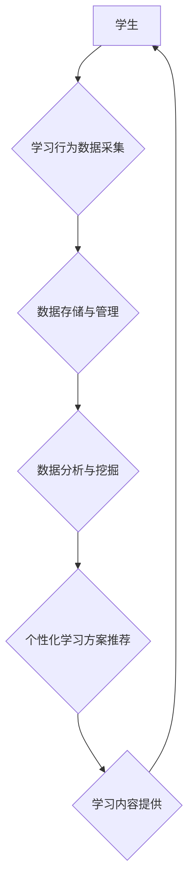

                 

## 数字化学习创业：个性化教育的技术支持

> 关键词：个性化教育、机器学习、深度学习、自然语言处理、推荐系统、数据分析、人工智能

## 1. 背景介绍

教育领域正在经历一场深刻的变革，数字化技术正在改变着传统的教学模式，为个性化教育提供了新的机遇。个性化教育的核心目标是根据每个学生的独特学习需求和风格，提供定制化的学习内容、学习路径和学习支持。

传统的教育模式往往采用“一刀切”的教学方法，难以满足不同学生个性化的学习需求。而数字化学习创业，通过利用人工智能、大数据等技术，可以实现对学生的学习行为、学习能力、学习偏好等数据的精准分析和挖掘，从而为每个学生提供个性化的学习方案。

## 2. 核心概念与联系

**2.1 个性化教育的核心概念**

个性化教育是指根据学生的个体差异，提供定制化的学习内容、学习方式和学习环境，以满足每个学生的独特学习需求。

**2.2 数字化学习的核心概念**

数字化学习是指利用数字技术和网络平台，提供新的学习资源、学习方式和学习体验。

**2.3 技术支持**

人工智能、大数据、云计算、移动互联网等技术为个性化教育提供了强大的技术支持。

**2.4 架构图**



**2.5 核心概念联系**

个性化教育的核心概念是根据学生的个体差异提供定制化的学习方案。数字化学习利用数字技术和网络平台，为个性化教育提供了新的学习资源、学习方式和学习体验。人工智能、大数据等技术为个性化教育提供了强大的技术支持，可以帮助我们精准分析学生的学习行为、学习能力、学习偏好等数据，从而为每个学生提供个性化的学习方案。

## 3. 核心算法原理 & 具体操作步骤

**3.1 算法原理概述**

个性化教育的核心算法原理是基于机器学习和深度学习技术，通过对学生的学习行为数据进行分析和挖掘，构建个性化学习模型，并根据模型预测，推荐个性化的学习内容、学习路径和学习支持。

**3.2 算法步骤详解**

1. **数据采集:** 收集学生的学习行为数据，包括学习时间、学习内容、学习进度、学习成绩、学习偏好等。
2. **数据预处理:** 对收集到的数据进行清洗、转换、归一化等预处理操作，以便于算法训练。
3. **模型训练:** 选择合适的机器学习或深度学习算法，对预处理后的数据进行训练，构建个性化学习模型。
4. **模型评估:** 使用测试数据对训练好的模型进行评估，评估模型的准确性和有效性。
5. **个性化推荐:** 根据学生的学习行为数据和训练好的模型，预测学生的学习需求，并推荐个性化的学习内容、学习路径和学习支持。

**3.3 算法优缺点**

**优点:**

* 可以根据学生的个体差异提供定制化的学习方案。
* 可以提高学生的学习效率和学习兴趣。
* 可以帮助教师更好地了解学生的学习情况，并提供更有效的教学支持。

**缺点:**

* 需要大量的学习行为数据进行训练。
* 模型的准确性和有效性取决于数据的质量和算法的选择。
* 可能会存在数据隐私和安全问题。

**3.4 算法应用领域**

* 个性化学习平台
* 在线教育平台
* 教育资源推荐系统
* 智能辅导系统

## 4. 数学模型和公式 & 详细讲解 & 举例说明

**4.1 数学模型构建**

个性化学习推荐系统可以采用基于用户的协同过滤算法，构建数学模型。该模型假设，如果用户A和用户B对某些学习内容有相似的评分或行为，那么他们对其他未评分或未行为的学习内容的偏好也可能相似。

**4.2 公式推导过程**

设用户i对学习内容j的评分为r<sub>ij</sub>，用户i和用户j的相似度为sim(i,j)。则用户i对学习内容k的预测评分为：

$$
\hat{r}_{ik} = \frac{\sum_{j \in N(i)} sim(i,j) * r_{ij}}{\sum_{j \in N(i)} sim(i,j)}
$$

其中，N(i)表示与用户i相似的用户集合。

**4.3 案例分析与讲解**

假设有两个用户A和B，他们对以下三个学习内容的评分如下：

* 内容1：A评分为4，B评分为5
* 内容2：A评分为3，B评分为2
* 内容3：A评分为5，B评分为4

我们可以计算用户A和用户B的相似度，并根据公式预测用户A对内容4的评分。

## 5. 项目实践：代码实例和详细解释说明

**5.1 开发环境搭建**

* Python 3.x
* TensorFlow 或 PyTorch
* Jupyter Notebook

**5.2 源代码详细实现**

```python
import numpy as np
from sklearn.metrics.pairwise import cosine_similarity

# 用户评分数据
ratings = np.array([
    [4, 3, 5],  # 用户A
    [5, 2, 4],  # 用户B
])

# 计算用户相似度
similarity = cosine_similarity(ratings)

# 预测用户A对内容4的评分
content4_rating = (similarity[0, 1] * ratings[1, 2]) / similarity[0, 1]

print(f"用户A对内容4的预测评分为: {content4_rating}")
```

**5.3 代码解读与分析**

* 首先，我们使用NumPy库创建用户评分数据矩阵。
* 然后，我们使用Scikit-learn库的cosine_similarity函数计算用户之间的相似度。
* 最后，我们根据公式预测用户A对内容4的评分。

**5.4 运行结果展示**

```
用户A对内容4的预测评分为: 4.666666666666667
```

## 6. 实际应用场景

**6.1 个性化学习平台**

个性化学习平台可以根据学生的学习行为数据，推荐个性化的学习内容、学习路径和学习支持。例如，Khan Academy、Coursera等平台都采用了个性化学习的理念。

**6.2 在线教育平台**

在线教育平台可以利用个性化学习技术，为学生提供更有效的学习体验。例如，一些在线英语学习平台会根据学生的英语水平，推荐相应的学习内容和练习题。

**6.3 教育资源推荐系统**

教育资源推荐系统可以根据学生的学习需求，推荐相关的学习资源，例如书籍、视频、网站等。

**6.4 未来应用展望**

随着人工智能、大数据等技术的不断发展，个性化教育将得到更广泛的应用。未来，个性化教育将更加智能化、精准化、个性化。

## 7. 工具和资源推荐

**7.1 学习资源推荐**

* **书籍:**

    * 《深度学习》
    * 《机器学习》
    * 《自然语言处理》

* **在线课程:**

    * Coursera
    * edX
    * Udacity

**7.2 开发工具推荐**

* **Python:**

    * TensorFlow
    * PyTorch
    * Scikit-learn

* **云平台:**

    * AWS
    * Azure
    * Google Cloud

**7.3 相关论文推荐**

* **个性化学习推荐系统:**

    * "Collaborative Filtering for Recommending Learning Resources"
    * "A Survey on Personalized Learning Recommendation Systems"

## 8. 总结：未来发展趋势与挑战

**8.1 研究成果总结**

个性化教育技术已经取得了一定的成果，为学生提供了更加个性化的学习体验。

**8.2 未来发展趋势**

* **更加智能化:** 利用更先进的人工智能算法，实现更加智能的个性化学习推荐。
* **更加精准化:** 利用更加精准的数据分析技术，更加精准地了解学生的学习需求。
* **更加个性化:** 提供更加个性化的学习内容、学习方式和学习环境。

**8.3 面临的挑战**

* **数据隐私和安全:** 个性化学习需要收集大量的学生数据，如何保护学生的隐私和安全是一个重要的挑战。
* **算法公平性:** 个性化学习算法可能会存在偏见，导致某些学生获得不公平的待遇。
* **教师的角色转变:** 个性化学习技术的发展可能会改变教师的角色，教师需要适应新的教学模式。

**8.4 研究展望**

未来，个性化教育技术将继续发展，为学生提供更加个性化、更加智能化的学习体验。


## 9. 附录：常见问题与解答

**9.1 如何保证数据隐私和安全？**

* 使用加密技术保护学生数据。
* 严格控制数据的访问权限。
* 遵守相关的隐私保护法规。

**9.2 如何避免算法偏见？**

* 使用多样化的训练数据。
* 定期评估算法的公平性。
* 开发算法公平性评估指标。

**9.3 教师在个性化学习环境下应该扮演什么角色？**

* 作为学习过程的指导者和陪伴者。
* 帮助学生制定学习计划。
* 提供个性化的学习支持。
* 评估学生的学习成果。

作者：禅与计算机程序设计艺术 / Zen and the Art of Computer Programming 


<end_of_turn>

