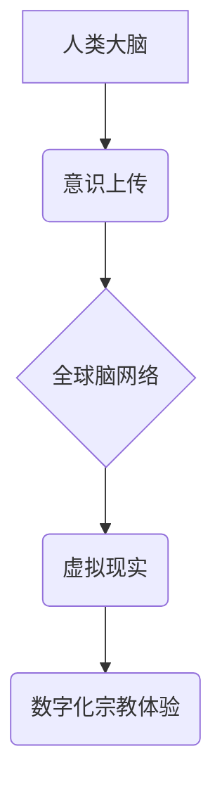

                 

## 数字化宗教:全球脑时代的信仰演变

> 关键词：全球脑、人工智能、数字化信仰、虚拟现实、元宇宙、伦理困境、未来宗教

### 1. 背景介绍

人类历史上的宗教信仰，从原始部落的自然崇拜到现代的宗教多元化，始终是人类精神世界的重要组成部分。宗教为人们提供了精神寄托、道德规范和社会凝聚力。然而，随着科技的飞速发展，特别是人工智能和虚拟现实技术的突破，我们正进入一个全新的时代——全球脑时代。在这个时代，数字技术将深刻地改变人类的认知、沟通和生活方式，也势必对宗教信仰产生深远的影响。

全球脑的概念最早由美国科学家杰克·摩尔提出，指的是一个由网络连接的超级计算机构成的全球性信息网络。在这个网络中，人类的大脑将能够与计算机直接连接，实现信息共享和意识上传。全球脑的出现将极大地扩展人类的认知能力和创造力，但也带来了一系列伦理和社会问题。

其中，对宗教信仰的影响最为显著。传统宗教依赖于神圣的经文、仪式和信仰体系，而全球脑时代的信息化和虚拟化将挑战这些传统的基石。虚拟现实技术可以创造出逼真的虚拟世界，人们可以在其中体验宗教仪式、与虚拟神灵交流，甚至进行意识上传，从而获得全新的宗教体验。

### 2. 核心概念与联系

**2.1  全球脑架构**



**2.2  数字化信仰的特征**

* **个性化:**  数字化宗教可以根据个人的信仰和需求进行定制，提供更加个性化的宗教体验。
* **互动性:**  虚拟现实技术可以创造出互动式的宗教环境，人们可以与虚拟神灵交流，参与宗教仪式，体验宗教信仰的互动性。
* **普惠性:**  数字化宗教可以打破地域和时间限制，让更多人能够接触到宗教信仰。

**2.3  数字化宗教与传统宗教的关系**

数字化宗教并非取代传统宗教，而是与传统宗教相互补充和融合。传统宗教仍然是许多人精神生活的核心，而数字化宗教则为宗教信仰提供了新的表达方式和体验途径。

### 3. 核心算法原理 & 具体操作步骤

**3.1  算法原理概述**

数字化宗教的核心算法原理主要包括：

* **意识上传算法:** 将人类意识信息转化为可存储和传输的数字格式。
* **虚拟现实生成算法:**  根据宗教信仰和仪式内容，生成逼真的虚拟环境和虚拟角色。
* **人工智能交互算法:**  使虚拟角色能够与用户进行自然流畅的对话和互动，提供个性化的宗教体验。

**3.2  算法步骤详解**

1. **意识扫描:** 使用脑机接口技术扫描人类大脑，获取意识信息。
2. **数据编码:** 将扫描到的意识信息进行编码，转化为可存储和传输的数字格式。
3. **意识上传:** 将编码后的意识信息上传到全球脑网络。
4. **虚拟环境构建:** 根据用户的宗教信仰和需求，使用虚拟现实生成算法构建虚拟宗教环境。
5. **虚拟角色交互:**  使用人工智能交互算法，使虚拟角色能够与用户进行自然流畅的对话和互动，提供个性化的宗教体验。

**3.3  算法优缺点**

**优点:**

* **个性化:**  可以根据用户的需求定制宗教体验。
* **互动性:**  可以提供更加沉浸式的宗教体验。
* **普惠性:**  可以打破地域和时间限制，让更多人能够接触到宗教信仰。

**缺点:**

* **技术难度:**  意识上传和虚拟现实技术目前还处于发展阶段，技术难度较大。
* **伦理问题:**  意识上传和虚拟宗教体验可能引发一系列伦理问题，例如意识的完整性、虚拟世界的道德规范等。

**3.4  算法应用领域**

* **宗教教育:**  提供更加生动和互动式的宗教教育体验。
* **宗教研究:**  研究宗教信仰的本质和影响。
* **精神治疗:**  帮助人们缓解心理压力和焦虑，获得精神慰藉。

### 4. 数学模型和公式 & 详细讲解 & 举例说明

**4.1  数学模型构建**

我们可以使用神经网络模型来模拟人类意识的结构和功能。神经网络模型由多个层级的神经元组成，每个神经元都连接到其他神经元，并通过权重来调节信号传递强度。通过训练神经网络模型，可以使其学习和模拟人类的认知过程，包括感知、记忆、决策等。

**4.2  公式推导过程**

神经网络模型的训练过程基于梯度下降算法。目标函数是衡量模型预测结果与真实结果之间的误差。梯度下降算法通过不断调整神经元的权重，使目标函数值最小化，从而提高模型的预测精度。

**4.3  案例分析与讲解**

例如，我们可以使用神经网络模型来训练一个虚拟神灵角色。通过训练数据，例如宗教经文、神话故事、宗教仪式等，神经网络模型可以学习到神灵的知识、性格和行为模式。然后，我们可以通过用户与虚拟神灵角色的对话，来测试模型的训练效果。

$$
Loss = \frac{1}{N} \sum_{i=1}^{N} (y_i - \hat{y}_i)^2
$$

其中：

* $Loss$ 表示目标函数值
* $N$ 表示训练样本数量
* $y_i$ 表示真实标签
* $\hat{y}_i$ 表示模型预测结果

### 5. 项目实践：代码实例和详细解释说明

**5.1  开发环境搭建**

* 操作系统: Ubuntu 20.04
* 编程语言: Python 3.8
* 深度学习框架: TensorFlow 2.0
* 虚拟现实库: Pygame

**5.2  源代码详细实现**

```python
# 虚拟神灵角色的对话模型
class VirtualGod:
    def __init__(self, knowledge_base):
        self.knowledge_base = knowledge_base

    def respond(self, user_input):
        # 使用自然语言处理模型分析用户输入
        # 根据知识库和用户输入生成神灵的回复
        pass

# 虚拟宗教环境的构建
class VirtualTemple:
    def __init__(self):
        # 使用虚拟现实库构建虚拟环境
        pass

    def render(self):
        # 渲染虚拟环境
        pass

# 主程序
if __name__ == "__main__":
    # 加载神灵知识库
    knowledge_base = load_knowledge_base("god_knowledge.txt")

    # 创建虚拟神灵角色
    god = VirtualGod(knowledge_base)

    # 创建虚拟宗教环境
    temple = VirtualTemple()

    # 启动虚拟宗教体验
    temple.render()
    while True:
        user_input = input("您想问神灵什么？")
        response = god.respond(user_input)
        print(response)
```

**5.3  代码解读与分析**

* `VirtualGod` 类模拟虚拟神灵角色，拥有知识库和对话模型。
* `VirtualTemple` 类构建虚拟宗教环境，提供渲染功能。
* 主程序加载神灵知识库，创建虚拟神灵角色和虚拟宗教环境，启动虚拟宗教体验。

**5.4  运行结果展示**

运行代码后，用户可以在虚拟宗教环境中与虚拟神灵角色进行对话，获得神灵的回复。

### 6. 实际应用场景

**6.1  宗教教育**

数字化宗教可以为宗教教育提供更加生动和互动式的体验。例如，用户可以进入虚拟的宗教场所，体验宗教仪式，与虚拟的宗教人物对话，学习宗教知识。

**6.2  宗教研究**

数字化宗教可以帮助宗教研究者更好地理解宗教信仰的本质和影响。例如，可以通过分析用户与虚拟神灵角色的对话，了解用户的宗教信仰和心理状态。

**6.3  精神治疗**

数字化宗教可以帮助人们缓解心理压力和焦虑，获得精神慰藉。例如，用户可以进入虚拟的宗教场所，进行冥想和祈祷，获得精神上的平静和安宁。

**6.4  未来应用展望**

随着科技的不断发展，数字化宗教将更加普及和完善。未来，我们可以期待看到更加逼真的虚拟宗教体验，更加智能的虚拟神灵角色，以及更加广泛的数字化宗教应用场景。

### 7. 工具和资源推荐

**7.1  学习资源推荐**

* **书籍:**

    * 《全球脑: 人类意识的未来》
    * 《数字宗教: 虚拟现实与信仰的融合》

* **网站:**

    * 全球脑倡议 (Global Brain Initiative)
    * 虚拟现实宗教研究中心 (Virtual Reality Religious Studies Center)

**7.2  开发工具推荐**

* **深度学习框架:** TensorFlow, PyTorch
* **虚拟现实库:** Pygame, Unity, Unreal Engine

**7.3  相关论文推荐**

* 《虚拟现实中的宗教体验》
* 《人工智能与宗教信仰的未来》

### 8. 总结：未来发展趋势与挑战

**8.1  研究成果总结**

数字化宗教的研究成果表明，科技可以深刻地改变人类的宗教信仰和体验方式。虚拟现实技术和人工智能技术为宗教信仰提供了新的表达方式和体验途径，并为宗教研究和精神治疗提供了新的工具和方法。

**8.2  未来发展趋势**

未来，数字化宗教将更加普及和完善，其应用场景也将更加广泛。例如，我们可以期待看到更加逼真的虚拟宗教体验，更加智能的虚拟神灵角色，以及更加广泛的数字化宗教应用场景。

**8.3  面临的挑战**

数字化宗教的发展也面临着一些挑战，例如：

* **伦理问题:**  意识上传和虚拟宗教体验可能引发一系列伦理问题，例如意识的完整性、虚拟世界的道德规范等。
* **技术难度:**  意识上传和虚拟现实技术目前还处于发展阶段，技术难度较大。
* **社会接受度:**  数字化宗教的普及需要克服人们对传统宗教的固有观念和信仰。

**8.4  研究展望**

未来，我们需要继续深入研究数字化宗教的原理、应用和伦理问题，并探索其在宗教信仰、精神治疗、教育等领域的应用潜力。同时，我们也需要加强与社会各界的沟通和交流，促进数字化宗教的健康发展。

### 9. 附录：常见问题与解答

**9.1  数字化宗教是否会取代传统宗教？**

数字化宗教并非取代传统宗教，而是与传统宗教相互补充和融合。传统宗教仍然是许多人精神生活的核心，而数字化宗教则为宗教信仰提供了新的表达方式和体验途径。

**9.2  数字化宗教的伦理问题有哪些？**

数字化宗教可能引发一系列伦理问题，例如：

* **意识的完整性:**  意识上传是否会损害意识的完整性？
* **虚拟世界的道德规范:**  虚拟宗教环境的道德规范应该如何制定和执行？
* **数据隐私:**  数字化宗教平台收集的用户数据应该如何保护？

**9.3  数字化宗教的未来发展趋势是什么？**

未来，数字化宗教将更加普及和完善，其应用场景也将更加广泛。例如，我们可以期待看到更加逼真的虚拟宗教体验，更加智能的虚拟神灵角色，以及更加广泛的数字化宗教应用场景。


作者：禅与计算机程序设计艺术 / Zen and the Art of Computer Programming 
<end_of_turn>

