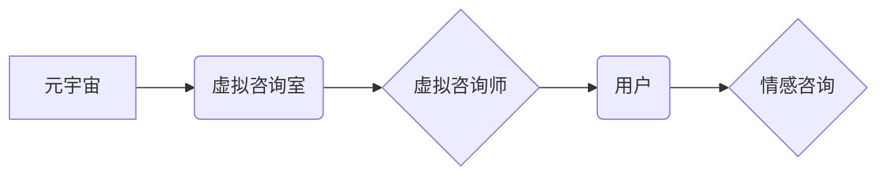

                 

## 数字化情感咨询:元宇宙中的心理健康服务

> 关键词：元宇宙、情感咨询、人工智能、心理健康、虚拟现实、自然语言处理

## 1. 背景介绍

随着科技的飞速发展，元宇宙概念逐渐成为现实，为人们提供沉浸式、交互式的虚拟世界体验。在这个虚拟世界中，人们可以自由地创造、探索和连接。而心理健康问题日益突出，传统的心理咨询模式面临着诸多挑战，例如时间、地域、成本等限制。元宇宙为数字化情感咨询提供了全新的可能性，它可以打破传统模式的局限，为人们提供更加便捷、高效、个性化的心理健康服务。

## 2. 核心概念与联系

### 2.1 元宇宙

元宇宙是一个由虚拟现实、增强现实、区块链、人工智能等技术融合而成的虚拟世界，它具有以下特点：

* **沉浸式体验:**  用户可以通过虚拟现实设备或增强现实设备沉浸在虚拟世界中，体验更加真实、逼真的交互。
* **持久性:** 元宇宙是一个持续运行的虚拟世界，用户可以随时随地进入，并保留其虚拟资产和身份。
* **去中心化:** 元宇宙由多个平台和开发者共同构建，用户拥有更大的自主权和控制权。
* **社交互动:** 元宇宙提供丰富的社交互动功能，用户可以与其他用户进行交流、合作和娱乐。

### 2.2 情感咨询

情感咨询是指通过专业的心理咨询师与受咨询者进行一对一或小组交流，帮助受咨询者解决情感问题、提升心理健康水平的一种服务。传统的情感咨询模式主要依赖于线下面对面交流，存在着时间、地域、成本等限制。

### 2.3 核心概念联系

元宇宙为数字化情感咨询提供了全新的平台和可能性。在元宇宙中，用户可以创建虚拟形象，与虚拟咨询师进行互动，获得更加沉浸式、个性化的咨询服务。

**核心概念架构图:**



## 3. 核心算法原理 & 具体操作步骤

### 3.1 算法原理概述

数字化情感咨询的核心算法主要包括自然语言处理（NLP）、情感分析、机器学习等技术。

* **自然语言处理（NLP）:** 用于理解和处理人类语言，例如文本分析、语音识别等。
* **情感分析:** 用于识别文本或语音中表达的情感，例如快乐、悲伤、愤怒等。
* **机器学习:** 用于训练模型，使模型能够根据历史数据预测用户的情感状态和需求，并提供相应的咨询建议。

### 3.2 算法步骤详解

1. **用户输入:** 用户通过文本或语音输入自己的情感问题或诉求。
2. **文本预处理:** 对用户输入进行清洗、分词、词性标注等预处理，以便于后续算法的理解。
3. **情感分析:** 使用情感分析模型识别用户输入中的情感倾向，例如积极、消极、中性等。
4. **需求识别:** 根据用户输入的情感倾向和历史数据，识别用户的具体需求，例如情绪调节、压力缓解、人际关系问题等。
5. **咨询建议生成:** 根据用户的需求，使用机器学习模型生成相应的咨询建议，例如提供放松技巧、情绪管理策略、心理健康知识等。
6. **交互反馈:** 用户可以根据咨询建议进行调整，并与虚拟咨询师进行交互反馈，虚拟咨询师会根据用户的反馈进一步调整咨询建议。

### 3.3 算法优缺点

**优点:**

* **便捷性:** 用户可以随时随地通过元宇宙平台获得情感咨询服务。
* **高效性:** 虚拟咨询师可以同时服务多个用户，提高咨询效率。
* **个性化:** 算法可以根据用户的个人情况和需求提供个性化的咨询建议。
* **匿名性:** 用户可以匿名进行咨询，降低心理负担。

**缺点:**

* **技术限制:** 目前虚拟咨询师的智能水平还无法完全替代人类咨询师。
* **伦理问题:** 虚拟咨询师的隐私保护和数据安全需要得到保障。
* **社会接受度:** 一些用户可能对虚拟咨询师的真实性和有效性存在疑虑。

### 3.4 算法应用领域

数字化情感咨询算法可以应用于以下领域:

* **心理健康服务:** 为用户提供情感支持、情绪调节、心理危机干预等服务。
* **教育培训:** 为学生提供学习压力缓解、情绪管理、人际交往技巧等培训。
* **企业管理:** 为员工提供压力管理、团队合作、沟通技巧等培训。
* **医疗保健:** 为患者提供疾病心理支持、康复指导、生活方式调整等服务。

## 4. 数学模型和公式 & 详细讲解 & 举例说明

### 4.1 数学模型构建

情感分析模型通常采用深度学习算法，例如循环神经网络（RNN）或长短期记忆网络（LSTM）。这些模型可以学习文本或语音中的情感特征，并预测情感类别。

### 4.2 公式推导过程

RNN和LSTM模型的具体公式推导过程比较复杂，涉及到矩阵运算、激活函数等多个方面。这里不再赘述，可以参考相关深度学习教材或论文进行学习。

### 4.3 案例分析与讲解

假设我们有一个情感分析模型，它可以识别文本中的情感类别，例如“快乐”、“悲伤”、“愤怒”等。我们可以使用以下公式计算文本中不同情感类别的概率：

$$P(情感类别|文本) = \frac{exp(w_1 * 文本_1 + w_2 * 文本_2 + ... + w_n * 文本_n)}{exp(w_1 * 文本_1 + w_2 * 文本_2 + ... + w_n * 文本_n) + exp(w_1 * 文本_1 + w_2 * 文本_2 + ... + w_n * 文本_n) + ...}$$

其中：

* $P(情感类别|文本)$ 表示给定文本的情况下，预测情感类别的概率。
* $w_i$ 表示模型参数，用于权衡每个词语对情感类别的影响。
* $文本_i$ 表示文本中的第i个词语。

例如，如果一个文本是“我今天过得很开心”，模型可能会预测其情感类别为“快乐”，并且概率较高。

## 5. 项目实践：代码实例和详细解释说明

### 5.1 开发环境搭建

* **操作系统:** Windows/macOS/Linux
* **编程语言:** Python
* **深度学习框架:** TensorFlow/PyTorch
* **虚拟环境:** conda/virtualenv

### 5.2 源代码详细实现

```python
# 导入必要的库
import tensorflow as tf

# 定义情感分析模型
model = tf.keras.Sequential([
    tf.keras.layers.Embedding(input_dim=vocab_size, output_dim=embedding_dim),
    tf.keras.layers.LSTM(units=128),
    tf.keras.layers.Dense(units=num_classes, activation='softmax')
])

# 编译模型
model.compile(optimizer='adam',
              loss='sparse_categorical_crossentropy',
              metrics=['accuracy'])

# 训练模型
model.fit(x_train, y_train, epochs=10)

# 预测情感类别
predictions = model.predict(x_test)
```

### 5.3 代码解读与分析

* **Embedding层:** 将词语映射到低维向量空间，提取词语的语义特征。
* **LSTM层:** 学习文本序列中的长期依赖关系，捕捉情感变化的趋势。
* **Dense层:** 将LSTM层的输出映射到情感类别，并使用softmax激活函数输出每个类别的概率。
* **编译模型:** 使用Adam优化器、交叉熵损失函数和准确率作为评估指标。
* **训练模型:** 使用训练数据训练模型，迭代10次。
* **预测情感类别:** 使用训练好的模型预测测试数据的情感类别。

### 5.4 运行结果展示

训练完成后，可以评估模型的准确率等指标，并使用测试数据进行预测，展示模型的性能。

## 6. 实际应用场景

### 6.1 元宇宙心理咨询平台

在元宇宙中，可以构建虚拟心理咨询平台，用户可以创建虚拟形象，与虚拟咨询师进行互动，获得情感支持和心理咨询服务。

### 6.2 情感分析聊天机器人

可以开发情感分析聊天机器人，用于提供情感支持、情绪调节、心理危机干预等服务。

### 6.3 教育培训平台

可以将数字化情感咨询技术应用于教育培训平台，为学生提供学习压力缓解、情绪管理、人际交往技巧等培训。

### 6.4 企业员工心理健康服务

企业可以利用数字化情感咨询技术，为员工提供压力管理、团队合作、沟通技巧等培训，提升员工的心理健康水平。

### 6.5 未来应用展望

随着元宇宙技术的不断发展，数字化情感咨询将有更广泛的应用场景，例如：

* **虚拟现实沉浸式心理治疗:** 利用虚拟现实技术，为用户提供更加沉浸式的治疗体验。
* **人工智能辅助心理咨询:** 人工智能可以辅助心理咨询师，提高咨询效率和准确性。
* **个性化心理健康服务:** 基于用户的个人数据和需求，提供更加个性化的心理健康服务。

## 7. 工具和资源推荐

### 7.1 学习资源推荐

* **书籍:**

    * 深度学习
    * 自然语言处理

* **在线课程:**

    * Coursera
    * edX
    * Udacity

### 7.2 开发工具推荐

* **深度学习框架:** TensorFlow, PyTorch
* **自然语言处理库:** NLTK, spaCy
* **元宇宙平台:** Unity, Unreal Engine

### 7.3 相关论文推荐

* **情感分析论文:**

    * Sentiment Analysis: A Survey
    * Deep Learning for Sentiment Analysis

* **元宇宙与心理健康论文:**

    * The Metaverse and Mental Health: Opportunities and Challenges
    * Virtual Reality Therapy for Anxiety Disorders

## 8. 总结：未来发展趋势与挑战

### 8.1 研究成果总结

数字化情感咨询技术在元宇宙中具有巨大的潜力，可以为人们提供更加便捷、高效、个性化的心理健康服务。

### 8.2 未来发展趋势

* **人工智能技术不断进步:** 人工智能技术将更加智能化，能够更好地理解和应对用户的复杂情感需求。
* **元宇宙平台更加成熟:** 元宇宙平台将更加完善，提供更加沉浸式、交互式的虚拟体验。
* **个性化定制服务:** 基于用户的个人数据和需求，提供更加个性化的心理健康服务。

### 8.3 面临的挑战

* **技术限制:** 目前虚拟咨询师的智能水平还无法完全替代人类咨询师。
* **伦理问题:** 虚拟咨询师的隐私保护和数据安全需要得到保障。
* **社会接受度:** 一些用户可能对虚拟咨询师的真实性和有效性存在疑虑。

### 8.4 研究展望

未来，数字化情感咨询技术将继续发展，并与其他技术融合，例如生物反馈技术、脑机接口技术等，为人们提供更加全面的心理健康服务。

## 9. 附录：常见问题与解答

**Q1: 数字化情感咨询是否可以完全替代传统的心理咨询？**

A1: 目前数字化情感咨询技术还无法完全替代传统的心理咨询。传统的心理咨询需要面对面的交流和情感共鸣，而数字化情感咨询主要依赖于算法和技术，无法完全替代人类咨询师的专业判断和情感支持。

**Q2: 数字化情感咨询的隐私安全如何保障？**

A2: 数字化情感咨询平台需要采取严格的隐私安全措施，例如数据加密、匿名化处理等，确保用户的个人信息安全。

**Q3: 如何评估数字化情感咨询的有效性？**

A3: 可以通过用户反馈、心理测评等方式评估数字化情感咨询的有效性。


作者：禅与计算机程序设计艺术 / Zen and the Art of Computer Programming 
<end_of_turn>

