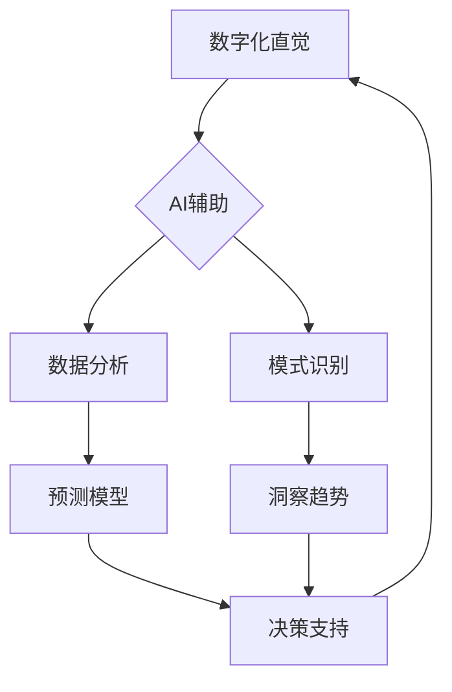

                 

## 数字化直觉训练：AI辅助的第六感开发

> 关键词：人工智能、直觉、深度学习、模式识别、数据分析、预测模型、第六感、认知增强

## 1. 背景介绍

在瞬息万变的数字化时代，人类面临着前所未有的信息爆炸和决策压力。传统的信息处理方式已经难以适应这种快速变化的环境。我们需要一种新的能力，一种能够帮助我们快速理解复杂数据、洞察隐藏模式、做出明智决策的“第六感”。而人工智能（AI）正逐渐成为实现这一目标的关键技术。

AI技术的快速发展，特别是深度学习的突破，赋予了机器强大的数据分析和模式识别能力。通过训练大量的样本数据，AI模型能够学习到人类难以察觉的复杂关系和趋势，并将其转化为可操作的洞察和预测。这为我们开发“数字化直觉”提供了全新的可能性。

“数字化直觉”并非指超自然的能力，而是通过AI辅助，将数据分析、模式识别和决策支持等功能整合到人类认知中，从而提升我们的直觉判断能力。它可以帮助我们：

* **快速理解复杂数据：** AI可以自动分析海量数据，提取关键信息和隐藏模式，帮助我们快速掌握大局。
* **洞察隐藏趋势：** AI可以识别微弱的信号和异常值，帮助我们预测未来趋势和潜在风险。
* **做出更明智的决策：** AI可以提供数据驱动的建议和决策支持，帮助我们做出更理性、更有效的决策。

## 2. 核心概念与联系

### 2.1 数字化直觉

数字化直觉是指通过AI辅助，将数据分析、模式识别和决策支持等功能整合到人类认知中，从而提升人类直觉判断能力的一种新兴概念。它并非超自然能力，而是基于数据驱动和算法模型的智能辅助。

### 2.2 AI辅助

AI辅助是指利用人工智能技术，例如机器学习、深度学习等，辅助人类完成特定任务或提升认知能力的过程。

### 2.3 模式识别

模式识别是人工智能领域的核心技术之一，是指通过算法识别数据中的规律和模式的过程。AI模型通过学习大量的样本数据，能够识别出人类难以察觉的复杂关系和趋势。

### 2.4 预测模型

预测模型是基于历史数据和统计分析，预测未来事件或趋势的一种数学模型。AI可以构建复杂的预测模型，并根据实时数据进行更新和调整，提高预测的准确性。

**核心概念与联系流程图**



## 3. 核心算法原理 & 具体操作步骤

### 3.1 算法原理概述

数字化直觉训练的核心算法原理基于深度学习，特别是卷积神经网络（CNN）和循环神经网络（RNN）。

* **卷积神经网络（CNN）**擅长处理图像、视频等多维数据，能够识别图像中的物体、场景和特征。
* **循环神经网络（RNN）**擅长处理序列数据，例如文本、语音等，能够理解语言的上下文和语义。

通过训练大量的样本数据，CNN和RNN模型能够学习到人类难以察觉的复杂关系和模式，并将其转化为可操作的洞察和预测。

### 3.2 算法步骤详解

1. **数据收集和预处理:** 收集相关数据，并进行清洗、格式化、特征提取等预处理工作。
2. **模型选择和训练:** 选择合适的深度学习模型，例如CNN或RNN，并根据训练数据进行模型训练。
3. **模型评估和优化:** 使用测试数据评估模型的性能，并根据评估结果进行模型调优，例如调整模型参数、增加训练数据等。
4. **模型部署和应用:** 将训练好的模型部署到实际应用场景中，例如智能推荐系统、风险预警系统等。

### 3.3 算法优缺点

**优点:**

* **高准确率:** 深度学习模型能够学习到复杂的模式，具有较高的预测准确率。
* **自动化能力:** 算法能够自动完成数据分析和模式识别，减少人工干预。
* **可扩展性:** 深度学习模型可以处理海量数据，并随着数据量的增加而提升性能。

**缺点:**

* **数据依赖:** 深度学习模型需要大量的训练数据，否则性能会下降。
* **计算资源需求:** 训练深度学习模型需要大量的计算资源，成本较高。
* **可解释性:** 深度学习模型的决策过程较为复杂，难以解释其背后的逻辑。

### 3.4 算法应用领域

数字化直觉训练的算法应用领域广泛，包括：

* **金融领域:** 风险评估、欺诈检测、投资决策
* **医疗领域:** 疾病诊断、药物研发、个性化治疗
* **商业领域:** 客户画像、精准营销、市场预测
* **教育领域:** 个性化学习、智能辅导、学习效果评估

## 4. 数学模型和公式 & 详细讲解 & 举例说明

### 4.1 数学模型构建

数字化直觉训练的核心数学模型是深度学习模型，例如CNN和RNN。这些模型基于神经网络的结构和学习算法，通过多层神经元网络进行数据处理和模式识别。

**CNN模型**

CNN模型由卷积层、池化层、全连接层组成。卷积层使用卷积核提取图像特征，池化层降低特征维度，全连接层进行分类或预测。

**RNN模型**

RNN模型由循环神经元组成，能够处理序列数据。每个循环神经元接收当前输入和之前隐藏状态的信息，并输出新的隐藏状态和预测结果。

### 4.2 公式推导过程

深度学习模型的训练过程基于梯度下降算法，通过不断调整模型参数，使得模型预测结果与真实值之间的误差最小化。

**损失函数:**

$$L(w) = \frac{1}{N} \sum_{i=1}^{N} loss(y_i, \hat{y}_i)$$

其中：

* $L(w)$ 是模型参数 $w$ 的损失函数
* $N$ 是训练样本的数量
* $loss(y_i, \hat{y}_i)$ 是第 $i$ 个样本的损失值，$y_i$ 是真实值，$\hat{y}_i$ 是模型预测值

**梯度下降算法:**

$$w = w - \eta \nabla L(w)$$

其中：

* $\eta$ 是学习率
* $\nabla L(w)$ 是损失函数 $L(w)$ 对参数 $w$ 的梯度

### 4.3 案例分析与讲解

例如，在图像识别任务中，CNN模型可以学习到图像中的特征，例如边缘、纹理、形状等。通过训练大量的图像数据，CNN模型能够识别出不同类别图像的特征，并进行分类。

## 5. 项目实践：代码实例和详细解释说明

### 5.1 开发环境搭建

* **操作系统:** Ubuntu 18.04 或更高版本
* **编程语言:** Python 3.6 或更高版本
* **深度学习框架:** TensorFlow 或 PyTorch
* **其他工具:** Jupyter Notebook、Git

### 5.2 源代码详细实现

以下是一个使用 TensorFlow 实现简单的 CNN 模型的代码示例：

```python
import tensorflow as tf

# 定义模型结构
model = tf.keras.models.Sequential([
    tf.keras.layers.Conv2D(32, (3, 3), activation='relu', input_shape=(28, 28, 1)),
    tf.keras.layers.MaxPooling2D((2, 2)),
    tf.keras.layers.Conv2D(64, (3, 3), activation='relu'),
    tf.keras.layers.MaxPooling2D((2, 2)),
    tf.keras.layers.Flatten(),
    tf.keras.layers.Dense(10, activation='softmax')
])

# 编译模型
model.compile(optimizer='adam',
              loss='sparse_categorical_crossentropy',
              metrics=['accuracy'])

# 训练模型
model.fit(x_train, y_train, epochs=5)

# 评估模型
loss, accuracy = model.evaluate(x_test, y_test)
print('Test loss:', loss)
print('Test accuracy:', accuracy)
```

### 5.3 代码解读与分析

* **模型结构:** 代码定义了一个简单的 CNN 模型，包含两层卷积层、两层池化层、一层全连接层和一层输出层。
* **激活函数:** 使用 ReLU 激活函数，可以提高模型的学习能力。
* **损失函数:** 使用 sparse_categorical_crossentropy 损失函数，适用于多分类问题。
* **优化器:** 使用 Adam 优化器，可以快速收敛到最优解。
* **训练和评估:** 代码使用训练数据训练模型，并使用测试数据评估模型的性能。

### 5.4 运行结果展示

训练完成后，可以查看模型的测试损失和准确率。

## 6. 实际应用场景

数字化直觉训练的应用场景非常广泛，例如：

### 6.1 金融领域

* **风险评估:** 利用AI分析客户的财务数据、交易记录等，识别潜在的风险客户，降低金融机构的风险。
* **欺诈检测:** 通过分析交易行为模式，识别异常交易，及时阻止欺诈行为。
* **投资决策:** 利用AI分析市场数据、公司财务报表等，预测股票价格走势，辅助投资决策。

### 6.2 医疗领域

* **疾病诊断:** 利用AI分析患者的病历、影像数据等，辅助医生诊断疾病。
* **药物研发:** 利用AI分析药物分子结构、生物活性等，加速药物研发过程。
* **个性化治疗:** 利用AI分析患者的基因信息、生活习惯等，制定个性化的治疗方案。

### 6.3 商业领域

* **客户画像:** 利用AI分析客户的购买行为、浏览记录等，构建客户画像，精准营销。
* **精准营销:** 根据客户画像，推送个性化的广告和产品推荐，提高营销效果。
* **市场预测:** 利用AI分析市场数据、消费者行为等，预测市场趋势，帮助企业制定战略决策。

### 6.4 未来应用展望

随着AI技术的不断发展，数字化直觉训练将在更多领域得到应用，例如：

* **教育领域:** 个性化学习、智能辅导、学习效果评估
* **交通领域:** 智能驾驶、交通流量预测、道路安全管理
* **环境领域:** 环境监测、污染预测、资源管理

## 7. 工具和资源推荐

### 7.1 学习资源推荐

* **书籍:**
    * 《深度学习》 by Ian Goodfellow, Yoshua Bengio, Aaron Courville
    * 《动手学深度学习》 by Aurélien Géron
* **在线课程:**
    * Coursera: 深度学习 Specialization
    * Udacity: Deep Learning Nanodegree
    * fast.ai: Practical Deep Learning for Coders

### 7.2 开发工具推荐

* **深度学习框架:** TensorFlow, PyTorch, Keras
* **数据处理工具:** Pandas, NumPy
* **可视化工具:** Matplotlib, Seaborn

### 7.3 相关论文推荐

* **AlexNet:** ImageNet Classification with Deep Convolutional Neural Networks
* **VGGNet:** Very Deep Convolutional Networks for Large-Scale Image Recognition
* **ResNet:** Deep Residual Learning for Image Recognition

## 8. 总结：未来发展趋势与挑战

### 8.1 研究成果总结

数字化直觉训练是人工智能领域的一个重要发展方向，它将AI技术与人类认知相结合，提升人类的直觉判断能力。

### 8.2 未来发展趋势

* **模型更加复杂:** 未来，数字化直觉训练的模型将更加复杂，能够处理更加复杂的数据类型和任务。
* **解释性更强:** 研究者将更加关注模型的解释性，开发能够解释模型决策过程的算法。
* **个性化定制:** 数字化直觉训练将更加个性化，根据用户的需求和习惯定制模型。

### 8.3 面临的挑战

* **数据获取和隐私保护:** 数字化直觉训练需要大量的训练数据，如何获取高质量数据并保护用户隐私是一个挑战。
* **模型可解释性:** 深度学习模型的决策过程较为复杂，难以解释其背后的逻辑，这限制了模型的应用场景。
* **伦理问题:** 数字化直觉训练可能会带来一些伦理问题，例如算法偏见、数据安全等，需要引起重视。

### 8.4 研究展望

数字化直觉训练是一个充满机遇和挑战的领域，未来研究将集中在以下几个方面：

* 开发更加高效、准确、可解释的深度学习模型。
* 探索新的数据来源和数据处理方法。
* 研究数字化直觉训练的伦理问题，并制定相应的规范和标准。


## 9. 附录：常见问题与解答

**Q1: 数字化直觉训练需要哪些技术基础？**

**A1:** 数字化直觉训练需要一定的编程基础，熟悉Python语言和深度学习框架，例如TensorFlow或PyTorch。

**Q2: 数字化直觉训练的应用场景有哪些？**

**A2:** 数字化直觉训练的应用场景非常广泛，例如金融风险评估、医疗疾病诊断、商业精准营销等。

**Q3: 数字化直觉训练的伦理问题有哪些？**

**A3:** 数字化直觉训练可能会带来一些伦理问题，例如算法偏见、数据安全等，需要引起重视。

**Q4: 如何学习数字化直觉训练？**

**A4:** 可以通过阅读相关书籍、参加在线课程、学习开源项目等方式学习数字化直觉训练。

作者：禅与计算机程序设计艺术 / Zen and the Art of Computer Programming 


<end_of_turn>

