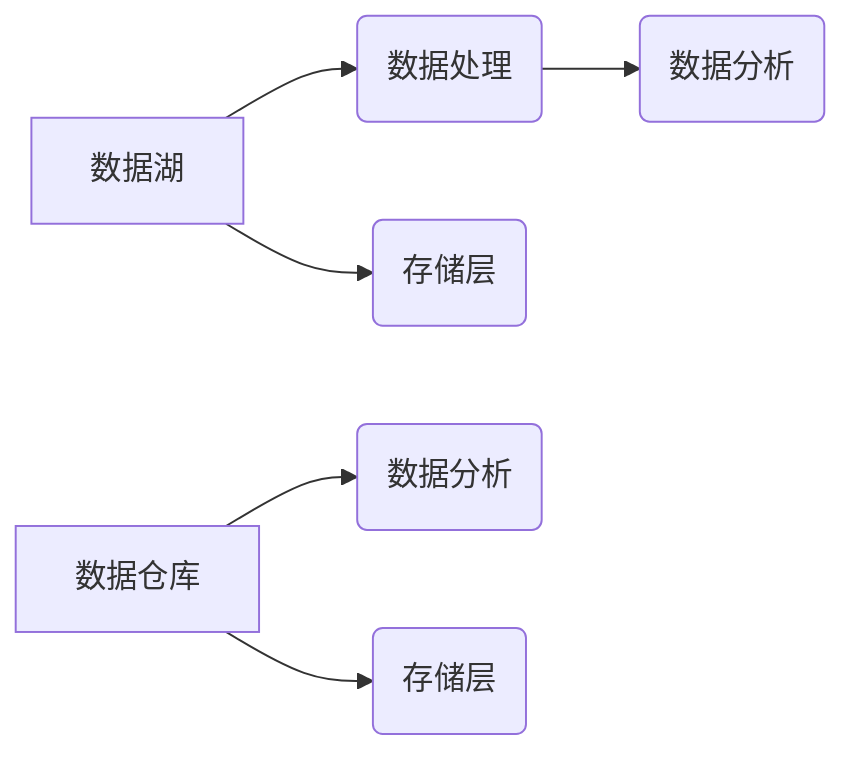

                 

## 数据湖架构：统一数据管理平台

> 关键词：数据湖，数据仓库，数据管理，数据架构，大数据，云计算，数据分析

### 1. 背景介绍

随着数字化转型加速推进，企业面临着海量数据爆炸式增长和多样化挑战。传统数据仓库架构难以应对这种快速变化的数据场景，其结构化、预定义的模式难以处理半结构化和非结构化数据。为了更好地管理和利用这些数据，数据湖架构应运而生。

数据湖是一种基于分布式存储系统的数据管理架构，它以其灵活、可扩展和成本效益高的特点，成为企业数据管理的新趋势。数据湖打破了传统数据仓库的限制，能够存储各种类型的数据，包括结构化、半结构化和非结构化数据，并提供灵活的数据处理和分析能力。

### 2. 核心概念与联系

#### 2.1 数据湖的核心概念

数据湖的核心概念包括：

* **存储层：** 数据湖通常基于分布式文件系统（如HDFS、S3）构建，提供海量数据存储能力。
* **数据处理层：** 数据湖支持多种数据处理引擎，如Spark、Hive、Flink等，能够对数据进行清洗、转换、聚合等操作。
* **数据分析层：** 数据湖提供多种数据分析工具，如Tableau、Power BI等，帮助用户进行数据探索、可视化和洞察。

#### 2.2 数据湖与数据仓库的关系

数据湖和数据仓库是两种不同的数据管理架构，它们之间存在着一定的联系和区别：

* **数据类型：** 数据仓库主要存储结构化数据，而数据湖能够存储各种类型的数据，包括结构化、半结构化和非结构化数据。
* **数据结构：** 数据仓库的数据结构是预定义的，而数据湖的数据结构是灵活的，可以根据需要进行调整。
* **数据处理方式：** 数据仓库的数据处理方式是批处理，而数据湖支持批处理和流式处理两种方式。
* **数据分析方式：** 数据仓库的数据分析方式是离线分析，而数据湖支持离线分析和在线分析两种方式。

**数据湖与数据仓库的关系图**



### 3. 核心算法原理 & 具体操作步骤

#### 3.1 算法原理概述

数据湖架构的核心算法原理主要包括：

* **分布式存储：** 数据湖基于分布式文件系统，将数据分散存储在多个节点上，提高数据存储容量和可用性。
* **数据分区：** 数据湖将数据按照一定的规则进行分区，例如时间、地域、用户等，方便数据管理和查询。
* **数据压缩：** 数据湖支持数据压缩技术，减少数据存储空间和传输成本。
* **数据元数据管理：** 数据湖需要维护数据元数据，例如数据类型、数据格式、数据来源等，方便数据理解和使用。

#### 3.2 算法步骤详解

数据湖架构的具体操作步骤包括：

1. **数据采集：** 从各种数据源收集数据，例如数据库、日志文件、传感器数据等。
2. **数据清洗：** 对收集到的数据进行清洗，例如去除重复数据、错误数据、缺失数据等。
3. **数据转换：** 将数据转换为适合数据湖存储和分析的格式，例如JSON、Avro等。
4. **数据加载：** 将清洗和转换后的数据加载到数据湖中。
5. **数据分析：** 使用数据湖提供的工具和引擎对数据进行分析，例如数据探索、数据可视化、机器学习等。

#### 3.3 算法优缺点

**优点：**

* **灵活：** 数据湖能够存储各种类型的数据，不受数据结构的限制。
* **可扩展：** 数据湖基于分布式存储系统，能够轻松扩展存储容量和处理能力。
* **成本效益高：** 数据湖的存储成本相对较低，并且能够利用开源工具进行数据处理和分析。

**缺点：**

* **数据管理复杂：** 数据湖需要维护数据元数据和数据质量，数据管理工作相对复杂。
* **数据安全风险：** 数据湖存储的数据量大，需要加强数据安全防护措施。
* **数据分析效率：** 对非结构化数据进行分析需要更强大的计算能力和算法支持。

#### 3.4 算法应用领域

数据湖架构广泛应用于以下领域：

* **金融行业：** 用于存储和分析客户交易数据、风险数据、市场数据等。
* **电商行业：** 用于存储和分析用户行为数据、商品数据、订单数据等。
* **医疗行业：** 用于存储和分析患者数据、医疗影像数据、基因数据等。
* **互联网行业：** 用于存储和分析用户行为数据、网站日志数据、社交媒体数据等。

### 4. 数学模型和公式 & 详细讲解 & 举例说明

#### 4.1 数学模型构建

数据湖架构的数学模型可以抽象为一个多层级网络结构，其中每一层代表不同的数据处理阶段。

* **存储层：** 可以用图论中的无向图表示，其中每个节点代表一个数据块，边代表数据块之间的依赖关系。
* **数据处理层：** 可以用图论中的有向图表示，其中每个节点代表一个数据处理任务，边代表任务之间的执行顺序。
* **数据分析层：** 可以用拓扑图表示，其中每个节点代表一个数据分析模型，边代表模型之间的依赖关系。

#### 4.2 公式推导过程

数据湖架构的性能评估可以基于以下公式：

* **数据存储成本：** $C_{storage} = \frac{V \times D}{S}$，其中V为数据量，D为存储成本，S为存储容量。
* **数据处理时间：** $T_{processing} = \frac{V \times P}{C}$，其中V为数据量，P为处理速度，C为处理能力。
* **数据分析效率：** $E_{analysis} = \frac{R}{T_{analysis}}$，其中R为分析结果的准确率，$T_{analysis}$为分析时间。

#### 4.3 案例分析与讲解

假设一家电商公司需要构建一个数据湖来存储和分析用户行为数据。

* **数据量：** 每天产生100GB的用户行为数据。
* **存储成本：** 每GB存储成本为0.1美元。
* **处理速度：** 数据处理引擎每秒可以处理1GB的数据。
* **分析效率：** 分析模型的准确率为90%。

根据上述数据，我们可以计算出：

* **数据存储成本：** $C_{storage} = \frac{100GB \times 0.1\$}{GB} = 10\$。
* **数据处理时间：** $T_{processing} = \frac{100GB \times 1s}{1GB} = 100s$。
* **数据分析效率：** $E_{analysis} = \frac{0.9}{T_{analysis}} = \frac{0.9}{100s}$。

### 5. 项目实践：代码实例和详细解释说明

#### 5.1 开发环境搭建

数据湖架构的开发环境搭建需要以下软件和工具：

* **分布式文件系统：** HDFS、S3等。
* **数据处理引擎：** Spark、Hive、Flink等。
* **数据分析工具：** Tableau、Power BI等。
* **编程语言：** Python、Java、Scala等。

#### 5.2 源代码详细实现

以下是一个使用Python和Spark实现数据湖数据处理的简单代码示例：

```python
from pyspark.sql import SparkSession

# 创建SparkSession
spark = SparkSession.builder.appName("DataLakeExample").getOrCreate()

# 读取数据
df = spark.read.csv("data.csv", header=True, inferSchema=True)

# 数据清洗
df = df.filter(df["age"] > 18)

# 数据转换
df = df.withColumn("age_group", when(df["age"] < 30, "young").otherwise("old"))

# 数据保存
df.write.parquet("output.parquet")

# 关闭SparkSession
spark.stop()
```

#### 5.3 代码解读与分析

这段代码首先创建了一个SparkSession，然后读取CSV文件中的数据。接着对数据进行过滤和转换操作，最后将处理后的数据保存到Parquet格式文件中。

#### 5.4 运行结果展示

运行这段代码后，会在指定目录下生成一个名为"output.parquet"的文件，该文件包含了处理后的数据。

### 6. 实际应用场景

#### 6.1 数据湖在金融行业的应用

在金融行业，数据湖可以用于存储和分析客户交易数据、风险数据、市场数据等。例如，银行可以使用数据湖来识别潜在的欺诈交易，保险公司可以使用数据湖来评估风险，投资公司可以使用数据湖来进行投资决策。

#### 6.2 数据湖在电商行业的应用

在电商行业，数据湖可以用于存储和分析用户行为数据、商品数据、订单数据等。例如，电商平台可以使用数据湖来个性化推荐商品，优化用户体验，提高转化率。

#### 6.3 数据湖在医疗行业的应用

在医疗行业，数据湖可以用于存储和分析患者数据、医疗影像数据、基因数据等。例如，医院可以使用数据湖来进行疾病诊断，研究药物疗效，提高医疗服务质量。

#### 6.4 未来应用展望

随着人工智能、机器学习等技术的不断发展，数据湖的应用场景将更加广泛。例如，数据湖可以用于预测未来趋势，进行智能决策，推动企业数字化转型。

### 7. 工具和资源推荐

#### 7.1 学习资源推荐

* **书籍：**
    * 《数据湖架构：统一数据管理平台》
    * 《Spark权威指南》
    * 《Hadoop权威指南》
* **在线课程：**
    * Coursera上的《数据科学与大数据》
    * Udemy上的《Apache Spark编程》
* **博客和论坛：**
    * Apache Spark官方博客
    * Cloudera社区

#### 7.2 开发工具推荐

* **分布式文件系统：** HDFS、S3
* **数据处理引擎：** Spark、Hive、Flink
* **数据分析工具：** Tableau、Power BI
* **编程语言：** Python、Java、Scala

#### 7.3 相关论文推荐

* 《Data Lake Architecture: A Comprehensive Guide》
* 《Spark: The Definitive Guide》
* 《Hadoop: The Definitive Guide》

### 8. 总结：未来发展趋势与挑战

#### 8.1 研究成果总结

数据湖架构已经成为企业数据管理的新趋势，它能够有效地存储和管理海量数据，并提供灵活的数据处理和分析能力。

#### 8.2 未来发展趋势

* **数据湖的智能化：** 将人工智能和机器学习技术融入数据湖架构，实现数据自动分类、标签和分析。
* **数据湖的实时化：** 支持实时数据处理和分析，满足企业对实时决策的需求。
* **数据湖的安全性：** 加强数据安全防护措施，保障数据隐私和安全。

#### 8.3 面临的挑战

* **数据质量问题：** 数据湖需要维护数据质量，确保数据准确、完整、一致。
* **数据安全风险：** 数据湖存储的数据量大，需要加强数据安全防护措施。
* **技术复杂性：** 数据湖架构的搭建和维护需要专业的技术人员。

#### 8.4 研究展望

未来，数据湖架构将继续发展和完善，并与其他技术融合，例如云计算、物联网、边缘计算等，为企业提供更加强大的数据管理和分析能力。

### 9. 附录：常见问题与解答

#### 9.1 数据湖和数据仓库的区别是什么？

数据湖和数据仓库是两种不同的数据管理架构，数据湖更加灵活，能够存储各种类型的数据，而数据仓库则更加结构化，主要存储结构化数据。

#### 9.2 如何选择合适的分布式文件系统？

选择分布式文件系统需要考虑数据量、存储成本、数据访问速度等因素。

#### 9.3 如何保证数据湖的数据安全？

数据湖需要采用多种安全措施，例如数据加密、访问控制、审计日志等，保障数据隐私和安全。


作者：禅与计算机程序设计艺术 / Zen and the Art of Computer Programming 
<end_of_turn>

