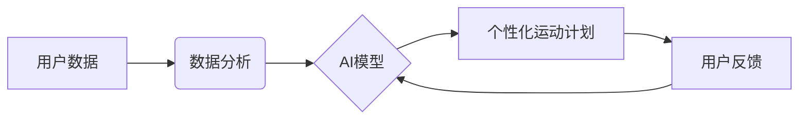

                 

## 智能健身创业：个性化运动指导的未来

> 关键词：人工智能、机器学习、运动指导、个性化健身、健康科技、数据分析、算法优化

## 1. 背景介绍

近年来，健身行业迎来了前所未有的发展机遇。人们对健康生活的追求日益强烈，健身房、运动APP、智能穿戴设备等都呈现出爆发式增长。然而，传统的健身方式往往缺乏个性化，难以满足不同用户多样化的需求。智能健身创业应运而生，利用人工智能、机器学习等先进技术，为用户提供个性化的运动指导，提升健身体验和效果。

智能健身创业的核心在于利用数据驱动个性化。通过收集用户的运动数据、生理数据、生活习惯等信息，人工智能算法可以分析用户的运动状态、健康状况、目标需求等，并根据这些信息制定个性化的运动计划、提供实时反馈和建议，帮助用户实现健身目标。

## 2. 核心概念与联系

智能健身的核心概念包括：

* **人工智能 (AI):**  智能健身系统的核心驱动力，通过机器学习、深度学习等算法，分析用户数据，提供个性化建议。
* **机器学习 (ML):**  AI 的重要分支，通过训练模型，从数据中学习规律，预测用户需求，优化运动计划。
* **数据分析:**  收集和分析用户运动数据、生理数据、生活习惯等信息，为个性化建议提供依据。
* **个性化:**  根据用户的不同需求、目标、体质等，定制专属的运动计划和指导。

**核心概念架构流程图:**



## 3. 核心算法原理 & 具体操作步骤

### 3.1  算法原理概述

智能健身系统中常用的算法包括：

* **推荐算法:**  根据用户的运动历史、喜好、目标等信息，推荐合适的运动计划、健身课程、营养方案等。
* **预测算法:**  预测用户的运动表现、健康状况变化等，及时调整运动计划，避免受伤。
* **优化算法:**  根据用户的反馈和运动数据，不断优化运动计划，提高健身效果。

### 3.2  算法步骤详解

以推荐算法为例，其具体操作步骤如下：

1. **数据收集:**  收集用户的运动数据、生理数据、生活习惯等信息，包括运动类型、运动强度、运动时间、心率、睡眠时间、饮食习惯等。
2. **数据预处理:**  对收集到的数据进行清洗、转换、归一化等处理，使其符合算法的输入要求。
3. **特征提取:**  从用户数据中提取关键特征，例如运动频率、运动时长、运动强度、喜欢的运动类型等。
4. **模型训练:**  利用机器学习算法，训练推荐模型，例如协同过滤算法、内容过滤算法、深度学习算法等。
5. **推荐生成:**  根据用户的特征和模型的预测结果，生成个性化的运动计划推荐。
6. **反馈收集:**  收集用户的反馈信息，例如对推荐计划的满意度、实际运动效果等，用于模型优化。

### 3.3  算法优缺点

**优点:**

* **个性化:**  根据用户的不同需求和特点，提供定制化的运动计划。
* **效率提升:**  智能算法可以快速分析数据，提供精准的建议，提高健身效率。
* **体验增强:**  个性化的运动指导和实时反馈，提升用户的健身体验。

**缺点:**

* **数据依赖:**  算法的准确性依赖于数据的质量和数量。
* **算法复杂性:**  训练和优化复杂的机器学习模型需要专业的技术能力。
* **隐私安全:**  收集和使用用户的个人数据需要保障隐私安全。

### 3.4  算法应用领域

智能健身算法广泛应用于：

* **运动APP:**  提供个性化的运动计划、运动指导、运动数据分析等功能。
* **智能穿戴设备:**  根据用户的运动数据，提供实时反馈和建议。
* **健身房:**  提供个性化的健身课程、教练指导、运动数据分析等服务。
* **医疗保健:**  辅助医生制定个性化的康复计划，监测患者的健康状况。

## 4. 数学模型和公式 & 详细讲解 & 举例说明

### 4.1  数学模型构建

智能健身系统中常用的数学模型包括：

* **线性回归模型:**  用于预测用户的运动表现，例如跑步速度、举重重量等。
* **逻辑回归模型:**  用于预测用户的健身目标达成概率，例如是否能够减重10公斤。
* **决策树模型:**  用于根据用户的特征，推荐合适的运动计划。
* **神经网络模型:**  用于更复杂的预测和推荐任务，例如预测用户的运动损伤风险。

### 4.2  公式推导过程

以线性回归模型为例，其目标是找到一条直线，使得预测值与实际值之间的误差最小。

假设我们有n个样本数据，每个样本包含一个输入特征x和一个输出目标y。线性回归模型的公式如下：

$$y = wx + b$$

其中，w是权重系数，b是偏置项。

为了找到最佳的w和b值，我们需要最小化误差函数，例如均方误差函数：

$$MSE = \frac{1}{n} \sum_{i=1}^{n} (y_i - \hat{y}_i)^2$$

其中，$\hat{y}_i$是模型预测的输出值，$y_i$是实际的输出值。

通过梯度下降算法，我们可以迭代地更新w和b值，直到误差函数达到最小值。

### 4.3  案例分析与讲解

假设我们想要预测用户的跑步速度，根据用户的年龄、体重、跑步距离等特征。我们可以使用线性回归模型，训练一个模型，将这些特征作为输入，跑步速度作为输出。

通过训练模型，我们可以得到最佳的权重系数和偏置项，例如：

$$跑步速度 = 0.5 * 年龄 + 0.2 * 体重 - 0.1 * 跑步距离 + 3$$

我们可以使用这个模型，预测不同用户跑步的速度。

## 5. 项目实践：代码实例和详细解释说明

### 5.1  开发环境搭建

智能健身项目可以使用Python语言开发，常用的框架包括TensorFlow、PyTorch、Scikit-learn等。

需要安装Python环境、相关库和工具，例如：

* Python 3.x
* TensorFlow/PyTorch
* NumPy
* Pandas
* Matplotlib

### 5.2  源代码详细实现

以下是一个简单的Python代码示例，使用Scikit-learn库实现一个线性回归模型，预测用户的跑步速度：

```python
import pandas as pd
from sklearn.linear_model import LinearRegression
from sklearn.model_selection import train_test_split

# 加载数据
data = pd.read_csv('running_data.csv')

# 分割数据
X = data[['年龄', '体重', '跑步距离']]
y = data['跑步速度']
X_train, X_test, y_train, y_test = train_test_split(X, y, test_size=0.2, random_state=42)

# 创建线性回归模型
model = LinearRegression()

# 训练模型
model.fit(X_train, y_train)

# 预测测试数据
y_pred = model.predict(X_test)

# 评估模型性能
from sklearn.metrics import mean_squared_error
mse = mean_squared_error(y_test, y_pred)
print('均方误差:', mse)
```

### 5.3  代码解读与分析

* 首先，我们加载数据，并使用Scikit-learn库的`train_test_split`函数将数据分割成训练集和测试集。
* 然后，我们创建线性回归模型，并使用`fit`方法训练模型。
* 训练完成后，我们可以使用`predict`方法预测测试数据的跑步速度。
* 最后，我们使用`mean_squared_error`函数评估模型的性能，计算均方误差。

### 5.4  运行结果展示

运行代码后，会输出模型的均方误差值，该值越小，模型的预测性能越好。

## 6. 实际应用场景

智能健身创业已经开始在各个领域得到应用，例如：

* **个性化运动计划:**  根据用户的目标、体质、喜好等信息，定制专属的运动计划，提高健身效率。
* **实时运动指导:**  通过智能设备，实时监测用户的运动状态，提供指导和建议，避免受伤。
* **运动数据分析:**  分析用户的运动数据，了解用户的运动习惯、健康状况，提供个性化的健康建议。
* **虚拟教练:**  利用人工智能技术，模拟专业的健身教练，为用户提供一对一指导。

### 6.4  未来应用展望

智能健身创业未来发展潜力巨大，可以应用于更多场景，例如：

* **远程医疗:**  辅助医生远程监测患者的运动状态，提供个性化的康复指导。
* **老年人健康管理:**  帮助老年人进行安全有效的运动，预防跌倒和慢性疾病。
* **儿童成长发育:**  根据儿童的年龄、体质、发育情况，制定个性化的运动计划，促进健康成长。

## 7. 工具和资源推荐

### 7.1  学习资源推荐

* **在线课程:**  Coursera、edX、Udacity等平台提供人工智能、机器学习等相关课程。
* **书籍:**  《深度学习》、《机器学习实战》等书籍可以帮助深入了解相关知识。
* **开源项目:**  TensorFlow、PyTorch等开源项目可以帮助实践学习。

### 7.2  开发工具推荐

* **Python:**  人工智能开发的常用语言。
* **TensorFlow/PyTorch:**  深度学习框架。
* **Scikit-learn:**  机器学习库。
* **Jupyter Notebook:**  交互式编程环境。

### 7.3  相关论文推荐

* **AlphaGo论文:**  介绍了深度学习在围棋领域的应用。
* **BERT论文:**  介绍了自然语言处理领域的预训练语言模型。
* **GAN论文:**  介绍了生成对抗网络的原理和应用。

## 8. 总结：未来发展趋势与挑战

### 8.1  研究成果总结

智能健身创业取得了显著成果，人工智能、机器学习等技术为个性化运动指导提供了强大的支持。

### 8.2  未来发展趋势

* **更精准的个性化:**  利用更先进的算法和更丰富的用户数据，提供更精准的个性化运动指导。
* **更智能的交互:**  利用自然语言处理、语音识别等技术，实现更智能的交互体验。
* **更全面的健康管理:**  将智能健身与其他健康管理服务结合，提供更全面的健康解决方案。

### 8.3  面临的挑战

* **数据安全和隐私保护:**  收集和使用用户的个人数据需要保障数据安全和隐私。
* **算法的准确性和可靠性:**  算法的准确性和可靠性直接影响用户的健身效果和安全。
* **技术成本和普及性:**  智能健身技术的开发和应用需要较高的技术成本，需要进一步降低成本，提高普及性。

### 8.4  研究展望

未来，智能健身创业将继续朝着更精准、更智能、更全面的方向发展，为用户提供更优质的健身体验和健康管理服务。


## 9. 附录：常见问题与解答

* **智能健身系统是否安全可靠？**

智能健身系统的设计和开发需要遵循严格的安全标准，保障用户的个人数据安全和健身安全。

* **智能健身系统是否适合所有人？**

智能健身系统可以根据用户的不同需求和体质提供个性化的指导，但对于一些特殊人群，例如孕妇、患有慢性疾病的人群，需要咨询医生意见后再使用。

* **智能健身系统如何保证算法的准确性？**

智能健身系统的算法需要通过大量的训练数据和不断优化才能保证准确性。用户也可以通过反馈信息帮助改进算法。


作者：禅与计算机程序设计艺术 / Zen and the Art of Computer Programming 
<end_of_turn>

