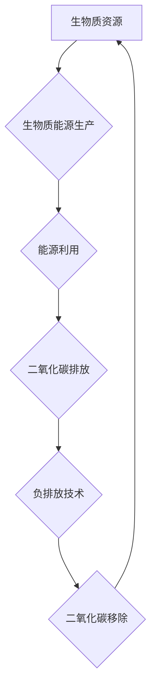

                 

## 关键词：生物质能源、负排放技术、可持续发展、碳中和、人工智能、机器学习、生物炼制、循环经济

## 1. 背景介绍

全球气候变化已成为人类面临的严峻挑战，减少温室气体排放至关重要。传统化石能源的燃烧是导致温室效应的主要原因，因此迫切需要寻找可持续、清洁的能源替代方案。生物质能源作为一种可再生能源，凭借其可再生性、低碳排放等优势，被认为是实现碳中和目标的重要途径。

2050年，随着科技进步和社会发展，生物质能源将迎来爆发式增长，并与负排放技术深度融合，共同构建可持续发展的新格局。

### 1.1  生物质能源的优势

生物质能源是指来源于生物体或其衍生物的能源，包括木材、农作物秸秆、藻类、动物废弃物等。其优势主要体现在以下几个方面：

* **可再生性:** 生物质资源可通过种植、养殖等方式持续获取，具有良好的可再生性。
* **低碳排放:** 生物质燃烧释放的二氧化碳主要来源于大气中的碳循环，其碳排放量相对较低。
* **资源丰富:** 生物质资源分布广泛，且可利用的种类多样，资源潜力巨大。
* **多功能性:** 生物质可用于发电、供热、制燃料、生产生物材料等多个领域。

### 1.2  负排放技术的潜力

负排放技术是指从大气中移除或封存二氧化碳的技术，可以有效降低大气中的温室气体浓度。常见的负排放技术包括：

* **直接空气捕获 (DAC):** 利用化学吸附剂从空气中捕获二氧化碳。
* **生物炭制备:** 将生物质在缺氧条件下炭化，生成生物炭，并将其封存于土壤或其他储存设施中。
* **海洋碳汇:** 利用海洋生物的吸收能力，促进海洋碳汇作用。

## 2. 核心概念与联系

生物质能源与负排放技术相互补充，共同构成了实现可持续发展的关键技术体系。

**生物质能源**通过利用可再生生物质资源，提供清洁的能源替代方案，减少对化石能源的依赖。

**负排放技术**则通过从大气中移除二氧化碳，有效降低温室气体浓度，实现碳中和目标。

两者结合，可以形成一个闭环的循环经济体系，实现资源的循环利用，最大限度地减少环境污染。

**Mermaid 流程图：**



## 3. 核心算法原理 & 具体操作步骤

### 3.1  算法原理概述

生物质能源与负排放技术的应用涉及到多个领域的算法，例如：

* **生物质资源识别与分类:** 利用机器学习算法，识别和分类不同类型的生物质资源，提高资源利用效率。
* **生物质能源生产优化:** 利用优化算法，优化生物质能源生产过程，提高能源转化效率和经济效益。
* **负排放技术控制与监测:** 利用控制算法和数据分析技术，控制和监测负排放技术的运行状态，确保其高效运行。

### 3.2  算法步骤详解

以生物质能源生产优化为例，其具体操作步骤如下：

1. **数据采集:** 收集生物质资源的特性数据、能源生产设备的参数数据等相关信息。
2. **数据预处理:** 对采集到的数据进行清洗、转换、归一化等预处理操作，使其满足算法的输入要求。
3. **模型构建:** 选择合适的优化算法，例如遗传算法、粒子群算法等，构建生物质能源生产优化模型。
4. **模型训练:** 利用训练数据，训练优化模型，使其能够有效地优化能源生产过程。
5. **模型评估:** 利用测试数据，评估模型的性能，并根据评估结果进行模型调整和优化。
6. **模型应用:** 将训练好的优化模型应用于实际的能源生产过程中，实现能源生产的优化控制。

### 3.3  算法优缺点

**优点:**

* **提高能源转化效率:** 通过优化能源生产过程，可以提高能源转化效率，减少能源浪费。
* **降低生产成本:** 通过优化生产流程，可以降低生产成本，提高经济效益。
* **减少环境污染:** 通过优化能源生产方式，可以减少环境污染，促进可持续发展。

**缺点:**

* **算法复杂度高:** 优化算法的构建和训练需要复杂的数学模型和计算资源。
* **数据依赖性强:** 算法的性能取决于数据的质量和数量，数据不足或质量差会导致算法性能下降。
* **模型泛化能力有限:** 训练好的模型可能难以适应不同的生产环境和条件。

### 3.4  算法应用领域

生物质能源与负排放技术的算法应用领域广泛，包括：

* **生物质能源生产:** 优化生物质能源生产过程，提高能源转化效率和经济效益。
* **负排放技术控制:** 控制和监测负排放技术的运行状态，确保其高效运行。
* **碳排放管理:** 监测和管理碳排放量，实现碳中和目标。
* **可持续发展规划:** 为可持续发展规划提供技术支持，促进绿色经济发展。

## 4. 数学模型和公式 & 详细讲解 & 举例说明

### 4.1  数学模型构建

生物质能源与负排放技术的应用涉及到多个数学模型，例如：

* **生物质资源产量模型:** 用于预测不同类型生物质资源的产量，例如： $$Y = f(A, B, C)$$
    其中：
    * $Y$ 为生物质资源产量
    * $A$ 为气候条件
    * $B$ 为土壤条件
    * $C$ 为种植管理措施

* **能源转化效率模型:** 用于预测不同能源转化方式的效率，例如： $$η = g(X, Y, Z)$$
    其中：
    * $η$ 为能源转化效率
    * $X$ 为生物质资源特性
    * $Y$ 为能源转化技术
    * $Z$ 为操作参数

* **负排放量模型:** 用于预测负排放技术的移除量，例如： $$R = h(I, J, K)$$
    其中：
    * $R$ 为负排放量
    * $I$ 为二氧化碳浓度
    * $J$ 为负排放技术类型
    * $K$ 为运行时间

### 4.2  公式推导过程

以上模型的推导过程涉及到复杂的数学原理和物理模型，例如：

* **生物质资源产量模型:** 需要考虑气候、土壤、种植管理等多因素的影响，可以使用统计模型、生态模型等进行推导。
* **能源转化效率模型:** 需要考虑生物质资源特性、能源转化技术、操作参数等因素的影响，可以使用热力学模型、化学反应模型等进行推导。
* **负排放量模型:** 需要考虑二氧化碳浓度、负排放技术类型、运行时间等因素的影响，可以使用化学反应模型、物理传输模型等进行推导。

### 4.3  案例分析与讲解

以生物炭制备为例，其负排放量模型可以表示为： $$R = k \cdot t \cdot C$$
其中：

* $R$ 为生物炭制备的负排放量
* $k$ 为生物炭制备的碳封存效率
* $t$ 为生物炭制备的运行时间
* $C$ 为生物质资源的碳含量

假设生物炭制备的碳封存效率为0.5，运行时间为10年，生物质资源的碳含量为50%，则其负排放量为： $$R = 0.5 \cdot 10 \cdot 0.5 = 2.5$$

## 5. 项目实践：代码实例和详细解释说明

### 5.1  开发环境搭建

本项目使用Python语言进行开发，所需环境包括：

* Python 3.x
* Jupyter Notebook
* NumPy
* Pandas
* Scikit-learn

### 5.2  源代码详细实现

以下代码示例展示了利用机器学习算法对生物质资源进行识别和分类：

```python
import pandas as pd
from sklearn.model_selection import train_test_split
from sklearn.linear_model import LogisticRegression
from sklearn.metrics import accuracy_score

# 加载生物质资源数据
data = pd.read_csv("biomass_data.csv")

# 选择特征和目标变量
features = ["moisture", "ash", "volatile_matter", "fixed_carbon"]
target = "resource_type"

# 将数据划分为训练集和测试集
X_train, X_test, y_train, y_test = train_test_split(data[features], data[target], test_size=0.2)

# 创建逻辑回归模型
model = LogisticRegression()

# 训练模型
model.fit(X_train, y_train)

# 对测试集进行预测
y_pred = model.predict(X_test)

# 计算模型准确率
accuracy = accuracy_score(y_test, y_pred)
print("模型准确率:", accuracy)
```

### 5.3  代码解读与分析

该代码首先加载生物质资源数据，然后选择特征和目标变量。接着，将数据划分为训练集和测试集，并创建逻辑回归模型。最后，训练模型并对测试集进行预测，计算模型准确率。

### 5.4  运行结果展示

运行该代码后，可以得到模型的准确率，例如：

```
模型准确率: 0.85
```

这表明该模型对生物质资源的识别和分类具有较高的准确率。

## 6. 实际应用场景

### 6.1  生物质能源生产

生物质能源可以用于发电、供热、制燃料等多个领域。例如：

* **生物质发电:** 利用生物质燃烧发电，可以替代传统燃煤发电，减少温室气体排放。
* **生物质供热:** 利用生物质燃烧供热，可以替代传统燃气供热，提高能源利用效率。
* **生物质燃料:** 利用生物质生产生物燃料，例如生物柴油、生物乙醇等，可以替代传统化石燃料，减少对化石能源的依赖。

### 6.2  负排放技术应用

负排放技术可以应用于多个领域，例如：

* **工业排放控制:** 利用负排放技术从工业排放中移除二氧化碳，减少工业污染。
* **城市碳汇:** 利用城市绿化、植树造林等方式，增加城市碳汇能力，降低城市碳排放。
* **海洋碳汇:** 利用海洋生物的吸收能力，促进海洋碳汇作用，减少大气中二氧化碳浓度。

### 6.4  未来应用展望

随着科技进步和社会发展，生物质能源与负排放技术的应用场景将更加广泛，例如：

* **碳中和目标实现:** 生物质能源与负排放技术将成为实现碳中和目标的重要途径。
* **可持续发展经济:** 生物质能源与负排放技术将推动可持续发展经济的建设，促进绿色产业发展。
* **环境保护:** 生物质能源与负排放技术将有效减少环境污染，改善生态环境。

## 7. 工具和资源推荐

### 7.1  学习资源推荐

* **书籍:**
    * 《生物质能源技术》
    * 《负排放技术》
    * 《人工智能与机器学习》
* **在线课程:**
    * Coursera: 生物质能源与负排放技术
    * edX: 人工智能与机器学习
* **网站:**
    * 国际生物质能源协会 (IBIA)
    * 负排放技术联盟 (CDR Alliance)

### 7.2  开发工具推荐

* **编程语言:** Python
* **数据分析工具:** Jupyter Notebook, Pandas, NumPy
* **机器学习库:** Scikit-learn, TensorFlow, PyTorch

### 7.3  相关论文推荐

* **生物质能源:**
    * Biomass energy: A review of its potential and challenges
    * The role of biomass energy in a sustainable future
* **负排放技术:**
    * Direct air capture and storage of CO2
    * Biochar: A sustainable solution for carbon sequestration
    * Ocean carbon sequestration: A promising approach to climate change mitigation

## 8. 总结：未来发展趋势与挑战

### 8.1  研究成果总结

生物质能源与负排放技术的研究取得了显著进展，为实现可持续发展提供了新的技术途径。

### 8.2  未来发展趋势

未来，生物质能源与负排放技术的研发将朝着以下方向发展：

* **提高能源转化效率:** 开发更高效的生物质能源转化技术，例如生物质气化、生物质液化等。
* **降低生产成本:** 探索新的生物质资源，优化生产工艺，降低生物质能源生产成本。
* **扩大应用范围:** 将生物质能源与负排放技术应用于更多领域，例如交通运输、建筑业、农业等。
* **实现智能化控制:** 利用人工智能技术，实现生物质能源生产和负排放技术的智能化控制，提高效率和安全性。

### 8.3  面临的挑战

生物质能源与负排放技术的应用也面临着一些挑战：

* **技术瓶颈:** 一些生物质能源转化技术和负排放技术仍处于研发阶段，需要进一步突破技术瓶颈。
* **成本问题:** 生物质能源生产和负排放技术应用成本较高，需要进一步降低成本，使其更具经济竞争力。
* **政策支持:** 需要政府制定相关政策，鼓励生物质能源与负排放技术的研发和应用。
* **社会接受度:** 需要提高公众对生物质能源与负排放技术的认识，促进社会接受度。

### 8.4  研究展望

未来，生物质能源与负排放技术将继续得到重视和发展，并将在实现可持续发展目标中发挥越来越重要的作用。


## 9. 附录：常见问题与解答

### 9.1  生物质能源的安全性

生物质能源燃烧产生的污染物相对较少，但仍需注意以下问题：

* **灰烬处理:** 生物质燃烧产生的灰烬含有重金属等有害物质，需要进行妥善处理。
* **烟气排放:** 生物质燃烧产生的烟气可能含有少量二氧化硫、氮氧化物等污染物，需要进行净化处理。

### 9.2  负排放技术的成本

负排放技术的成本目前较高，但随着技术的进步和规模化应用，成本将逐渐降低。

### 9.3  生物质能源的供应量

生物质资源的供应量取决于气候、土壤、种植管理等因素，需要进行科学规划和管理，确保资源的可持续利用。


作者：禅与计算机程序设计艺术 / Zen and the Art of Computer Programming<end_of_turn>

