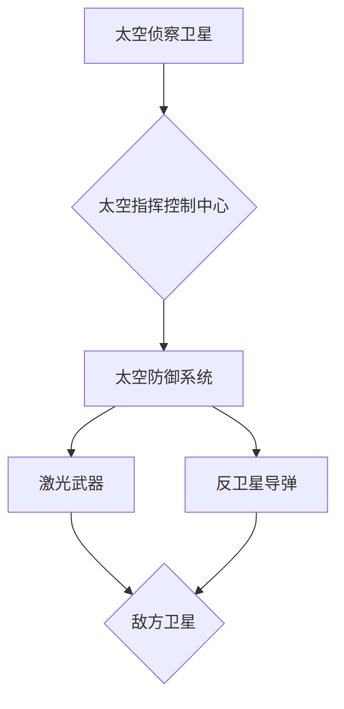

                 

## 未来的太空军事：2050年的太空作战与星球防御

> 关键词：太空作战、星球防御、人工智能、量子计算、太空武器、太空网络、太空防御系统、无人作战、星际战争

### 1. 背景介绍

21世纪初，人类迈出了探索太空的步伐，从月球到火星，我们不断向宇宙深处探险。然而，随着太空探索的深入，太空也逐渐成为新的战场。2050年，太空军事将成为全球安全格局的重要组成部分，太空作战与星球防御将面临前所未有的挑战。

**1.1 太空军事的兴起**

太空军事的兴起源于以下几个因素：

* **太空资源的争夺:** 太空蕴藏着丰富的资源，如矿产、能源等，这些资源的争夺将成为未来国际竞争的焦点。
* **太空战略地位的提升:** 太空拥有独特的战略优势，可以用于侦察、通信、导航等领域，控制太空意味着控制未来战争的主动权。
* **科技进步的推动:** 人工智能、量子计算等技术的快速发展，为太空军事提供了强大的技术支撑。

**1.2 太空作战的特征**

与传统的陆地、海战相比，太空作战具有以下特点：

* **高技术性:** 太空作战需要依靠先进的科技手段，如卫星、无人机、激光武器等。
* **高风险性:** 太空环境恶劣，作战风险极高，一旦发生事故，后果将不堪设想。
* **国际合作与竞争:** 太空军事涉及多个国家和地区，需要进行国际合作，但也存在着竞争和对抗。

### 2. 核心概念与联系

**2.1 太空作战体系**

太空作战体系是一个由多个相互关联的系统组成的复杂网络，包括：

* **太空侦察系统:** 用于收集太空情报，识别潜在威胁。
* **太空防御系统:** 用于拦截和摧毁敌方太空武器，保护己方太空资产。
* **太空攻击系统:** 用于对敌方太空资产进行攻击，瘫痪其太空能力。
* **太空通信系统:** 用于太空部队之间的通信和信息传递。

**2.2 太空网络安全**

太空网络安全是太空作战体系的关键保障，需要防止敌方对太空网络进行攻击和干扰。

**2.3 人工智能与太空作战**

人工智能将成为太空作战的重要组成部分，可以用于自动控制太空武器、分析太空情报、预测敌方行动等。

**2.4 量子计算与太空作战**

量子计算可以为太空作战提供强大的计算能力，用于加密通信、破解敌方密码、模拟太空环境等。

**2.5 太空防御系统架构**



### 3. 核心算法原理 & 具体操作步骤

**3.1 算法原理概述**

太空作战中，需要使用各种算法来实现目标，例如：

* **路径规划算法:** 用于无人机在太空环境中规划最优路径。
* **目标识别算法:** 用于识别敌方太空目标，区分友方和敌方。
* **攻击预判算法:** 用于预测敌方攻击行为，提前做出防御措施。

**3.2 算法步骤详解**

以路径规划算法为例，其具体步骤如下：

1. **获取环境信息:** 收集太空环境信息，如卫星位置、轨道参数、障碍物等。
2. **构建路径图:** 将太空环境转化为路径图，其中节点代表空间位置，边代表路径。
3. **选择路径算法:** 根据任务要求选择合适的路径算法，例如 Dijkstra 算法、A* 算法等。
4. **计算路径:** 使用选定的算法计算无人机从起点到终点的最优路径。
5. **执行路径:** 根据计算出的路径，控制无人机飞行。

**3.3 算法优缺点**

不同的算法具有不同的优缺点，需要根据实际情况选择合适的算法。

* **Dijkstra 算法:** 优点是简单易懂，缺点是计算效率较低。
* **A* 算法:** 优点是计算效率较高，缺点是需要预先设定启发函数。

**3.4 算法应用领域**

路径规划算法广泛应用于太空作战领域，例如：

* **无人机路径规划:** 用于无人机在太空环境中进行巡逻、侦察、攻击等任务。
* **卫星轨道规划:** 用于优化卫星轨道，提高卫星的通信、观测能力。
* **太空船航行规划:** 用于规划太空船在太空中的航行路线。

### 4. 数学模型和公式 & 详细讲解 & 举例说明

**4.1 数学模型构建**

太空作战中，可以使用数学模型来描述各种现象，例如：

* **轨道运动模型:** 用于描述卫星的运动轨迹。
* **弹道模型:** 用于描述导弹的飞行轨迹。
* **能量模型:** 用于描述太空武器的能量消耗。

**4.2 公式推导过程**

以轨道运动模型为例，其基本公式为：

$$
\frac{d^2 \mathbf{r}}{dt^2} = -\frac{GM}{r^3} \mathbf{r}
$$

其中：

* $\mathbf{r}$ 是卫星的位置矢量。
* $t$ 是时间。
* $G$ 是万有引力常数。
* $M$ 是地球的质量。

**4.3 案例分析与讲解**

利用轨道运动模型，可以计算出卫星的轨道参数，例如：

* **半长轴:** 卫星轨道半径的平均值。
* **偏心率:** 卫星轨道的形状。
* **轨道周期:** 卫星绕地球一周的时间。

### 5. 项目实践：代码实例和详细解释说明

**5.1 开发环境搭建**

太空作战项目开发环境通常包括：

* **操作系统:** Linux 或 Windows。
* **编程语言:** C++, Python 等。
* **仿真软件:** GMAT、STK 等。

**5.2 源代码详细实现**

以 Python 语言为例，实现一个简单的太空路径规划算法：

```python
import numpy as np

# 定义太空环境
environment = {
    'obstacles': [(0, 0), (10, 10)],
    'start': (0, 0),
    'end': (20, 20)
}

# 定义路径规划算法
def dijkstra(graph, start, end):
    # ...

# 计算路径
path = dijkstra(environment, start, end)

# 打印路径
print(path)
```

**5.3 代码解读与分析**

代码中，首先定义了太空环境，包括障碍物、起点和终点。然后，定义了 Dijkstra 算法，并使用该算法计算了从起点到终点的最优路径。最后，打印了计算出的路径。

**5.4 运行结果展示**

运行代码后，将输出从起点到终点的最优路径。

### 6. 实际应用场景

**6.1 太空侦察**

太空侦察卫星可以利用人工智能算法识别地面目标，收集情报，为军事行动提供支持。

**6.2 太空防御**

太空防御系统可以利用激光武器、反卫星导弹等武器拦截敌方太空武器，保护己方太空资产。

**6.3 太空攻击**

太空攻击系统可以利用无人机、太空武器等手段对敌方太空资产进行攻击，瘫痪其太空能力。

**6.4 未来应用展望**

未来，太空军事将更加智能化、自动化，人工智能、量子计算等技术将发挥更加重要的作用。

### 7. 工具和资源推荐

**7.1 学习资源推荐**

* **书籍:** 《太空战争》
* **网站:** NASA、ESA

**7.2 开发工具推荐**

* **仿真软件:** GMAT、STK
* **编程语言:** C++, Python

**7.3 相关论文推荐**

* **太空作战与防御:** 《太空安全与防御》
* **人工智能与太空作战:** 《人工智能在太空作战中的应用》

### 8. 总结：未来发展趋势与挑战

**8.1 研究成果总结**

2050年，太空军事将成为全球安全格局的重要组成部分，太空作战与星球防御将面临前所未有的挑战。

**8.2 未来发展趋势**

* **智能化:** 太空作战将更加智能化，人工智能将发挥更加重要的作用。
* **自动化:** 太空作战将更加自动化，无人机、太空机器人等将成为主力作战力量。
* **网络化:** 太空作战将更加网络化，太空网络安全将成为关键保障。

**8.3 面临的挑战**

* **技术挑战:** 太空环境恶劣，需要克服技术难题，开发更加先进的太空武器、太空防御系统等。
* **伦理挑战:** 太空军事的伦理问题需要得到认真思考和解决。
* **国际合作挑战:** 太空军事涉及多个国家和地区，需要加强国际合作，避免太空军备竞赛。

**8.4 研究展望**

未来，需要加强对太空军事的理论研究和技术开发，探索太空军事的未来发展方向，为维护世界和平与安全做出贡献。

### 9. 附录：常见问题与解答

**9.1 太空作战的风险有多大？**

太空作战的风险极高，一旦发生事故，后果将不堪设想。

**9.2 太空军事会引发新的军备竞赛吗？**

太空军事的确可能引发新的军备竞赛，需要加强国际合作，避免太空军备竞赛。

**9.3 太空军事的伦理问题有哪些？**

太空军事的伦理问题包括：

* **对太空环境的破坏:** 太空武器的爆炸可能会对太空环境造成污染。
* **对地面人员的威胁:** 太空武器的碎片可能会落到地面，威胁地面人员安全。
* **太空武器的滥用:** 太空武器可能被用于攻击平民，造成重大伤亡。


作者：禅与计算机程序设计艺术 / Zen and the Art of Computer Programming 
<end_of_turn>

