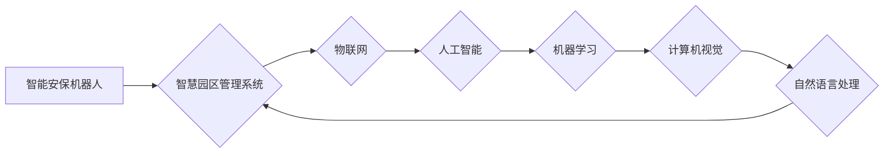

                 

## 关键词：智慧物业、智能安保机器人、智慧园区管理、人工智能、机器学习、计算机视觉、自然语言处理、物联网

## 1. 背景介绍

随着城市化进程的加速和人口密集度的提高，智慧城市建设已成为全球发展趋势。智慧物业作为智慧城市的重要组成部分，旨在通过数字化、智能化手段提升物业管理效率、保障居民安全和提升生活品质。未来，智能安保机器人将成为智慧物业的核心驱动力，并与智慧园区管理系统深度融合，构建一个安全、高效、智能的物业生态系统。

### 1.1  智慧物业发展现状

目前，智慧物业已在一些城市取得了初步进展，主要体现在以下几个方面：

* **智能门禁系统:** 利用生物识别技术、智能卡等手段实现门禁控制，提高安全性和便捷性。
* **远程监控系统:** 通过摄像头、传感器等设备实时监控物业环境，及时发现异常情况。
* **智能家居系统:** 通过物联网技术，实现对家居设备的远程控制和管理，提高生活舒适度。
* **物业服务平台:** 通过移动互联网平台，提供线上物业缴费、报修、咨询等服务，提升服务效率。

### 1.2  智能安保机器人发展趋势

智能安保机器人作为智慧物业的重要组成部分，其发展趋势主要体现在以下几个方面：

* **功能多样化:** 智能安保机器人将具备巡逻、监控、报警、识别、语音交互等多种功能，能够满足不同场景下的安全需求。
* **自主化程度提升:** 智能安保机器人将更加智能化，能够自主规划巡逻路线、识别异常情况并做出相应的处理。
* **协同作战能力增强:** 智能安保机器人将与其他智能设备、系统协同作战，形成一个更加完善的安全保障体系。
* **人机交互更加自然:** 智能安保机器人将具备更加自然的人机交互能力，能够更好地与人类进行沟通和协作。

## 2. 核心概念与联系

智慧物业的核心概念包括智能安保机器人、智慧园区管理系统、物联网、人工智能、机器学习、计算机视觉、自然语言处理等。这些概念相互关联，共同构成了智慧物业的生态系统。

**Mermaid 流程图:**



**核心概念原理和架构:**

* **智能安保机器人:** 具备自主导航、感知、决策和执行能力的机器人，能够在物业环境中巡逻、监控、报警、识别等。
* **智慧园区管理系统:** 集中管理物业的各种信息和设备，通过数据分析和智能算法，实现物业的智能化运营和管理。
* **物联网:** 通过传感器、网络等技术，将各种设备和信息连接起来，形成一个互联互通的网络。
* **人工智能:** 通过模拟人类智能的方式，使机器能够学习、推理、决策等。
* **机器学习:** 一种人工智能技术，通过算法训练，使机器能够从数据中学习并不断改进。
* **计算机视觉:** 使计算机能够“看”和理解图像和视频的能力。
* **自然语言处理:** 使计算机能够理解和处理人类语言的能力。

## 3. 核心算法原理 & 具体操作步骤

### 3.1  算法原理概述

智能安保机器人需要依靠多种算法来实现其功能，例如路径规划算法、目标识别算法、行为决策算法等。这些算法的原理主要基于人工智能、机器学习、计算机视觉等技术。

* **路径规划算法:** 用于规划机器人移动的最佳路径，避免障碍物，提高效率。常见的路径规划算法包括A*算法、Dijkstra算法等。
* **目标识别算法:** 用于识别机器人所感知到的目标，例如人员、车辆、物品等。常见的目标识别算法包括卷积神经网络、支持向量机等。
* **行为决策算法:** 用于根据机器人感知到的信息和预设的目标，做出相应的行为决策，例如巡逻、报警、追逐等。常见的行为决策算法包括强化学习、决策树等。

### 3.2  算法步骤详解

以路径规划算法为例，详细说明其操作步骤：

1. **构建地图:** 利用传感器数据，构建机器人周围环境的二元地图，其中“1”表示障碍物，“0”表示空旷区域。
2. **设置起点和终点:** 指定机器人当前位置作为起点，目标位置作为终点。
3. **搜索路径:** 利用A*算法等路径规划算法，从起点到终点搜索最优路径。
4. **规划轨迹:** 将搜索到的路径转化为机器人可执行的轨迹，包括速度、方向等信息。
5. **执行轨迹:** 机器人根据规划的轨迹进行运动，并实时感知环境变化，进行路径修正。

### 3.3  算法优缺点

**路径规划算法:**

* **优点:** 能够有效地规划机器人移动路径，提高效率和安全性。
* **缺点:** 算法复杂度较高，对计算资源要求较高，在复杂环境下可能难以找到最优路径。

### 3.4  算法应用领域

路径规划算法广泛应用于机器人领域，例如：

* **自主导航机器人:** 用于无人驾驶汽车、无人机、智能安保机器人等。
* **工业机器人:** 用于自动化生产线上的物料搬运、焊接、组装等。
* **服务机器人:** 用于酒店、餐厅、医院等场所提供服务。

## 4. 数学模型和公式 & 详细讲解 & 举例说明

### 4.1  数学模型构建

路径规划算法通常采用图论模型来表示环境和路径。其中，节点代表环境中的位置，边代表连接两个位置的路径。

**图论模型:**

* **节点:**  $N = \{n_1, n_2, ..., n_m\}$，其中$n_i$表示环境中的第$i$个位置。
* **边:** $E = \{(n_i, n_j) | n_i, n_j \in N\}$，其中$(n_i, n_j)$表示连接节点$n_i$和$n_j$的路径。

### 4.2  公式推导过程

A*算法是一种常用的路径规划算法，其核心思想是利用启发函数估算从当前节点到目标节点的距离，并选择距离最短的节点进行搜索。

**A*算法公式:**

* **启发函数:** $h(n)$，表示从节点$n$到目标节点的估计距离。
* **代价函数:** $g(n)$，表示从起点到节点$n$的实际距离。
* **总代价:** $f(n) = g(n) + h(n)$

A*算法选择总代价最小的节点进行扩展，直到找到目标节点。

### 4.3  案例分析与讲解

假设有一个机器人需要从起点$A$到终点$B$，环境中存在障碍物。

**A*算法步骤:**

1. **构建图论模型:** 将环境中的位置和路径表示为图论模型。
2. **设置起点和终点:** 将起点$A$和终点$B$作为图论模型中的节点。
3. **计算启发函数:** 根据目标节点$B$，计算每个节点到$B$的估计距离$h(n)$。
4. **计算代价函数:** 根据机器人移动的实际距离，计算每个节点到起点的实际距离$g(n)$。
5. **计算总代价:** 计算每个节点的总代价$f(n) = g(n) + h(n)$。
6. **选择最优路径:** 选择总代价最小的节点进行扩展，直到找到目标节点$B$。

## 5. 项目实践：代码实例和详细解释说明

### 5.1  开发环境搭建

* **操作系统:** Ubuntu 20.04 LTS
* **编程语言:** Python 3.8
* **库依赖:** ROS (Robot Operating System), OpenCV, TensorFlow

### 5.2  源代码详细实现

```python
# 路径规划算法实现

import rospy
from nav_msgs.msg import Path
from geometry_msgs.msg import PoseStamped

class PathPlanner:
    def __init__(self):
        self.path = Path()
        self.path.header.frame_id = "map"
        self.pose_pub = rospy.Publisher("/path", Path, queue_size=10)

    def plan_path(self, start_pose, goal_pose):
        # 使用A*算法规划路径
        # ...

        # 将规划好的路径发布
        self.path.poses = planned_path
        self.pose_pub.publish(self.path)

if __name__ == "__main__":
    rospy.init_node("path_planner")
    planner = PathPlanner()

    # 获取机器人当前位置和目标位置
    start_pose = rospy.wait_for_message("/start_pose", PoseStamped)
    goal_pose = rospy.wait_for_message("/goal_pose", PoseStamped)

    # 规划路径
    planner.plan_path(start_pose, goal_pose)

    rospy.spin()
```

### 5.3  代码解读与分析

* **PathPlanner类:** 负责路径规划和发布。
* **__init__方法:** 初始化路径对象和发布器。
* **plan_path方法:** 使用A*算法规划路径，并将规划好的路径发布到`/path`话题。
* **rospy.init_node:** 初始化ROS节点。
* **rospy.wait_for_message:** 等待接收`/start_pose`和`/goal_pose`话题的消息。
* **rospy.spin:** 保持节点运行，接收消息并处理。

### 5.4  运行结果展示

运行代码后，机器人将根据规划好的路径进行运动。

## 6. 实际应用场景

### 6.1  智慧安保机器人应用场景

* **巡逻警戒:** 智能安保机器人可以自主巡逻物业区域，实时监控环境，发现异常情况并报警。
* **人员识别:** 智能安保机器人可以识别人员身份，并进行身份验证，提高安全防范水平。
* **入侵报警:** 智能安保机器人可以感知入侵行为，并及时报警，保障物业安全。
* **应急救援:** 在突发事件发生时，智能安保机器人可以协助人员进行救援，提高应急响应效率。

### 6.2  智慧园区管理系统应用场景

* **智能能源管理:** 通过传感器数据，智能园区管理系统可以监测能源消耗，并进行优化控制，降低能源成本。
* **智能环境控制:** 智能园区管理系统可以根据环境条件，自动调节温度、湿度、照明等，提高舒适度和效率。
* **智能设备管理:** 智能园区管理系统可以远程监控和管理各种设备，提高设备利用率和维护效率。
* **智慧停车管理:** 智能园区管理系统可以提供智能停车引导、缴费、预约等服务，提高停车效率和用户体验。

### 6.4  未来应用展望

未来，智能安保机器人与智慧园区管理系统将更加融合，形成一个更加智能、高效、安全的物业生态系统。例如：

* **协同作战:** 智能安保机器人将与其他智能设备、系统协同作战，形成一个更加完善的安全保障体系。
* **个性化服务:** 智能安保机器人将根据用户的需求，提供个性化的服务，例如巡逻路线规划、安全提醒等。
* **数据分析:** 智能园区管理系统将对物业数据进行分析，发现问题并提供解决方案，提升物业管理水平。

## 7. 工具和资源推荐

### 7.1  学习资源推荐

* **ROS官网:** https://www.ros.org/
* **OpenCV官网:** https://opencv.org/
* **TensorFlow官网:** https://www.tensorflow.org/

### 7.2  开发工具推荐

* **ROS Melodic:** https://docs.ros.org/en/melodic/
* **Visual Studio Code:** https://code.visualstudio.com/
* **PyCharm:** https://www.jetbrains.com/pycharm/

### 7.3  相关论文推荐

* **A Survey of Path Planning Algorithms for Mobile Robots:** https://ieeexplore.ieee.org/document/6490649
* **Deep Reinforcement Learning for Robot Navigation:** https://arxiv.org/abs/1604.06361

## 8. 总结：未来发展趋势与挑战

### 8.1  研究成果总结

智能安保机器人与智慧园区管理系统的发展取得了显著成果，为智慧物业建设提供了重要的技术支撑。

### 8.2  未来发展趋势

* **更加智能化:** 智能安保机器人将更加智能化，能够自主学习、决策、协作。
* **更加融合化:** 智能安保机器人与智慧园区管理系统将更加融合，形成一个更加完整的生态系统。
* **更加个性化:** 智能安保机器人将根据用户的需求，提供更加个性化的服务。

### 8.3  面临的挑战

* **技术难题:** 智能安保机器人需要解决许多技术难题，例如环境感知、路径规划、决策控制等。
* **安全问题:** 智能安保机器人的安全问题需要得到充分重视，例如数据安全、网络安全、物理安全等。
* **伦理问题:** 智能安保机器人的应用需要考虑伦理问题，例如隐私保护、责任归属等。

### 8.4  研究展望

未来，我们将继续致力于智能安保机器人与智慧园区管理系统的研究，推动智慧物业的快速发展，为人们创造更加安全、舒适、便捷的生活环境。

## 9. 附录：常见问题与解答

**Q1: 智能安保机器人如何感知环境？**

**A1:** 智能安保机器人通常使用传感器来感知环境，例如摄像头、激光雷达、超声波传感器等。

**Q2: 智能安保机器人如何规划路径？**

**A2:** 智能安保机器人使用路径规划算法来规划路径，例如A*算法、Dijkstra算法等。

**Q3: 智能安保机器人如何做出决策？**

**A3:** 智能安保机器人使用行为决策算法来做出决策，例如强化学习、决策树等。

**Q4: 智能安保机器人的安全问题如何解决？**

**A4:** 智能安保机器人的安全问题需要从多方面解决，例如数据加密、身份验证、安全监控等。

**Q5: 智能安保机器人与人类如何协作？**

**A5:** 智能安保机器人可以与人类进行语音交互、图像识别等方式协作，实现人机协同工作。


作者：禅与计算机程序设计艺术 / Zen and the Art of Computer Programming<end_of_turn>

