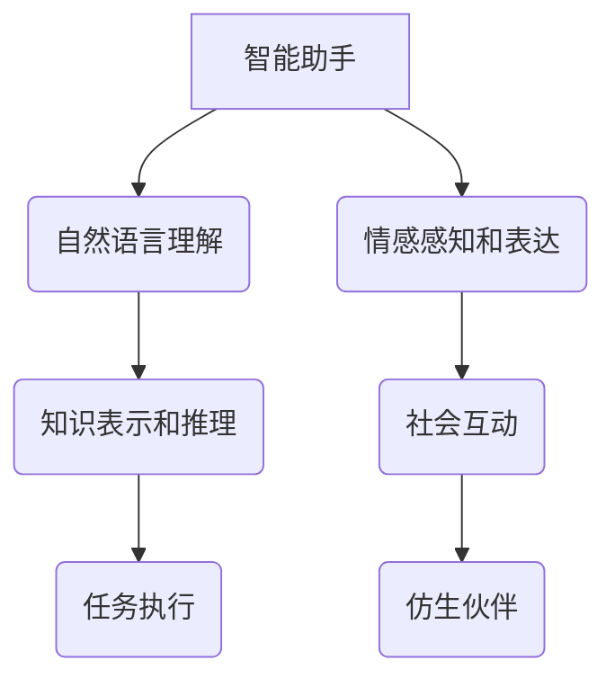

                 

## 未来的机器人：2050年的智能助手与仿生伙伴

> 关键词：机器人、人工智能、仿生学、智能助手、协作机器人、自然语言处理、计算机视觉、机器学习、深度学习

### 1. 背景介绍

人类文明的发展离不开对工具的不断革新。从石器时代的手工艺工具到现代的智能手机，工具的演变始终推动着社会进步。如今，我们站在一个新的技术拐点上，人工智能（AI）和机器人技术的飞速发展，正在重塑我们与工具的关系，并为未来社会带来前所未有的机遇和挑战。

2050年，机器人将不再是科幻电影中的幻想，而是我们日常生活不可或缺的一部分。它们将以智能助手和仿生伙伴的身份融入我们的生活，帮助我们完成各种任务，陪伴我们度过人生的各个阶段。

### 2. 核心概念与联系

**2.1 智能助手**

智能助手是指能够理解和响应人类指令，并执行相关任务的智能系统。它们通常具备以下核心功能：

* **自然语言理解 (NLU)：** 能够理解人类的自然语言指令，并将其转换为机器可执行的指令。
* **知识表示和推理：** 能够存储和组织知识，并进行逻辑推理，以解决问题和提供信息。
* **任务执行：** 能够执行各种任务，例如设置提醒、发送邮件、控制智能家居设备等。

**2.2 仿生伙伴**

仿生伙伴是指模仿生物特征和行为的机器人，它们能够与人类进行更自然的互动，并提供情感支持和陪伴。

* **仿生设计：** 仿生伙伴的外形和行为设计灵感来源于生物，例如动物的运动方式、植物的生长规律等。
* **情感感知和表达：** 仿生伙伴能够感知和表达人类的情感，例如通过表情、语调、肢体语言等方式。
* **社会互动：** 仿生伙伴能够参与人类的社会互动，例如参与对话、提供陪伴、协助完成任务等。

**2.3 核心概念联系**

智能助手和仿生伙伴是机器人技术发展的重要方向，它们之间存在着密切的联系。智能助手可以为仿生伙伴提供知识和任务执行能力，而仿生伙伴则可以为智能助手提供更自然的交互方式和情感支持。



### 3. 核心算法原理 & 具体操作步骤

**3.1 算法原理概述**

机器人技术的核心算法包括：

* **机器学习 (ML)：** 允许机器人从数据中学习，并改进其性能。
* **深度学习 (DL)：** 一种更高级的机器学习方法，能够处理更复杂的数据，例如图像、语音和文本。
* **强化学习 (RL)：** 允许机器人通过试错学习，并找到最佳的行动策略。

**3.2 算法步骤详解**

1. **数据收集和预处理：** 收集相关数据，并进行清洗、转换和格式化。
2. **模型选择和训练：** 选择合适的机器学习算法，并使用训练数据训练模型。
3. **模型评估和优化：** 使用测试数据评估模型性能，并根据评估结果调整模型参数，以提高性能。
4. **模型部署和应用：** 将训练好的模型部署到机器人系统中，并用于实际应用。

**3.3 算法优缺点**

* **优点：** 机器学习算法能够自动学习数据模式，并提高机器人性能。
* **缺点：** 机器学习算法需要大量数据进行训练，并且训练过程可能很耗时。

**3.4 算法应用领域**

* **图像识别和物体检测：** 用于识别和定位图像中的物体，例如人脸识别、自动驾驶等。
* **语音识别和自然语言处理：** 用于理解和生成人类语言，例如语音助手、机器翻译等。
* **机器人控制和导航：** 用于控制机器人的运动和导航，例如自主移动机器人、协作机器人等。

### 4. 数学模型和公式 & 详细讲解 & 举例说明

**4.1 数学模型构建**

机器学习算法通常使用数学模型来表示数据之间的关系。例如，线性回归模型使用以下公式来预测目标变量：

$$y = mx + c$$

其中：

* $y$ 是目标变量
* $x$ 是输入变量
* $m$ 是斜率
* $c$ 是截距

**4.2 公式推导过程**

线性回归模型的系数 $m$ 和 $c$ 可以通过最小化预测误差来计算。预测误差通常使用均方误差 (MSE) 来衡量：

$$MSE = \frac{1}{n} \sum_{i=1}^{n} (y_i - \hat{y}_i)^2$$

其中：

* $n$ 是样本数量
* $y_i$ 是第 $i$ 个样本的目标变量
* $\hat{y}_i$ 是第 $i$ 个样本的预测值

通过求解 MSE 的最小值，可以得到最佳的 $m$ 和 $c$ 值。

**4.3 案例分析与讲解**

假设我们想要预测房屋价格，输入变量是房屋面积，目标变量是房屋价格。我们可以使用线性回归模型来建立房屋价格预测模型。

通过收集房屋面积和价格数据，并使用线性回归算法进行训练，我们可以得到一个预测模型。例如，模型可能得出以下结论：

$$y = 5000x + 100000$$

其中：

* $y$ 是房屋价格
* $x$ 是房屋面积

这意味着，每增加 1 平方米房屋面积，房屋价格将增加 5000 元。

### 5. 项目实践：代码实例和详细解释说明

**5.1 开发环境搭建**

* 操作系统：Ubuntu 20.04
* Python 版本：3.8
* 机器学习库：TensorFlow 2.0

**5.2 源代码详细实现**

```python
import tensorflow as tf

# 定义模型
model = tf.keras.Sequential([
    tf.keras.layers.Dense(64, activation='relu', input_shape=(1,)),
    tf.keras.layers.Dense(1)
])

# 编译模型
model.compile(optimizer='adam', loss='mse')

# 训练模型
model.fit(x_train, y_train, epochs=100)

# 评估模型
loss = model.evaluate(x_test, y_test)
print('Loss:', loss)

# 预测
predictions = model.predict(x_new)
print('Predictions:', predictions)
```

**5.3 代码解读与分析**

* 代码首先定义了一个简单的线性回归模型，包含两个全连接层。
* 然后，模型被编译，使用 Adam 优化器和均方误差损失函数。
* 接着，模型使用训练数据进行训练，训练过程持续 100 个 epochs。
* 训练完成后，模型使用测试数据进行评估，并打印出损失值。
* 最后，模型使用新的数据进行预测，并打印出预测结果。

**5.4 运行结果展示**

运行结果将显示模型的损失值和预测结果。

### 6. 实际应用场景

**6.1 智能助手**

* **语音助手：** 例如 Siri、Alexa 和 Google Assistant，可以理解用户的语音指令，并执行相应的任务，例如设置提醒、播放音乐、控制智能家居设备等。
* **聊天机器人：** 例如客服机器人，可以与用户进行对话，回答常见问题，并提供帮助。
* **个人助理：** 可以帮助用户管理日程安排、发送邮件、预订机票等。

**6.2 仿生伙伴**

* **陪伴机器人：** 例如陪伴老人或儿童的机器人，可以提供情感支持和陪伴。
* **教育机器人：** 可以帮助儿童学习，例如通过游戏和互动的方式教授数学、科学等知识。
* **医疗机器人：** 可以协助医生进行手术、提供患者护理等。

**6.4 未来应用展望**

未来，机器人将更加智能化、个性化和协作性。

* **更智能的机器人：** 能够理解更复杂的指令，并执行更复杂的任务。
* **更个性化的机器人：** 可以根据用户的喜好和需求进行定制化。
* **更协作的机器人：** 可以与人类和其他机器人协同工作，完成更复杂的任务。

### 7. 工具和资源推荐

**7.1 学习资源推荐**

* **在线课程：** Coursera、edX、Udacity 等平台提供丰富的机器学习和机器人学课程。
* **书籍：** 《深度学习》、《机器人学原理》等书籍是学习相关知识的经典教材。
* **开源项目：** TensorFlow、ROS 等开源项目可以帮助你实践机器学习和机器人技术。

**7.2 开发工具推荐**

* **Python：** 机器学习和机器人开发的常用编程语言。
* **TensorFlow：** 深度学习框架。
* **ROS：** 机器人操作系统。

**7.3 相关论文推荐**

* **AlphaGo：** DeepMind 发布的 AlphaGo 论文，展示了深度学习在围棋领域的突破。
* **OpenAI Five：** OpenAI 发布的 OpenAI Five 论文，展示了深度学习在 Dota 2 领域的突破。

### 8. 总结：未来发展趋势与挑战

**8.1 研究成果总结**

近年来，人工智能和机器人技术取得了长足的进步，为未来社会带来了巨大的机遇。

**8.2 未来发展趋势**

* **更智能的机器人：** 能够理解更复杂的指令，并执行更复杂的任务。
* **更个性化的机器人：** 可以根据用户的喜好和需求进行定制化。
* **更协作的机器人：** 可以与人类和其他机器人协同工作，完成更复杂的任务。

**8.3 面临的挑战**

* **伦理问题：** 机器人的发展引发了伦理问题，例如机器人是否应该拥有自主权，如何避免机器人被滥用等。
* **安全问题：** 机器人安全问题，例如机器人是否会对人类构成威胁，如何确保机器人的可靠性等。
* **技术挑战：** 机器人技术还面临着许多技术挑战，例如如何让机器人更加智能化、更加人性化等。

**8.4 研究展望**

未来，我们需要继续加强对人工智能和机器人技术的研发，并积极探索其应用场景，同时也要关注其带来的伦理和社会问题，确保其健康发展。

### 9. 附录：常见问题与解答

**9.1 机器人是否会取代人类工作？**

机器人技术的发展可能会改变一些工作岗位，但同时也创造新的工作机会。重要的是，我们需要适应技术发展带来的变化，并不断提升自身技能，以应对未来的挑战。

**9.2 机器人是否会对人类构成威胁？**

目前，机器人技术还处于发展阶段，并不会对人类构成直接威胁。但我们需要关注机器人技术的伦理问题，并制定相应的规范和制度，确保其安全和可控发展。

**9.3 如何学习机器人技术？**

学习机器人技术需要掌握相关基础知识，例如数学、物理、计算机科学等。此外，还需要学习机器人相关的软件和硬件知识。可以通过在线课程、书籍、开源项目等方式学习机器人技术。


作者：禅与计算机程序设计艺术 / Zen and the Art of Computer Programming 
<end_of_turn>

