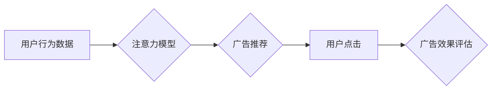

                 

## 注意力商业化：AI时代的广告革命

> 关键词：注意力机制、深度学习、广告投放、个性化推荐、数据分析、AI伦理

### 1. 背景介绍

在数字时代，信息爆炸式增长，用户注意力成为稀缺资源。传统广告模式的粗放式投放效率不断下降，用户对广告的接受度也越来越低。而人工智能（AI）的兴起，特别是深度学习技术的突破，为广告行业带来了新的机遇。注意力机制作为深度学习的重要组成部分，能够模拟人类对信息的关注方式，为广告投放提供更精准、更有效的解决方案。

### 2. 核心概念与联系

#### 2.1 注意力机制

注意力机制是一种模仿人类认知机制的技术，它允许模型在处理信息时，对重要信息给予更多关注，而对无关信息则给予较少关注。这种机制能够帮助模型更好地理解上下文信息，提高处理复杂信息的效率。

#### 2.2 广告投放

广告投放是指企业通过各种渠道向目标用户展示广告，以达到宣传推广、销售产品等目的的过程。传统的广告投放方式主要依靠人工筛选目标用户，效率低下，精准度不足。

#### 2.3 连接

注意力机制可以应用于广告投放，通过分析用户的行为数据、兴趣偏好等信息，识别用户对哪些广告内容更感兴趣，并优先展示这些广告。

**Mermaid 流程图**



### 3. 核心算法原理 & 具体操作步骤

#### 3.1 算法原理概述

注意力机制在广告投放中的应用主要基于深度学习模型，例如Transformer网络。这些模型能够学习用户和广告之间的复杂关系，并根据用户的注意力分布，生成个性化的广告推荐。

#### 3.2 算法步骤详解

1. **数据收集和预处理:** 收集用户行为数据、广告信息等数据，并进行清洗、转换等预处理操作。
2. **模型训练:** 使用深度学习模型，例如Transformer网络，对用户和广告数据进行训练，学习用户注意力分布的规律。
3. **注意力计算:** 根据用户的特征信息，计算用户对不同广告的注意力分数。
4. **广告排序:** 根据注意力分数对广告进行排序，优先展示用户感兴趣的广告。
5. **广告展示:** 将排序后的广告展示给用户。
6. **效果评估:** 收集用户点击、转化等数据，评估广告效果。

#### 3.3 算法优缺点

**优点:**

* **精准度高:** 可以根据用户的兴趣偏好，精准推荐感兴趣的广告。
* **用户体验好:** 展示更相关的广告，可以提高用户体验。
* **效率高:** 自动化广告投放，提高效率。

**缺点:**

* **数据依赖:** 需要大量的用户数据进行训练，数据质量直接影响模型效果。
* **计算复杂:** 深度学习模型训练和推理过程计算量大，需要强大的计算资源。
* **隐私问题:** 需要收集和使用用户数据，需要关注用户隐私保护问题。

#### 3.4 算法应用领域

* **搜索引擎广告:** 根据用户的搜索关键词，推荐相关的广告。
* **社交媒体广告:** 根据用户的兴趣爱好、社交关系等信息，推荐个性化的广告。
* **电商广告:** 根据用户的浏览历史、购买记录等信息，推荐相关的商品广告。

### 4. 数学模型和公式 & 详细讲解 & 举例说明

#### 4.1 数学模型构建

注意力机制的核心是计算用户对不同广告的注意力分数。常用的注意力机制模型是基于加权求和的注意力机制，其数学模型如下：

$$
\text{Attention}(Q, K, V) = \text{softmax}\left(\frac{Q K^T}{\sqrt{d_k}}\right) V
$$

其中：

* $Q$：查询向量，表示用户的特征信息。
* $K$：键向量，表示广告的特征信息。
* $V$：值向量，表示广告的内容信息。
* $d_k$：键向量的维度。
* $\text{softmax}$：softmax函数，将注意力分数归一化到0到1之间。

#### 4.2 公式推导过程

注意力机制的公式推导过程主要基于以下几个步骤：

1. 计算查询向量 $Q$ 和键向量 $K$ 的点积，得到一个得分矩阵。
2. 对得分矩阵进行归一化，得到注意力权重矩阵。
3. 将注意力权重矩阵与值向量 $V$ 进行加权求和，得到最终的注意力输出。

#### 4.3 案例分析与讲解

假设用户 $u$ 的特征向量为 $Q_u$，广告 $a$ 的特征向量为 $K_a$，广告 $a$ 的内容向量为 $V_a$。

则用户 $u$ 对广告 $a$ 的注意力分数为：

$$
\text{Attention}(Q_u, K_a, V_a) = \text{softmax}\left(\frac{Q_u K_a^T}{\sqrt{d_k}}\right) V_a
$$

如果用户 $u$ 对广告 $a$ 的兴趣较高，则注意力分数会更高，反之则更低。

### 5. 项目实践：代码实例和详细解释说明

#### 5.1 开发环境搭建

* Python 3.x
* TensorFlow 或 PyTorch 深度学习框架
* Jupyter Notebook 或 VS Code 代码编辑器

#### 5.2 源代码详细实现

```python
import tensorflow as tf

# 定义注意力机制模型
class Attention(tf.keras.layers.Layer):
    def __init__(self, units):
        super(Attention, self).__init__()
        self.Wq = tf.keras.layers.Dense(units)
        self.Wk = tf.keras.layers.Dense(units)
        self.Wv = tf.keras.layers.Dense(units)
        self.fc = tf.keras.layers.Dense(1)

    def call(self, query, key, value):
        # 计算注意力分数
        scores = self.fc(tf.nn.tanh(self.Wq(query) + self.Wk(key)))
        # 归一化注意力分数
        attention_weights = tf.nn.softmax(scores, axis=-1)
        # 计算加权求和
        context_vector = attention_weights * value
        return tf.reduce_sum(context_vector, axis=-1)

# 实例化注意力机制模型
attention_layer = Attention(units=128)

# 输入数据
query = tf.random.normal(shape=(1, 10, 128))
key = tf.random.normal(shape=(1, 10, 128))
value = tf.random.normal(shape=(1, 10, 64))

# 计算注意力输出
output = attention_layer(query, key, value)
print(output.shape)
```

#### 5.3 代码解读与分析

* 代码首先定义了一个 `Attention` 类，继承自 `tf.keras.layers.Layer`，实现注意力机制模型。
* `__init__` 方法中定义了三个稠密层 `Wq`、`Wk`、`Wv`，用于计算查询向量、键向量和值向量的线性变换。
* `call` 方法中计算注意力分数，并使用 softmax 函数归一化注意力分数，最后计算加权求和得到注意力输出。
* 代码实例化了 `Attention` 模型，并使用随机数据进行测试，输出注意力输出的形状。

#### 5.4 运行结果展示

运行代码后，会输出注意力输出的形状，例如 `(1, 64)`。

### 6. 实际应用场景

#### 6.1 搜索引擎广告

注意力机制可以帮助搜索引擎根据用户的搜索关键词和历史搜索记录，识别用户对哪些广告更感兴趣，并优先展示这些广告。

#### 6.2 社交媒体广告

注意力机制可以根据用户的兴趣爱好、社交关系等信息，推荐个性化的广告。例如，如果用户经常关注科技类内容，则可以推荐科技类广告。

#### 6.3 电商广告

注意力机制可以根据用户的浏览历史、购买记录等信息，推荐相关的商品广告。例如，如果用户之前购买过手机，则可以推荐手机配件广告。

#### 6.4 未来应用展望

随着人工智能技术的不断发展，注意力机制在广告投放领域的应用将更加广泛。例如，可以利用注意力机制实现更精准的广告定位、更个性化的广告推荐、更有效的广告效果评估等。

### 7. 工具和资源推荐

#### 7.1 学习资源推荐

* **书籍:**
    * 《深度学习》
    * 《Attention Is All You Need》
* **在线课程:**
    * Coursera: 深度学习
    * Udacity: 自然语言处理

#### 7.2 开发工具推荐

* **TensorFlow:** 开源深度学习框架
* **PyTorch:** 开源深度学习框架
* **Jupyter Notebook:** 代码编辑器和交互式笔记本

#### 7.3 相关论文推荐

* 《Attention Is All You Need》
* 《BERT: Pre-training of Deep Bidirectional Transformers for Language Understanding》

### 8. 总结：未来发展趋势与挑战

#### 8.1 研究成果总结

注意力机制在广告投放领域取得了显著的成果，能够提高广告精准度、用户体验和效率。

#### 8.2 未来发展趋势

* **更精准的广告定位:** 利用更丰富的用户数据和更先进的机器学习算法，实现更精准的广告定位。
* **更个性化的广告推荐:** 根据用户的兴趣爱好、行为模式等信息，提供更个性化的广告推荐。
* **更有效的广告效果评估:** 利用注意力机制分析用户对广告的交互行为，更有效地评估广告效果。

#### 8.3 面临的挑战

* **数据隐私问题:** 收集和使用用户数据需要谨慎处理，确保用户隐私安全。
* **算法可解释性问题:** 深度学习模型的决策过程难以解释，需要提高算法的可解释性。
* **公平性问题:** 注意力机制可能会存在偏见，需要确保广告投放公平公正。

#### 8.4 研究展望

未来研究方向包括：

* 开发更鲁棒、更公平的注意力机制模型。
* 探索注意力机制在其他广告投放场景的应用。
* 研究注意力机制与其他人工智能技术的结合。

### 9. 附录：常见问题与解答

**Q1: 注意力机制与传统广告投放有什么区别？**

**A1:** 传统广告投放主要依靠人工筛选目标用户，效率低下，精准度不足。而注意力机制可以根据用户的行为数据、兴趣偏好等信息，自动识别用户对哪些广告更感兴趣，并优先展示这些广告，提高广告精准度和效率。

**Q2: 注意力机制的应用场景有哪些？**

**A2:** 注意力机制可以应用于搜索引擎广告、社交媒体广告、电商广告等多个广告投放场景。

**Q3: 注意力机制有哪些挑战？**

**A3:** 注意力机制面临的数据隐私问题、算法可解释性问题和公平性问题等挑战。


作者：禅与计算机程序设计艺术 / Zen and the Art of Computer Programming 
<end_of_turn>

