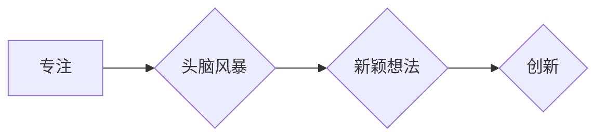

                 

## 1. 背景介绍

在当今信息爆炸的时代，我们面临着前所未有的信息洪流。来自邮件、社交媒体、新闻推送的各种信息无时无刻不在冲击着我们的注意力。这种碎片化、分散的注意力状态，不仅影响了我们的工作效率，也阻碍了我们进行深入思考、激发创造力的能力。

创造性思维是人类进步的源泉，它驱动着创新和变革。然而，创造力并非天生的，它需要我们不断地练习和培养。而注意力管理正是创造力发展的基石。只有专注于当下，才能静下心来，深入思考，并最终产生新的想法和见解。

## 2. 核心概念与联系

### 2.1 注意力与创造力

注意力是认知过程的核心，它指我们对特定信息或任务的集中和选择性关注。创造力则是指我们能够产生新颖、有价值的思想、概念或解决方案的能力。

注意力与创造力之间存在着密切的联系。

* **注意力是创造力的基础：** 创造力需要我们能够专注于问题，深入思考，并对相关信息进行整合和联想。而注意力正是实现这些过程的关键。
* **注意力是创造力的催化剂：** 当我们专注于一个问题时，我们的思维会更加清晰，能够更好地识别问题中的关键信息，并从中产生新的灵感。

### 2.2  注意力管理与头脑风暴

头脑风暴是一种集思广益的创意方法，它鼓励团队成员在短时间内尽可能地提出想法，不考虑其可行性或合理性。

注意力管理在头脑风暴中扮演着至关重要的角色：

* **集中注意力：** 头脑风暴需要团队成员能够集中注意力，积极参与讨论，并对提出的想法进行思考和评价。
* **抑制干扰：** 头脑风暴的环境需要尽量减少干扰，例如手机、邮件等，以便团队成员能够更好地集中精力。
* **引导注意力：** 作为主持人，需要引导团队成员的注意力，确保讨论围绕主题展开，并鼓励成员提出更多新颖的想法。

**Mermaid 流程图**



## 3. 核心算法原理 & 具体操作步骤

### 3.1 算法原理概述

注意力管理算法的核心是通过对用户的行为和生理特征进行分析，并根据分析结果动态调整用户的注意力状态。

常见的注意力管理算法包括：

* **基于行为的算法：** 通过分析用户的浏览记录、点击行为等，识别用户的注意力集中和分散的模式，并根据这些模式提供个性化的提醒和干预。
* **基于生理特征的算法：** 通过监测用户的眼动、心率、脑电波等生理特征，识别用户的注意力状态，并根据状态提供相应的调整建议。

### 3.2 算法步骤详解

1. **数据采集：** 收集用户的行为和生理特征数据，例如浏览记录、鼠标移动轨迹、眼动数据、心率等。
2. **数据预处理：** 对采集到的数据进行清洗、转换和特征提取，以便于后续的分析和建模。
3. **模型训练：** 使用机器学习算法对预处理后的数据进行训练，建立注意力管理模型。
4. **注意力状态预测：** 将用户的实时行为和生理特征数据输入到训练好的模型中，预测用户的注意力状态。
5. **干预策略执行：** 根据预测的注意力状态，执行相应的干预策略，例如：
    * **提醒用户注意：** 当用户注意力分散时，发出提醒，引导用户重新集中注意力。
    * **调整环境：** 根据用户的注意力状态，调整环境因素，例如灯光、温度、背景音乐等，以提高用户的注意力集中度。
    * **提供个性化建议：** 根据用户的注意力模式，提供个性化的建议，例如休息时间、学习方法等。

### 3.3 算法优缺点

**优点：**

* **个性化：** 基于用户的行为和生理特征，提供个性化的注意力管理建议。
* **实时性：** 可以实时监测用户的注意力状态，并根据状态动态调整干预策略。
* **可扩展性：** 可以根据用户的需求，添加新的干预策略和功能。

**缺点：**

* **数据依赖性：** 需要大量的用户数据进行训练和验证，否则模型的准确性会降低。
* **隐私问题：** 收集和使用用户的生理特征数据可能会引发隐私问题。
* **技术复杂性：** 开发和部署注意力管理算法需要一定的技术难度。

### 3.4 算法应用领域

注意力管理算法在以下领域具有广泛的应用前景：

* **教育：** 帮助学生提高学习效率，更好地集中注意力。
* **医疗：** 辅助医生诊断和治疗注意力缺陷障碍等疾病。
* **企业：** 提高员工的工作效率，减少工作中的分心和错误。
* **游戏：** 增强游戏玩家的沉浸感和体验。

## 4. 数学模型和公式 & 详细讲解 & 举例说明

### 4.1 数学模型构建

注意力可以被视为一个概率分布，它描述了我们对不同信息或任务的关注程度。我们可以使用以下数学模型来表示注意力：

$$
\alpha(t) = \frac{e^{w^T \cdot h(t)}}{\sum_{i=1}^{N} e^{w^T \cdot h(i)}}
$$

其中：

* $\alpha(t)$ 表示在时间 $t$ 时对第 $t$ 个信息或任务的注意力权重。
* $w$ 是一个权重向量，它决定了不同特征对注意力的影响程度。
* $h(t)$ 是第 $t$ 个信息或任务的特征向量。
* $N$ 是所有信息或任务的数量。

### 4.2 公式推导过程

该公式基于 softmax 函数，它将一个向量映射到一个概率分布。

* **特征提取：** 首先需要提取每个信息或任务的特征向量 $h(t)$。这些特征可以是文本内容、图像信息、音频特征等。
* **权重计算：** 然后，使用权重向量 $w$ 与每个特征向量进行点积，得到每个信息或任务的注意力得分。
* **概率分布：** 最后，使用 softmax 函数将注意力得分转换为概率分布，其中每个概率值代表了我们对相应信息或任务的关注程度。

### 4.3 案例分析与讲解

例如，在阅读文章时，我们的注意力会随着文章内容的变化而发生变化。

* **重要信息：** 当遇到重要的信息时，我们的注意力会集中在该信息上，注意力权重会相应增加。
* **重复信息：** 当遇到重复的信息时，我们的注意力会分散，注意力权重会相应减少。

通过分析用户的注意力权重变化，我们可以了解用户对文章内容的理解程度，并提供个性化的学习建议。

## 5. 项目实践：代码实例和详细解释说明

### 5.1 开发环境搭建

* **操作系统：** Ubuntu 20.04
* **编程语言：** Python 3.8
* **深度学习框架：** TensorFlow 2.0
* **其他工具：** Jupyter Notebook、Git

### 5.2 源代码详细实现

```python
import tensorflow as tf

# 定义注意力模型
class AttentionModel(tf.keras.Model):
    def __init__(self, units):
        super(AttentionModel, self).__init__()
        self.W = tf.keras.layers.Dense(units)
        self.softmax = tf.keras.layers.Softmax()

    def call(self, inputs):
        # 计算注意力得分
        scores = self.W(inputs)
        # 将注意力得分转换为概率分布
        attention_weights = self.softmax(scores)
        # 将注意力权重与输入数据进行加权求和
        output = tf.matmul(attention_weights, inputs)
        return output

# 实例化注意力模型
model = AttentionModel(units=128)

# 输入数据
inputs = tf.random.normal(shape=(10, 512))

# 预测注意力权重
attention_weights = model(inputs)

# 打印注意力权重
print(attention_weights)
```

### 5.3 代码解读与分析

* **模型定义：** 我们定义了一个简单的注意力模型，它包含一个全连接层和一个 softmax 函数。
* **输入数据：** 输入数据是一个形状为 (10, 512) 的张量，代表 10 个样本的 512 维特征向量。
* **注意力得分计算：** 全连接层将输入数据映射到一个注意力得分向量。
* **概率分布转换：** softmax 函数将注意力得分转换为概率分布，每个概率值代表了对相应样本的关注程度。
* **加权求和：** 将注意力权重与输入数据进行加权求和，得到最终的输出。

### 5.4 运行结果展示

运行上述代码，会输出一个形状为 (10, 512) 的张量，代表每个样本的注意力权重分布。

## 6. 实际应用场景

### 6.1  教育领域

* **个性化学习：** 根据学生的注意力模式，提供个性化的学习内容和学习方法。
* **课堂互动：** 通过监测学生的注意力状态，及时调整课堂节奏和教学内容，提高课堂互动效果。
* **学习效率提升：** 帮助学生集中注意力，提高学习效率，减少学习疲劳。

### 6.2  医疗领域

* **注意力缺陷障碍诊断：** 通过监测患者的注意力状态，辅助医生诊断注意力缺陷障碍等疾病。
* **认知功能评估：** 评估患者的注意力、记忆力和执行功能等认知能力。
* **康复训练：** 设计个性化的注意力训练方案，帮助患者恢复注意力功能。

### 6.3  企业领域

* **员工工作效率提升：** 帮助员工集中注意力，提高工作效率，减少工作中的分心和错误。
* **远程办公协作：** 通过监测员工的注意力状态，了解员工的工作状态，并提供相应的协作建议。
* **产品设计：** 通过分析用户的注意力模式，优化产品设计，提高用户体验。

### 6.4 未来应用展望

随着人工智能技术的不断发展，注意力管理算法将在更多领域得到应用，例如：

* **自动驾驶：** 帮助驾驶员集中注意力，提高驾驶安全。
* **虚拟现实：** 增强用户在虚拟环境中的沉浸感和体验。
* **人机交互：** 开发更加自然、智能的人机交互方式。

## 7. 工具和资源推荐

### 7.1 学习资源推荐

* **书籍：**
    * 《深度学习》 by Ian Goodfellow, Yoshua Bengio, Aaron Courville
    * 《Attention Is All You Need》 by Vaswani et al.
* **在线课程：**
    * Coursera: Deep Learning Specialization
    * Udacity: Deep Learning Nanodegree

### 7.2 开发工具推荐

* **深度学习框架：** TensorFlow, PyTorch, Keras
* **编程语言：** Python
* **数据可视化工具：** Matplotlib, Seaborn

### 7.3 相关论文推荐

* **Attention Is All You Need:** https://arxiv.org/abs/1706.03762
* **BERT: Pre-training of Deep Bidirectional Transformers for Language Understanding:** https://arxiv.org/abs/1810.04805

## 8. 总结：未来发展趋势与挑战

### 8.1 研究成果总结

注意力管理算法在近年来取得了显著的进展，并展现出巨大的应用潜力。

* **模型复杂度提升：** 出现了更加复杂的注意力模型，例如 Transformer、BERT 等，能够更好地捕捉长距离依赖关系和语义信息。
* **数据规模扩大：** 随着大规模数据集的涌现，注意力模型的训练效果不断提升。
* **应用场景拓展：** 注意力管理算法的应用场景不断拓展，涵盖教育、医疗、企业等多个领域。

### 8.2 未来发展趋势

* **更精准的注意力预测：** 开发更加精准的注意力预测模型，能够更准确地识别用户的注意力状态和变化趋势。
* **个性化干预策略：** 根据用户的不同需求和特征，提供更加个性化的干预策略，提高干预效果。
* **跨模态注意力管理：** 将注意力管理算法应用于多模态数据，例如文本、图像、音频等，实现更加全面的注意力理解和控制。

### 8.3 面临的挑战

* **数据隐私保护：** 收集和使用用户的生理特征数据可能会引发隐私问题，需要采取相应的技术和政策措施进行保护。
* **模型解释性：** 许多注意力模型过于复杂，难以解释其内部工作机制，这可能会阻碍其在实际应用中的推广。
* **伦理问题：** 注意力管理技术可能会被滥用，例如用于操控用户行为，因此需要认真考虑其伦理问题。

### 8.4 研究展望

未来，注意力管理技术将继续朝着更加精准、个性化、智能的方向发展。

* **探索新的注意力机制：** 研究更加高效、鲁棒的注意力机制，例如自注意力、交叉注意力等。
* **开发可解释的注意力模型：** 开发能够解释其内部工作机制的注意力模型，提高模型的透明度和可信度。
* **建立注意力管理伦理规范：** 制定相应的伦理规范，确保注意力管理技术被安全、负责任地应用。

## 9. 附录：常见问题与解答

### 9.1 如何提高注意力集中度？

* **创造专注环境：** 减少干扰，例如关闭手机、邮件通知等。
* **设定明确目标：** 明确自己想要完成什么，并制定相应的计划。
* **使用番茄工作法：** 将工作时间分成 25 分钟的间隔，并在每个间隔结束后休息 5 分钟。
* **进行规律的运动：** 运动可以提高大脑的血液循环，增强注意力集中度。
* **保证充足的睡眠：** 睡眠不足会影响注意力和认知功能。

### 9.2 注意力管理技术有哪些风险？

* **数据隐私泄露：** 收集和使用用户的生理特征数据可能会引发隐私问题。
* **用户操控：** 注意力管理技术可能会被滥用，例如用于操控用户的行为。
* **过度依赖技术：** 过度依赖注意力管理技术可能会导致用户丧失自主控制能力。


作者：禅与计算机程序设计艺术 / Zen and the Art of Computer Programming<end_of_turn>

