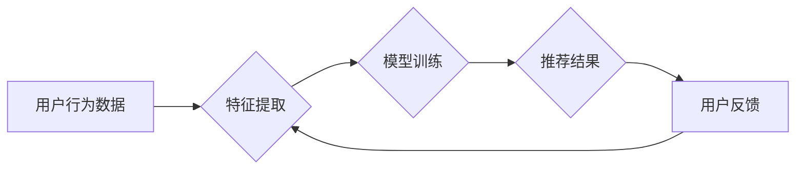

                 

## 注意力经济与个性化推荐系统：为受众提供定制、有针对性的内容和体验

> 关键词：注意力经济、个性化推荐、推荐算法、深度学习、用户行为分析、内容过滤、协同过滤、矩阵分解、神经网络

### 1. 背景介绍

在信息爆炸的时代，人们每天面临着海量信息的选择和处理。如何有效地获取所需信息，并过滤掉无关紧要的内容，成为了一个重要的挑战。注意力经济的概念应运而生，它强调了信息获取和处理的有限性，以及人们对信息的“选择性关注”。在这个背景下，个性化推荐系统应运而生，它通过分析用户的行为数据和偏好，为用户提供定制化的内容和体验，帮助用户更高效地获取所需信息，并提升用户满意度。

个性化推荐系统已经广泛应用于各个领域，例如电商、社交媒体、视频平台、音乐平台等。它可以帮助用户发现新的商品、内容和服务，并提高用户的购物体验、社交互动和娱乐体验。

### 2. 核心概念与联系

#### 2.1 注意力经济

注意力经济是指在信息过载的时代，人们对信息的获取和处理能力有限，因此需要对信息进行选择性关注，并集中注意力于最相关的部分。

#### 2.2 个性化推荐

个性化推荐是指根据用户的历史行为、偏好和需求，为用户提供定制化的内容和服务。

#### 2.3 推荐系统架构

**Mermaid 流程图**



**核心概念联系：**

注意力经济强调了信息获取和处理的有限性，而个性化推荐系统正是为了解决这个问题，通过分析用户的行为数据和偏好，为用户提供更精准、更有效的推荐，从而帮助用户集中注意力于最相关的部分。

### 3. 核心算法原理 & 具体操作步骤

#### 3.1 算法原理概述

个性化推荐系统通常采用以下几种算法：

* **内容过滤:** 基于用户的历史行为和偏好，推荐与用户兴趣相符的内容。
* **协同过滤:** 基于其他用户的行为数据，推荐与用户相似用户的兴趣内容。
* **矩阵分解:** 将用户-物品交互矩阵分解成低维矩阵，从而预测用户对物品的评分或偏好。
* **深度学习:** 利用深度神经网络，学习用户行为和内容特征，进行更精准的推荐。

#### 3.2 算法步骤详解

以协同过滤算法为例，其具体步骤如下：

1. **数据收集:** 收集用户对物品的评分或交互数据。
2. **用户-物品矩阵构建:** 将用户和物品作为行和列，构建用户-物品交互矩阵。
3. **相似用户/物品查找:** 根据用户-物品矩阵，计算用户之间的相似度或物品之间的相似度。
4. **推荐生成:** 为用户推荐与其相似用户喜欢的物品，或推荐与用户喜欢的物品相似的物品。

#### 3.3 算法优缺点

**内容过滤:**

* **优点:** 可以推荐与用户兴趣相符的内容，不受数据稀疏性的影响。
* **缺点:** 容易陷入“同质化推荐”，难以发现新的兴趣。

**协同过滤:**

* **优点:** 可以推荐与用户相似用户的兴趣内容，发现新的兴趣。
* **缺点:** 容易受到数据稀疏性的影响，难以推荐新用户或新物品。

**矩阵分解:**

* **优点:** 可以解决数据稀疏性问题，并进行更精准的推荐。
* **缺点:** 计算复杂度较高，需要大量的计算资源。

**深度学习:**

* **优点:** 可以学习用户行为和内容特征，进行更精准的推荐。
* **缺点:** 需要大量的训练数据，训练时间较长。

#### 3.4 算法应用领域

* **电商:** 推荐商品、优惠券、促销活动等。
* **社交媒体:** 推荐好友、群组、话题等。
* **视频平台:** 推荐视频、电视剧、电影等。
* **音乐平台:** 推荐歌曲、专辑、歌手等。
* **新闻平台:** 推荐新闻文章、博客、论坛等。

### 4. 数学模型和公式 & 详细讲解 & 举例说明

#### 4.1 数学模型构建

协同过滤算法的数学模型通常基于用户-物品交互矩阵，该矩阵的元素表示用户对物品的评分或交互行为。

假设用户集合为U，物品集合为I，则用户-物品交互矩阵为R，其中R(u,i)表示用户u对物品i的评分或交互行为。

#### 4.2 公式推导过程

协同过滤算法的目标是预测用户对物品的评分或交互行为。常用的预测公式包括：

* **基于用户的协同过滤:**

$$
R(u,i) = \frac{\sum_{j \in N(u)} R(u,j) \cdot sim(u,v)}{\sum_{j \in N(u)} sim(u,v)}
$$

其中，N(u)表示与用户u相似的用户集合，sim(u,v)表示用户u和用户v之间的相似度。

* **基于物品的协同过滤:**

$$
R(u,i) = \frac{\sum_{v \in N(i)} R(u,v) \cdot sim(i,j)}{\sum_{v \in N(i)} sim(i,j)}
$$

其中，N(i)表示与物品i相似的物品集合，sim(i,j)表示物品i和物品j之间的相似度。

#### 4.3 案例分析与讲解

假设有一个用户-物品交互矩阵，其中用户集合为{u1, u2, u3}, 物品集合为{i1, i2, i3}, 矩阵元素表示用户对物品的评分。

```
R = [
    [5, 3, 4],
    [4, 5, 2],
    [3, 2, 5]
]
```

如果要预测用户u1对物品i3的评分，可以使用基于用户的协同过滤算法。首先需要找到与用户u1相似的用户，例如用户u2。然后计算用户u1和用户u2之间的相似度，并使用公式进行预测。

### 5. 项目实践：代码实例和详细解释说明

#### 5.1 开发环境搭建

* Python 3.x
* scikit-learn
* pandas
* numpy

#### 5.2 源代码详细实现

```python
import pandas as pd
from sklearn.metrics.pairwise import cosine_similarity

# 加载用户-物品交互数据
data = pd.read_csv('user_item_data.csv')

# 构建用户-物品交互矩阵
user_item_matrix = data.pivot_table(index='user_id', columns='item_id', values='rating')

# 计算用户之间的相似度
user_similarity = cosine_similarity(user_item_matrix)

# 预测用户对物品的评分
def predict_rating(user_id, item_id):
    # 找到与用户相似的用户
    similar_users = user_similarity[user_id].argsort()[:-10:-1]
    # 计算预测评分
    predicted_rating = sum([user_item_matrix.loc[similar_user, item_id] * user_similarity[user_id][similar_user] for similar_user in similar_users]) / sum([user_similarity[user_id][similar_user] for similar_user in similar_users])
    return predicted_rating

# 预测用户u1对物品i3的评分
predicted_rating = predict_rating(1, 3)
print(f'预测用户u1对物品i3的评分: {predicted_rating}')
```

#### 5.3 代码解读与分析

* 首先，加载用户-物品交互数据，并构建用户-物品交互矩阵。
* 然后，使用余弦相似度计算用户之间的相似度。
* 最后，定义一个预测评分的函数，该函数根据用户和物品的相似度，预测用户对物品的评分。

#### 5.4 运行结果展示

运行代码后，将输出用户u1对物品i3的预测评分。

### 6. 实际应用场景

#### 6.1 电商推荐

个性化推荐系统可以帮助电商平台推荐商品、优惠券、促销活动等，提高用户的购物体验和转化率。

#### 6.2 社交媒体推荐

个性化推荐系统可以帮助社交媒体平台推荐好友、群组、话题等，提高用户的社交互动和活跃度。

#### 6.3 视频平台推荐

个性化推荐系统可以帮助视频平台推荐视频、电视剧、电影等，提高用户的观看体验和用户留存率。

#### 6.4 音乐平台推荐

个性化推荐系统可以帮助音乐平台推荐歌曲、专辑、歌手等，提高用户的音乐体验和付费转化率。

#### 6.5 未来应用展望

随着人工智能技术的不断发展，个性化推荐系统将应用于更多领域，例如教育、医疗、金融等。

### 7. 工具和资源推荐

#### 7.1 学习资源推荐

* **书籍:**

    * 《推荐系统》
    * 《深度学习》

* **在线课程:**

    * Coursera: Recommender Systems
    * Udacity: Deep Learning Nanodegree

#### 7.2 开发工具推荐

* **Python:**

    * scikit-learn
    * pandas
    * numpy

* **Spark:**

    * MLlib

#### 7.3 相关论文推荐

* **Collaborative Filtering for Implicit Feedback Datasets**
* **Matrix Factorization Techniques for Recommender Systems**
* **Deep Learning for Recommender Systems**

### 8. 总结：未来发展趋势与挑战

#### 8.1 研究成果总结

个性化推荐系统已经取得了显著的成果，在电商、社交媒体、视频平台等领域得到了广泛应用。

#### 8.2 未来发展趋势

* **更精准的推荐:** 利用深度学习等先进算法，学习用户行为和内容特征，进行更精准的推荐。
* **更个性化的体验:** 结合用户的情感、兴趣、需求等多方面因素，提供更个性化的体验。
* **更透明的推荐:** 解释推荐结果背后的逻辑，提高用户的信任度。

#### 8.3 面临的挑战

* **数据稀疏性:** 用户-物品交互数据往往是稀疏的，难以训练有效的推荐模型。
* **冷启动问题:** 新用户和新物品难以获得推荐，需要新的算法和策略来解决。
* **公平性问题:** 推荐结果可能存在偏差，需要保证推荐的公平性和公正性。

#### 8.4 研究展望

未来，个性化推荐系统将朝着更精准、更个性化、更透明的方向发展，并应用于更多领域，为用户提供更优质的服务和体验。

### 9. 附录：常见问题与解答

* **Q: 如何解决数据稀疏性问题？**

    * **A:** 可以使用矩阵分解、协同过滤等算法，以及利用用户画像、物品特征等补充信息。

* **Q: 如何解决冷启动问题？**

    * **A:** 可以利用用户的历史行为、物品的相似性、用户的社会关系等信息进行推荐。

* **Q: 如何保证推荐结果的公平性？**

    * **A:** 可以使用公平性算法，避免推荐结果存在偏差。


作者：禅与计算机程序设计艺术 / Zen and the Art of Computer Programming 
<end_of_turn>

