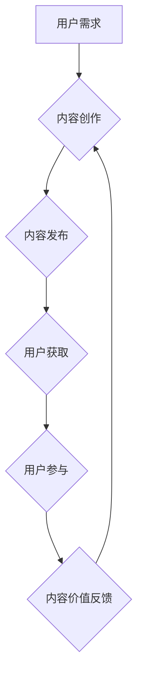

                 

##  注意力经济与内容创作最佳实践：吸引并留住受众的参与

> 关键词：注意力经济、内容创作、用户参与、算法原理、数学模型、实践案例、工具推荐

### 1. 背景介绍

在当今信息爆炸的时代，人们每天面临着海量的资讯和内容。如何才能在众多信息中脱颖而出，吸引用户的注意力，并留住他们的参与，成为了内容创作者面临的重大挑战。

注意力经济的概念应运而生，它强调了在信息过载的时代，注意力成为了最稀缺的资源。用户对信息的筛选和选择能力日益增强，他们倾向于关注那些能够提供价值、满足需求、引发情感共鸣的内容。

内容创作不再仅仅是信息传递，更需要注重用户体验、互动性和参与度。如何理解用户需求，如何设计引人入胜的内容结构，如何利用技术手段提升用户参与度，成为了内容创作者需要不断探索和实践的课题。

### 2. 核心概念与联系

**2.1 注意力经济的核心概念**

注意力经济的核心概念是：注意力是稀缺资源，而内容创作者需要通过提供有价值、吸引人的内容来获取用户的注意力。

**2.2 内容创作与注意力经济的联系**

内容创作是注意力经济的应用场景之一。内容创作者需要通过以下方式来获取和留住用户的注意力：

* **提供有价值的内容：** 内容需要能够满足用户的需求，提供有用的信息、知识或娱乐。
* **设计引人入胜的内容结构：** 内容需要结构清晰、逻辑严谨，能够吸引用户的阅读兴趣。
* **利用技术手段提升用户参与度：** 可以通过互动元素、个性化推荐等技术手段，提高用户的参与度和粘性。

**2.3  注意力经济与内容创作的流程图**



### 3. 核心算法原理 & 具体操作步骤

**3.1 算法原理概述**

在内容创作中，算法可以帮助我们更好地理解用户需求，推荐更符合用户兴趣的内容，并提高用户参与度。常见的算法包括：

* **推荐算法：** 基于用户的历史行为、偏好等信息，推荐用户可能感兴趣的内容。
* **内容分类算法：** 将内容进行分类，方便用户查找和浏览。
* **个性化算法：** 根据用户的个人特征，定制个性化的内容体验。

**3.2 算法步骤详解**

以推荐算法为例，其基本步骤如下：

1. **数据收集：** 收集用户的行为数据，例如浏览历史、点赞记录、评论内容等。
2. **数据预处理：** 对收集到的数据进行清洗、转换和特征提取。
3. **模型训练：** 选择合适的推荐算法模型，并利用训练数据进行模型训练。
4. **模型评估：** 使用测试数据评估模型的性能，并进行模型调优。
5. **推荐结果输出：** 将训练好的模型应用于新的用户数据，生成推荐结果。

**3.3 算法优缺点**

推荐算法的优点在于能够根据用户的个性化需求提供精准的推荐，提高用户体验。但其缺点也包括：

* **数据依赖性强：** 推荐算法的性能取决于数据的质量和数量。
* **算法偏差：** 算法可能会存在偏差，导致推荐结果不准确或不公平。
* **用户隐私问题：** 推荐算法需要收集用户的个人数据，需要妥善处理用户隐私问题。

**3.4 算法应用领域**

推荐算法广泛应用于各个领域，例如：

* **电商平台：** 推荐商品、优惠券等。
* **社交媒体：** 推荐好友、内容等。
* **视频网站：** 推荐视频、电视剧等。
* **音乐平台：** 推荐歌曲、音乐人等。

### 4. 数学模型和公式 & 详细讲解 & 举例说明

**4.1 数学模型构建**

推荐算法通常使用矩阵分解模型，将用户和物品表示为低维向量，通过计算向量之间的相似度来进行推荐。

**4.2 公式推导过程**

假设用户集合为U，物品集合为I，用户-物品交互矩阵为R，其中R(u,i)表示用户u对物品i的评分。

矩阵分解模型的目标是找到用户向量矩阵U和物品向量矩阵V，使得：

$$R \approx U V^T$$

其中，U的维度为|U| x k，V的维度为|I| x k，k为隐含特征维度。

**4.3 案例分析与讲解**

例如，假设有一个用户-电影交互矩阵，其中用户对电影的评分表示为1-5星。可以使用矩阵分解模型将用户和电影表示为低维向量，并根据向量之间的相似度推荐用户可能喜欢的电影。

### 5. 项目实践：代码实例和详细解释说明

**5.1 开发环境搭建**

可以使用Python语言和相关的机器学习库，例如Scikit-learn，来实现推荐算法。

**5.2 源代码详细实现**

```python
from sklearn.decomposition import NMF

# 用户-物品交互矩阵
R = [[5, 4, 3],
     [4, 5, 2],
     [3, 2, 5]]

# 隐含特征维度
k = 2

# 使用NMF算法进行矩阵分解
model = NMF(n_components=k, init='random', random_state=0)
U = model.fit_transform(R)
V = model.components_

# 推荐结果
print(U)
print(V)
```

**5.3 代码解读与分析**

代码首先定义了用户-物品交互矩阵R，然后使用NMF算法进行矩阵分解，得到用户向量矩阵U和物品向量矩阵V。

**5.4 运行结果展示**

运行代码后，会输出用户向量矩阵U和物品向量矩阵V，这些向量可以用于计算用户和物品之间的相似度，并进行推荐。

### 6. 实际应用场景

**6.1 内容推荐系统**

内容推荐系统可以根据用户的阅读历史、点赞记录等信息，推荐用户可能感兴趣的文章、视频、音频等内容。

**6.2 个性化内容定制**

个性化内容定制可以根据用户的个人特征，例如年龄、性别、兴趣爱好等，定制个性化的内容体验。

**6.3 用户互动增强**

通过互动元素、个性化推荐等技术手段，可以增强用户的参与度，提高用户粘性。

**6.4 未来应用展望**

随着人工智能技术的不断发展，注意力经济与内容创作将更加融合，未来可能出现以下应用场景：

* **智能内容创作：** 利用人工智能技术自动生成内容，例如新闻报道、广告文案等。
* **沉浸式内容体验：** 利用虚拟现实、增强现实等技术，打造更加沉浸式的用户体验。
* **个性化内容营销：** 利用大数据分析和人工智能技术，进行更加精准的个性化内容营销。

### 7. 工具和资源推荐

**7.1 学习资源推荐**

* **书籍：** 《注意力经济》
* **在线课程：** Coursera、edX等平台上的机器学习、数据挖掘课程。

**7.2 开发工具推荐**

* **Python语言：** 广泛应用于机器学习和数据分析。
* **Scikit-learn库：** Python机器学习库，提供各种算法模型和工具。
* **TensorFlow、PyTorch等深度学习框架：** 用于构建更复杂的机器学习模型。

**7.3 相关论文推荐**

* **The Attention Economy: A Framework for Understanding How Attention Works**
* **Collaborative Filtering for Recommender Systems**

### 8. 总结：未来发展趋势与挑战

**8.1 研究成果总结**

注意力经济与内容创作的结合，为用户提供更加个性化、精准的内容体验，同时也为内容创作者提供了新的思路和方法。

**8.2 未来发展趋势**

未来，注意力经济与内容创作将更加融合，人工智能技术将扮演更加重要的角色，推动内容创作的智能化、个性化和沉浸式化发展。

**8.3 面临的挑战**

* **数据隐私问题：** 内容创作需要收集用户的个人数据，需要妥善处理用户隐私问题。
* **算法偏差问题：** 算法可能会存在偏差，导致推荐结果不准确或不公平。
* **内容质量问题：** 随着智能内容创作技术的普及，如何保证内容的质量和原创性成为一个挑战。

**8.4 研究展望**

未来研究方向包括：

* **开发更加公平、透明、可解释的推荐算法。**
* **探索新的内容创作模式，例如基于人工智能的协同创作。**
* **研究注意力经济对社会的影响，并制定相应的伦理规范。**

### 9. 附录：常见问题与解答

**9.1 如何提高用户参与度？**

可以通过以下方式提高用户参与度：

* 设计互动元素，例如问答、投票、评论等。
* 提供个性化推荐，根据用户的兴趣爱好推荐相关内容。
* 利用社交媒体平台，鼓励用户分享和讨论内容。

**9.2 如何避免算法偏差？**

可以通过以下方式避免算法偏差：

* 使用更加多样化的训练数据，减少数据偏见。
* 定期评估算法的性能，并进行模型调优。
* 采用公平性评估指标，例如公平性、准确率、召回率等。


作者：禅与计算机程序设计艺术 / Zen and the Art of Computer Programming 
<end_of_turn>

