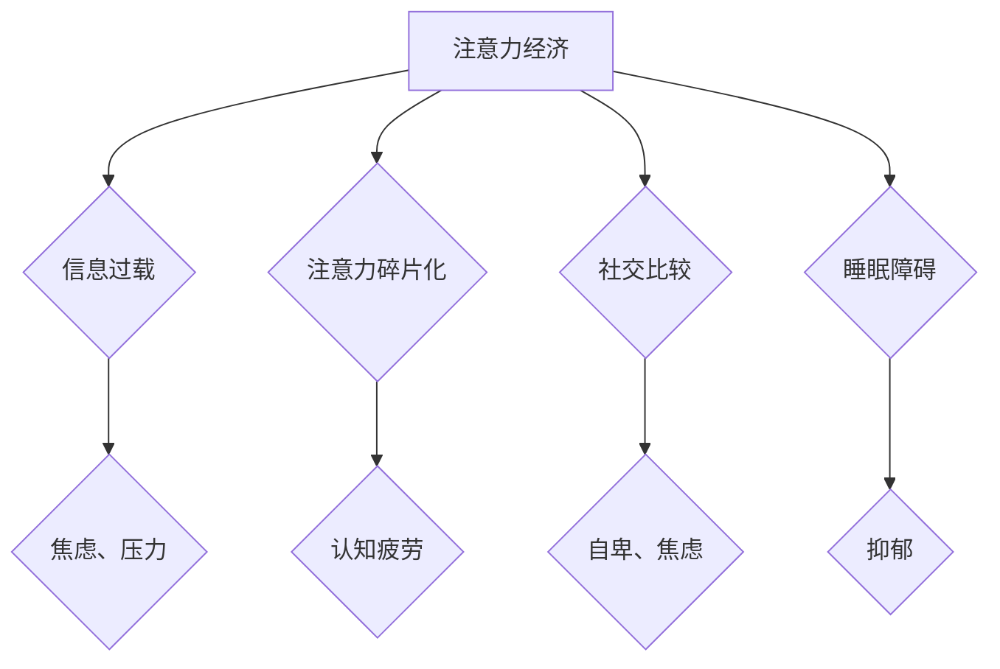

                 

## 1. 背景介绍

在当今信息爆炸的时代，我们被来自各个方向的海量信息所包围。从智能手机的推送通知到社交媒体的动态更新，从电子邮件的提醒到网络广告的轰炸，无处不在的数字信息不断地争夺着我们的注意力。这种“注意力经济”的兴起，一方面带来了便利和效率，另一方面也对我们的心理健康产生了深远的影响。

注意力，作为认知功能的核心，是人类获取、处理和理解信息的关键。然而，在注意力经济的驱动下，我们的注意力变得越来越碎片化，难以集中。我们习惯于快速浏览信息，跳跃阅读，缺乏深度思考。这种注意力状态的改变，会导致一系列的心理健康问题，例如焦虑、抑郁、失眠、认知疲劳等。

## 2. 核心概念与联系

### 2.1 注意力经济

注意力经济是指在信息时代，注意力成为一种稀缺资源，并被商业化和交易的经济模式。在这个模式中，平台和企业通过各种手段吸引用户的注意力，从而获取广告收入、数据流量等经济利益。

### 2.2  心理健康

心理健康是指个体在生理、心理、社会等方面处于良好的状态，能够有效地应对生活中的压力和挑战，并拥有幸福感和生活满意度。

### 2.3  注意力与心理健康之间的关系

注意力经济对心理健康的影响主要体现在以下几个方面：

* **注意力碎片化:**  注意力经济促使人们习惯于快速浏览信息，缺乏深度思考，导致注意力碎片化，难以集中精力完成任务。
* **信息过载:**  海量信息不断涌入，让人感到信息过载，难以筛选和处理，从而引发焦虑和压力。
* **社交比较:**  社交媒体平台上充斥着完美的生活展示，容易引发人们的社交比较，导致自卑和焦虑。
* **睡眠障碍:**  手机、平板电脑等电子设备的蓝光会抑制褪黑素分泌，影响睡眠质量，从而加重焦虑和抑郁症状。

**Mermaid 流程图**



## 3. 核心算法原理 & 具体操作步骤

### 3.1 算法原理概述

注意力机制是一种模仿人类注意力机制的算法，旨在帮助模型更好地理解和处理信息。它通过赋予不同输入元素不同的权重，从而突出重要信息，抑制无关信息。

### 3.2 算法步骤详解

1. **输入数据:** 将输入数据（例如文本、图像）转换为模型可处理的格式。
2. **计算权重:** 使用注意力机制计算每个输入元素的权重，权重越高表示该元素越重要。
3. **加权求和:** 根据计算出的权重，对输入元素进行加权求和，得到最终的输出。

### 3.3 算法优缺点

**优点:**

* **提高模型性能:** 注意力机制可以帮助模型更好地理解和处理信息，从而提高模型的准确率和效率。
* **解释性强:** 注意力权重可以直观地反映模型对输入信息的关注程度，提高模型的解释性。

**缺点:**

* **计算复杂度高:** 注意力机制的计算复杂度较高，需要更多的计算资源。
* **参数量大:** 注意力机制需要更多的参数，训练时间更长。

### 3.4 算法应用领域

注意力机制在自然语言处理、计算机视觉、机器翻译等领域都有广泛的应用。例如，在机器翻译中，注意力机制可以帮助模型更好地理解句子结构和语义，从而提高翻译质量。

## 4. 数学模型和公式 & 详细讲解 & 举例说明

### 4.1 数学模型构建

注意力机制的数学模型通常基于一个加权求和操作。假设我们有一个输入序列 $x = (x_1, x_2, ..., x_n)$，以及一个查询向量 $q$。

注意力权重 $a_{ij}$ 表示模型对输入元素 $x_i$ 和查询向量 $q$ 的关注程度。

### 4.2 公式推导过程

注意力权重通常使用一个得分函数计算，例如：

$$a_{ij} = \frac{exp(score(x_i, q))}{\sum_{k=1}^{n} exp(score(x_k, q))}$$

其中，$score(x_i, q)$ 是 $x_i$ 和 $q$ 之间的相似度得分。

### 4.3 案例分析与讲解

例如，在机器翻译中，查询向量 $q$ 可以是目标语言的词嵌入，输入序列 $x$ 可以是源语言的词嵌入。注意力权重 $a_{ij}$ 可以表示模型对源语言每个词对目标语言词的关注程度。

## 5. 项目实践：代码实例和详细解释说明

### 5.1 开发环境搭建

* Python 3.6+
* TensorFlow/PyTorch

### 5.2 源代码详细实现

```python
import tensorflow as tf

# 定义注意力机制
def attention_layer(inputs, query, key, value, mask=None):
    # 计算注意力权重
    scores = tf.matmul(query, key, transpose_b=True)
    if mask is not None:
        scores += (mask * -1e9)
    attention_weights = tf.nn.softmax(scores, axis=-1)
    # 加权求和
    context_vector = tf.matmul(attention_weights, value)
    return context_vector

# 示例代码
# 输入序列
inputs = tf.random.normal((10, 5, 128))
# 查询向量
query = tf.random.normal((10, 128))
# 键向量
key = tf.random.normal((10, 5, 128))
# 值向量
value = tf.random.normal((10, 5, 128))
# 计算注意力输出
output = attention_layer(inputs, query, key, value)
```

### 5.3 代码解读与分析

* `attention_layer` 函数定义了注意力机制的计算过程。
* `scores` 计算了查询向量和键向量的相似度得分。
* `attention_weights` 使用 softmax 函数将得分转换为注意力权重。
* `context_vector` 通过对值向量进行加权求和，得到最终的注意力输出。

### 5.4 运行结果展示

运行上述代码，会输出一个形状为 (10, 128) 的注意力输出向量。

## 6. 实际应用场景

### 6.1  医疗诊断

注意力机制可以帮助医生更好地理解病人的症状和病历信息，从而提高诊断准确率。

### 6.2  金融风险评估

注意力机制可以帮助金融机构识别潜在的风险因素，从而降低金融风险。

### 6.3  教育领域

注意力机制可以帮助教育机构个性化推荐学习内容，提高学生的学习效率。

### 6.4  未来应用展望

随着人工智能技术的不断发展，注意力机制将在更多领域得到应用，例如自动驾驶、机器人、人机交互等。

## 7. 工具和资源推荐

### 7.1 学习资源推荐

* **书籍:**
    * 《深度学习》
    * 《自然语言处理》
* **在线课程:**
    * Coursera
    * edX

### 7.2 开发工具推荐

* **TensorFlow:** https://www.tensorflow.org/
* **PyTorch:** https://pytorch.org/

### 7.3 相关论文推荐

* **Attention Is All You Need:** https://arxiv.org/abs/1706.03762

## 8. 总结：未来发展趋势与挑战

### 8.1 研究成果总结

注意力机制是一种重要的深度学习技术，在许多领域取得了显著的成果。

### 8.2 未来发展趋势

* **更有效的注意力机制:** 研究更有效的注意力机制，提高模型的性能和效率。
* **自适应注意力机制:** 研究自适应注意力机制，能够根据不同的任务和数据自动调整注意力权重。
* **多模态注意力机制:** 研究多模态注意力机制，能够处理多种类型的输入数据，例如文本、图像、音频等。

### 8.3 面临的挑战

* **计算复杂度:** 注意力机制的计算复杂度较高，需要更多的计算资源。
* **参数量大:** 注意力机制需要更多的参数，训练时间更长。
* **解释性:** 尽管注意力权重可以提供一些解释性，但注意力机制的内部工作机制仍然难以完全理解。

### 8.4 研究展望

未来，注意力机制的研究将继续深入，在更多领域得到应用，并推动人工智能技术的进一步发展。

## 9. 附录：常见问题与解答

### 9.1 什么是注意力机制？

注意力机制是一种模仿人类注意力机制的算法，旨在帮助模型更好地理解和处理信息。

### 9.2 注意力机制的应用场景有哪些？

注意力机制在自然语言处理、计算机视觉、机器翻译等领域都有广泛的应用。

### 9.3 注意力机制的优缺点是什么？

注意力机制的优点是提高模型性能和解释性，缺点是计算复杂度高和参数量大。


作者：禅与计算机程序设计艺术 / Zen and the Art of Computer Programming 
<end_of_turn>

