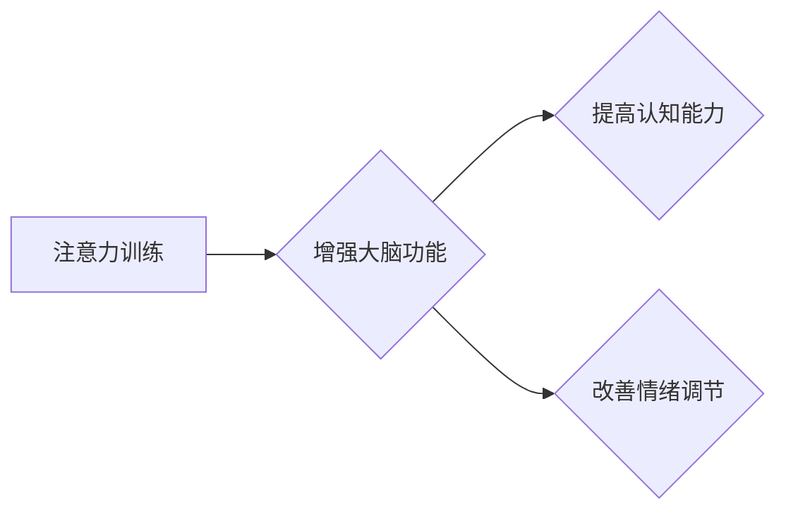

                 

## 1. 背景介绍

在当今信息爆炸的时代，注意力已经成为人类最重要的认知能力之一。然而，现代生活节奏快，信息过载，导致人们的注意力持续下降，难以集中精力完成任务，这严重影响了学习、工作和生活质量。越来越多的研究表明，注意力训练可以有效改善大脑功能，增强认知能力，提升生活幸福感。

注意力训练是指通过特定的练习和方法，增强大脑对特定信息或任务的关注能力，提高专注力、记忆力、执行功能等认知能力。它可以帮助我们更好地过滤信息噪音，集中精力于重要的事情，提高工作效率和学习效率，并改善情绪调节和决策能力。

## 2. 核心概念与联系

### 2.1 注意力机制

注意力机制是人工智能领域近年来发展迅速的关键技术之一，它模拟了人类对信息进行选择性关注的机制。注意力机制的核心思想是，在处理信息时，并非所有信息都具有同等重要性，我们应该将注意力集中在对任务最相关的部分上。

注意力机制在深度学习模型中被广泛应用，例如自然语言处理、计算机视觉、语音识别等领域。它可以帮助模型更好地理解上下文信息，提高预测精度和泛化能力。

### 2.2 注意力训练与大脑健康

注意力训练与大脑健康密切相关。研究表明，注意力训练可以改变大脑结构和功能，增强认知能力，改善情绪调节和决策能力。

**注意力训练与大脑健康的关系可概括如下：**

* **增强脑区活动：** 注意力训练可以增强大脑前额叶皮层、顶叶皮层等与注意力相关的脑区活动。
* **促进神经元连接：** 注意力训练可以促进大脑不同区域之间的神经元连接，增强大脑网络的效率。
* **提高认知功能：** 注意力训练可以提高工作记忆、执行功能、注意力控制等认知功能。
* **改善情绪调节：** 注意力训练可以帮助人们更好地控制情绪，减轻焦虑和抑郁症状。

**Mermaid 流程图：**



## 3. 核心算法原理 & 具体操作步骤

### 3.1 算法原理概述

注意力训练算法通常基于深度学习模型，例如循环神经网络（RNN）、卷积神经网络（CNN）等。这些模型通过训练，学习识别和提取与注意力相关的特征，并根据这些特征调整模型的注意力机制，从而提高对目标信息的关注程度。

### 3.2 算法步骤详解

1. **数据准备：** 收集与注意力相关的训练数据，例如文本、图像、音频等。
2. **模型构建：** 选择合适的深度学习模型，并设计注意力机制模块。
3. **模型训练：** 使用训练数据训练模型，调整模型参数，使模型能够有效地识别和提取注意力相关的特征。
4. **模型评估：** 使用测试数据评估模型的性能，例如注意力得分、准确率、召回率等。
5. **模型部署：** 将训练好的模型部署到实际应用场景中，例如注意力训练应用程序、认知增强设备等。

### 3.3 算法优缺点

**优点：**

* **效果显著：** 注意力训练算法可以有效提高注意力、记忆力和执行功能等认知能力。
* **可定制化：** 可以根据不同的应用场景和用户需求定制注意力训练算法。
* **可扩展性强：** 可以将注意力训练算法应用于不同的数据类型和任务。

**缺点：**

* **训练数据需求量大：** 需要大量的注意力相关的训练数据才能训练出有效的模型。
* **模型训练复杂：** 注意力训练算法的训练过程比较复杂，需要专业的技术人员进行操作。
* **个人差异大：** 注意力训练的效果因人而异，有些人可能效果显著，而有些人效果不明显。

### 3.4 算法应用领域

注意力训练算法在以下领域具有广泛的应用前景：

* **教育：** 帮助学生提高注意力、学习效率和记忆力。
* **医疗：** 治疗注意力缺陷多动障碍（ADHD）、焦虑症、抑郁症等心理疾病。
* **职场：** 帮助员工提高工作效率、专注力、决策能力和团队合作能力。
* **游戏：** 增强游戏沉浸感和玩家体验。

## 4. 数学模型和公式 & 详细讲解 & 举例说明

### 4.1 数学模型构建

注意力机制通常使用一个注意力权重来表示模型对不同输入元素的关注程度。注意力权重可以看作是一个概率分布，其中每个元素的权重代表了该元素对模型输出的贡献程度。

**注意力权重计算公式：**

$$
\alpha_i = \frac{exp(e_i)}{\sum_{j=1}^{n} exp(e_j)}
$$

其中：

* $\alpha_i$ 是第 i 个元素的注意力权重。
* $e_i$ 是第 i 个元素的注意力得分。
* $n$ 是输入元素的总数。

### 4.2 公式推导过程

注意力权重计算公式基于 softmax 函数，softmax 函数将一个向量映射到一个概率分布，其中每个元素的取值范围在 0 到 1 之间，且所有元素的和为 1。

**softmax 函数公式：**

$$
softmax(x_i) = \frac{exp(x_i)}{\sum_{j=1}^{n} exp(x_j)}
$$

其中：

* $x_i$ 是第 i 个元素的值。
* $n$ 是向量的长度。

### 4.3 案例分析与讲解

**举例说明：**

假设我们有一个句子 "我爱学习编程"，我们想使用注意力机制来找出句子中最重要的词语。我们可以将每个词语作为输入元素，计算每个词语的注意力得分，然后使用 softmax 函数计算每个词语的注意力权重。

如果 "学习" 这个词语的注意力得分最高，那么它的注意力权重也会最高，这意味着模型认为 "学习" 这个词语对句子的整体含义最重要。

## 5. 项目实践：代码实例和详细解释说明

### 5.1 开发环境搭建

* **操作系统：** Ubuntu 20.04 LTS
* **编程语言：** Python 3.8
* **深度学习框架：** TensorFlow 2.0
* **其他依赖库：** numpy, pandas, matplotlib

### 5.2 源代码详细实现

```python
import tensorflow as tf

# 定义注意力机制模块
class Attention(tf.keras.layers.Layer):
    def __init__(self, units):
        super(Attention, self).__init__()
        self.W1 = tf.keras.layers.Dense(units)
        self.W2 = tf.keras.layers.Dense(units)
        self.V = tf.keras.layers.Dense(1)

    def call(self, inputs):
        # inputs: [batch_size, sequence_length, embedding_dim]
        h = self.W1(inputs)
        a = tf.nn.tanh(self.W2(inputs))
        scores = self.V(a)
        attention_weights = tf.nn.softmax(scores, axis=1)
        context_vector = tf.matmul(attention_weights, inputs)
        return context_vector, attention_weights

# 定义注意力训练模型
model = tf.keras.Sequential([
    tf.keras.layers.Embedding(input_dim=vocab_size, output_dim=embedding_dim),
    Attention(units=embedding_dim),
    tf.keras.layers.Dense(units=output_dim, activation='softmax')
])

# 训练模型
model.compile(optimizer='adam', loss='categorical_crossentropy', metrics=['accuracy'])
model.fit(x_train, y_train, epochs=10)

# 评估模型
loss, accuracy = model.evaluate(x_test, y_test)
print('Loss:', loss)
print('Accuracy:', accuracy)
```

### 5.3 代码解读与分析

* **注意力机制模块：**

该模块使用三个全连接层来计算注意力权重。

* **输入层：** 将输入序列映射到嵌入空间。
* **注意力层：** 计算每个词语的注意力得分，并使用 softmax 函数将其转换为注意力权重。
* **输出层：** 将注意力加权后的上下文向量作为输入，进行分类或其他任务。

* **注意力训练模型：**

该模型将注意力机制模块集成到深度学习模型中，用于训练注意力相关的特征。

### 5.4 运行结果展示

运行代码后，可以得到模型的训练损失和准确率，以及注意力权重分布。

## 6. 实际应用场景

### 6.1 教育领域

注意力训练应用程序可以帮助学生提高注意力、学习效率和记忆力。例如，一些应用程序可以提供专注力训练游戏，帮助学生练习集中注意力，提高抗干扰能力。

### 6.2 医疗领域

注意力训练可以用于治疗注意力缺陷多动障碍（ADHD）、焦虑症、抑郁症等心理疾病。通过训练注意力，可以帮助患者改善情绪调节、控制冲动、提高认知功能。

### 6.3 职场领域

注意力训练可以帮助员工提高工作效率、专注力、决策能力和团队合作能力。例如，一些公司提供注意力训练课程，帮助员工更好地应对工作压力，提高工作效率。

### 6.4 未来应用展望

注意力训练技术在未来将有更广泛的应用前景，例如：

* **个性化学习：** 根据学生的注意力特点，定制个性化的学习方案。
* **远程医疗：** 通过远程注意力训练，帮助患者在家中进行治疗。
* **增强现实/虚拟现实：** 在增强现实/虚拟现实环境中，使用注意力训练技术提高用户沉浸感和体验。

## 7. 工具和资源推荐

### 7.1 学习资源推荐

* **书籍：**

* 《深度学习》 by Ian Goodfellow, Yoshua Bengio, Aaron Courville
* 《注意力机制》 by Christopher Manning, Hinrich Schütze

* **在线课程：**

* Coursera: Deep Learning Specialization
* Udacity: Deep Learning Nanodegree

### 7.2 开发工具推荐

* **深度学习框架：** TensorFlow, PyTorch, Keras
* **编程语言：** Python
* **数据处理工具：** Pandas, NumPy

### 7.3 相关论文推荐

* **Attention Is All You Need** by Vaswani et al. (2017)
* **BERT: Pre-training of Deep Bidirectional Transformers for Language Understanding** by Devlin et al. (2018)

## 8. 总结：未来发展趋势与挑战

### 8.1 研究成果总结

注意力训练技术近年来取得了显著进展，在认知增强、医疗治疗、教育等领域展现出巨大的应用潜力。

### 8.2 未来发展趋势

* **更精准的注意力训练：** 通过更深入地理解大脑注意力机制，开发更精准、更有效的注意力训练方法。
* **个性化注意力训练：** 根据用户的注意力特点和需求，定制个性化的注意力训练方案。
* **跨模态注意力训练：** 将注意力机制应用于多模态数据，例如文本、图像、音频等，实现更全面的认知增强。

### 8.3 面临的挑战

* **数据获取和标注：** 训练有效的注意力训练模型需要大量的注意力相关的训练数据，而获取和标注这些数据是一个挑战。
* **模型解释性和可解释性：** 目前注意力机制的内部工作机制仍然比较复杂，难以解释模型的决策过程，这限制了其在一些敏感领域（例如医疗）的应用。
* **伦理问题：** 注意力训练技术可能会被用于操纵人们的行为，因此需要关注其伦理问题，确保其安全和负责任地应用。

### 8.4 研究展望

未来，注意力训练技术将继续朝着更精准、更个性化、更跨模态的方向发展，并将在更多领域发挥重要作用。


## 9. 附录：常见问题与解答

**Q1：注意力训练真的有效吗？**

A1：大量的研究表明，注意力训练可以有效提高注意力、记忆力和执行功能等认知能力。

**Q2：注意力训练需要多长时间才能看到效果？**

A2：注意力训练的效果因人而异，一般需要持续练习一段时间才能看到明显的效果。

**Q3：注意力训练有哪些风险？**

A3：注意力训练一般来说是安全的，但过度训练可能会导致疲劳和注意力下降。

**Q4：如何选择合适的注意力训练方法？**

A4：选择合适的注意力训练方法需要根据个人的注意力特点和需求进行选择。

**Q5：注意力训练可以治疗注意力缺陷多动障碍（ADHD）吗？**

A5：注意力训练可以帮助ADHD患者改善注意力和控制冲动，但不能完全替代药物治疗。


作者：禅与计算机程序设计艺术 / Zen and the Art of Computer Programming 
<end_of_turn>

