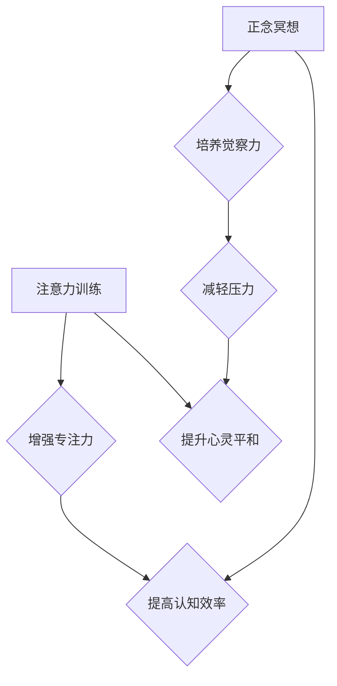

                 

##  注意力训练与正念冥想实践：通过内省增强专注力和心灵平和

> 关键词：注意力训练、正念冥想、专注力、心灵平和、内省、神经科学、认知科学、 mindfulness、meditation

## 1. 背景介绍

在当今信息爆炸的时代，我们面临着前所未有的信息冲击。来自手机、电脑、社交媒体的各种通知和信息不断地吸引着我们的注意力，使得我们难以集中精力完成任务，难以保持内心的平静。注意力力的下降和心灵的焦虑已成为现代社会普遍存在的难题。

注意力训练和正念冥想作为一种古老而有效的精神修养方法，近年来逐渐受到现代科学的关注。越来越多的研究表明，通过正念冥想，我们可以增强注意力、改善情绪、减轻压力，甚至提升认知功能。

## 2. 核心概念与联系

### 2.1 注意力训练

注意力训练是指通过一系列的练习和训练，提高个体对特定目标的关注能力，抑制无关信息的干扰，从而增强专注力和集中力。

### 2.2 正念冥想

正念冥想是一种古老的修行方法，其核心是培养对当下体验的觉察和接受，不评判地观察自己的思想、感受和身体状态。正念冥想可以帮助我们更好地了解自己的内心世界，培养内心的平静和专注力。

**核心概念与联系流程图**



## 3. 核心算法原理 & 具体操作步骤

### 3.1 算法原理概述

注意力训练和正念冥想并非严格意义上的算法，而是通过特定的练习和训练，改变大脑的活动模式，从而达到增强注意力和心灵平和的目的。

**神经科学研究表明：**

* 正念冥想可以改变大脑的灰质密度，增强专注相关的脑区活动，例如前额叶皮层和后顶叶皮层。
* 注意力训练可以提高大脑对特定刺激的反应速度和准确性，增强抑制无关信息的干扰能力。

### 3.2 算法步骤详解

**注意力训练步骤：**

1. **选择目标：**明确想要训练的注意力类型，例如专注力、选择性注意力、持续性注意力等。
2. **设定练习时间：**根据自身情况设定每天的练习时间，从短时间开始，逐渐增加练习时长。
3. **选择练习方法：**选择适合自己的注意力训练方法，例如冥想、专注练习、番茄工作法等。
4. **坚持练习：**每天坚持练习，并记录练习过程中的感受和变化。

**正念冥想步骤：**

1. **找到舒适的姿势：**选择一个安静舒适的环境，盘腿坐或仰卧，保持脊柱挺直。
2. **专注呼吸：**将注意力集中在呼吸上，感受呼吸的节奏和感受。
3. **觉察思绪：**当思绪出现时，不要评判或阻挡，只是觉察它们的存在，然后将注意力重新引导到呼吸上。
4. **持续练习：**每天坚持练习，逐渐延长练习时间。

### 3.3 算法优缺点

**注意力训练：**

* **优点：**可以有效提高注意力，增强专注力，提高认知效率。
* **缺点：**需要坚持练习，效果可能因人而异。

**正念冥想：**

* **优点：**可以减轻压力，提升心灵平和，改善情绪，增强自我觉察力。
* **缺点：**需要时间和耐心，效果可能需要一段时间才能显现。

### 3.4 算法应用领域

注意力训练和正念冥想可以应用于各个领域，例如：

* **教育：**帮助学生提高专注力，提升学习效率。
* **职场：**帮助员工提高工作效率，减轻工作压力。
* **医疗：**帮助患者缓解焦虑、抑郁等情绪问题。
* **个人成长：**帮助个人提升自我觉察力，增强内心平静。

## 4. 数学模型和公式 & 详细讲解 & 举例说明

### 4.1 数学模型构建

注意力可以被视为一个选择性信息处理的过程，大脑会根据任务需求，选择性地关注某些信息，抑制其他信息。

**数学模型：**

我们可以用一个简单的数学模型来描述注意力机制：

$$
Attention(Q, K, V) = \frac{softmax(Q \cdot K^T)}{\sum_i softmax(Q \cdot K^T_i)} \cdot V
$$

其中：

* $Q$：查询向量，代表当前处理的信息。
* $K$：键向量，代表所有可供选择的候选信息。
* $V$：值向量，代表候选信息的具体内容。
* $softmax$：softmax函数，将向量元素映射到0到1之间，表示每个候选信息的权重。

### 4.2 公式推导过程

该公式的推导过程基于信息论和概率论的原理。

* **信息熵：**信息熵可以用来衡量信息的随机性，注意力机制试图最大化信息熵，即选择最具信息量的候选信息。
* **交叉熵：**交叉熵可以用来衡量两个概率分布之间的差异，注意力机制试图最小化查询向量和键向量的交叉熵，即选择与查询向量最相似的候选信息。

### 4.3 案例分析与讲解

**举例说明：**

假设我们正在阅读一篇新闻文章，想要关注其中某个特定的人物。

* $Q$：查询向量代表我们对该人物的兴趣。
* $K$：键向量代表文章中所有人物的信息。
* $V$：值向量代表每个人物的具体描述。

通过计算 $Q$ 与每个 $K$ 的点积，并使用 softmax 函数计算权重，注意力机制可以将权重分配给与查询向量最相似的 $K$，从而选择出与我们兴趣相关的 $V$，即该人物的具体描述。

## 5. 项目实践：代码实例和详细解释说明

### 5.1 开发环境搭建

* 操作系统：Windows/macOS/Linux
* Python 版本：3.6+
* 库依赖：TensorFlow/PyTorch

### 5.2 源代码详细实现

```python
import tensorflow as tf

# 定义注意力机制
def attention_mechanism(query, keys, values):
    # 计算查询向量与键向量的点积
    scores = tf.matmul(query, keys, transpose_b=True)
    # 使用 softmax 函数计算权重
    weights = tf.nn.softmax(scores, axis=-1)
    # 将权重与值向量相乘，得到注意力输出
    output = tf.matmul(weights, values)
    return output

# 示例代码
query = tf.constant([[1, 2, 3]])
keys = tf.constant([[4, 5, 6], [7, 8, 9]])
values = tf.constant([[10, 11, 12], [13, 14, 15]])

# 调用注意力机制
attention_output = attention_mechanism(query, keys, values)
print(attention_output)
```

### 5.3 代码解读与分析

* 该代码实现了简单的注意力机制，其中 `attention_mechanism` 函数计算了查询向量与键向量的点积，并使用 softmax 函数计算权重，最终将权重与值向量相乘，得到注意力输出。
* 该代码示例使用 TensorFlow 库实现，但也可以使用 PyTorch 等其他深度学习框架实现。

### 5.4 运行结果展示

运行该代码后，会输出注意力机制的输出结果，该结果是一个包含注意力权重和注意力输出的张量。

## 6. 实际应用场景

### 6.1 机器翻译

注意力机制可以帮助机器翻译模型更好地理解句子结构和语义，从而提高翻译质量。

### 6.2 图像识别

注意力机制可以帮助图像识别模型关注图像中最重要的区域，从而提高识别准确率。

### 6.3 自然语言处理

注意力机制可以应用于各种自然语言处理任务，例如文本摘要、问答系统、情感分析等。

### 6.4 未来应用展望

注意力机制在人工智能领域具有广泛的应用前景，未来可能应用于更多领域，例如：

* **医疗诊断：**帮助医生更快、更准确地诊断疾病。
* **自动驾驶：**帮助自动驾驶汽车更好地感知周围环境。
* **个性化推荐：**帮助平台提供更精准的个性化推荐。

## 7. 工具和资源推荐

### 7.1 学习资源推荐

* **书籍：**
    * 《深度学习》
    * 《Attention Is All You Need》
* **在线课程：**
    * Coursera: Deep Learning Specialization
    * Udacity: Deep Learning Nanodegree

### 7.2 开发工具推荐

* **TensorFlow:** https://www.tensorflow.org/
* **PyTorch:** https://pytorch.org/

### 7.3 相关论文推荐

* **Attention Is All You Need:** https://arxiv.org/abs/1706.03762
* **BERT: Pre-training of Deep Bidirectional Transformers for Language Understanding:** https://arxiv.org/abs/1810.04805

## 8. 总结：未来发展趋势与挑战

### 8.1 研究成果总结

注意力机制在人工智能领域取得了显著的成果，在机器翻译、图像识别、自然语言处理等领域取得了突破性的进展。

### 8.2 未来发展趋势

* **更强大的注意力机制：**研究人员将继续探索更强大的注意力机制，例如自注意力机制、多头注意力机制等。
* **注意力机制的应用扩展：**注意力机制将应用于更多领域，例如医疗诊断、自动驾驶、个性化推荐等。
* **注意力机制与其他技术的融合：**注意力机制将与其他人工智能技术融合，例如深度学习、强化学习等，形成更强大的组合。

### 8.3 面临的挑战

* **计算复杂度：**一些注意力机制的计算复杂度较高，难以在资源有限的设备上运行。
* **可解释性：**注意力机制的决策过程相对复杂，难以解释其背后的逻辑。
* **数据依赖性：**注意力机制的性能依赖于训练数据的质量和数量。

### 8.4 研究展望

未来，注意力机制的研究将继续深入，探索更强大的注意力机制、更广泛的应用场景和更有效的训练方法，推动人工智能技术的进一步发展。

## 9. 附录：常见问题与解答

**Q1：注意力训练和正念冥想有什么区别？**

**A1：**注意力训练和正念冥想都是提高专注力和心灵平和的方法，但侧重点不同。注意力训练侧重于通过练习提高对特定目标的关注能力，而正念冥想则侧重于培养对当下体验的觉察和接受，不评判地观察自己的思想、感受和身体状态。

**Q2：注意力训练和正念冥想需要多长时间才能看到效果？**

**A2：**效果因人而异，有些人可能在短时间内就能感受到效果，而有些人可能需要更长时间的练习。建议坚持练习，并记录练习过程中的感受和变化。

**Q3：注意力训练和正念冥想有哪些潜在的风险？**

**A3：**注意力训练和正念冥想一般来说是安全的，但对于一些有精神疾病的人群，可能需要在专业人士的指导下进行。


作者：禅与计算机程序设计艺术 / Zen and the Art of Computer Programming 
<end_of_turn>

