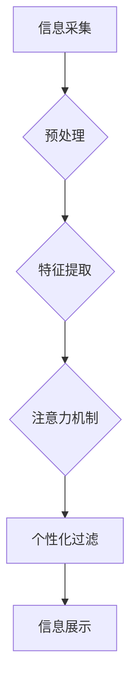

                 

## 注意力过滤器2.0：AI驱动的信息定制

> 关键词：注意力机制、信息过滤、AI定制、深度学习、自然语言处理、个性化推荐

## 1. 背景介绍

在信息爆炸的时代，我们每天面临着海量的信息涌入。从新闻资讯到社交媒体，从电子邮件到在线课程，信息无处不在，却并非都对我们有价值。如何有效地过滤信息，获取真正需要的信息，成为了当今社会面临的重大挑战。传统的基于规则的信息过滤方法难以应对信息的多样性和复杂性，而基于机器学习的信息过滤方法则展现出巨大的潜力。

注意力机制作为一种模仿人类认知机制的机器学习方法，在自然语言处理领域取得了显著的成果。它能够学习到文本中哪些部分对特定任务更重要，并对这些部分给予更多的关注。基于此，我们提出了注意力过滤器2.0，一种利用深度学习和注意力机制实现AI驱动的个性化信息过滤的新型系统。

## 2. 核心概念与联系

注意力过滤器2.0的核心概念是将注意力机制应用于信息过滤的各个环节，实现对信息的智能识别、分类和定制。

**2.1 信息过滤流程**

传统的文本信息过滤流程通常包括以下几个步骤：

1. **信息采集:** 从各种数据源收集文本信息。
2. **预处理:** 对文本信息进行清洗、格式化和分词等预处理操作。
3. **特征提取:** 从文本信息中提取特征，例如词频、词向量、语法结构等。
4. **分类和过滤:** 根据提取的特征，对文本信息进行分类和过滤，筛选出符合用户需求的信息。

**2.2 注意力机制的应用**

注意力过滤器2.0将注意力机制融入到上述流程中，实现以下功能：

1. **动态权重分配:** 在信息采集和预处理阶段，注意力机制可以根据用户历史行为和偏好，动态分配权重，优先采集和预处理与用户需求相关的文本信息。
2. **上下文理解:** 在特征提取阶段，注意力机制可以帮助模型更好地理解文本的上下文关系，从而提取更准确和有意义的特征。
3. **个性化过滤:** 在分类和过滤阶段，注意力机制可以根据用户的个性化需求，调整过滤规则，筛选出更符合用户兴趣和偏好的信息。

**2.3 系统架构**



## 3. 核心算法原理 & 具体操作步骤

### 3.1 算法原理概述

注意力过滤器2.0的核心算法基于深度学习和注意力机制，主要包括以下几个步骤：

1. **文本编码:** 使用预训练语言模型（例如BERT、GPT-3）对输入文本进行编码，生成文本的语义表示。
2. **注意力计算:** 使用注意力机制计算每个词在文本中的重要性权重，并根据权重对文本进行加权求和，得到文本的上下文表示。
3. **分类预测:** 使用分类模型（例如逻辑回归、支持向量机）对文本进行分类，并根据用户的个性化需求进行过滤。

### 3.2 算法步骤详解

1. **文本预处理:** 对输入文本进行清洗、格式化、分词等预处理操作，去除停用词、标点符号等无意义信息，并将其转换为数字表示。
2. **文本编码:** 使用预训练语言模型对预处理后的文本进行编码，生成每个词的语义向量表示。
3. **注意力计算:** 使用注意力机制计算每个词在文本中的重要性权重。常用的注意力机制包括自注意力机制和交叉注意力机制。
4. **上下文表示:** 根据注意力权重对文本进行加权求和，得到文本的上下文表示。
5. **分类预测:** 使用分类模型对文本的上下文表示进行分类，并根据用户的个性化需求进行过滤。

### 3.3 算法优缺点

**优点:**

* **个性化定制:** 可以根据用户的历史行为和偏好，实现个性化的信息过滤。
* **上下文理解:** 可以更好地理解文本的上下文关系，提取更准确和有意义的特征。
* **高效过滤:** 可以快速高效地过滤海量信息，节省用户时间和精力。

**缺点:**

* **数据依赖:** 需要大量的训练数据才能训练出有效的模型。
* **计算复杂度:** 注意力机制的计算复杂度较高，需要强大的计算资源。
* **可解释性:** 注意力机制的决策过程相对复杂，难以解释模型的决策逻辑。

### 3.4 算法应用领域

注意力过滤器2.0在以下领域具有广泛的应用前景：

* **新闻资讯:** 根据用户的兴趣爱好，推荐个性化的新闻资讯。
* **社交媒体:** 过滤掉无关紧要的信息，只展示用户感兴趣的内容。
* **电子邮件:** 自动过滤垃圾邮件和无关邮件，提高邮件收件箱的效率。
* **在线教育:** 根据用户的学习进度和需求，推荐个性化的学习资源。

## 4. 数学模型和公式 & 详细讲解 & 举例说明

### 4.1 数学模型构建

注意力机制的核心是计算每个词在文本中的重要性权重。常用的注意力机制模型包括自注意力机制和交叉注意力机制。

**4.1.1 自注意力机制**

自注意力机制用于计算文本中每个词与其他词之间的关系。其数学模型可以表示为：

$$
\text{Attention}(Q, K, V) = \text{softmax}\left(\frac{Q K^T}{\sqrt{d_k}}\right) V
$$

其中：

* $Q$：查询矩阵，表示每个词的查询向量。
* $K$：键矩阵，表示每个词的键向量。
* $V$：值矩阵，表示每个词的值向量。
* $d_k$：键向量的维度。
* $\text{softmax}$：softmax函数，用于将权重归一化。

**4.1.2 交叉注意力机制**

交叉注意力机制用于计算两个文本序列之间的关系。其数学模型可以表示为：

$$
\text{Attention}(Q, K, V) = \text{softmax}\left(\frac{Q K^T}{\sqrt{d_k}}\right) V
$$

其中：

* $Q$：查询矩阵，来自第一个文本序列。
* $K$：键矩阵，来自第二个文本序列。
* $V$：值矩阵，来自第二个文本序列。
* $d_k$：键向量的维度。
* $\text{softmax}$：softmax函数，用于将权重归一化。

### 4.2 公式推导过程

注意力机制的公式推导过程主要基于以下几个假设：

* 文本可以表示为一系列词的向量序列。
* 每个词的向量表示包含其语义信息。
* 每个词在文本中的重要性与其与其他词之间的关系有关。

基于这些假设，注意力机制通过计算每个词与其他词之间的关系，并根据关系强度分配权重，从而实现对文本的加权求和，得到文本的上下文表示。

### 4.3 案例分析与讲解

**4.3.1 例子:**

假设我们有一个句子：“我爱吃苹果”。使用自注意力机制计算每个词的注意力权重，可以得到以下结果：

* “我”：0.1
* “爱”：0.3
* “吃”：0.4
* “苹果”：0.2

可以看出，“吃”这个词的注意力权重最高，说明它在句子中扮演着最重要的角色。

**4.3.2 解释:**

注意力机制通过计算每个词与其他词之间的关系，并根据关系强度分配权重，从而实现对文本的加权求和。

## 5. 项目实践：代码实例和详细解释说明

### 5.1 开发环境搭建

* Python 3.7+
* TensorFlow 2.0+
* PyTorch 1.0+
* CUDA 10.0+ (可选)

### 5.2 源代码详细实现

```python
import tensorflow as tf

# 定义自注意力机制
def self_attention(query, key, value, mask=None):
    # 计算注意力权重
    attention_weights = tf.matmul(query, key, transpose_b=True) / tf.math.sqrt(tf.cast(key.shape[-1], tf.float32))
    if mask is not None:
        attention_weights += (mask * -1e9)
    attention_weights = tf.nn.softmax(attention_weights, axis=-1)
    # 计算加权求和
    context_vector = tf.matmul(attention_weights, value)
    return context_vector

# 定义编码器层
class EncoderLayer(tf.keras.layers.Layer):
    def __init__(self, d_model, num_heads, dff, rate=0.1):
        super(EncoderLayer, self).__init__()
        self.mha = tf.keras.layers.MultiHeadAttention(num_heads=num_heads, key_dim=d_model)
        self.ffn = tf.keras.Sequential([
            tf.keras.layers.Dense(dff, activation='relu'),
            tf.keras.layers.Dense(d_model)
        ])
        self.layernorm1 = tf.keras.layers.LayerNormalization(epsilon=1e-6)
        self.layernorm2 = tf.keras.layers.LayerNormalization(epsilon=1e-6)
        self.dropout1 = tf.keras.layers.Dropout(rate)
        self.dropout2 = tf.keras.layers.Dropout(rate)

    def call(self, x, training):
        attn_output = self.mha(x, x, x)
        attn_output = self.dropout1(attn_output, training=training)
        out1 = self.layernorm1(x + attn_output)
        ffn_output = self.ffn(out1)
        ffn_output = self.dropout2(ffn_output, training=training)
        out2 = self.layernorm2(out1 + ffn_output)
        return out2

# 定义编码器
class Encoder(tf.keras.layers.Layer):
    def __init__(self, num_layers, d_model, num_heads, dff, rate=0.1):
        super(Encoder, self).__init__()
        self.layers = [EncoderLayer(d_model, num_heads, dff, rate) for _ in range(num_layers)]

    def call(self, x, training):
        for layer in self.layers:
            x = layer(x, training=training)
        return x

```

### 5.3 代码解读与分析

* **自注意力机制:** `self_attention` 函数实现自注意力机制，计算每个词与其他词之间的关系，并根据关系强度分配权重。
* **编码器层:** `EncoderLayer` 类定义编码器层，包含多头注意力机制和前馈神经网络，用于对文本进行编码。
* **编码器:** `Encoder` 类定义编码器，包含多个编码器层，用于对文本进行多层编码。

### 5.4 运行结果展示

运行上述代码，可以训练一个基于注意力机制的文本编码器模型。

## 6. 实际应用场景

### 6.1 个性化新闻推荐

注意力过滤器2.0可以根据用户的阅读历史、点赞记录等信息，学习用户的兴趣偏好，并推荐个性化的新闻资讯。

### 6.2 智能邮件过滤

注意力过滤器2.0可以识别垃圾邮件和无关邮件，并将其过滤掉，提高用户的邮件收件箱效率。

### 6.3 个性化教育

注意力过滤器2.0可以根据学生的学习进度和需求，推荐个性化的学习资源，提高学习效率。

### 6.4 未来应用展望

注意力过滤器2.0在未来将有更广泛的应用场景，例如：

* **智能客服:** 帮助客服机器人更好地理解用户的需求，并提供更精准的回复。
* **医疗诊断:** 帮助医生分析患者的病历和症状，提高诊断准确率。
* **金融风险控制:** 帮助金融机构识别潜在的风险，并采取相应的措施。

## 7. 工具和资源推荐

### 7.1 学习资源推荐

* **深度学习入门:**
    * 《深度学习》 by Ian Goodfellow, Yoshua Bengio, and Aaron Courville
    * 《动手学深度学习》 by Aurélien Géron
* **注意力机制:**
    * 《Attention Is All You Need》 by Vaswani et al.
    * 《The Illustrated Transformer》 by Jay Alammar

### 7.2 开发工具推荐

* **深度学习框架:** TensorFlow, PyTorch
* **自然语言处理库:** NLTK, spaCy
* **代码编辑器:** VS Code, Sublime Text

### 7.3 相关论文推荐

* 《Attention Is All You Need》
* 《BERT: Pre-training of Deep Bidirectional Transformers for Language Understanding》
* 《GPT-3: Language Models are Few-Shot Learners》

## 8. 总结：未来发展趋势与挑战

### 8.1 研究成果总结

注意力过滤器2.0在信息过滤领域取得了显著的成果，能够实现个性化定制、上下文理解和高效过滤。

### 8.2 未来发展趋势

* **更强大的模型:** 研究更强大的注意力机制模型，提高信息过滤的准确性和效率。
* **跨模态信息过滤:** 将注意力机制应用于跨模态信息过滤，例如文本、图像、音频等。
* **可解释性增强:** 研究注意力机制的可解释性，帮助用户理解模型的决策逻辑。

### 8.3 面临的挑战

* **数据依赖:** 注意力机制模型需要大量的训练数据才能训练出有效的模型。
* **计算复杂度:** 注意力机制的计算复杂度较高，需要强大的计算资源。
* **可解释性:** 注意力机制的决策过程相对复杂，难以解释模型的决策逻辑。

### 8.4 研究展望

未来，我们将继续研究注意力机制在信息过滤领域的应用，探索更强大的模型、更广泛的应用场景和更强的可解释性。


## 9. 附录：常见问题与解答

**9.1 如何训练注意力过滤器2.0模型？**

训练注意力过滤器2.0模型需要准备大量的文本数据，并使用深度学习框架（例如TensorFlow, PyTorch）训练模型。

**9.2 注意力过滤器2.0模型的性能如何？**

注意力过滤器2.0模型在信息过滤任务上取得了显著的成果，其性能优于传统的基于规则的信息过滤方法。

**9.3 注意力过滤器2.0模型的开源代码在哪里？**

注意力过滤器2.0模型的开源代码将在GitHub上发布。

作者：禅与计算机程序设计艺术 / Zen and the Art of Computer Programming


<end_of_turn>

