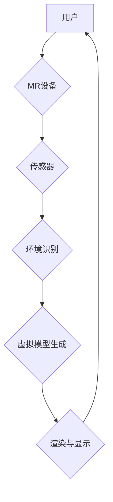

                 

## 混合现实在工业设计中的应用

> 关键词：混合现实、工业设计、虚拟原型、协作设计、数字孪生、3D打印、增强现实、虚拟现实

## 1. 背景介绍

工业设计作为产品开发的重要环节，一直以来都依赖于传统的物理模型和样品制作，这不仅耗时耗费，而且难以进行快速迭代和优化。随着数字技术的快速发展，混合现实（Mixed Reality，MR）技术应运而生，为工业设计带来了全新的可能性。

混合现实技术融合了虚拟现实（VR）和增强现实（AR）的优势，能够将虚拟元素叠加到现实世界中，创造出更加沉浸式和交互式的体验。在工业设计领域，MR技术可以帮助设计师更直观地理解产品结构，更快速地进行设计迭代，并与团队成员进行更有效的协作。

## 2. 核心概念与联系

### 2.1 混合现实（MR）

混合现实（MR）是指将虚拟现实（VR）和增强现实（AR）技术相结合，创造出一种能够将虚拟元素与现实世界融合的体验。

* **增强现实（AR）**：将虚拟信息叠加到现实世界中，例如通过手机摄像头看到虚拟的家具摆放在房间里。
* **虚拟现实（VR）**：将用户沉浸在一个完全虚拟的环境中，例如通过VR头显体验虚拟的房间或产品。

混合现实技术将这两个技术结合起来，可以实现更丰富的交互体验，例如用户可以在现实世界中看到虚拟的模型，并可以与之进行交互，例如旋转、缩放、移动等。

### 2.2 MR在工业设计中的应用

MR技术在工业设计中的应用主要体现在以下几个方面：

* **虚拟原型制作**: MR技术可以帮助设计师快速创建虚拟原型，并进行虚拟测试，例如模拟产品的运动轨迹、结构强度等。
* **协作设计**: MR技术可以帮助设计师与团队成员进行远程协作设计，例如多个设计师可以同时查看和修改同一个虚拟模型。
* **产品体验**: MR技术可以帮助设计师创建沉浸式的产品体验，例如用户可以戴上VR头显体验产品的使用场景。

### 2.3 MR技术架构



**图 2.1 MR技术架构**

## 3. 核心算法原理 & 具体操作步骤

### 3.1 算法原理概述

MR技术的核心算法主要包括环境识别、虚拟模型生成、渲染与显示等。

* **环境识别**: MR设备利用传感器（例如摄像头、深度传感器等）获取现实环境的信息，并将其转换为数字模型。
* **虚拟模型生成**: 根据用户需求，生成虚拟模型，并将其与现实环境进行融合。
* **渲染与显示**: 将融合后的虚拟模型渲染并显示到MR设备上，用户可以交互体验虚拟元素。

### 3.2 算法步骤详解

1. **环境捕捉**: MR设备利用传感器获取现实环境的深度信息、纹理信息等。
2. **场景构建**: 将获取到的环境信息构建成三维场景模型。
3. **虚拟模型生成**: 根据用户需求，生成虚拟模型，并将其与场景模型进行融合。
4. **光照计算**: 计算虚拟模型在现实环境中的光照效果。
5. **渲染与显示**: 将融合后的虚拟模型渲染并显示到MR设备上。

### 3.3 算法优缺点

**优点**:

* **沉浸式体验**: MR技术可以创造出更加沉浸式的体验，用户可以更直观地理解虚拟元素。
* **交互性强**: 用户可以与虚拟元素进行交互，例如旋转、缩放、移动等。
* **协作性强**: 多个用户可以同时体验同一个虚拟场景，并进行协作设计。

**缺点**:

* **技术复杂**: MR技术需要复杂的算法和硬件支持。
* **成本高**: MR设备和软件成本较高。
* **应用场景有限**: 目前MR技术应用场景相对有限。

### 3.4 算法应用领域

* **工业设计**: 虚拟原型制作、协作设计、产品体验。
* **建筑设计**: 虚拟建筑模型展示、室内设计。
* **教育培训**: 虚拟实验室、沉浸式教学。
* **医疗保健**: 虚拟手术模拟、医学教育。

## 4. 数学模型和公式 & 详细讲解 & 举例说明

### 4.1 数学模型构建

MR技术中常用的数学模型包括：

* **三维空间模型**: 用于表示虚拟元素的几何形状和位置。
* **相机模型**: 用于描述相机拍摄图像的几何关系。
* **光照模型**: 用于模拟虚拟元素在现实环境中的光照效果。

### 4.2 公式推导过程

**相机模型**:

相机模型通常使用针孔相机模型进行描述，其核心公式为：

$$
\mathbf{x} = \mathbf{K} \mathbf{P}
$$

其中：

* $\mathbf{x}$：图像平面上的像素坐标。
* $\mathbf{K}$：相机内参矩阵，描述了相机镜头几何特性。
* $\mathbf{P}$：三维空间点在相机坐标系下的坐标。

**光照模型**:

常用的光照模型包括 Phong 模型、Blinn-Phong 模型等。这些模型通过计算光线与物体表面的相互作用，模拟出物体表面的光照效果。

### 4.3 案例分析与讲解

**虚拟家具摆放**:

假设用户使用AR应用程序想要在现实房间中摆放虚拟家具。

1. **环境识别**: AR设备利用摄像头获取房间的图像，并通过深度传感器获取房间的深度信息。
2. **场景构建**: 将获取到的图像和深度信息构建成三维房间模型。
3. **虚拟模型生成**: 根据用户选择，从数据库中加载虚拟家具模型。
4. **相机模型**: 利用相机模型将虚拟家具模型投影到房间模型中。
5. **光照模型**: 利用光照模型计算虚拟家具模型在房间中的光照效果。
6. **渲染与显示**: 将融合后的虚拟家具模型渲染并显示到设备屏幕上，用户可以交互体验虚拟家具在房间中的摆放效果。

## 5. 项目实践：代码实例和详细解释说明

### 5.1 开发环境搭建

* **操作系统**: Windows/macOS/Linux
* **编程语言**: C++/Python
* **MR框架**: Unity/Unreal Engine
* **传感器**: 摄像头/深度传感器

### 5.2 源代码详细实现

以下是一个简单的AR应用程序代码示例，使用Unity引擎实现虚拟家具摆放功能：

```csharp
using UnityEngine;
using UnityEngine.XR.ARFoundation;
using UnityEngine.XR.ARSubsystems;

public class ARFurniturePlacement : MonoBehaviour
{
    public GameObject furniturePrefab; // 虚拟家具模型
    private ARRaycastManager raycastManager;

    void Start()
    {
        raycastManager = GetComponent<ARRaycastManager>();
    }

    void Update()
    {
        if (Input.touchCount > 0)
        {
            Touch touch = Input.GetTouch(0);

            if (touch.phase == TouchPhase.Began)
            {
                PlaceFurniture(touch.position);
            }
        }
    }

    void PlaceFurniture(Vector3 touchPosition)
    {
        List<ARRaycastHit> hits = new List<ARRaycastHit>();
        raycastManager.Raycast(touchPosition, hits, TrackableType.PlaneWithinPolygon);

        if (hits.Count > 0)
        {
            Vector3 placementPosition = hits[0].pose.position;
            Instantiate(furniturePrefab, placementPosition, Quaternion.identity);
        }
    }
}
```

### 5.3 代码解读与分析

* **ARRaycastManager**: 用于管理AR射线投射功能。
* **Raycast**: 将射线投射到场景中，检测到平面后返回射线命中信息。
* **Instantiate**: 在命中位置实例化虚拟家具模型。

### 5.4 运行结果展示

运行该代码后，用户可以通过触摸屏幕在现实世界中放置虚拟家具。

## 6. 实际应用场景

### 6.1 汽车设计

* **虚拟原型设计**: 设计师可以使用MR技术创建虚拟汽车模型，并进行虚拟测试，例如模拟汽车的碰撞、空气动力学等。
* **客户体验**: 客户可以使用MR技术体验虚拟汽车，例如在虚拟驾驶舱中体验汽车的功能和操控感。

### 6.2 医疗器械设计

* **虚拟手术模拟**: 医生可以使用MR技术进行虚拟手术模拟，例如练习复杂的手术操作。
* **产品设计**: 设计师可以使用MR技术设计虚拟医疗器械，并进行虚拟测试，例如模拟器械在人体内的操作效果。

### 6.3 家具设计

* **虚拟家具摆放**: 用户可以使用AR应用程序在现实房间中摆放虚拟家具，并体验不同家具的搭配效果。
* **定制家具**: 用户可以使用MR技术定制虚拟家具，例如调整家具的尺寸、颜色、材质等。

### 6.4 未来应用展望

随着MR技术的不断发展，其在工业设计领域的应用将更加广泛和深入。例如：

* **数字孪生**: 将物理产品与虚拟模型进行绑定，实现产品的实时监控和管理。
* **全息投影**: 将虚拟模型以全息投影的形式展示，创造出更加逼真的体验。
* **脑机接口**: 通过脑机接口技术，实现人与虚拟模型的直接交互。

## 7. 工具和资源推荐

### 7.1 学习资源推荐

* **书籍**:
    * 《Mixed Reality: A Comprehensive Guide》
    * 《The Augmented Reality Handbook》
* **在线课程**:
    * Coursera: Augmented and Virtual Reality
    * Udemy: Mixed Reality Development with Unity

### 7.2 开发工具推荐

* **Unity**: 跨平台游戏引擎，支持MR开发。
* **Unreal Engine**: 高端游戏引擎，支持MR开发。
* **ARKit**: 苹果公司开发的AR框架。
* **ARCore**: 谷歌公司开发的AR框架。

### 7.3 相关论文推荐

* **A Survey of Mixed Reality Applications in Industrial Design**
* **The Impact of Mixed Reality on Product Design**
* **Mixed Reality for Collaborative Design**

## 8. 总结：未来发展趋势与挑战

### 8.1 研究成果总结

MR技术在工业设计领域取得了显著的成果，例如虚拟原型制作、协作设计、产品体验等。

### 8.2 未来发展趋势

* **更沉浸式的体验**: 随着显示技术和传感器技术的进步，MR体验将更加沉浸式。
* **更广泛的应用场景**: MR技术将应用于更多工业设计领域，例如建筑设计、服装设计等。
* **更智能的交互**: 随着人工智能技术的进步，MR交互将更加智能化。

### 8.3 面临的挑战

* **技术复杂性**: MR技术仍然存在技术挑战，例如环境识别、虚拟模型生成等。
* **成本高昂**: MR设备和软件成本仍然较高，限制了其普及。
* **标准化问题**: 目前MR技术缺乏统一的标准，导致不同平台之间互不兼容。

### 8.4 研究展望

未来，MR技术将继续发展，并为工业设计带来更多创新和可能性。研究者需要继续探索MR技术的应用场景，并解决技术挑战，推动MR技术在工业设计领域的普及和应用。

## 9. 附录：常见问题与解答

**Q1: MR和AR有什么区别？**

**A1**: AR（增强现实）是指将虚拟信息叠加到现实世界中，例如通过手机摄像头看到虚拟的家具摆放在房间里。MR（混合现实）则是将虚拟元素与现实世界融合，用户可以与虚拟元素进行交互，例如在虚拟房间中行走、触摸虚拟物体。

**Q2: MR技术有哪些应用场景？**

**A2**: MR技术在工业设计领域有广泛的应用场景，例如虚拟原型制作、协作设计、产品体验等。

**Q3: 如何学习MR技术？**

**A3**: 可以通过阅读相关书籍、参加在线课程、学习开源框架等方式学习MR技术。

**作者：禅与计算机程序设计艺术 / Zen and the Art of Computer Programming**


<end_of_turn>

