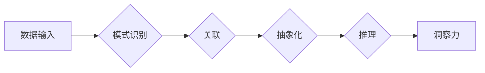

                 

## 理解洞察力：大脑的神奇能力

> 关键词：洞察力、人工智能、神经网络、深度学习、认知科学、机器学习、模式识别

## 1. 背景介绍

洞察力，这是一种令人惊叹的能力，让我们能够从纷繁复杂的现象中识别出隐藏的模式，并从中得出深刻的见解。它赋予我们理解世界、解决问题和做出明智决策的能力。然而，洞察力是如何产生的？它究竟是人类独有的能力，还是可以被机器学习和模拟？

近年来，人工智能领域取得了令人瞩目的进展，特别是深度学习技术的突破，使得机器能够在图像识别、自然语言处理等领域展现出惊人的能力。然而，在更高级的认知任务，如洞察力、创造力和推理等方面，机器仍然显得力不从心。

理解洞察力的本质，对于推动人工智能发展至关重要。它不仅可以帮助我们构建更智能的机器，还可以让我们更好地理解人类自身的认知机制。

## 2. 核心概念与联系

洞察力本质上是一种模式识别和关联的能力。它涉及到以下几个核心概念：

* **模式识别:** 识别数据中的重复性和规律性，发现隐藏的结构和关系。
* **关联:** 将看似无关的事件或信息联系起来，发现它们之间的潜在联系。
* **抽象化:** 将具体的事物或现象概括成更抽象的概念，以便更好地理解其本质。
* **推理:** 基于已有的知识和经验，推断出新的结论或预测未来的发展趋势。

这些概念相互关联，共同构成了洞察力的基础。

**Mermaid 流程图:**



## 3. 核心算法原理 & 具体操作步骤

### 3.1  算法原理概述

目前，还没有一种完美的算法可以完全模拟人类的洞察力。然而，一些机器学习算法，如深度学习和强化学习，已经取得了一些进展。

* **深度学习:** 通过多层神经网络，学习复杂的非线性关系，能够识别出数据中的隐藏模式。
* **强化学习:** 通过试错和奖励机制，学习如何从环境中获取信息并做出最优决策，能够帮助机器发现新的关联和解决问题。

### 3.2  算法步骤详解

**深度学习算法步骤:**

1. **数据收集和预处理:** 收集大量相关数据，并进行清洗、转换和特征提取。
2. **网络结构设计:** 根据任务需求，设计多层神经网络的结构，包括神经元数量、连接方式和激活函数等。
3. **模型训练:** 使用训练数据，通过反向传播算法，调整神经网络的权重和偏差，使模型能够准确识别数据中的模式。
4. **模型评估:** 使用测试数据，评估模型的性能，并进行调整和优化。
5. **应用部署:** 将训练好的模型部署到实际应用场景中，用于洞察力分析和决策支持。

**强化学习算法步骤:**

1. **环境建模:** 建立一个模拟真实世界的环境，并定义奖励机制。
2. **代理设计:** 设计一个智能代理，能够与环境交互并做出决策。
3. **策略学习:** 使用强化学习算法，例如Q学习或深度强化学习，训练代理学习最优策略，以最大化奖励。
4. **策略评估:** 使用测试环境评估代理的性能，并进行调整和优化。
5. **应用部署:** 将训练好的策略部署到实际应用场景中，用于洞察力分析和决策支持。

### 3.3  算法优缺点

**深度学习算法:**

* **优点:** 能够学习复杂的非线性关系，识别出隐藏的模式。
* **缺点:** 需要大量的数据进行训练，训练时间长，解释性差。

**强化学习算法:**

* **优点:** 可以学习如何解决复杂的任务，并适应不断变化的环境。
* **缺点:** 训练过程复杂，需要精心设计的奖励机制，容易陷入局部最优。

### 3.4  算法应用领域

* **商业洞察:** 分析市场趋势、客户行为和竞争对手策略。
* **医疗诊断:** 识别疾病的早期症状和预测患者的健康状况。
* **金融风险管理:** 识别潜在的金融风险和制定风险控制策略。
* **科学研究:** 发现新的科学规律和推动科学发现。

## 4. 数学模型和公式 & 详细讲解 & 举例说明

### 4.1  数学模型构建

深度学习算法的核心是神经网络，它可以看作是一个复杂的数学模型。神经网络由多个层组成，每一层包含多个神经元。每个神经元接收来自上一层的输入信号，并通过一个激活函数进行处理，输出到下一层。

**激活函数:** 激活函数是神经网络中一个重要的组成部分，它决定了神经元的输出信号。常见的激活函数包括 sigmoid 函数、ReLU 函数和 tanh 函数。

**损失函数:** 损失函数用于衡量模型的预测结果与真实值的差异。常用的损失函数包括均方误差 (MSE) 和交叉熵 (Cross-Entropy)。

**优化算法:** 优化算法用于调整神经网络的权重和偏差，以最小化损失函数。常用的优化算法包括梯度下降 (Gradient Descent) 和 Adam 算法。

### 4.2  公式推导过程

**梯度下降算法:**

梯度下降算法的目标是找到损失函数的最小值。它通过迭代地更新权重和偏差，沿着梯度方向移动，直到找到最小值。

公式:

$$
\theta_{t+1} = \theta_t - \alpha \nabla L(\theta_t)
$$

其中:

* $\theta$ 是权重和偏差的向量。
* $t$ 是迭代次数。
* $\alpha$ 是学习率。
* $\nabla L(\theta_t)$ 是损失函数 $L$ 在当前权重 $\theta_t$ 处的梯度。

### 4.3  案例分析与讲解

**图像识别:**

深度学习算法可以用于识别图像中的物体。例如，可以训练一个神经网络，识别出图像中的人脸、汽车、猫等物体。

**自然语言处理:**

深度学习算法可以用于理解和生成自然语言。例如，可以训练一个神经网络，进行机器翻译、文本摘要和情感分析。

## 5. 项目实践：代码实例和详细解释说明

### 5.1  开发环境搭建

* Python 3.x
* TensorFlow 或 PyTorch 深度学习框架
* Jupyter Notebook 或 VS Code 代码编辑器

### 5.2  源代码详细实现

以下是一个简单的深度学习模型代码示例，用于识别手写数字：

```python
import tensorflow as tf

# 定义模型结构
model = tf.keras.models.Sequential([
  tf.keras.layers.Flatten(input_shape=(28, 28)),
  tf.keras.layers.Dense(128, activation='relu'),
  tf.keras.layers.Dense(10, activation='softmax')
])

# 编译模型
model.compile(optimizer='adam',
              loss='sparse_categorical_crossentropy',
              metrics=['accuracy'])

# 训练模型
model.fit(x_train, y_train, epochs=5)

# 评估模型
loss, accuracy = model.evaluate(x_test, y_test)
print('Test loss:', loss)
print('Test accuracy:', accuracy)
```

### 5.3  代码解读与分析

* **模型结构:** 该模型是一个简单的多层感知机 (MLP)，包含一个 Flatten 层、一个全连接层 (Dense) 和一个输出层。
* **激活函数:** 使用 ReLU 函数作为隐藏层的激活函数，softmax 函数作为输出层的激活函数。
* **损失函数:** 使用稀疏类别交叉熵损失函数 (sparse_categorical_crossentropy)，用于分类任务。
* **优化算法:** 使用 Adam 优化算法，用于更新模型参数。
* **训练过程:** 使用训练数据训练模型，并设置训练轮数 (epochs)。
* **评估过程:** 使用测试数据评估模型的性能，并打印测试损失和准确率。

### 5.4  运行结果展示

训练完成后，可以将模型应用于新的数据，进行预测。例如，可以将一张新的手写数字图像输入到模型中，模型会输出该数字的类别。

## 6. 实际应用场景

### 6.1  商业洞察

* **市场趋势分析:** 分析销售数据、用户行为和市场动态，预测未来市场趋势。
* **客户行为分析:** 分析客户购买记录、浏览历史和反馈信息，了解客户需求和偏好。
* **竞争对手分析:** 分析竞争对手的产品、价格和营销策略，制定差异化竞争策略。

### 6.2  医疗诊断

* **疾病早期诊断:** 分析患者的医疗影像、基因信息和症状，识别疾病的早期征兆。
* **个性化治疗:** 根据患者的基因信息和病史，制定个性化的治疗方案。
* **药物研发:** 分析药物的分子结构和生物活性，加速药物研发过程。

### 6.3  金融风险管理

* **欺诈检测:** 分析交易数据和用户行为，识别潜在的欺诈活动。
* **信用风险评估:** 分析客户的财务状况和信用历史，评估客户的信用风险。
* **投资决策:** 分析市场数据和经济指标，做出更明智的投资决策。

### 6.4  未来应用展望

随着人工智能技术的不断发展，洞察力将应用于更广泛的领域，例如：

* **教育:** 个性化学习、智能辅导、自动批改作业。
* **交通:** 智能驾驶、交通流量预测、道路安全监控。
* **环境保护:** 环境污染监测、自然灾害预警、资源管理。


## 7. 工具和资源推荐

### 7.1  学习资源推荐

* **书籍:**
    * 《深度学习》 by Ian Goodfellow, Yoshua Bengio, and Aaron Courville
    * 《机器学习》 by Tom Mitchell
* **在线课程:**
    * Coursera: 深度学习 Specialization
    * Udacity: 机器学习 Engineer Nanodegree
* **博客和网站:**
    * TensorFlow Blog: https://blog.tensorflow.org/
    * PyTorch Blog: https://pytorch.org/blog/

### 7.2  开发工具推荐

* **深度学习框架:** TensorFlow, PyTorch, Keras
* **数据处理工具:** Pandas, NumPy
* **可视化工具:** Matplotlib, Seaborn

### 7.3  相关论文推荐

* **《ImageNet Classification with Deep Convolutional Neural Networks》** by Alex Krizhevsky, Ilya Sutskever, and Geoffrey E. Hinton
* **《Attention Is All You Need》** by Ashish Vaswani, Noam Shazeer, Niki Parmar, Jakob Uszkoreit, Llion Jones, Aidan N. Gomez, Łukasz Kaiser, and Illia Polosukhin

## 8. 总结：未来发展趋势与挑战

### 8.1  研究成果总结

近年来，人工智能领域取得了令人瞩目的进展，特别是深度学习技术的突破，使得机器能够在图像识别、自然语言处理等领域展现出惊人的能力。

### 8.2  未来发展趋势

* **更强大的模型:** 研究更深、更复杂的深度学习模型，以提高洞察力的准确性和泛化能力。
* **解释性更强的模型:** 研究更易于解释的深度学习模型，以便更好地理解模型的决策过程。
* **跨模态洞察力:** 研究能够处理多种数据类型 (例如文本、图像、音频) 的跨模态洞察力模型。
* **联邦学习:** 研究联邦学习技术，以保护用户隐私，同时实现数据共享和模型训练。

### 8.3  面临的挑战

* **数据获取和标注:** 深度学习模型需要大量的数据进行训练，而获取和标注高质量的数据仍然是一个挑战。
* **计算资源:** 训练大型深度学习模型需要大量的计算资源，这对于个人开发者和小型公司来说是一个负担。
* **伦理问题:** 人工智能的快速发展也带来了伦理问题，例如算法偏见、数据隐私和工作岗位替代等。

### 8.4  研究展望

未来，人工智能领域将继续朝着更智能、更安全、更可解释的方向发展。洞察力作为人工智能的核心能力之一，将继续受到广泛关注和研究。


## 9. 附录：常见问题与解答

**Q1: 深度学习和强化学习哪个算法更适合洞察力分析？**

**A1:** 两种算法都有各自的优势和局限性。深度学习更擅长识别模式，而强化学习更擅长解决复杂的任务。选择哪种算法取决于具体的应用场景。

**Q2: 如何评估洞察力模型的性能？**

**A2:** 评估洞察力模型的性能是一个复杂的问题，需要考虑多种因素，例如准确率、召回率、F1-score、鲁棒性等。

**Q3: 如何解决深度学习模型的解释性问题？**

**A3:** 

目前，一些研究方法可以提高深度学习模型的解释性，例如：

* **可解释性模型:** 使用更易于解释的模型结构，例如决策树或线性回归。
* **模型分析技术:** 使用梯度分析、特征重要性分析等技术，分析模型的决策过程。
* **可视化技术:** 使用可视化技术，例如热力图或注意力机制，展示模型的决策过程。


作者：禅与计算机程序设计艺术 / Zen and the Art of Computer Programming<end_of_turn>

